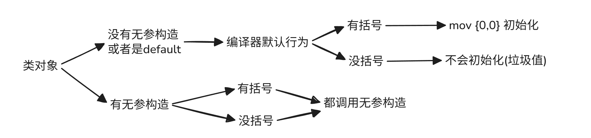

#### 定义变量时，是否初始化为0的编译器行为

大致分为三类：

1. 全局变量
2. 基本数据类型的局部变量
3. 类对象：
	1. 使用编译器提供的默认构造函数（没有无参构造函数）
	2. 有默认（/无参）构造函数

#### 全局变量

对于全局变量（包括静态变量）如果没有初值，都会初始化为0。

#### 基本数据类型

对于基本数据类型，定义一个局部变量时，只要变量名后面不跟括号那么编译器就不会对其进行初始化，其值就是一个垃圾值。
但只要后面**跟着括号**编译器就会将其初始化，即使括号里没有数，也会将其初始化为0。

~~~cpp
int a; // 垃圾值
int b{}; // 初始化为0
int c[5]; // 垃圾值
int d[5] = {} // 全部初始化为0

int* p1 = new int; // 垃圾值
int* p2 = new int(); // 初始化为0
int* p3 = new int[5]; // 垃圾值
int* p4 = new int[5]{}; // 全部初始化为0
~~~

特别注意，在类构造函数的初始化列表中，也会初始化为0

~~~cpp
struct Entity {
	int x, y;
	Entity():x(), y() {} // 全部初始化为0
};
~~~

总结：带括号其实就是告诉编译器多一个`mov 0`操作

---

#### 类对象

* 没有构造函数的结构体

同基本数据类型一样。如果有括号，里面的成员就会初始化（为0）；如果没有括号，成员的值就是垃圾值

~~~cpp
struct Entity {
	int x, y;
};
	Entity e1; // 垃圾值
	Entity e2{}; // 全部初始化为0
	Entity* p1 = new Entity; // 垃圾值
	Entity* p2 = new Entity(); // 全部初始化为0
~~~

总结：带括号其实就是告诉编译器多一个`mov {0, 0}`操作

* 无参构造函数为`default`

就和没有写构造函数一样。如果有括号，就是`mov {0, 0}`；如果没有括号，那就什么都不做。

~~~cpp
class Entity {
private:
	int x, y;
public:
	Entity() = default;
};

	Entity e1; // 垃圾值
	Entity e2{}; // 全部初始化为0
	Entity* p1 = new Entity; // 垃圾值
	Entity* p2 = new Entity(); // 全部初始化为0
~~~

从上面两个来看，都是使用的编译器提供的默认的构造函数。**而编译器提供的默认构造函数本质就是编译器对汇编指令的插入，或者说编译器行为：有括号就插入`mov {0, 0}`，没括号就什么都不做**。

* 带构造函数的类

对于带构造函数的类。如果有括号，那肯定会调用无参构造；但如果没有括号，同样也会调用无参构造

~~~cpp
class Entity {
private:
	int x, y;
public:
	Entity() {} // 不做任何处理，肯定都是垃圾值
};
	Entity e1; // 垃圾值
	Entity e2{}; // 垃圾值
	Entity* p1 = new Entity; // 垃圾值
	Entity* p2 = new Entity(); // 垃圾值
~~~

**特别注意**，在类构造函数的初始化列表中，也会初始化为0

~~~cpp
struct Entity {
	int x, y;
	Entity():x(), y() {} // 全部初始化为0
};
~~~

---

