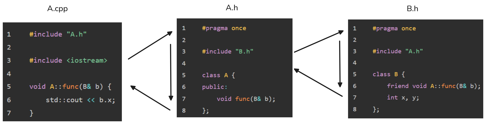

### 通过类成员函数做友元，研究头文件包含依赖问题

#### 一、背景与核心问题

在 C++ 项目中，头文件之间的相互包含（即循环 `#include`）会引发一系列问题。虽然可以通过 `#pragma once` 或宏守卫（`#ifndef`）避免预处理器无限递归包含，但这并不能解决所有问题，尤其是**类型声明顺序**带来的编译错误。

本文通过一个具体场景——**让 `class A` 的某个成员函数成为 `class B` 的友元**，来展示包含依赖问题，并提供可行的解决方案。

---

#### 二、代码目标

在头文件（`.h`）和源文件（`.cpp`）分离的工程中：
- 使 `class A` 中的成员函数 `A::func` 成为 `class B` 的友元。
- 实现目的：仅允许 `A::func` 访问 `B` 的私有成员（`x` 和 `y`）。

---

#### 三、初步（错误）的代码结构

**文件列表与内容：**

**`B.h`**
```cpp
#pragma once

#include "A.h"

class B {
	friend void A::func(B& b); // 错误1: “A”: 不是类或命名空间名称
	int x, y;
};
```

**`A.h`**
```cpp
#pragma once

#include "B.h"

class A {
public:
	void func(B& b);
};
```

**`A.cpp`**
```cpp
#include "A.h"

#include <iostream>

void A::func(B& b) {
	std::cout << b.x; // 错误2: “B::x”: 无法访问 private 成员
}
```

---

#### 四、编译错误及其原因分析

**编译输出（以 MSVC 为例）：**
```bash
1>A.cpp
1>D:\VS_Projects\...\B.h(6,14): error C2653: “A”: 不是类或命名空间名称
1>D:\VS_Projects\...\A.cpp(8,16): error C2248: “B::x”: 无法访问 private 成员
```

**关键认知：**
> 编译器以 `.cpp` 源文件为编译单元，而不是从头文件开始编译。头文件只是在预处理阶段被展开到包含它的 `.cpp` 文件中。

**预处理后的 `A.cpp` 展开顺序分析：**

编译 `A.cpp` ➡ 进入 `A.h` ➡ 还没处理 `class A` ➡ 进入 `B.h`
➡ 由于 `#pragma once` 不会再包含 `A.h`
➡ 复制 `class B` 返回 `A.h` 
➡ 复制 `class B` 和  `class A` 返回`A.cpp`

1. 编译 `A.cpp` → 进入 `A.h`。
2. `A.h` 开头 `#include "B.h"` → 进入 `B.h`。
3. `B.h` 开头 `#include "A.h"`，但被 `#pragma once` 阻止，不再重复包含。
4. 此时 `class A` **尚未定义**，但 `B.h` 中已使用 `A::func`，因此报错（错误1）。
5. 展开 `class B` 定义后，返回到 `A.h`，再展开 `class A`。
6. 最终在 `A.cpp` 中，实际的预处理顺序是 **`class B` 先于 `class A` 定义**。



**最终预处理结果（简化）：**
```cpp
class B {
	friend void A::func(B& b); // 此时 A 尚未声明
	int x, y;
};

class A {
public:
	void func(B& b);
};

#include <iostream>

void A::func(B& b) {
	std::cout << b.x; // 因为友元声明无效，所以无法访问私有成员
}
```

**结论：**
- 错误根源在于 **`class A` 的定义出现在 `class B` 之后**，导致友元声明时 `A` 还不完整。
- 第二个错误是第一个错误的连锁反应。

---

#### 五、解决方案

**核心思路：**
1. 确保 `class A` 的完整定义出现在 `class B` 的友元声明之前。
2. `class A` 的声明中不需要 `B` 的完整定义，仅需前向声明（`class B;`）。

**具体修改步骤：**

1. **`B.h` 保持不变**（它已经通过 `#include "A.h"` 获取了完整的 `class A`）。
2. **修改 `A.h`**：
   - 在 `class A` 定义前，添加 `class B;` 的前向声明。
   - 将 `#include "B.h"` 移到 `class A` 定义之后（可选，但建议做，以保证声明顺序清晰）。
3. **`A.cpp`** 无需额外修改，因为 `A.h` 已包含 `B.h`。

---

#### 六、修正后的代码

**`B.h`（不变）**
```cpp
#pragma once

#include "A.h"

class B {
	friend void A::func(B& b);
	int x, y;
};
```

**`A.h`（修改后）**
```cpp
#pragma once

class B; // 前向声明，解决声明顺序问题

class A {
public:
	void func(B& b);
};

#include "B.h" // 移到 class A 之后，确保 B 的完整定义在需要时可用
```

**`A.cpp`（不变）**
```cpp
#include "A.h"

#include <iostream>

void A::func(B& b) {
	std::cout << b.x;
}
```

---

#### 七、方案可行性的关键条件

> 此方案之所以可行，是因为 **`class A` 不需要知道 `class B` 的完整定义**（仅使用指针或引用作为参数，或仅前向声明即可）。
>
> 如果两个类**都必须知道对方的完整结构**（例如互为成员变量或相互调用具体成员），那这没完没了的确实没招，这种循环依赖在 C++ 中无法通过简单的前向声明解决，需要重构设计（如引入接口类、使用指针/引用等）。

---

#### 八、总结

- 头文件的相互包含会导致**声明顺序**问题，即使预处理机制避免了无限包含。
- 在友元场景中，必须保证被声明为友元的类（或函数）在友元声明处已经**完整定义**。
- 前向声明（`class B;`）可以打破依赖链，但前提是当前类不需要被前向声明类的具体内容。
- 编译器以 `.cpp` 为单元，理解预处理顺序是解决此类问题的关键。
