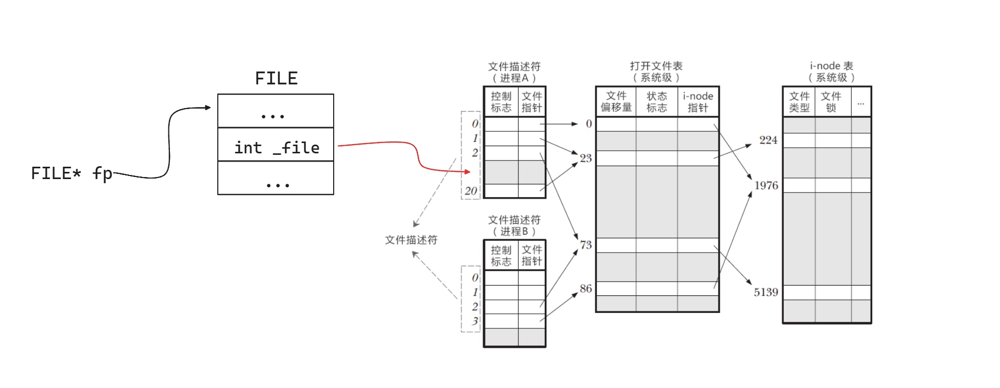
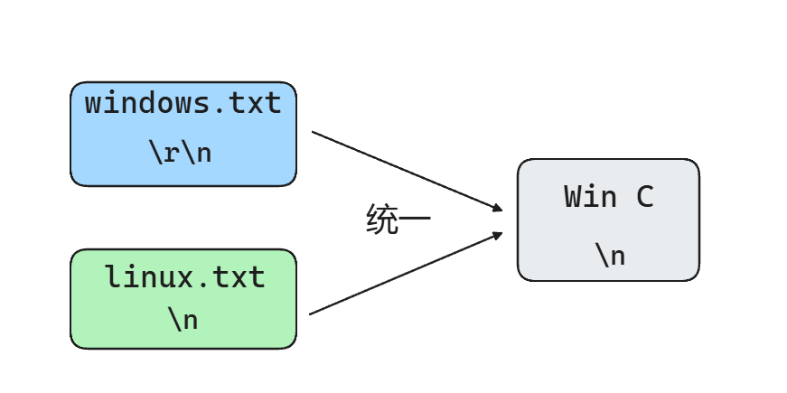
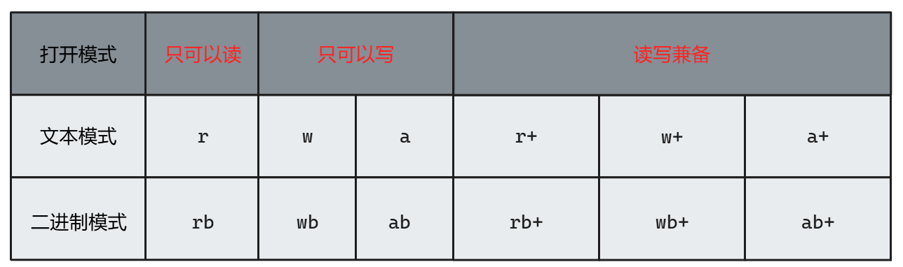

[c语言文件操作详解：fgetc,fputc,fgets,fputs,fscanf,,fprintf,fread,fwrite的使用和区别-CSDN博客](https://blog.csdn.net/m0_69519887/article/details/133678342)

[C语言中文件打开模式(r/w/a/r+/w+/a+/rb/wb/ab/rb+/wb+/ab+)浅析 - 康建伟 - 博客园 (cnblogs.com)](https://www.cnblogs.com/kangjianwei101/p/5220021.html)

[C 标准库 –  | 菜鸟教程 (runoob.com)](https://www.runoob.com/cprogramming/c-standard-library-stdio-h.html)

关于`FILE`结构体，这是C语言库自己定义的一个描述文件信息的结构体，底层逻辑肯定还是`linux`那一套，只不过这个结构体对操作系统的这个表记录的信息大概的汇总了一些。C语言的文件操作函数具体的实现方式可能是调用`linux`提供的`open、write`这些内核调用函数。

~~~C
struct _iobuf {
    char *_ptr;         // 指向当前缓冲区位置的指针
    int _cnt;           // 缓冲区中剩余的字符数
    char *_base;        // 缓冲区的起始地址
    int _flag;          // 文件状态标志
    int _file;          // 文件描述符
    int _charbuf;       // 单字符缓冲区处理变量
    int _bufsiz;        // 缓冲区的大小
    char *_tmpfname;    // 临时文件名的指针
};
typedef struct _iobuf FILE;
~~~

关于文件结束符 **EOF**，这通常是一个文件操作函数的返回值，当文件操作函数运行出错或者文件读取到结尾时会返回这个值。**EOF **的值通常是 `-1`，在计算机中用补码表示。关于文件操作函数如何判断已经读取到文件结尾，应该是通过比较`struct file`中的**文件偏移量**`f_pos`和`inode`中的**文件长度**`i_size`得出的如果`f_pos == i_size`也就说明这个文件已经读取到结尾了，再往后就没有东西了，于是就返回**EOF**告知调用者已经没东西可以读取了。

`int fgetc(FILE* fp)`函数读取文件指针(f_pos)指向的字节，返回这个字节的`int`，同时文件指针往后移一个。

`char* fgets(char* buf, int size, FILE* fp)`函数从文件指针指向的地方开始读取，一直读取到换行符结束，也就是读取文本的一行到缓冲区。换行符经过处理后也会放入`buf`中，如何处理视平台差异不同。然后文件指针指向换行符的下一个字节，准备从下一行开始读取。函数会返回缓冲区的地址也就是传入的`buf`。最后函数在读取完后，会在`buf`已读取的字节后面加个`\0`表示一个完整的字符串。所以，这个函数在没有遇到换行符或者文件结束符前最多会读取`size - 1`个字节，预留一个字节用来放`\0`。一般来说`size`传入`sizeof(buf)`就行了。

`fscanf()`函数是从文件指针处开始匹配，也就是说文件指针开始的字符串格式要与给定的格式相同，否则匹配不成功

注意所有文件操作函数都是基于文件指针的，也就是说读写操作都会从文件指针开始。

同样的一段文本，分别用`windows`的文本编辑器和`linux`的文本编辑器，最终保存的字节码会有所不同，主要区别还是在换行符上。

~~~
hello world
nihao shijie
hello shijie
~~~

前两行的结尾都只用了一个回车，最后一行的结尾没有回车。这段文本在`windows`下编辑并保存为`windows.txt`，在`linux`下编辑并保存为`linux.txt`，最后保存的字节码分别用`hexdump`工具查看。

~~~
hexdump -C windows.txt
00000000  68 65 6c 6c 6f 20 77 6f  72 6c 64 0d 0a 6e 69 68  |hello world..nih|
00000010  61 6f 20 73 68 69 6a 69  65 0d 0a 68 65 6c 6c 6f  |ao shijie..hello|
00000020  20 73 68 69 6a 69 65                              | shijie|
00000027

hexdump -C linux.txt 
00000000  68 65 6c 6c 6f 20 77 6f  72 6c 64 0a 6e 69 68 61  |hello world.niha|
00000010  6f 20 73 68 69 6a 69 65  0a 68 65 6c 6c 6f 20 73  |o shijie.hello s|
00000020  68 69 6a 69 65 0a                                 |hijie.|
00000026
~~~

我们知道`windows`平台下用`\r\n`表示换行符，`linux`平台下用`\n`表示换行符，这是造成以上两段字节码中间两个换行符不同的原因，此外`windows`在文本的结尾处不会额外添加换行符，但是`linux`在文本的结尾会额外添加换行符，即使我没有打回车。

好的，上面展示的就是两个平台下生成的两个文件各自真是的字节码。那么`C语言`是如何处理这种不同平台下产生的文本文件的差异呢。

给出以下源代码

~~~C
#include <stdio.h>

void print(unsigned char* buf, int size)
{
    int i;
    int j = 0;
    for (i = 0; i < size; i++) {
        printf("%02x ", buf[i]);
        j = (j + 1) % 10;
        if (j == 0)
            printf("\n");
    }
}

void init(unsigned char* buf, int size)
{
    int i;
    for (i = 0; i < size; i++)
        buf[i] = 0xcc;
}

int main()
{
    unsigned char win_buf[50];
    unsigned char linux_buf[50];
    init(win_buf, sizeof(win_buf));
    init(linux_buf, sizeof(linux_buf));

    FILE* win_fp = fopen("windows.txt", "r");
    FILE* linux_fp = fopen("linux.txt", "r");

    char ch;
    int i;
    for (i = 0; (ch = fgetc(win_fp)) != EOF; i++)
        win_buf[i] = ch;
    for (i = 0; (ch = fgetc(linux_fp)) != EOF; i++)
        linux_buf[i] = ch;

    fclose(win_fp);
    fclose(linux_fp);

    printf("win_buf:\n");
    print(win_buf, sizeof(win_buf));
    printf("linux_buf:\n");
    print(linux_buf, sizeof(linux_buf));
    return 0;
}
~~~

上面代码的逻辑很简单，就是分别读取`windows.txt`和`linux.txt`中的内容到`win_buf`和`linux_buf`中。两个`buf`在一开始就将每个字节初始化为`cc`，这样最终输出的时候可以比较明显的进行比较

还需要说明的是，不同平台下的`C语言`在文件处理时对待换行符的操作也不同。换句话说，上面同样的代码，我在`windows`平台下和`linux`平台下运行的结果是不同的。首先，我将在`windows`平台下运行上面代码。运行的结果如下：

~~~
win_buf:
68 65 6c 6c 6f 20 77 6f 72 6c 
64 0a 6e 69 68 61 6f 20 73 68 
69 6a 69 65 0a 68 65 6c 6c 6f 
20 73 68 69 6a 69 65 cc cc cc 
cc cc cc cc cc cc cc cc cc cc 
linux_buf:
68 65 6c 6c 6f 20 77 6f 72 6c 
64 0a 6e 69 68 61 6f 20 73 68 
69 6a 69 65 0a 68 65 6c 6c 6f 
20 73 68 69 6a 69 65 0a cc cc 
cc cc cc cc cc cc cc cc cc cc 
~~~

不难发现，除了`linux.txt`本身结尾就有一个`\n`换行符不用在意之外，中间两个换行符在数组中都是`0a`，也就是`\n`的存在。从此，可以得出结论，`windows`平台下`C语言`中，在文本模式下，`C语言`会将从文本读取到的换行符统一为`\n`，也就是说不管是原先`windows`平台下的`0d 0a`还是`linux`平台下的`0a`在`C语言`中都会被处理成`0a`。
但是如果是二进制模式(`rb`)的情况下，肯定还是保持原来文本文件的字节码，该是`0d 0a`读进来还是`0d 0a`。

以上是`C语言`在`windows`平台下以文本模式读取文件遇到换行符的操作。在`linux`平台下，这个操作会有不同，甚至让人迷惑。

~~~
win_buf:
68 65 6c 6c 6f 20 77 6f 72 6c 
64 0d 0a 6e 69 68 61 6f 20 73 
68 69 6a 69 65 0d 0a 68 65 6c 
6c 6f 20 73 68 69 6a 69 65 cc 
cc cc cc cc cc cc cc cc cc cc 
linux_buf:
68 65 6c 6c 6f 20 77 6f 72 6c 
64 0a 6e 69 68 61 6f 20 73 68 
69 6a 69 65 0a 68 65 6c 6c 6f 
20 73 68 69 6a 69 65 0a cc cc 
cc cc cc cc cc cc cc cc cc cc
~~~

`linux`平台下的`C语言`在文本读模式的情况下并不会对换行符进行一个统一操作，原来该是什么字节还是什么字节。跟二进制读模式一样。虽然不知道为什么，但是还是有必要知道这个差异的存在。

此外，如果用`fgets()`函数代替`ch`遍历读取两个文件的第一行，在文本模式下对行尾换行符的处理也是一样的。`windows`平台下的`C语言`会进行统一处理，`linux`平台下的`C语言`不会进行统一，原来是什么样读取时不会处理，还是什么样。

以下是`windows`平台下的处理结果如下，可以发现都是`0a`也就是`\n`

~~~
win_buf:
68 65 6c 6c 6f 20 77 6f 72 6c
64 0a 00 cc cc cc cc cc cc cc
cc cc cc cc cc cc cc cc cc cc
cc cc cc cc cc cc cc cc cc cc
cc cc cc cc cc cc cc cc cc cc
linux_buf:
68 65 6c 6c 6f 20 77 6f 72 6c
64 0a 00 cc cc cc cc cc cc cc
cc cc cc cc cc cc cc cc cc cc
cc cc cc cc cc cc cc cc cc cc
cc cc cc cc cc cc cc cc cc cc
~~~

以下是`linux`平台下的处理结果，可以发现对于`windows.txt`的换行符仍然还是`0d 0a`也就是`\r\n`，对于`linux.txt`的换行符也仍然是`0a`。

~~~
win_buf:
68 65 6c 6c 6f 20 77 6f 72 6c 
64 0d 0a 00 cc cc cc cc cc cc 
cc cc cc cc cc cc cc cc cc cc 
cc cc cc cc cc cc cc cc cc cc 
cc cc cc cc cc cc cc cc cc cc 
linux_buf:
68 65 6c 6c 6f 20 77 6f 72 6c 
64 0a 00 cc cc cc cc cc cc cc 
cc cc cc cc cc cc cc cc cc cc 
cc cc cc cc cc cc cc cc cc cc 
cc cc cc cc cc cc cc cc cc cc
~~~

