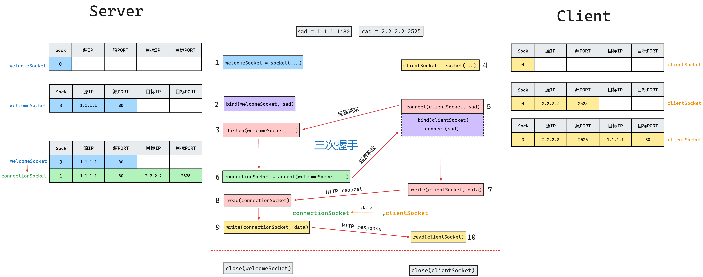

在`socket`编程中有一个通用的结构体来表示通用的表示一个网络中某个主机的地址`struct sockaddr`

~~~C
/* 16字节 */
struct sockaddr /* socket_address */
{
	sa_family_t sa_family; /* 地址族协议(2字节) */
	char sa_data[14]; /* 端口(2字节) + IP地址(4字节) + 填充(8字节) */ 
}
~~~

这个结构体可以表示所有类型的网络，包括`ipv4`。因为比较普遍，所以`socket`中的大部分`API`中有关主机地址的参数类型都是它。就像父类一样，用多态的方式使用。

此外，使用地址类型的参数时还会有个`socklen_t addrlen`参数和它配套使用，表示地址变量的大小(bytes)

因为现在大多用的是`ipv4`协议，所以专门有一个类型表示`ipv4`地址，它的内存大小与`struct sockaddr`完全一样，内存布局也相似，完全就是它的子类一样

[套接字-Socket | 爱编程的大丙 (subingwen.cn)](https://subingwen.cn/linux/socket/)

~~~C
typedef unsigned int uint32_t;
typedef unsigned short uint16_t;

typedef unsigned short int sa_family_t;
typedef uint16_t in_port_t;
struct in_addr {
    uint32_t s_addr;  /* 32-bit IPv4 address */
};

typedef unsigned int socklen_t;

struct sockaddr_in /* socket_address_internet */
{
    sa_family_t sin_family;		/* 地址族协议(2字节): AF_INET */
    in_port_t sin_port;         /* 端口, 2字节-> 大端  */
    struct in_addr sin_addr;    /* IP地址, 4字节 -> 大端  */
    /* 填充 8字节 */
    unsigned char sin_zero[8];
};
~~~

用到的时候需要传入指针，并且还需要像多态一样将其强制类型转化为其父类的指针，此外还需要配套一个`socklen_t addrlen`表示其大小。就像下面这样

~~~C
struct sockaddr_in cad; /* client address */
socklen_t cadlen = sizeof(cad);
accept(welcomeSocket, (struct sockaddr*)&cad, &cadlen);
~~~

网络字节序要求是大端发送的，所以跟`socket`相关的结构体尤其是`struct sockaddr_in`里面的`port`和`ip`地址要求都是大端存储的。为了实现对整数大小端的自由转换提供了**2**组**4**个函数，分别处理`2`个字节和`4`个字节大小的数据的大小端转换。

使用套接字通信函数需要包含头文件`<arpa/inet.h>`，包含了这个头文件`<sys/socket.h>`就不用在包含了。

~~~c
// 这套api主要用于 网络通信过程中 IP 和 port 的大小端的转换
#include <arpa/inet.h>

// 将一个短整形从主机字节序 -> 网络字节序
uint16_t htons(uint16_t hostshort); // host to net : short
// 将一个短整形从网络字节序 -> 主机字节序
uint16_t ntohs(uint16_t netshort); // net to host : short

// 将一个整形从主机字节序 -> 网络字节序
uint32_t htonl(uint32_t hostlong); // host to net : long
// 将一个整形从网络字节序 -> 主机字节序
uint32_t ntohl(uint32_t netlong); // net to host : long
~~~

`IP`地址一般都是点分十进制字符串形式出现的，但其本质上还是`32`位`4`字节大小的整数(**对IPv4而言**)，所以还提供了针对`IP`地址(包括`IPv4和IPv6`)字符串和整数的转换函数。**值得注意的是，转换的整数(不管的作为参数还是返回结果)都应该是大端序存储的。**

**`n`**: **Network**（网络格式，也就是二进制格式(**大端序整数格式**)，通常是大端序的表示方式）

**`p`**: **Presentation**（**文本格式**，适合人类阅读的形式，如 `"192.168.1.1"`）

~~~c
#include <arpa/inet.h>
// 将大端的整数, 转换为小端的点分十进制的IP地址字符串        
const char *inet_ntop(int af, const void *src, char *dst, socklen_t size);
参数:
af: 地址族协议
AF_INET: ipv4格式的ip地址
AF_INET6: ipv6格式的ip地址
src: 传入参数, 这个指针指向的内存中存储了大端的整形IP地址
dst: 传出参数, 存储转换得到的小端的点分十进制的IP地址
size: 修饰dst参数的, 标记dst指向的内存中最多可以存储多少个字节
返回值:
成功: 指针指向第三个参数对应的内存地址, 通过返回值也可以直接取出转换得到的IP字符串
失败: NULL
~~~

~~~c
#include <arpa/inet.h>
// 将小端的点分十进制的IP地址字符串, 转换为大端的整数
int inet_pton(int af, const char *src, void *dst); 
参数:
af: 地址族(IP地址的家族包括ipv4和ipv6)协议
	AF_INET: ipv4格式的ip地址
	AF_INET6: ipv6格式的ip地址
src: 传入参数, 对应要转换的点分十进制的ip地址: 192.168.1.100
dst: 传出参数, 函数调用完成, 转换得到的大端整形IP被写入到这块内存中
返回值：成功返回1，失败返回0或者-1
~~~


---



客户端通过命令行向服务器发送数据，按下回车后会将换行符一起发送给服务器。可能是`\r\n`也可能是`\n`视操作系统不同吧

客户端代码

~~~C
#include <stdio.h>
#include <unistd.h>
#include <string.h>
#include <arpa/inet.h>

int main()
{
    const char* SERVER_IP_ADDRESS = "192.168.66.142";
    const unsigned short int SERVER_PORT = 8080;
    uint32_t SERVER_IP;
    inet_pton(AF_INET, SERVER_IP_ADDRESS, &SERVER_IP);

    int res;

    struct sockaddr_in sad; /* server address */
    memset(&sad, 0, sizeof(sad));
    sad.sin_family = AF_INET;
    sad.sin_port = htons(SERVER_PORT);
    sad.sin_addr.s_addr = SERVER_IP;

    int clientSocket = socket(AF_INET, SOCK_STREAM, 0);
    if (clientSocket == -1) {
        perror("clientSocket创建失败");
        return -1;
    }

    res = connect(clientSocket, (struct sockaddr*)&sad, sizeof(sad));
    if (res == -1) {
        perror("与服务器建立连接失败");
        return -1;
    }

    char buf[1024] = {0};
    int i = 0;
    while (1) {
        sprintf(buf, "%d: Hello World\n", i++);
        send(clientSocket, buf, strlen(buf) + 1, 0); /* 如果内核中写缓冲区满了会阻塞 */
        /* write(clientSocket, buf, strlen(buf)+1) */
        memset(buf, 0, sizeof(buf)); /* 发送完了就清空准备用于接收 */
        int len = recv(clientSocket, buf, sizeof(buf), 0); /* 如果内核中读缓冲区为空会阻塞 */
        /* read(clientSocket, buf, sizeof(buf)) */
        if (len > 0) {
            printf("服务器: %s", buf);
        } else if(len == 0) {
            printf("服务器断开连接...\n");
            break;
        } else {
            perror("从服务器接收数据失败");
            break;
        }
        sleep(1);
    }

    close(clientSocket);
    return 0;
}
~~~

服务器端代码

~~~C
#include <stdio.h>
#include <unistd.h>
#include <string.h>
#include <arpa/inet.h>

int main()
{
 
    const unsigned short int PORT = 8080;

    int res;
    
    struct sockaddr_in sad; /* server address */
    memset(&sad, 0, sizeof(sad));
    sad.sin_family = AF_INET;
    sad.sin_port = htons(PORT);
    sad.sin_addr.s_addr = htonl(INADDR_ANY);

    int welcomeSocket = socket(AF_INET, SOCK_STREAM, 0);
    if (welcomeSocket == -1) {
        perror("welcomeSocket创建失败");
        return -1;
    }
    res = bind(welcomeSocket, (struct sockaddr*)&sad, sizeof(sad));
    if (res == -1) {
        perror("welcomeSocket绑定失败");
        return -1;
    }

    res = listen(welcomeSocket, 128);
    if (res == -1) {
        perror("监听失败");
        return -1;
    }

    struct sockaddr_in cad; /* client address */
    memset(&cad, 0, sizeof(cad));
    socklen_t cadlen = sizeof(cad);
    int connectionSocket = accept(welcomeSocket, (struct sockaddr*)&cad, &cadlen); /* 如果连接请求队列为空会阻塞 */
    if (connectionSocket == -1) {
        perror("与客户端建立连接失败");
        return -1;
    }

    char cip[32]; /* client ip */
    inet_ntop(AF_INET, &cad.sin_addr.s_addr, cip, sizeof(cip));
    unsigned short int cport = ntohs(cad.sin_port);
    printf("与客户端[%s:%d]建立连接成功\n", cip, cport);

    char buf[1024] = {0};
    while (1) {
        int len = recv(connectionSocket, buf, sizeof(buf) - 1, 0); /* 如果内核中读缓冲区为空会阻塞 */
        /* read(connectionSocket, buf, sizeof(buf)) */
        if (len > 0) {
            printf("客户端: %s", buf);
            send(connectionSocket, buf, len, 0); /* 如果内核中写缓冲区满了会阻塞 */
            /* write(connectionSocket, buf, len) */
        } else if(len == 0) {
            printf("客户端断开连接...\n");
            break;
        } else {
            perror("从客户端接收数据失败");
            break;
        }
    }

    close(welcomeSocket);
    close(connectionSocket);
    return 0;
}
~~~

多线程简单高并发服务器端代码

传统高并发服务器每次`accept`一个新的连接就需要创建一个新的进程，用于检测用户读写事件，同时处理业务。

能创建的最大线程数量限制了最大的用户连接数。

~~~C
#include <stdio.h>
#include <unistd.h>
#include <string.h>
#include <pthread.h>
#include <arpa/inet.h>

#define UNCONNECTED -1
#define NR_CLIENTS 128

struct client {
    int connectionSocket;
    struct sockaddr_in address;
};

struct client clients[NR_CLIENTS];

void* thread(void* arg)
{
    struct client* client = (struct client*)arg;

    char cip[32]; /* client ip */
    inet_ntop(AF_INET, &client->address.sin_addr.s_addr, cip, sizeof(cip));
    unsigned short int cport = ntohs(client->address.sin_port);
    printf("与客户端[%s:%d]连接成功\n", cip, cport);

    char buf[1024] = {0};
    while (1) {
        int len = recv(client->connectionSocket, buf, sizeof(buf) - 1, 0);
        if (len > 0) {
            printf("客户端[%s:%d]: %s", cip, cport, buf);
            send(client->connectionSocket, buf, len, 0);
        } else if(len == 0) {
            printf("客户端[%s:%d]断开连接\n", cip, cport);
            break;
        } else {
            char error[128];
            sprintf(error, "从客户端[%s:%d]接收数据失败", cip, cport);
            perror(error);
            break;
        }
    }

    close(client->connectionSocket);
    memset(client, 0, sizeof(struct client));
    client->connectionSocket = UNCONNECTED;

    return NULL;
}

int main()
{
    const unsigned short int PORT = 8080;

    int i;
    int res;

    for (i = 0; i < NR_CLIENTS; i++) {
        memset(&clients[i], 0, sizeof(struct client));
        clients[i].connectionSocket = UNCONNECTED;
    }

    struct sockaddr_in sad;
    memset(&sad, 0, sizeof(sad));
    sad.sin_family = AF_INET;
    sad.sin_port = htons(PORT);
    sad.sin_addr.s_addr = htonl(INADDR_ANY);

    int welcomeSocket = socket(AF_INET, SOCK_STREAM, 0);
    if (welcomeSocket == -1) {
        perror("welcomeSocket创建失败");
        return -1;
    }
    res = bind(welcomeSocket, (struct sockaddr*)&sad, sizeof(sad));
    if (res == -1) {
        perror("welcomeSocket绑定失败");
        return -1;
    }

    res = listen(welcomeSocket, 128);
    if (res == -1) {
        perror("监听失败");
        return -1;
    }

    socklen_t addrlen = sizeof(struct sockaddr_in);
    while (1) {
        struct client* client = NULL;
        for (i = 0; i < NR_CLIENTS; i++) {
            if (clients[i].connectionSocket == UNCONNECTED) {
                client = &clients[i];
                break;
            }
        }
        if (!client) continue;
        int socket = accept(welcomeSocket, (struct sockaddr*)&client->address, &addrlen);
        client->connectionSocket = socket;
        if (socket == -1) {
            perror("与客户端建立连接失败");
            continue;
        }
        pthread_t tid;
        pthread_create(&tid, NULL, thread, client);
        pthread_detach(tid); /* 子线程与主线程分离，不会阻塞主线程，由操作系统回收子线程 */
    }
    
    close(welcomeSocket);
    return 0;
}
~~~

---

**IO多路复用**有三种方式：`select`、`poll`、`epoll`

其中只有`select`是可以跨平台的，`poll`和`epoll`只支持`Linux`

`select`和`poll`底层实现是线性表，`epoll`底层实现是红黑树。从效率上来看，`epoll`的事件驱动效率会高于其它两个

`select`有上限限制，默认 1024。其它两个没有限制


用`select`实现**IO多路复用**

~~~C 
#include <sys/select.h>
struct timeval {
    time_t      tv_sec;         /* seconds */
    suseconds_t tv_usec;        /* microseconds */
};

int select(int nfds, fd_set *readfds, fd_set *writefds, fd_set *exceptfds, struct timeval * timeout);
/*
大于0：成功，返回集合中已就绪的文件描述符的总个数
等于-1：函数调用失败
等于0：超时，没有检测到就绪的文件描述符
注意：这个函数在给定的fd集合中没有检测到就绪的文件描述符时是会阻塞的，除非设置了timeout
*/

// 将文件描述符fd从set集合中删除 == 将fd对应的标志位设置为0        
void FD_CLR(int fd, fd_set *set);
// 判断文件描述符fd是否在set集合中 == 读一下fd对应的标志位到底是0还是1
int  FD_ISSET(int fd, fd_set *set);
// 将文件描述符fd添加到set集合中 == 将fd对应的标志位设置为1
void FD_SET(int fd, fd_set *set);
// 将set集合中, 所有文件文件描述符对应的标志位设置为0, 集合中没有添加任何文件描述符
void FD_ZERO(fd_set *set);
~~~

服务器代码

连接监听事件和用户读写事件统一交给select管理，有需要才`accept`有需要才`recv`，避免阻塞。

~~~C
#include <stdio.h>
#include <unistd.h>
#include <string.h>
#include <arpa/inet.h>
#include <sys/select.h>

#define NR_CLIENTS 128
#define BUFSIZE 1024
#define MSGSIZE 128
#define NFDS(fd) (fd+1) /* 根据下标获取fd的个数 */

int main()
{
	const unsigned short int PORT = 8080;

	/* listen_fd */
	int lfd = socket(AF_INET, SOCK_STREAM, 0);
	if (lfd == -1) {
		perror("lfd创建失败");
		return -1;
	}

	/* 初始化本地地址 */
	struct sockaddr_in addr;
	memset(&addr, 0, sizeof(addr));
	addr.sin_family = AF_INET;
	addr.sin_port = htons(PORT);
	addr.sin_addr.s_addr = htonl(INADDR_ANY);

	int res;

	/* 绑定socket和addr */
	res = bind(lfd, (struct sockaddr*)&addr, sizeof(addr));
	if (res == -1) {
		perror("lfd绑定失败");
		return -1;
	}
	/* 在lfd上监听,数组大小设置为128 */
	listen(lfd, NR_CLIENTS);
	if (res == -1) {
		perror("监听失败");
		return -1;
	}

	/* 创建文件描述符位图(集合) */
	fd_set read_set; /* 1024位,128字节*/
	/* 清零read_set */
	FD_ZERO(&read_set);
	/* 将lfd对应标志位设置为1 */
	FD_SET(lfd, &read_set);

	fd_set write_set; /* 写集合 */
	fd_set except_set; /* 异常集合 */

	struct timeval time; /* select()的最后一个参数的结构体 */
	time.tv_sec = 0;
	time.tv_usec = 0;
	struct timeval* timeval = NULL;

	/* max_fd */
	int mfd = lfd;
	while (1) {
		fd_set temp_set = read_set;
		int res = select(NFDS(mfd), &temp_set, &write_set, &except_set, timeval);

		struct sockaddr_in cad;
		socklen_t cadlen = sizeof(cad);
		memset(&cad, 0, sizeof(cad));
		char cip[32];
		unsigned short int cport;

        // listen_fd 与 client_fd 一起放到 select_set 中管理
		/* 判断lfd读缓冲区是否有数据 */
		if (FD_ISSET(lfd, &temp_set)) {
			int cfd = accept(lfd, (struct sockaddr*)&cad, &cadlen);
			FD_SET(cfd, &read_set);	 /* 将cfd对应标志位设置为1 */
			mfd = cfd > mfd ? cfd : mfd; /* 每次更新最大的fd */
			inet_ntop(AF_INET, &cad.sin_addr.s_addr, cip, sizeof(cip));
			cport = ntohs(cad.sin_port);
			printf("与客户端[%s:%d]连接成功\n", cip, cport);
		}
		for (int fd = 0; fd < NFDS(mfd); fd++) {
			/* 不是lfd且fd读缓冲区内有数据 */
			if (fd != lfd && FD_ISSET(fd, &temp_set)) {
				unsigned char buf[BUFSIZE];
				memset(buf, 0, sizeof(buf));

				/* 获取客户端地址 */
				res = getpeername(fd, (struct sockaddr*)&cad, &cadlen);
				if (res == -1) {
					char error[MSGSIZE];
					sprintf(error, "fd:%d获取客户端地址失败", fd);
					perror(error);
					continue;
				}
				/* 设置客户端ip和port */
				inet_ntop(AF_INET, &cad.sin_addr.s_addr, cip, sizeof(cip));
				cport = ntohs(cad.sin_port);
				/* 接收数据 */
				int len = recv(fd, buf, sizeof(buf) - 1, 0);
				if (len == -1) {
					char error[MSGSIZE];
					sprintf(error, "与客户端[%s:%d]接收数据失败", cip, cport);
					perror(error);
					continue;
				} else if (len == 0) {
					char message[MSGSIZE];
					sprintf(message, "与客户端[%s:%d]断开连接\n", cip, cport);
					printf(message);
					FD_CLR(fd, &read_set);
					close(fd);
					continue;
				}
				printf("客户端[%s:%d]: %s", cip, cport, buf);
				/* 转换成大写字母 */
				for (int i = 0; i < len; i++) {
					buf[i] &= 0xdf;
				}
				/* 发送数据 */
				res = send(fd, buf, len, 0);
				if (res == -1) {
					char error[MSGSIZE];
					sprintf(error, "向客户端[%s:%d]发送数据失败", cip, cport);
					perror(error);
					continue;
				}
			}
		}
	}
	
	close (lfd);
	return 0;
}
~~~

需要注意的是，`select`函数是将传入参数当传出参数来用，也就是说它会修改原来的参数。`read_set`是我们用来记录有效`fd`的所以不能被传进去轻易的被修改，所以需要创建一个它的拷贝副本`temp_set`传进去，然后从这个临时变量中读取想要的数据。

用`select`实现的**IO多路复用**核心思想就是操作系统提供一个函数给你，你把要遍历的文件描述符统一交给操作系统，操作系统会统一检查这些文件描述符的缓冲区里有没有数据(这里以读缓冲区为例)，再把缓冲区中有数据的文件描述符筛选出来返回给你。这样我们只需要遍历这些确定有数据的文件描述符调用`read()`来读取数据就可以了，不需要像原来一样把所有文件描述都调用一遍`read()`，造成当前线程的在某个文件描述符上堵塞，以及避免一些切换到内核区所需要的资源开销的浪费。

[IO多路转接（复用）之select | 爱编程的大丙 (subingwen.cn)](https://subingwen.cn/linux/select/)

---

`poll`和`select`的原理差不多，都是由操作系统统一检查文件描述符的缓冲区，返回就绪的文件描述符，避免用户调用`read()`造成的当前进程的阻塞和切换到内核去的资源开销浪费。

但是和`select`不同的是，`select`操作的是位图，而`poll`会针对每一个`pollfd`数组内元素预留的`events`来根据文件描述符读写缓冲区的实际情况设置对应的`revents`来表示函数返回的结果。

出于跨平台和效率的考虑，一般不会选择`poll`。

~~~C
#include <poll.h>
// 每个委托poll检测的fd都对应这样一个结构体
struct pollfd {
    int   fd;         /* 委托内核检测的文件描述符 */
    short events;     /* 委托内核检测文件描述符的什么事件 */
    short revents;    /* 文件描述符实际发生的事件 -> 传出 */
};

struct pollfd myfd[100];
int poll(struct pollfd *fds, nfds_t nfds, int timeout);
/* 传进去pollfd的数组、数组内有效fd的个数、超时时间(单位为毫秒) */
/* timeout设置为-1函数就会一直阻塞 */
~~~

[IO多路转接（复用）之poll | 爱编程的大丙 (subingwen.cn)](https://subingwen.cn/linux/poll/)

---

**epoll(eventpoll)**

~~~C
int epoll_create(int size);
~~~

这个函数会创建一个`epoll树`或者说一个`epoll`实例，因为一个进程中可以不止创建一个`epoll`实例，所以这个函数会返回一个整数用于标识此次创建的`epoll`实例。这个整数其实就是一个文件描述符，这个标识某个`epoll`实例的文件描述符也会在当前进程的文件描述符表中占据一个位置。所以在不使用某个`epoll`实例后需要`close(epfd)`来归还文件描述符，释放资源。

* 函数参数 size：在Linux内核2.6.8版本以后，这个参数是被忽略的，只需要指定一个大于0的数值就可以了。
* 函数返回值：
	* 失败：返回-1
	* 成功：返回一个有效的文件描述符，通过这个文件描述符就可以访问创建的`epoll`实例了

`epoll`的实例本质上是一颗红黑树。树节点的具体实现是`struct epitem`，源码有些复杂

~~~C
struct epitem {
    union {
        struct rb_node rbn;
        struct rcu_head rcu;
    };
    struct list_head llink;
    struct epitem *next;
    struct epoll_filefd ffd; /* fd存储在这里面 */
    struct eventpoll *ep;
    struct list_head rdllink;
    struct epoll_event event; /* event,注意是结构体不是结构体指针 */
    u64 data;
    u64 data1;
};
~~~

但是可供用户操作成员变量就是`fd`和`event`。或者说这个结构体的重点就是这两个，干脆抽象成这两个好了。

~~~
+--------------+
|      fd      |
+--------------+
|     event    |
+--------------+
~~~

`fd`，是文件描述符，也就是个整数，没什么好说的，`event`的具体实现如下

~~~C
struct epoll_event {
	uint32_t     events;      /* Epoll events */
	epoll_data_t data;        /* User data variable */
};
/* events标注这个节点的事件是读事件还是写事件,分别对应操作系统是检查这个fd的读缓冲区还是写缓冲区 */
/* data相当于是这个节点的事件是一个备注,因为epoll_wait()函数传出的是结构体struct epoll_event,光凭这个无法判断这个事件是哪个fd的,所以在事件envent里除了标明属性还需要打上备注 */

// 联合体, 多个变量共用同一块内存   
typedef union epoll_data {
 	void        *ptr;
	int          fd;	// 通常情况下使用这个成员, 和epoll_ctl的第三个参数相同即可
	uint32_t     u32;
	uint64_t     u64;
} epoll_data_t;
~~~

`epoll_ctl()`函数的作用是管理红黑树实例上的节点，可以进行添加、删除、修改操作。

~~~C
int epoll_ctl(int epfd, int op, int fd, struct epoll_event *event);
~~~

函数参数：

* `epfd`：`epoll_create()` 函数的返回值，通过这个参数找到`epoll`实例
* `op`：这是一个枚举值，控制通过该函数执行什么操作
	* `EPOLL_CTL_ADD`：往`epoll`模型中添加新的节点
	* `EPOLL_CTL_MOD`：修改`epoll`模型中已经存在的节点
	* `EPOLL_CTL_DEL`：删除`epoll`模型中的指定的节点
* `fd`：文件描述符，即要添加/修改/删除的文件描述符
* `event`：`epoll`事件，用来修饰第三个参数对应的文件描述符的，指定检测这个文件描述符的什么事件
	* `events`：委托`epoll`检测的事件
		* `EPOLLIN`：读事件, 接收数据, 检测读缓冲区，如果有数据该文件描述符就绪
		* `EPOLLOUT`：写事件, 发送数据, 检测写缓冲区，如果可写该文件描述符就绪
		* `EPOLLERR`：异常事件
	* `data`：用户数据变量，这是一个联合体类型，通常情况下使用里边的fd成员，用于存储待检测的文件描述符的值，在调用`epoll_wait()`函数的时候这个值会被传出。
* 函数返回值：
	失败：返回`-1`
	成功：返回`0`

需要注意的是，用`epoll_ctl()`函数做添加操作的时候，虽然传进去的事件是以指针的方式传进去的，但是真正创建节点，设置节点的`event`时采用的是拷贝的方式，源码是下面这样。

~~~C
epi->event = *event; /* epi即epoll-item */
~~~

所以会看到下面的代码只会定义一个`event`当作公共变量。

~~~C
int epoll_wait(int epfd, struct epoll_event * events, int maxevents, int timeout);
~~~

函数参数：

* `epfd`：e`poll_create()` 函数的返回值, 通过这个参数找到epoll实例
* `events`：传出参数, 这是一个结构体数组的地址, 里边存储了已就绪的文件描述符的信息
* `maxevents`：修饰第二个参数, 结构体数组的容量（元素个数）
* `timeout`：如果检测的epoll实例中没有已就绪的文件描述符，该函数阻塞的时长, 单位ms 毫秒
	* 0：函数不阻塞，不管epoll实例中有没有就绪的文件描述符，函数被调用后都直接返回
	* 大于0：如果epoll实例中没有已就绪的文件描述符，函数阻塞对应的毫秒数再返回
	* -1：函数一直阻塞，直到epoll实例中有已就绪的文件描述符之后才解除阻塞
* 函数返回值：
	* 成功：
		* 等于0：函数是阻塞被强制解除了, 没有检测到满足条件的文件描述符
		* 大于0：检测到的已就绪的文件描述符的总个数
	* 失败：返回-1

[IO多路转接（复用）之epoll | 爱编程的大丙 (subingwen.cn)](https://subingwen.cn/linux/epoll/)

~~~C
#include <stdio.h>
#include <unistd.h>
#include <string.h>
#include <arpa/inet.h>
#include <sys/epoll.h>

#define NR_CLIENTS 128
#define EPOLL 1
#define EVSSIZE 1024
#define BUFSIZE 1024
#define MSGSIZE 128

int main()
{
    const unsigned short int PORT = 8080;

    /* 设置服务器本地地址 */
    struct sockaddr_in addr;
    addr.sin_family = AF_INET;
    addr.sin_port = htons(PORT);
    addr.sin_addr.s_addr = htonl(INADDR_ANY);

    int res;

    /* 创建lfd作为监听socket */
    int lfd = socket(AF_INET, SOCK_STREAM, 0);
    if (lfd == -1) {
        perror("lfd创建失败");
        return -1;
    }
    /* 绑定addr到lfd上 */
    res = bind(lfd, (struct sockaddr*)&addr, sizeof(addr));
    if (res == -1) {
        perror("lfd绑定失败");
        return -1;
    }
    /* 开始在lfd上监听,数组大小设置为128 */
    res = listen(lfd, NR_CLIENTS);
    if (res == -1) {
        perror("lfd监听失败");
        return -1;
    }

    /* 创建一个epoll树 */
    int epoll = epoll_create(EPOLL);
    if (epoll == -1) {
        perror("epoll创建失败");
        return -1;
    }

    /* 创建公共变量 */
    struct epoll_event event;
    struct epoll_event events[EVSSIZE];

    struct sockaddr_in cad;
    socklen_t cadlen = sizeof(cad);
    char cip[32];
	unsigned short int cport;

    /* 添加lfd到epoll中 */
    event.events = EPOLLIN;
    event.data.fd = lfd;
    epoll_ctl(epoll, EPOLL_CTL_ADD, lfd, &event);

    while (1) {
        int event_count = epoll_wait(epoll, events, EVSSIZE, -1);
        for (int i = 0; i < event_count; i++) {
            int fd = events[i].data.fd;
            if (fd == lfd) {
                int cfd = accept(lfd, (struct sockaddr*)&cad, &cadlen);
                /* 设置事件和添加cfd到epoll上 */
                event.events = EPOLLIN;
                event.data.fd = cfd;
                epoll_ctl(epoll, EPOLL_CTL_ADD, cfd, &event);
                inet_ntop(AF_INET, &cad.sin_addr.s_addr, cip, sizeof(cip));
			    cport = ntohs(cad.sin_port);
			    printf("与客户端[%s:%d]连接成功\n", cip, cport);
            } else {
                unsigned char buf[BUFSIZE];
                memset(buf, 0, sizeof(buf)); 
                /* 获取客户端地址 */
                res = getpeername(fd, (struct sockaddr*)&cad, &cadlen);
                if (res == -1) {
                    char error[MSGSIZE];
                    sprintf(error, "fd:%d获取客户端地址失败", fd);
                    perror(error);
                    continue;
                }
                /* 设置客户端ip和port */
                inet_ntop(AF_INET, &cad.sin_addr.s_addr, cip, sizeof(cip));
                cport = ntohs(cad.sin_port);
                /* 接收数据 */
				int len = recv(fd, buf, sizeof(buf) - 1, 0);  
                if (len == -1) {
                    char error[MSGSIZE];
                    sprintf(error, "与客户端[%s:%d]接收数据失败", cip, cport);
                    perror(error);
                    continue;
                } else if (len == 0) {
                    char message[MSGSIZE];
                    sprintf(message, "与客户端[%s:%d]断开连接\n", cip, cport);
                    printf(message);
                    epoll_ctl(epoll, EPOLL_CTL_DEL, fd, NULL);
                    close(fd);
                    continue;
                }
                printf("客户端[%s:%d]: %s", cip, cport, buf);
                /* 转换成大写字母 */
				for (int i = 0; i < len; i++) {
					buf[i] &= 0xdf;
				}
                /* 发送数据 */
				res = send(fd, buf, len, 0);
				if (res == -1) {
					char error[MSGSIZE];
					sprintf(error, "向客户端[%s:%d]发送数据失败", cip, cport);
					perror(error);
					continue;
				}
            }
        }
    }

    close(epoll);
    close(lfd);
    return 0;
}
~~~

触发模式是针对`epoll`树里的某个节点的，或者说某个节点的`event`

水平触发模式：代码里的`buf`就这么大，每次读取不能将文件描述符的读缓冲区里数据全部读完，这样在下次循环检测的时候，这个文件描述符的读缓冲区仍然会被标记为就绪状态，且仍然从上次没读取完的数据开始读取。对于写缓冲区来说，只要写缓冲区不是满的就是就绪状态，`epoll`每次都会发送通知。

边沿触发模式：代码里的`buf`就这么大，如果这次没有将读缓冲区里的数据全部读完，在下次循环中`epoll`不会再把这个缓冲区标记为就绪状态，也不会返回通知，只有当下一条数据从客户端接收到，这个读缓冲区才会被标记为就绪状态。对于写缓冲区来说，一开始空的，`epoll`标记为就绪状态，只返回这一次通知，后面即使写缓冲区没满也不会通知，下次通知只有在写缓冲区从满到不满，写缓冲区才会被标记为就绪返回通知。

对于读缓冲区来说：

* 水平触发模式(默认)：只要缓冲区内数据没有读完，就会被标记为就绪，在下次检测时会返回通知
* 边沿触发模式：只有当新的数据到达时，才会被标记为就绪，在下次检测时返回通知

对于写缓冲区来说：

* 水平触发模式(默认)：只要缓冲区内还没有写满，就会被标记为就绪，在下次检测时会返回通知
* 边沿触发模式：只有当缓冲区从满到不满，或者一开始就是不满时才会被标记为就绪，在下次检测时返回通知

`recv()`函数能否调用，能否读取内核中读缓冲区的数据，这与`epoll`或者说`IO多路复用`的返回值无关，真正能决定`recv()`函数还能不能继续读下去的应该是缓冲区本身有记录的接收到的字节数这个成员变量。但是每次调用`recv()`函数的开销是很大的，什么时候调用，而让`recv()`每次都能读取到数据，不会跑空，不会因此而阻塞，换句话说我们在调用`recv()`函数前就需要知道读缓冲区的情况才能更好的决定是否要调用`recv()`函数。内核提供的`IO多路复用`就是为此而存在的，像`select()`、`epoll_wait()`这样的函数，就能够让内核在内核态中检测各个读缓冲区的情况，再返回通知告诉我们哪些`socket`的缓冲区是有数据的，让我们可以挑这些有数据的缓冲区去高效地调用`recv()`。而让内核决定是否对某个缓冲区返回通知，这就是两种触发模式地区别。

边沿触发模式代码

~~~C
#include <stdio.h>
#include <unistd.h>
#include <string.h>
#include <fcntl.h>
#include <errno.h>
#include <arpa/inet.h>
#include <sys/epoll.h>

#define NR_CLIENTS 128
#define EPOLL 1
#define EVSSIZE 1024
#define BUFSIZE 5
#define MSGSIZE 128

int main()
{
    const unsigned short int PORT = 8080;

    /* 设置服务器本地地址 */
    struct sockaddr_in addr;
    addr.sin_family = AF_INET;
    addr.sin_port = htons(PORT);
    addr.sin_addr.s_addr = htonl(INADDR_ANY);

    int res;

    /* 创建lfd作为监听socket */
    int lfd = socket(AF_INET, SOCK_STREAM, 0);
    if (lfd == -1) {
        perror("lfd创建失败");
        return -1;
    }
    /* 绑定addr到lfd上 */
    res = bind(lfd, (struct sockaddr*)&addr, sizeof(addr));
    if (res == -1) {
        perror("lfd绑定失败");
        return -1;
    }
    /* 开始在lfd上监听,数组大小设置为128 */
    res = listen(lfd, NR_CLIENTS);
    if (res == -1) {
        perror("lfd监听失败");
        return -1;
    }

    /* 创建一个epoll树 */
    int epoll = epoll_create(EPOLL);
    if (epoll == -1) {
        perror("epoll创建失败");
        return -1;
    }

    /* 创建公共变量 */
    struct epoll_event event;
    struct epoll_event events[EVSSIZE];

    struct sockaddr_in cad;
    socklen_t cadlen = sizeof(cad);
    char cip[32];
	unsigned short int cport;

    /* 添加lfd到epoll中 */
    event.events = EPOLLIN | EPOLLET; /* 将这个监听节点设置为边沿触发模式 */
    event.data.fd = lfd;
    epoll_ctl(epoll, EPOLL_CTL_ADD, lfd, &event);

    while (1) {
        int event_count = epoll_wait(epoll, events, EVSSIZE, -1);
        for (int i = 0; i < event_count; i++) {
            int fd = events[i].data.fd;
            if (fd == lfd) {
                int cfd = accept(lfd, (struct sockaddr*)&cad, &cadlen);
                /* 设置cfd为非阻塞属性 */
                int flag = fcntl(cfd, F_GETFL);
                flag |= O_NONBLOCK;
                fcntl(cfd, F_SETFL, flag);
                /* 设置事件和添加cfd到epoll上 */
                event.events = EPOLLIN | EPOLLET;
                event.data.fd = cfd;
                epoll_ctl(epoll, EPOLL_CTL_ADD, cfd, &event);
                inet_ntop(AF_INET, &cad.sin_addr.s_addr, cip, sizeof(cip));
			    cport = ntohs(cad.sin_port);
			    printf("与客户端[%s:%d]连接成功\n", cip, cport);
            } else {
                unsigned char buf[BUFSIZE];
                /* 获取客户端地址 */
                res = getpeername(fd, (struct sockaddr*)&cad, &cadlen);
                if (res == -1) {
                    char error[MSGSIZE];
                    sprintf(error, "fd:%d获取客户端地址失败", fd);
                    perror(error);
                    continue;
                }
                /* 设置客户端ip和port */
                inet_ntop(AF_INET, &cad.sin_addr.s_addr, cip, sizeof(cip));
                cport = ntohs(cad.sin_port);
                /* 接收数据 */
                while (1) {
				    int len = recv(fd, buf, sizeof(buf)-1, 0);
                    /* 如果读缓冲区空了,或者文件描述符失效了返回recv()返回-1
                        如果客户端发出了断开连接请求,recv()函数返回0
                        如果客户端正常通信发送字节流,recv()函数返回已经读入buf的字节数    
                     */
                    if (len == -1) {
                        char error[MSGSIZE];
                        if (errno == EAGAIN) {
                            printf("数据接收完毕...\n");
                        }
                        break;
                    } else if (len == 0) {
                        char message[MSGSIZE];
                        sprintf(message, "与客户端[%s:%d]断开连接\n", cip, cport);
                        printf(message);
                        epoll_ctl(epoll, EPOLL_CTL_DEL, fd, NULL);
                        close(fd);
                        continue;
                    }
                    printf("客户端[%s:%d]: %s", cip, cport, buf);
                    /* 转换成大写字母 */
                    for (int i = 0; i < len; i++) {
                        buf[i] &= 0xdf;
                    }
                    /* 发送数据 */
                    res = send(fd, buf, len, 0);
                    if (res == -1) {
                        char error[MSGSIZE];
                        sprintf(error, "向客户端[%s:%d]发送数据失败", cip, cport);
                        perror(error);
                        continue;
                    }
                }
                
            }
        }
    }

    close(epoll);
    close(lfd);
    return 0;
}
~~~

基于边沿触发模式的多线程代码

每次有新连接时会创建一个线程，建立连接后线程马上就会销毁

在已经建立的连接上，如果客户端发来数据，就会创建一个线程，处理完数据后线程马上销毁

~~~C
#include <stdio.h>
#include <stdlib.h>
#include <unistd.h>
#include <string.h>
#include <fcntl.h>
#include <errno.h>
#include <pthread.h>
#include <arpa/inet.h>
#include <sys/epoll.h>

#define NR_CLIENTS 128
#define EPOLL 1
#define EVSSIZE 1024
#define BUFSIZE 5
#define MSGSIZE 128
#define DATASIZE 1024

typedef struct _accept_t accept_t;
struct _accept_t {
    int lfd;
    int epoll;
};
void* acceptance(void* arg)
{
    accept_t* args = (accept_t*)arg;
    int lfd = args->lfd;
    int epoll = args->epoll;

    struct sockaddr_in cad;
    socklen_t cadlen = sizeof(cad);
    char cip[32];
	unsigned short int cport;

    struct epoll_event event;

    int cfd = accept(lfd, (struct sockaddr*)&cad, &cadlen);
    /* 设置cfd为非阻塞属性 */
    int flag = fcntl(cfd, F_GETFL);
    flag |= O_NONBLOCK;
    fcntl(cfd, F_SETFL, flag);
    /* 设置事件和添加cfd到epoll上 */
    event.events = EPOLLIN | EPOLLET;
    event.data.fd = cfd;
    epoll_ctl(epoll, EPOLL_CTL_ADD, cfd, &event);
    inet_ntop(AF_INET, &cad.sin_addr.s_addr, cip, sizeof(cip));
	cport = ntohs(cad.sin_port);
	printf("与客户端[%s:%d]连接成功\n", cip, cport);

    free(args);
    return NULL;
}

typedef struct _commu_t commu_t;
struct _commu_t {
    int fd;
    int epoll;
};
void* communication(void* arg)
{
    commu_t* args = (commu_t*)arg;
    int fd = args->fd;
    int epoll = args->epoll;

    struct sockaddr_in cad;
    socklen_t cadlen = sizeof(cad);
    char cip[32];
	unsigned short int cport;

    /* 获取客户端地址 */
    int res = getpeername(fd, (struct sockaddr*)&cad, &cadlen);
    if (res == -1) {
        char error[MSGSIZE];
        sprintf(error, "fd:%d获取客户端地址失败", fd);
        perror(error);
        pthread_exit(NULL);
    }
    /* 设置客户端ip和port */
    inet_ntop(AF_INET, &cad.sin_addr.s_addr, cip, sizeof(cip));
    cport = ntohs(cad.sin_port);

    unsigned char buf[BUFSIZE];
    unsigned char data[DATASIZE];
    memset(data, 0, sizeof(data));
    /* 接收数据 */
    while (1) {
        memset(buf, 0, sizeof(buf));
	    int len = recv(fd, buf, sizeof(buf)-1, 0);
        /* 如果读缓冲区空了,或者文件描述符失效了返回recv()返回-1
            如果客户端发出了断开连接请求,recv()函数返回0
            如果客户端正常通信发送字节流,recv()函数返回已经读入buf的字节数    
         */
        if (len == -1) {
            char error[MSGSIZE];
            if (errno == EAGAIN) {
                printf("数据接收完毕...\n");
                /* 发送数据 */
                res = send(fd, data, strlen(data) + 1, 0);
                if (res == -1) {
                    sprintf(error, "向客户端[%s:%d]发送数据失败", cip, cport);
                    perror(error);
                    pthread_exit(NULL);
                }
            }
            break;
        } else if (len == 0) {
            char message[MSGSIZE];
            sprintf(message, "与客户端[%s:%d]断开连接\n", cip, cport);
            printf(message);
            epoll_ctl(epoll, EPOLL_CTL_DEL, fd, NULL);
            close(fd);
            break;
        }
        printf("客户端[%s:%d]: %s", cip, cport, buf);
        /* 转换成大写字母 */
        for (int i = 0; i < len; i++) {
            buf[i] &= 0xdf;
        }
        strncat(data+strlen(data), buf, len);
    }
    
    free(args);
    return NULL;
}

int main()
{
    const unsigned short int PORT = 8080;

    /* 设置服务器本地地址 */
    struct sockaddr_in addr;
    addr.sin_family = AF_INET;
    addr.sin_port = htons(PORT);
    addr.sin_addr.s_addr = htonl(INADDR_ANY);

    int res;

    /* 创建lfd作为监听socket */
    int lfd = socket(AF_INET, SOCK_STREAM, 0);
    if (lfd == -1) {
        perror("lfd创建失败");
        return -1;
    }
    /* 绑定addr到lfd上 */
    res = bind(lfd, (struct sockaddr*)&addr, sizeof(addr));
    if (res == -1) {
        perror("lfd绑定失败");
        return -1;
    }
    /* 开始在lfd上监听,数组大小设置为128 */
    res = listen(lfd, NR_CLIENTS);
    if (res == -1) {
        perror("lfd监听失败");
        return -1;
    }

    /* 创建一个epoll树 */
    int epoll = epoll_create(EPOLL);
    if (epoll == -1) {
        perror("epoll创建失败");
        return -1;
    }

    /* 创建公共变量 */
    struct epoll_event event;
    struct epoll_event events[EVSSIZE];

    /* 添加lfd到epoll中 */
    event.events = EPOLLIN | EPOLLET; /* 将这个监听节点设置为边沿触发模式 */
    event.data.fd = lfd;
    epoll_ctl(epoll, EPOLL_CTL_ADD, lfd, &event);

    while (1) {
        int event_count = epoll_wait(epoll, events, EVSSIZE, -1);
        for (int i = 0; i < event_count; i++) {
            int fd = events[i].data.fd;
            pthread_t tid;
            if (fd == lfd) {
                accept_t* arg = (accept_t*)malloc(sizeof(accept_t));
                arg->lfd = lfd;
                arg->epoll = epoll;
                pthread_create(&tid, NULL, acceptance, arg);
                pthread_detach(tid);
            } else {
                commu_t* arg = (commu_t*)malloc(sizeof(commu_t));
                arg->fd = fd;
                arg->epoll = epoll;
                pthread_create(&tid, NULL, communication, arg);
                pthread_detach(tid);
            }
        }
    }

    close(epoll);
    close(lfd);
    return 0;
}
~~~

---

在 Windows 和 Linux 下进行套接字编程时，所需的头文件有所不同。以下是对比分析：

------

### **1. Windows 下的头文件**

Windows 使用的是 Winsock（Windows Sockets）API，所需头文件如下：

#### **必要的头文件**

- **`<winsock2.h>`**
	提供基本的套接字函数和数据结构，例如 `socket()`、`bind()`、`listen()`、`connect()`、`recv()`、`send()`、`closesocket()` 等。
- **`<ws2tcpip.h>`**
	提供对现代网络协议（如 IPv6）和功能（如 `getaddrinfo()`、`inet_ntop()`）的支持。

#### **额外头文件**

- **`<windows.h>`**
	如果程序涉及到其他 Windows API 功能（如多线程、事件等），可能需要包含。

#### **库文件**

- 需要链接 `Ws2_32.lib`，可以通过 `#pragma comment(lib, "Ws2_32.lib")` 指令自动链接，或在项目设置中手动添加。

---

### **2. Linux 下的头文件**

Linux 使用的是 POSIX 套接字 API，头文件更简洁：

#### **必要的头文件**

- **`<arpa/inet.h>`**
	提供 IP 地址的转换函数，例如 `inet_pton()` 和 `inet_ntop()`。还包含了`<sys/socket.h>`和`<netinet/in.h>`。这个头文件可能是基于下面这两个头文件制作的，所以包含了这个头文件就不需要包含下面两个头文件了。
- **`<sys/socket.h>`**
	提供套接字函数和数据结构，例如 `socket()`、`bind()`、`listen()`、`accept()`、`connect()` 等。
- **`<netinet/in.h>`**
	提供与网络地址相关的结构（如 `sockaddr_in`）和常量（如 `INADDR_ANY`、`htons()`）。
- **`<unistd.h>`**
	提供 POSIX 接口的常规函数，例如 `close()`，用于关闭套接字。

#### **额外头文件**

- **`<netdb.h>`**
	提供主机名解析的函数，例如 `getaddrinfo()` 和 `gethostbyname()`。

------

### **Windows 和 Linux 的头文件对比表**

| 功能                   | Windows 头文件 | Linux 头文件         |
| ---------------------- | -------------- | -------------------- |
| 基本套接字函数         | `<winsock2.h>` | `<sys/socket.h>`     |
| 地址族、协议、常量定义 | `<winsock2.h>` | `<netinet/in.h>`     |
| 地址转换函数           | `<ws2tcpip.h>` | `<arpa/inet.h>`      |
| 主机名解析             | `<ws2tcpip.h>` | `<netdb.h>`          |
| 关闭套接字函数         | `<winsock2.h>` | `<unistd.h>`         |
| 系统通用功能           | `<windows.h>`  | `<unistd.h>` (POSIX) |

### **3. 使用差异**

#### **1) `closesocket()` 和 `close()`**

- Windows 下：套接字关闭需要用 `closesocket()`，因为套接字是特定于 Winsock 的资源。
- Linux 下：直接使用 `close()` 函数，因为套接字被视为文件描述符。

#### **2) 初始化与清理**

- Windows：
	- 必须在使用任何网络功能前调用 `WSAStartup()` 初始化 Winsock。
	- 使用完套接字后调用 `WSACleanup()` 进行清理。
- Linux：
	- 不需要专门的初始化或清理操作，直接使用套接字 API。

#### **3) 错误处理**

- **Windows**：使用 `WSAGetLastError()` 获取错误码。
- **Linux**：错误通过 `errno` 提供，使用 `perror()` 或 `strerror()` 打印。

---

### **4. 示例对比**

以下是 Windows 和 Linux 下一个简单的 TCP 客户端的代码示例，展示如何使用这些头文件。

#### **Windows 示例**

```c
#include <winsock2.h>
#include <ws2tcpip.h>
#include <stdio.h>

#pragma comment(lib, "Ws2_32.lib")

int main() {
    WSADATA wsaData;
    SOCKET sock;
    struct sockaddr_in server;

    // 初始化 Winsock
    if (WSAStartup(MAKEWORD(2, 2), &wsaData) != 0) {
        printf("WSAStartup failed\n");
        return 1;
    }

    // 创建套接字
    sock = socket(AF_INET, SOCK_STREAM, IPPROTO_TCP);
    if (sock == INVALID_SOCKET) {
        printf("Socket creation failed: %d\n", WSAGetLastError());
        WSACleanup();
        return 1;
    }

    // 配置服务器地址
    server.sin_family = AF_INET;
    server.sin_port = htons(80);
    inet_pton(AF_INET, "93.184.216.34", &server.sin_addr); // www.example.com 的 IP 地址

    // 连接服务器
    if (connect(sock, (struct sockaddr *)&server, sizeof(server)) == SOCKET_ERROR) {
        printf("Connection failed: %d\n", WSAGetLastError());
        closesocket(sock);
        WSACleanup();
        return 1;
    }

    printf("Connected successfully\n");

    // 关闭套接字和清理
    closesocket(sock);
    WSACleanup();
    return 0;
}
```

------

#### **Linux 示例**

```c
#include <arpa/inet.h>
#include <unistd.h>
#include <stdio.h>
#include <string.h>

int main() {
    int sock;
    struct sockaddr_in server;

    // 创建套接字
    sock = socket(AF_INET, SOCK_STREAM, 0);
    if (sock == -1) {
        perror("Socket creation failed");
        return 1;
    }

    // 配置服务器地址
    server.sin_family = AF_INET;
    server.sin_port = htons(80);
    inet_pton(AF_INET, "93.184.216.34", &server.sin_addr); // www.example.com 的 IP 地址

    // 连接服务器
    if (connect(sock, (struct sockaddr *)&server, sizeof(server)) == -1) {
        perror("Connection failed");
        close(sock);
        return 1;
    }

    printf("Connected successfully\n");

    // 关闭套接字
    close(sock);
    return 0;
}
```

------

### **5. 总结**

| 特性           | Windows                        | Linux           |
| -------------- | ------------------------------ | --------------- |
| **头文件**     | `<winsock2.h>`, `<ws2tcpip.h>` | `<arpa/inet.h>` |
| **库文件**     | 必须链接 `Ws2_32.lib`          | 无需额外库      |
| **关闭套接字** | `closesocket()`                | `close()`       |
| **初始化**     | 必须调用 `WSAStartup()`        | 无需初始化      |
| **错误处理**   | 使用 `WSAGetLastError()`       | 使用 `errno`    |

---

~~~c
struct addrinfo {
    int ai_flags;           // 标志，提供额外的选项
    int ai_family;          // 地址族（如 AF_INET 或 AF_INET6）
    int ai_socktype;        // 套接字类型（如 SOCK_STREAM 或 SOCK_DGRAM）
    int ai_protocol;        // 协议类型（如 IPPROTO_TCP 或 IPPROTO_UDP）
    size_t ai_addrlen;      // 地址的长度（单位：字节）
    struct sockaddr *ai_addr; // 指向具体地址的指针
    char *ai_canonname;     // 主机的规范名（可选）
    struct addrinfo *ai_next; // 指向下一个 addrinfo 的指针（用于链表）
};
~~~


~~~c
#include <stdio.h>
#include <stdlib.h>
#include <string.h>
#include <winsock2.h>
#include <ws2tcpip.h>

// 链接 Ws2_32.lib
#pragma comment(lib, "Ws2_32.lib")

int main() {
    WSADATA wsaData;
    int result;
    char ipstr[INET6_ADDRSTRLEN];

    // 初始化 Winsock
    result = WSAStartup(MAKEWORD(2, 2), &wsaData);
    if (result != 0) {
        printf("WSAStartup failed: %d\n", result);
        return 1;
    }

    const char *hostname = "36.155.132.76"; // 主机名
    const char *service = NULL;            // 服务名 (也可以直接指定端口号，如 "80")
    struct addrinfo hints, *res, *p;

    // 初始化 hints
    memset(&hints, 0, sizeof(hints));
    hints.ai_family = AF_UNSPEC;    // 支持 IPv4 和 IPv6
    hints.ai_socktype = SOCK_STREAM; // 使用 TCP

    // 获取地址信息
    result = getaddrinfo(hostname, service, &hints, &res);
    if (result != 0) {
        printf("getaddrinfo failed: %s\n", gai_strerror(result));
        WSACleanup();
        return 1;
    }
    printf("IP addresses for www.baidu.com:\n");
    // 遍历地址链表
    for (p = res; p != NULL; p = p->ai_next) {
        void *addr;
        char *ipver;

        // 获取地址（区分 IPv4 和 IPv6）
        if (p->ai_family == AF_INET) { // IPv4
            struct sockaddr_in *ipv4 = (struct sockaddr_in *)p->ai_addr;
            addr = &(ipv4->sin_addr);
            ipver = "IPv4";
        } else { // IPv6
            struct sockaddr_in6 *ipv6 = (struct sockaddr_in6 *)p->ai_addr;
            addr = &(ipv6->sin6_addr);
            ipver = "IPv6";
        }

        // 转换 IP 地址为字符串并打印
        inet_ntop(p->ai_family, addr, ipstr, sizeof(ipstr));
        printf("  %s: %s\n", ipver, ipstr);
    }

    // 释放地址链表
    freeaddrinfo(res);

    // 清理 Winsock
    WSACleanup();

    return 0;
}

~~~

