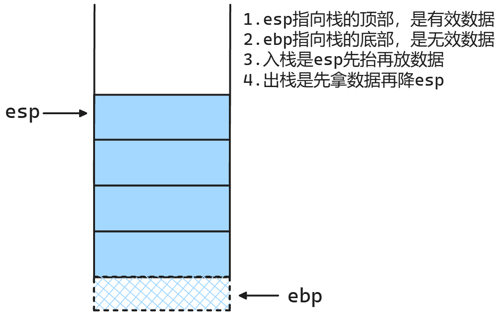
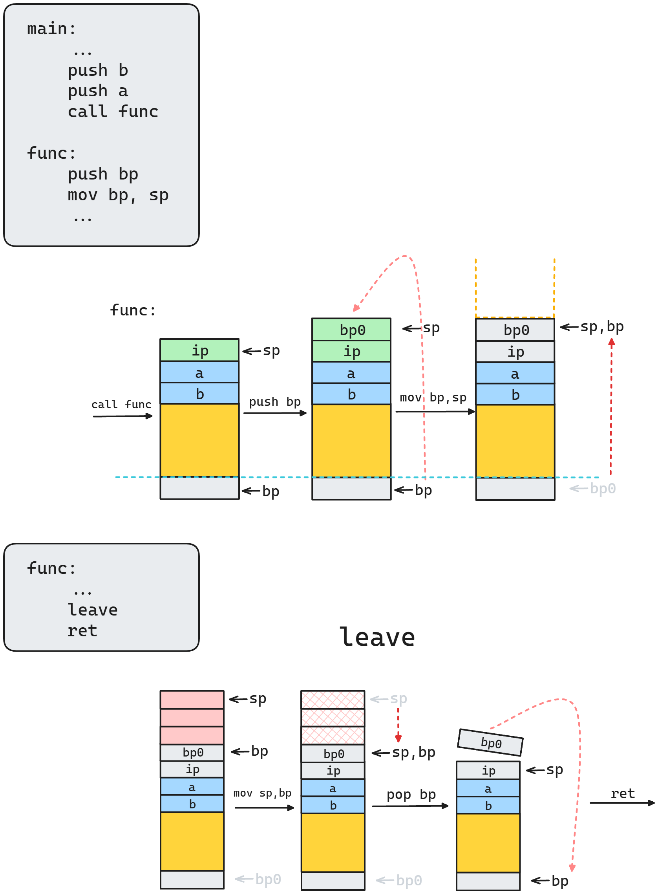

~~~assembly
main:
	...
	push a
	push b
	call func
	...
func:
	push ebp
	mov ebp, esp ; 先push ebp再把ebp拉上来
	...
	push ax
	push bx
	...
	leave ; mov esp, ebp; pop ebp 先把esp降下来再pop ebp
	ret ; 此时esp指向的地方存储的应该是eip
~~~

