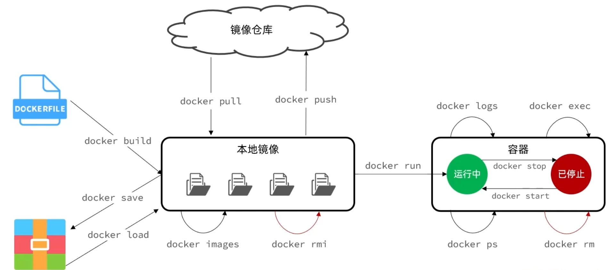
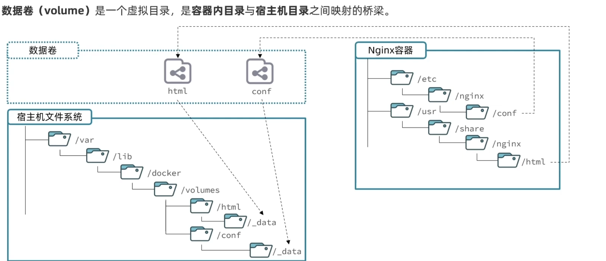

**docker** 本身就跟`mysql`服务器一样，通过接收来自`shell`的命令来执行一些动作

~~~shell
docker run -d \
	--name mysql \
	-p 3305:3306 \
	-e TZ=Asiz/Shanghai \
	-e MYSQL_ROOT_PASSWORD=root\
	mysql
~~~

`docker run <repositor>:<tag>`命令详解

* `docker run`启动并运行一个容器

* `-d`表示以**分离模式**（detached mode）运行容器。使用该参数后，容器将在后台运行

* `--name`给容器起个名字，必须唯一
* `-p <host-port>:<docker-port>`端口映射，左边是宿主机的端口可更改，右边是容器的端口不可更改，因为已做出来的镜像固定了这个端口
* `-e <KEY>=<VALUE>`设置容器的环境变量
* 最后就是指定一个镜像。镜像名称由两部分组成：[`repository`]:[`tag`]，其中`repository`是镜像名，`tag`是镜像的版本，默认是`latest`表示镜像的最新版本

`docker`对**容器**操作的命令

~~~shell
docker ps # 显示正在运行的容器
docker ps -a # 显示所有容器，包括停止的容器

docker log <name> # 显示<name>容器的日志
docker log -f <name> # f表follow，跟踪显示<name>容器的日志，ctrl+c退出

docker exec -it <name> <command> [<args>] # 在<name>容器中执行<command>命令跟上参数
# -i参数表示以交互模式运行 -t参数表示为容器分配一个终端
# 例：docker exec -it nginx bash
#     docker exec -it mysql -uroot -p

docker rm <name> # 删除<name>容器,但是不能删除运行中的容器
docker rm -f <name> # 强制删除，运行中的容器也能删除

docker stop <name> # 停止<name>容器
docker start <name> # 将<name>容器从stop状态转为运行状态

docker inspect <name> # 查看<name>容器的详细信息
~~~

`docker`对**镜像**操作的命令

~~~shell
docker images # 显示本地的镜像

docker rmi <image_name>:<tag> # 删除指定版本的镜像

docker save -o <outputfile> <image_name>:<tag> # 将指定版本的镜像输出为文件
# 例：docker save -o nginx.tar nginx:latest

docker load -i <filename> # 将上面的输出文件加载为镜像
# 例: docker load -i nginx.tar

# 如果某个命令参数不清楚可以用--help详知，比如 docker save --help
~~~

`volume`**数据卷**，是`docker`的一种逻辑概念，它能够与宿主机的某个目录进行关联，然后在创建容器时将容器内某个目录与这个数据卷也进行关联，`docker`就能通过这个数据卷完成宿主机目录与容器内目录的同步。注意，容器只有在创建时才能进行数据卷挂载，创建后就不行了，在创建容器时如果指定的数据卷不存在会创建一个指定名字的数据卷，并且关联的宿主机目录在`/var/lib/docker/volumes/<volume_name>/_data`目录下

在`docker run`命令下添加`-v`参数可以将容器内指定目录与数据卷关联(挂载)，比如

~~~shell
docker run --name nginx -v html:/usr/share/nginx/html nginx
~~~

就会创建一个`html`数据卷，并将创建的`nginx`容器内的`/usr/share/nginx/html`与`html`数据卷相关联，并且这个数据卷与宿主机的`/var/lib/docker/volumes/html/_data`目录相关联

`docker`挂载的方式有两种一种是通过数据卷挂载，叫`volume`；一种是直接与宿主机目录挂载，叫`bind`

`docker`对数据卷操作的命令

~~~shell
# 都是以volume打头
docker volume --help # 如果不清楚与数据卷有关的操作可以用这个命令
docker volume cerate # 创建数据卷
docker volume ls # 查看所有数据卷
docker volume rm # 删除指定数据卷
docker volume inspect # 查看某个数据卷的详情
docker volume prune # 清除数据卷
~~~

此外还可以不通过数据卷，直接将宿主机目录与容器内目录相关联

在执行`docker run`命令时，使用`-v 本地目录:容器内目录`可以完成本地目录挂载
本地目录必须以`/`或`./`开头，如果直接以名称开头，会被识别为数据卷而非本地目录

~~~shell
docker run --name nginx -v /home/kali/html:/usr/share/nginx/html nginx
~~~

此外还可以添加`ro`和`rw`来控制容器的读写权限，毕竟限制宿主机的读写权限也没什么意义

~~~shell
docker run --name nginx -v html:/usr/share/nginx/html:ro nginx # 容器对数据卷只有读权限
docker run --name nginx -v html:/usr/share/nginx/html:ro nginx # 容器对数据卷可读可写
~~~

`docker`可以进行**网络**操作，创建一个网络，其实就是创建一个内部的网络号和子网掩码，然后分配容器主机号，组成容器的内部`ip`地址。创建一个自定义网络，容器在自定义网络之间就可以通过容器名互相访问。

`docker`对**网络**操作的命令

~~~shell
# 都是以network打头
docker network --help # 如果不清楚与网络有关的操作可以用这个命令
docker netword cerate # 创建一个网络
docker network ls # 查看所有数据卷
docker network rm # 删除指定数据卷
docker network prune # 清除数据卷
docker network connect <容器> <网络> # 使指定容器接入某网络
docker network disconnect # 使指定容器离开某网络
docker network inspect # 查看网络详细信息
~~~

**Dockerfile**语法

|     指令     |                     说明                     |                             示例                             |
| :----------: | :------------------------------------------: | :----------------------------------------------------------: |
|    `FROM`    |                 指定基础镜像                 |                       `FROM centos:6`                        |
|    `ENV`     |        设置环境变量，可在后面指令使用        |                       `ENV key value`                        |
|    `COPY`    |         拷贝本地文件到镜像的指定目录         |                  `COPY ./jre11.tar.gz /tmp`                  |
|    `RUN`     | 执行`Linux`的`shell`命令，一般是安装过程命令 | `RUN tar -zxvf /tmp/jre11.tar.gz && EXPORT path=/tmp/jre11:$path` |
|   `EXPOSE`   | 指定容器运行时监听的端口，是给镜像使用者看的 |                        `EXPOSE 8080`                         |
| `ENTRYPOINT` |     镜像中应用的启动命令，容器运行时调用     |                `ENTRYPOINT java -jar xx.jar`                 |

~~~shell
docker build -t <image_name>:<tag> <Dockerfile_path>
~~~

`Dockerfile`让`docker`知道一个镜像需要哪些基础镜像进行制作

`docker-compose.yml`让`Docker Compose`知道一个项目需要怎么构建一些容器来构成子项目

