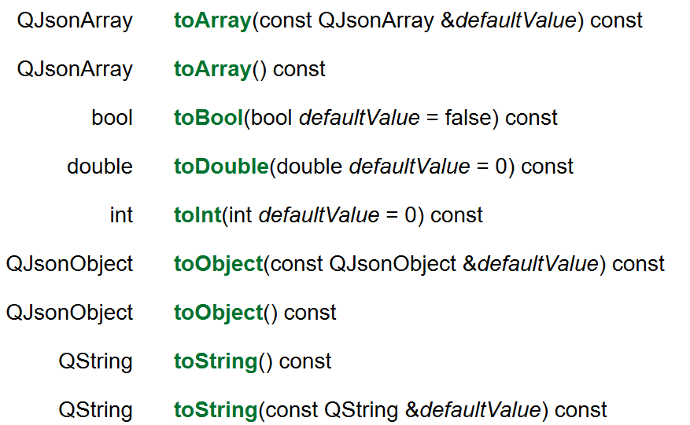

### 头文件

Qt帮我们包装好了JSON类，`QJson`

会使用到的头文件如下：

~~~cpp
#include <QJsonDocument>
#include <QJsonValue>
#include <QJsonObject>
#include <QJsonArray>
#include <QJsonParseError>
~~~

### 使用案例

以下这段原始的JSON数据为例

~~~json
[
    {
        "id": 1,
        "pid": 0,
        "city_code": "101010100",
        "city_name": "北京",
        "post_code": "100000",
        "area_code": "010",
        "ctime": ""
    },
    {
        "id": 2,
        "pid": 0,
        "city_code": "101020100",
        "city_name": "上海",
        "post_code": "200000",
        "area_code": "021",
        "ctime": ""
    },
    {
        "id": 3,
        "pid": 0,
        "city_code": "101030100",
        "city_name": "天津",
        "post_code": "300000",
        "area_code": "022",
        "ctime": ""
    }
]
~~~

### 先读取JSON数据转为QJsonDocument文档对象

首先使用`QJsonDocument`读取原始`JSON`数据

~~~cpp
QJsonParseError err;
QJsonDocument jsonDoc = QJsonDocument::fromJson(json, &err);
~~~

这个方法会先将整个JSON数据包装成`QJsonDocument`对象

>  值得注意的是：在JSON语法中，整个JSON数据是一个值，值可以是很多类型，比如：数组、对象、字符串、数字、布尔值以及null。也就是说一个JSON数据可以单单是一个数字或者布尔值。

~~~JSON
1
~~~

~~~JSON
true
~~~

上面两个都是合法的。

然后我们根据实际的情况调用方法将其转为JSON数组或者JSON对象。

如果是数组类型就转为数组`QArray`，如果是对象类型就转为对象`QObject`

~~~cpp
QJsonParseError err;
QJsonDocument jsonDoc = QJsonDocument::fromJson(json, &err);

QJsonArray cities = jsonDoc.array();
~~~

### 然后使用QJsonValue

前面说过，`JSON`的本质是一个**值**，这值可以是很多类型。JSON数据本身是一个值，JSON对象类型里的键值对中的键，是严格用双引号表示的字符串，值就是前面说的值可以是很对类型。

由于值可以是很多类型，所以Qt用统一的`QJsonValue`来表示`JSON`中的值。

然后用户根据实际的情况将其转化为其它类型

如果实际是数组，就转为JSON数组；如果实际是对象，就转为JSON对象。如果实际是字符串，就转为字符串

~~~cpp
QJsonParseError err;
QJsonDocument jsonDoc = QJsonDocument::fromJson(json, &err);

QJsonArray cities = jsonDoc.array();
for (const QJsonValue& jValue : cities) {
	QJsonObject city = jValue.toObject();
}
~~~

==可以说整个 QJson 就是以 QJsonValue 为重心。==

### 获取QObject中的键相应的值

直接使用`QJsonValue value(const QString &key) const`方法获取键的值。

注意到返回值还是一个`QJsonValue`，前面说过对象的键值对中的值同样是一个JSON的值，它可以是很多类型。

我们要根据实际情况把`QJsonValue`转为我们需要的类型。比如实际的值是字符串类型就要使用`QJsonValue.toString()`

~~~cpp
QJsonParseError err;
QJsonDocument jsonDoc = QJsonDocument::fromJson(json, &err);

QJsonArray cities = jsonDoc.array();
for (const QJsonValue& jValue : cities) {
	QJsonObject city = jValue.toObject();
    
    QString city_code = city.value("city_code").toString();
    QString city_name = city.value("city_name").toString();
    if (!city_code.isEmpty())
    	m_CityNameToCode.insert(std::pair<QString, QString>(city_name, city_code));
}
~~~

