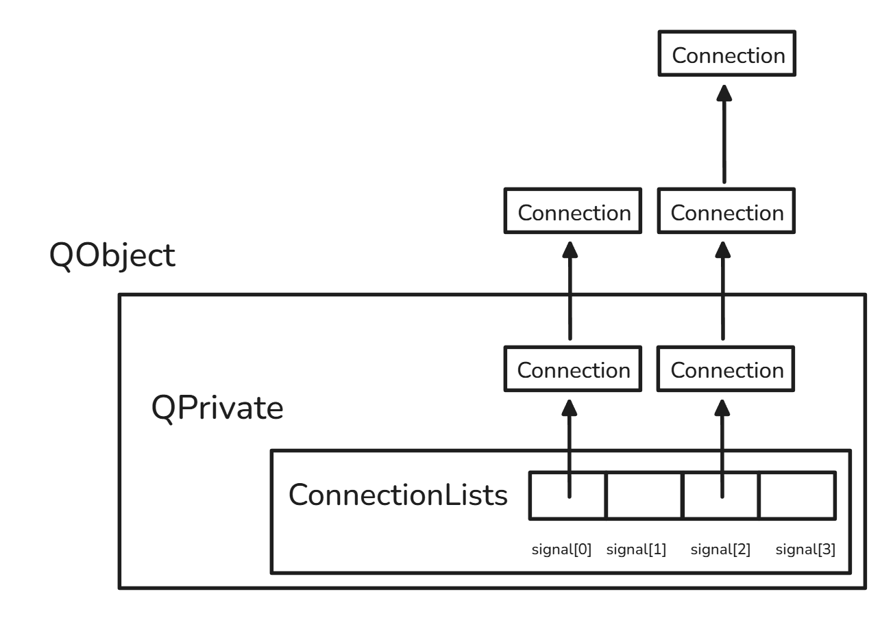
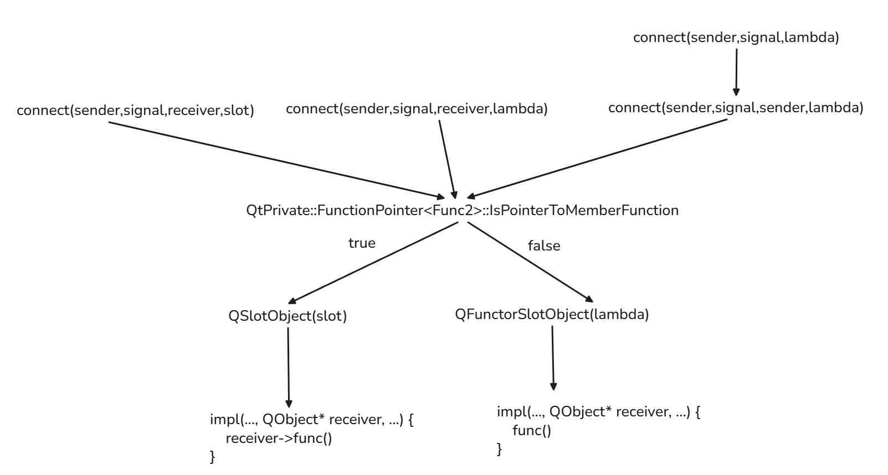

#### 一、Qt中.ui文件的作用原理

在`qtcreator`中新建项目时，会自动给我们生成`widget.h`和`widget.cpp`文件。其中`widget.h`会自动给我们一下内容。

~~~cpp
#include <QWidget>

namespace Ui {
class Widget;
}

class Widget : public QWidget
{
    Q_OBJECT

public:
    explicit Widget(QWidget *parent = 0);
    ~Widget();

private:
    Ui::Widget *ui;
};

~~~

这里面有两个`Widget`类，`Ui::Widget`与`::Widget`（我已这样的方式区分两个类）。

直入正题的说，界面文件夹下的`widget.ui`文件就是在定义`Ui::Widget`类。

* `widget.ui`文件以`xml`语言的方式在描述`Ui::Widget`的定义，然后`Qt`框架解析这个`ui`文件，生成对应`cpp`代码，由此来实现`Ui::Widget`的定义。

通过一个简单的例子来了解如何从`widget.ui`变成`cpp`代码。

~~~xml
 <?xml version="1.0" encoding="UTF-8"?>
  <ui version="4.0">
   <class>Widget</class> // 表明当前文件是在定义Ui::Widget类
      
   <widget class="QWidget" name="Widget"> // 表明setupUi传入的参数是QWidget* widget
     <property name="geometry">
   	 	<rect>
      		<x>0</x><y>0</y>
      		<width>300</width>
      		<height>150</height>
     	</rect>
  	 </property>
 	 <property name="windowTitle">
   		<string>窗口标题</string>
  	 </property>
       
       
    <widget class="QPushButton" name="pushButton"> // Ui::Widget下的一个控件
     <property name="text">
         <string>Click Me</string>
     </property>
    </widget>
       
    <widget class="QLineEdit" name="lineEdit"> // Ui::Widget下的另一个控件
    
   </widget>
  </ui>
~~~

对应生成的cpp代码如下

~~~cpp
// 由 uic 工具从 widget.ui 自动生成，不要手动编辑
  namespace Ui {
      class Widget;  // 前向声明
  }

  class Ui_Widget {
  public:
      QPushButton *pushButton;
      QLineEdit *lineEdit;

      void setupUi(QWidget *Widget) {
          Widget->setObjectName("Widget");
          Widget->resize(300, 150);
          Widget->setWindowTitle("窗口标题");
          // 根据 ui 文件的描述，用纯C++代码创建所有控件
          pushButton = new QPushButton(Widget);
          pushButton->setObjectName("pushButton");
          pushButton->setText("Click Me");
          
          lineEdit = new QLineEdit(Widget);
          lineEdit->setObjectName("lineEdit");
          // ... 设置布局、大小、信号槽等
      }
  };

  // 关键：把生成类"注入"到 Ui 命名空间
  namespace Ui {
      class Widget : public Ui_Widget {};
  }
~~~

或许会疑惑，为什么`widget.ui`的顶层控件`<widget>`并不在`Ui_Widget`中作为属性存在，只有其下的子控件作为属性存在。而且`setupUi()`中也没有去`new`它。

其实，顶层控件`<widget>`已经由用户去创建了，`::Widget`这个由用户定义的类就是这个顶层控件，它作为`setupUi()`的参数传进去。

`setupUi()`函数的本质就是在创建控件（设置它们的父类为我们在main.cpp中创建的Widget），然后给各个子控件赋予属性。

* `setupUi()`的作用就是1、`new`出各个子控件，2、把各个子控件挂到顶层控件上

至于为什么`Ui::Widget`下定义的属性都是指针，可以看看下面三条原因（我认为第三条比较靠谱：

* 我自己的推测是，用户可以自定义控件，但是Qt框架在定义时并不知道用户自定义的控件会有多大，所以干脆用指针来替代

> 核心原因有三点：
>
> ### 1. 生命周期由 Qt 父子树管理
>
> 控件在 `setupUi()` 里通过 `new` 创建在堆上，并被设为父控件的子对象：
>
> ```cpp
> void setupUi(QWidget *Widget) {
>     pushButton = new QPushButton(Widget);  // Widget 成为 pushButton 的父对象
>     // ...
> }
> ```
>
> Qt 的父子机制保证：**父对象析构时，会自动 `delete` 所有子对象**。所以这些控件存活在堆上直到窗口关闭，而不是随 `Ui_Widget` 这个壳对象的生命周期。
>
> ### 2. QObject 不可拷贝
>
> 所有 Qt 控件继承自 `QObject`，而 `QObject` 禁用了拷贝构造和赋值：
>
> ```cpp
> class QObject {
>     Q_DISABLE_COPY(QObject)  // 拷贝 = delete
> };
> ```
>
> 如果写成值成员：
> ```cpp
> QPushButton pushButton;  // ❌ Ui_Widget 也因此变得不可拷贝
> ```
>
> 用指针就没有这个问题，`Ui_Widget` 对象本身只是持有指针，拷贝/移动不受影响（虽然一般也不会去拷贝它）。
>
> ### 3. 头文件只需前向声明
>
> 用指针的话，头文件里只写 `class QPushButton;` 就够了，不需要 `#include <QPushButton>`，编译依赖更少、速度更快。值成员则必须有完整的类定义。
>
> ```cpp
> // ui_widget.h 中
> class QPushButton;          // 前向声明即可，因为只是指针
> class Ui_Widget {
>     QPushButton *pushButton; // ✓ 编译通过
> };
> ```
>
> 简而言之：**堆分配 + Qt 父子树自动管理了生命周期，指针是这套机制的必然选择。**

---

## 二、Qt中connect连接信号和槽机制的原理

## 为什么可以在方法体内直接使用 `connect`

`connect` 是 `QObject` 的 **public static** 成员函数。所有继承自 `QObject` 的类，在成员函数内部调用 `connect` 时，编译器通过名字查找找到这个静态函数，等价于 `QObject::connect(...)`。

---

## connect 的三个重载

重载都用函数重名，不涉及虚函数机制：

```cpp
// qobject.h (Qt 5.8 简化)

// 重载1：字符串 SIGNAL/SLOT 宏
static QMetaObject::Connection connect(
    const QObject *sender, const char *signal,
    const QObject *receiver, const char *method,
    Qt::ConnectionType = Qt::AutoConnection);

// 重载2：成员函数指针
template <typename Func1, typename Func2>
static QMetaObject::Connection connect(
    const typename QtPrivate::FunctionPointer<Func1>::Object *sender,
    Func1 signal,
    const typename QtPrivate::FunctionPointer<Func2>::Object *receiver,
    Func2 slot,
    Qt::ConnectionType = Qt::AutoConnection);

// 重载3：lambda / functor
template <typename Func1, typename Func2>
static QMetaObject::Connection connect(
    const typename QtPrivate::FunctionPointer<Func1>::Object *sender,
    Func1 signal, Func2 slot);
```

所有重载最终汇聚到 `QObjectPrivate::connect()`。

---

## 重载1：SIGNAL/SLOT 宏（Qt4 遗留方式）

### 宏的定义

```cpp
// qobjectdefs.h
#define SIGNAL(a)   "1" a
#define SLOT(a)     "2" a
#define METHOD(a)   "0" a
```

所以：
```cpp
connect(btn, SIGNAL(clicked()), this, SLOT(onClicked()));
// 展开为：
connect(btn, "1clicked()", this, "2onClicked()");
```

### connect 入口

```cpp
// qobject.cpp
QMetaObject::Connection QObject::connect(const QObject *sender, const char *signal,
                                         const QObject *receiver, const char *method,
                                         Qt::ConnectionType type)
{
    if (sender == nullptr || receiver == nullptr || signal == nullptr || method == nullptr) {
        qWarning("QObject::connect: invalid null parameter");
        return QMetaObject::Connection();
    }

    QByteArray tmp_signal_name;
    const QMetaObject *smeta = sender->metaObject();

    // 跳过前缀 '1' / '2'，定位到信号名
    ++signal;                                 // "clicked()"
    // 去除参数中的多余空格，做规范化
    QByteArray signalName = QMetaObject::normalizedSignature(signal);
    // 拿到规范化后的字符串，比如 "clicked()"

    // 在 sender 的 QMetaObject 中按名字查找信号索引
    int signal_index = smeta->indexOfSignal(signalName.constData());
    if (signal_index < 0) {
        // 尝试找同名方法——可能写成了 SLOT 或 METHOD
        signal_index = smeta->indexOfMethod(signalName.constData());
    }

    ++method;                                 // 跳过 '2'
    const QMetaObject *rmeta = receiver->metaObject();
    QByteArray methodName = QMetaObject::normalizedSignature(method);
    int method_index = rmeta->indexOfSlot(methodName.constData());    // ← 在 QMetaObject 表中按名查找
    if (method_index < 0)
        method_index = rmeta->indexOfMethod(methodName.constData());

    if (signal_index < 0 || method_index < 0) {  // 签名不匹配 —— 运行时错误！
        qWarning("QObject::connect: No such signal/slot ...");
        return QMetaObject::Connection();
    }

    if (!QMetaObjectPrivate::check_signal_macro(sender, signal_index,
                                                 receiver, method_index)) {
        qWarning("QObject::connect: signal/slot argument mismatch ...");
        return QMetaObject::Connection();
    }

    // ↓ 最终全部走到这里
    QMetaObject::Connection handle = QMetaObject::Connection();
    QMetaObjectPrivate::connectImpl(sender, signal_index, receiver, method_index,
                                    /*slot=*/0, type, /*types=*/0, smeta);
    handle.d_ptr->sender = const_cast<QObject*>(sender);
    return handle;
}
```

**缺点**：签名检查发生在运行时，拼写错误只有在运行时才能被发现。

---

## 重载2：成员函数指针（类型安全）

```cpp
connect(sender, &Sender::valueChanged, receiver, &Receiver::onValueChanged);
```

### `FunctionPointer` 萃取模板

```cpp
// qobjectdefs_impl.h
namespace QtPrivate {

template<typename T> struct FunctionPointer { /* 基础模板留空 */ };

// 偏特化：匹配 void (Obj::*)(Args...) 形式的成员函数指针
template<class Obj, typename Ret, typename... Args>
struct FunctionPointer<Ret (Obj::*)(Args...)>
{
    typedef Obj Object;                                    // 发送者/接收者类型
    typedef List<Args...> Arguments;                       // 参数列表
    enum { IsPointerToMemberFunction = true };

    // 从函数指针提炼出参数类型数组（用于运行时传递）
    static const int *argumentTypes() {
        static const int types[] = {
            (QtPrivate::QMetaTypeIdHelper<Args>::qt_metatype_id()...)  // 每个参数 → int id
        };
        return types;
    }
};

} // namespace
```

### connect 模板入口

```cpp
// qobject.h (简化)
template <typename Func1, typename Func2>
inline QMetaObject::Connection QObject::connect(
    const typename QtPrivate::FunctionPointer<Func1>::Object *sender,
    Func1 signal,
    const typename QtPrivate::FunctionPointer<Func2>::Object *receiver,
    Func2 slot,
    Qt::ConnectionType type)
{
    typedef QtPrivate::FunctionPointer<Func1> SignalType;
    typedef QtPrivate::FunctionPointer<Func2> SlotType;

    // ⚡ 编译期检查：参数是否兼容
    Q_STATIC_ASSERT_X(
        (QtPrivate::CheckCompatibleArguments<SignalType, SlotType>::value),
        "Signal and slot arguments are not compatible."
    );

    const int *signalTypes = SignalType::argumentTypes();  // 编译期生成
    const int *slotTypes   = SlotType::argumentTypes();

    // ↓ 调用连接实现
    return QObject::connectImpl(
        sender, reinterpret_cast<void **>(&signal),   // 信号函数指针的地址
        receiver, reinterpret_cast<void **>(&slot),   // 槽函数指针的地址
        new QtPrivate::QSlotObject<Func2, typename SignalType::Arguments>(slot), // 包装器
        type, signalTypes, &SignalType::Object::staticMetaObject
    );
}
```

### `QSlotObject` — 用函数指针把槽包装起来

```cpp
// qobjectdefs_impl.h
template<typename Func, typename Args>
struct QSlotObject : public QSlotObjectBase
{
    Func function;       // 存储成员函数指针  &Receiver::onValueChanged

    QSlotObject(Func f) : function(f) {}

    // 基类虚函数：真正调用槽函数
    static void impl(int which, QSlotObjectBase *this_, QObject *r, void **a, bool *ret)
    {
        QSlotObject *t = static_cast<QSlotObject *>(this_);
        switch (which) {
        case 0:  // call
            // 把 void* 数组 a[] 还原成真正的参数类型并调用 (r->*function)(a[1], a[2], ...)
            t->function(r,
                (*reinterpret_cast<typename RemoveRef<Args>::Type *>(a[1])),
                ...);
            break;
        case 1:  // compare
            // 用于断开连接时比对是否同一个槽
            break;
        }
    }
};
```

### connectImpl 的调用链

```
QObject::connect(sender, &S::sig, receiver, &R::slot, type)
  │
  ├─ FunctionPointer 萃取 sender/receiver 类型、参数类型
  ├─ 编译期类型检查 (COMPILE TIME ← 关键优势)
  ├─ 创建 QSlotObject 包装槽函数指针
  │
  └─ QObject::connectImpl(sender, &signal_ptr, receiver, &slot_ptr,
                           slotObj, type, types, &metaObject)
        │
        ├─ 拿到 signal_index（通过 sender→metaObject()→indexOfSignal）
        ├─ 拿到 method_index  （通过 receiver→metaObject()→indexOfSlot）
        │
        └─ QObjectPrivate::connectImpl(sender, signal_index, receiver,
                                        method_index, slotObj, type, types)
              │
              └─ QObjectPrivate::connect(同下)
```

---

## 重载3：Lambda / Functor

```cpp
connect(sender, &Sender::valueChanged,
        [](int v) { qDebug() << v; });
```

模板版本（无 receiver 参数的那个）：

```cpp
template <typename Func1, typename Func2>
inline /* SFINAE 约束 */ QObject::connect(
    const typename QtPrivate::FunctionPointer<Func1>::Object *sender,
    Func1 signal, Func2 slot)
{
    // 当 receiver 不存在时，sender 自己当上下文
    // 这样 sender 销毁时自动断开该连接
    return connect(sender, signal, sender, slot, Qt::DirectConnection);
    //                 ↑ sender 也是 receiver（上下文对象）
}

// 然后走到：
template <typename Func1, typename Func2>
QMetaObject::Connection QObject::connect(
    const typename QtPrivate::FunctionPointer<Func1>::Object *sender,
    Func1 signal,
    const QObject *context,    // ← 这里 context 就是 sender
    Func2 slot,                // ← 这里的 slot 是 lambda
    Qt::ConnectionType type)
{
    // 用 QFunctorSlotObject 包装 lambda
    auto slotObj = new QtPrivate::QFunctorSlotObject<Func2,
        typename QtPrivate::FunctionPointer<Func1>::Arguments>(slot);

    return QObject::connectImpl(sender, reinterpret_cast<void **>(&signal),
                                context, /*slot_ptr=*/nullptr,
                                slotObj,    // ← lambda 包装器
                                type, signalTypes, &metaObject);
}
```

### QFunctorSlotObject 如何调用 lambda

```cpp
// qobjectdefs_impl.h
template<typename Func, typename Args>
struct QFunctorSlotObject : public QSlotObjectBase
{
    Func function;  // 存储 lambda 或 std::function 对象

    QFunctorSlotObject(Func f) : function(std::move(f)) {}

    static void impl(int which, QSlotObjectBase *this_, QObject *, void **a, bool *ret)
    {
        QFunctorSlotObject *t = static_cast<QFunctorSlotObject *>(this_);
        switch (which) {
        case 0:  // call
            // 还原参数，调用 lambda
            t->function(reinterpret_cast<Args *>(a[0])->data()...);
            break;
        }
    }
};
```

---

## 汇聚点：`QObjectPrivate::connect()` 底层数据结构

三种重载最终都走到这里：

```cpp
// qobject_p.h — 数据结构
class QObjectPrivate : public QObjectData
{
public:
    // ════ 底层的连接结构 ════
    struct Connection
    {
        QObject *sender;
        QObject *receiver;
        QAtomicInt ref_;
        uint id;

        union {
            StaticMetaCallFunction callFunction;   // 成员函数指针方式用这里
            QSlotObjectBase      *slotObj;         // lambda/functor 方式用这里
        };

        // 发送者的信号索引（全局）
        int signal_index;
        // 接收者的槽索引（两种情况不同）
        int method;                   // 接收者 metaObject 中的绝对索引（字符串方式）
        ushort method_relative;       // 接收者的相对索引（函数指针方式）

        Qt::ConnectionType connectionType;
        uint isSlotObject       : 1;   // 哪个 union 成员有效
        uint slotThread        : 1;   // 是否跨线程排队

        // 链表指针
        Connection **prev;
        Connection  *nextConnectionList;

        // 排队调用时的参数类型数组
        QAtomicPointer<const int> argumentTypes;
    };

    // ════ 信号 → Connection 链表 的映射 ════
    // 每个信号都有一个 ConnectionList
    // connectionLists 是个数组，索引 = signal_index
    QVector<ConnectionList> connectionLists;

    // ConnectionList 本质上是单向链表头指针
    typedef Connection *ConnectionList;
};
```

### connect 插入链表的过程

```cpp
// qobject.cpp — QObjectPrivate::connect()
QMetaObject::Connection QObjectPrivate::connect(
    const QObject *sender, int signal_index,
    const QObject *receiver, int method_index,
    QSlotObjectBase *slotObj,          // lambda 时有效
    int type, int *types)
{
    QObject *s = const_cast<QObject *>(sender);
    QObject *r = const_cast<QObject *>(receiver);

    // 1. 申请一个 Connection 节点
    Connection *c = new Connection;
    c->sender         = s;
    c->receiver       = r;
    c->signal_index   = signal_index;
    c->method         = method_index;
    c->connectionType = type;
    c->isSlotObject   = (slotObj != 0);

    if (slotObj) {
        c->slotObj = slotObj;           // lambda 路径
        slotObj->ref();  // 增加引用计数
    } else {
        c->callFunction = ...;          // 函数指针路径
    }

    // 2. 加锁，插入发送者的 connectionLists[signal_index]
    QMutexLocker locker(&s->d_func()->mutex_lock);   // ← 注意：有个锁！

    // 确保数组够大
    if (s->d_func()->connectionLists.size() <= signal_index)
        s->d_func()->connectionLists.resize(signal_index + 1);

    ConnectionList &list = s->d_func()->connectionLists[signal_index];

    // 3. 链表头插法
    c->prev = reinterpret_cast<Connection **>(&list);
    c->nextConnectionList = list;        // c → 原head
    if (list)
        list->prev = &c->nextConnectionList;
    list = c;                            // head = c

    // 4. 双向绑定：在 receiver 这边也记录（用于 receiver 销毁时自动断开）
    QObjectPrivate::get(r)->addConnection(c);

    return c->toConnection(s);
}
```

最终形成的数据结构：

```
sender (QObject)
  d_ptr → QObjectPrivate
            connectionLists[]: QVector<Connection*>
              [0] →  nullptr        ← 信号 destroyed() 无连接
              [1] →  Connection⁰    ← 信号 valueChanged(int)
                      ├─ sender:    btn
                      ├─ receiver:  this
                      ├─ signal_index: 1
                      ├─ method: 3        (onValueChanged 在 receiver metaObject 中的索引)
                      ├─ slotObj / callFunction
                      ├─ nextConnectionList  →  Connection¹    ← 另一个槽连到同一信号
                      │                          └─ ...
                      └─ prev: ← &connectionLists[1]
              [2] →  nullptr
              ...
```

receiver 端同样维护了反向链表，使得 receiver 析构时可以遍历所有指向它的 Connection 并断开。

---

## 信号的发射

### 信号的真面目

```cpp
// 你在 .h 中写的：
signals:
    void valueChanged(int newValue);

// MOC 在 moc_xxx.cpp 中生成的实现：
void MyWidget::valueChanged(int _t1)
{
    // 把参数打包成 void* 数组
    void *_a[] = {
        Q_NULLPTR,
        const_cast<void*>(reinterpret_cast<const void*>(&_t1))
    };

    // 核心：调用 QMetaObject::activate
    QMetaObject::activate(this, &staticMetaObject,
                          1,   // ← 本信号在本类metaObject中的局部索引
                          _a); // ← 参数包
}
```

`emit` 宏的定义：

```cpp
#define emit   // 空的！
```

### activate — 遍历链表逐个调用

```cpp
// qobject.cpp（大幅简化）
void QMetaObject::activate(QObject *sender, const QMetaObject *m,
                           int local_signal_index, void **argv)
{
    // 计算全局信号索引
    int signal_index = local_signal_index + m->methodOffset();

    QObjectPrivate *d = sender->d_func();

    if (!d->connectionLists.isEmpty()) {
        QMutexLocker locker(&d->mutex_lock);

        ConnectionList &list = d->connectionLists[signal_index];

        // ═══════════════════════════════════
        // 遍历连接链表，逐个调用
        // ═══════════════════════════════════
        Connection *c = list;    // 链表头
        while (c != 0) {
            QObject *receiver = c->receiver;

            if (!receiver) {
                // 接收者已销毁 → 清理
                c = c->nextConnectionList;
                continue;
            }

            // 判断线程，决定是直接调用还是排队
            if (c->connectionType == Qt::DirectConnection ||
                (c->connectionType == Qt::AutoConnection
                 && sender->thread() == receiver->thread()))
            {
                // ─── 直接调用（同线程）───
                if (c->isSlotObject) {
                    // lambda/functor 路径
                    c->slotObj->call(receiver, argv);
                } else {
                    // 成员函数指针路径
                    // 通过 receiver 的 QMetaObject 分发
                    receiver->metaObject()->static_metacall(
                        receiver, QMetaObject::InvokeMetaMethod,
                        c->method, argv
                    );
                }
            }
            else
            {
                // ─── 队列调用（跨线程）───
                // 构造 QMetaCallEvent，post 到 receiver 所在线程的事件循环
                QMetaCallEvent *ev = c->isSlotObject
                    ? new QMetaCallEvent(c->slotObj, 0, signal_index, argv)
                    : new QMetaCallEvent(c->method, 0, ..., argv);

                QCoreApplication::postEvent(receiver, ev);
            }

            c = c->nextConnectionList;   // 继续下一个连接
        }
    }

    // 如果 m 是父类的 metaObject，还要递归到子类的 activate，
    // 处理子类中新增的信号
}
```

---

## 总结：一次 `connect` + `emit` 的全貌

```
┌─ 编译期 ─────────────────────────────────────────┐
│  connect(sender, &S::sig, receiver, &R::slot)     │
│    │                                               │
│    ├─ FunctionPointer 萃取类型                     │
│    ├─ 编译期参数兼容性检查                          │
│    ├─ QSlotObject 包装槽函数指针                    │
│    └─ → QObjectPrivate::connect()                  │
│         └─ Connection 节点插入                     │
│            sender.connectionLists[signal_index]    │
│            (链表头插法)                             │
└───────────────────────────────────────────────────┘

┌─ 运行时 ─────────────────────────────────────────┐
│  emit sig(args)                                    │
│    │                                               │
│    └─ MOC生成的 sig() 函数体                        │
│         └─ QMetaObject::activate(sender, metaObject,│
│                                  signal_index, argv)│
│              │                                     │
│              └─ 遍历 connectionLists[signal_index] │
│                   │                                │
│                   ├─ 同线程 → 直接调用 slot / lambda│
│                   └─ 跨线程 → postEvent 排队       │
└───────────────────────────────────────────────────┘
```

**信号的本质**：就是一个由 MOC 生成的 protected 成员函数，函数体只做一件事——把参数打包成 `void*[]`，然后调用 `QMetaObject::activate()`。信号的返回值永远是 `void`（MOC 强制）。`emit` 是个空宏，它的存在纯属给人类读者一个视觉标记。

---

# Qt5.8 信号槽机制深度解析

下面从 **connect 三种重载**、**核心数据结构**、**信号发射调用链** 三个层面展开，结合关键源码文件说明。

---

## 一、connect 的三种重载方式

##### 1. SIGNAL/SLOT 宏重载（字符串形式）

```cpp
// qobject.h - 声明
static QMetaObject::Connection connect(
    const QObject *sender, const char *signal,
    const QObject *receiver, const char *method,
    Qt::ConnectionType type = Qt::AutoConnection);
```

**内部流程**（`qobject.cpp:3473` 附近）：

```cpp
QMetaObject::Connection QObject::connect(const QObject *sender, const char *signal,
                                          const QObject *receiver, const char *method,
                                          Qt::ConnectionType type)
{
    // 1. 提取信号名，去掉 SIGNAL() 宏加的 "2" 前缀
    const QByteArray signalSignature = QMetaObjectPrivate::signalName(signal);
    const QByteArray methodSignature = QMetaObjectPrivate::methodName(method);

    // 2. 通过 metaObject 查找信号/槽的索引
    const QMetaObject *smeta = sender->metaObject();
    int signal_index = smeta->indexOfSignal(signalSignature.constData());   // O(n) 字符串匹配
    if (signal_index < 0) { /* warning and return */ }

    const QMetaObject *rmeta = receiver->metaObject();
    int method_index = rmeta->indexOfSlot(methodSignature.constData());     // O(n) 字符串匹配
    if (method_index < 0) { /* warning and return */ }

    // 3. 核心：调用 QMetaObjectPrivate::connect
    return QMetaObjectPrivate::connect(sender, signal_index, smeta,
                                        receiver, method_index, rmeta, type);
}
```

**关键点**：
- `SIGNAL(x)` 宏展开为 `"2" #x`，即 `"2valueChanged(int)"`，数字前缀用于区分信号/槽的规范化签名
- 每次调用都要做 **字符串解析和线性查找**，没有编译期类型检查
- 查找到的 `signal_index` 和 `method_index` 是 MOC 生成的 meta-object 表中的相对偏移

---

##### 2. 成员函数指针重载（类型安全）

```cpp
// qobject.h - 声明（简化）
template <typename Func1, typename Func2>
static inline QMetaObject::Connection connect(
    const typename QtPrivate::FunctionPointer<Func1>::Object *sender,
    Func1 signal,
    const typename QtPrivate::FunctionPointer<Func2>::Object *receiver,
    Func2 slot,
    Qt::ConnectionType type = Qt::AutoConnection);
```

**内部流程**（`qobject.h` 模板，调用到 `qobject.cpp:3786` 附近的 `QObject::connectImpl`）：

```cpp
// qobject.h - 模板展开
template <typename Func1, typename Func2>
QMetaObject::Connection QObject::connect(
    const typename QtPrivate::FunctionPointer<Func1>::Object *sender,
    Func1 signal,
    const typename QtPrivate::FunctionPointer<Func2>::Object *receiver,
    Func2 slot, Qt::ConnectionType type)
{
    typedef QtPrivate::FunctionPointer<Func1> SignalType;   // 编译期萃取信号类型
    typedef QtPrivate::FunctionPointer<Func2> SlotType;     // 编译期萃取槽类型

    // 编译期类型校验
    Q_STATIC_ASSERT_X(QtPrivate::HasQ_OBJECT_Macro<...>::Value, ...);

    // 提取参数类型列表
    const int *types = 0;
    // ... 类型匹配检查 ...

    // 最终仍调用 connectImpl
    return QObject::connectImpl(sender, reinterpret_cast<void **>(&signal),
                                receiver, reinterpret_cast<void **>(&slot),
                                new QtPrivate::QSlotObject<Func2, ...>(slot),
                                type, types, &SignalType::Object::staticMetaObject);
}
```

**关键数据结构 `QSlotObjectBase`**（`qobjectdefs_impl.h`）：

```cpp
// qobjectdefs_impl.h
struct QSlotObjectBase {
    QAtomicInt m_ref;
    // vtable-like function pointer
    typedef void (*Operation)(QSlotObjectBase *self, ...);
    Operation impl;
    // ...
};

template <typename Func, typename Args, typename R>
class QFunctorSlotObject : public QSlotObjectBase {  // 继承自 QSlotObjectBase
    Func function;   // 存储的函数对象（lambda 或仿函数）
    // ...
};
```

**关键点**：
- `QtPrivate::FunctionPointer` 模板在编译期萃取返回值类型、参数类型、类类型
- 不依赖字符串查找，通过 `&ClassName::methodName` 编译器直接确定函数在虚表中的偏移
- 最终调用 `QObject::connectImpl`，将槽包装为 `QSlotObjectBase` 子类对象

---

##### 3. Lambda/匿名函数重载

```cpp
// qobject.h
template <typename Func1, typename Func2>
static inline QMetaObject::Connection connect(
    const typename QtPrivate::FunctionPointer<Func1>::Object *sender,
    Func1 signal, Func2 slot);  // slot 没有指定 receiver
```

**内部流程**：

```cpp
template <typename Func1, typename Func2>
QMetaObject::Connection QObject::connect(
    const typename QtPrivate::FunctionPointer<Func1>::Object *sender,
    Func1 signal, Func2 slot)
{
    // slot 是一个 lambda，Func2 是 lambda 的类型（编译器生成的匿名类）
    // 将 lambda 包装成 QFunctorSlotObject
    return connect(sender, signal, sender,   // receiver = sender（默认上下文对象）
                   new QtPrivate::QFunctorSlotObject<Func2, ...>(slot), type);
    //                   ^^^^^^^^^^^^^^^^^^^^^^^^^^^^^^^^^^^^^^^^
    //                   把 lambda move 进去，生命周期由引用计数管理
}
```

**关键点**：
- Lambda 被包装进 `QFunctorSlotObject<Func2>`，Func2 是编译期确定的闭包类型
- 当不传 receiver 时，**默认以 sender 作为上下文对象**——sender 析构时连接自动断开
- `QSlotObjectBase::impl` 函数指针在构造时被设为模板特化的 `call` 静态函数，调用时直接执行 `function(args...)`

---

## 二、核心数据结构

##### QObjectPrivate::Connection

```cpp
// qobject_p.h
struct QObjectPrivate::Connection {
    QObject *sender;           // 发送者
    QObject *receiver;         // 接收者（lambda 连接时为 nullptr）
    QSlotObjectBase *slotObj;  // 槽的封装对象（新式 connect 使用）
    QObjectPrivate::Connection *nextConnectionList;  // 链表下一节点
    Connection **prevConnectionList;  // 链表前驱指针的地址（便于 O(1) 删除）

    ushort method_offset;      // 接收者的方法偏移
    ushort method_relative;    // 信号/槽在 metaobject 中的相对索引
    uint signal_index : 27;    // 信号的绝对索引（在 connectionLists 中的位置）
    ushort connectionType : 3; // AutoConnection/DirectConnection/QueuedConnection/BlockingQueuedConnection
    ushort isSlotObject : 1;   // 是否为新式 QSlotObjectBase 连接
    ushort ownSlotObj : 1;     // 是否需要析构时 delete slotObj
    // ...
};
```

##### QObjectPrivate::ConnectionList

```cpp
struct QObjectPrivate::ConnectionList {
    QObjectPrivate::Connection *first;   // 链表头指针
    QObjectPrivate::Connection *last;    // 链表尾指针（便于 O(1) 尾部插入）
};
```

##### ConnectionLists（信号→连接列表的映射）

```cpp
// qobject_p.h - QObjectPrivate 成员
// 每个 QObject 的 QObjectPrivate 中有一个 vector：
QObjectPrivate::ConnectionList *connectionLists;  // 实际上是 QObjectConnectionListVector

// qobject.cpp
class QObjectConnectionListVector : public QVector<ConnectionList> {
    // signal_index → ConnectionList 的映射
    // signalsBlocked 标志也在同一结构
};
```

**整体关系图**：

```
QObject
└── QObjectPrivate
    └── connectionLists (QObjectConnectionListVector)
        ├── [0] ConnectionList  →  Connection → Connection → ...
        ├── [1] ConnectionList  →  Connection → ...
        ├── [2] ConnectionList  →  (empty)
        ├── [3] ConnectionList  →  Connection → ...
        └── ...

  每个 ConnectionList 对应一个信号索引（signal_index）
  每个 Connection 是一个链表节点，记录了一对 sender-receiver 的连接关系
```

---

## 三、QMetaObjectPrivate::connect 核心逻辑

三种重载最终都汇入这里（`qobject.cpp:3546`）：

```cpp
QMetaObject::Connection QMetaObjectPrivate::connect(
    const QObject *sender, int signal_index, const QMetaObject *senderMetaObject,
    const QObject *receiver, int method_index, const QMetaObject *receiverMetaObject,
    int type, int *types, QSlotObjectBase *slotObj)
{
    QObject *s = const_cast<QObject *>(sender);

    // 1. 计算信号的绝对索引（累加父类的信号数量）
    int signal_absolute_index = signal_index + senderMetaObject->methodOffset();

    // 2. 确保 connectionLists 足够大（动态扩容）
    QObjectPrivate::ConnectionList *connectionList =
        QObjectPrivate::get(s)->ensureConnectionData(signal_absolute_index);

    // 3. 创建 Connection 节点
    QObjectPrivate::Connection *c = new QObjectPrivate::Connection;
    c->sender = s;
    c->receiver = const_cast<QObject *>(receiver);
    c->slotObj = slotObj;
    c->signal_index = signal_absolute_index;
    c->method_relative = method_index;
    c->method_offset = receiverMetaObject->methodOffset();
    c->connectionType = type;
    c->isSlotObject = (slotObj != 0);
    c->ownSlotObj = (slotObj != 0);

    // 4. 将 Connection 节点插入信号对应的链表（尾插法，O(1)）
    c->prevConnectionList = &connectionList->last;
    if (connectionList->last) {
        connectionList->last->nextConnectionList = c;
        c->prevConnectionList = &connectionList->last->nextConnectionList;
    } else {
        connectionList->first = c;
    }
    connectionList->last = c;

    // 5. 如果是 receiver，把自己注册到 receiver 的 senders 列表（用于 receiver 析构时自动断开）
    QObjectPrivate::get(receiver)->addToSenderList(c);

    QMetaObject::Connection handle(c, signal_absolute_index);
    return handle;
}
```

---

## 四、信号发射的完整调用链

当你写 `emit someSignal(arg)` 时：

##### Step 1: MOC 生成的信号函数体

```cpp
// moc_xxx.cpp - MOC 为信号生成的函数
void MyClass::someSignal(int _t1)
{
    // 直接调用 QMetaObject::activate，不执行任何业务逻辑
    void *_a[] = { Q_NULLPTR, const_cast<void*>(reinterpret_cast<const void*>(&_t1)) };
    QMetaObject::activate(this, &staticMetaObject, 1, _a);
    //                                          ^ 信号的相对索引
}
```

**signals 本质上就是 protected 的普通成员函数**，MOC 为你生成了函数体。`emit` 宏是空宏，纯粹用于可读性。

##### Step 2: QMetaObject::activate（`qobject.cpp:3959`）

```cpp
void QMetaObject::activate(QObject *sender, const QMetaObject *m,
                            int local_signal_index, void **argv)
{
    // 1. 计算信号绝对索引
    int signal_index = local_signal_index + m->methodOffset();

    // 2. 处理信号阻塞和连接数量判断（快速路径）
    QObjectPrivate *d = QObjectPrivate::get(sender);
    if (d->connectionLists && signal_index < d->connectionLists->count()) {
        // 获取该信号对应的连接链表
        const QObjectPrivate::ConnectionList *list =
            &(*d->connectionLists)[signal_index];

        if (list) {
            QObjectPrivate::Connection *c = list->first;
            if (c) {
                // 3. 检查是否在 sender 的信号发射保护间隔内
                //    防止递归连接导致的无限循环
                if (!d->isSender) {
                    d->isSender = true;
                    // 核心：遍历连接链表，逐一调用槽
                    QMetaObjectPrivate::activateHelper(sender, signal_index,
                                                        c, argv, 0, 0);
                    d->isSender = false;
                }
            }
        }
    }

    // 4. 信号发射完成后，如果 receiver 在 sender 线程，
    //    遍历 sender 的所有子对象，递归激活同名信号（处理动态属性变化通知等）
    activate0(sender, local_signal_index, argv);
}
```

##### Step 3: activateHelper 遍历链表并分发（`qobject.cpp`）

```cpp
static void activateHelper(QObject *sender, int signal_index,
                            QObjectPrivate::Connection *c, void **argv)
{
    // 临时存储，防止遍历时被修改
    QVarLengthArray<QObjectPrivate::Connection *> connections;
    while (c) {
        connections.append(c);
        c = c->nextConnectionList;
    }

    // 按连接类型分发
    for (int i = 0; i < connections.count(); ++i) {
        QObjectPrivate::Connection *conn = connections[i];
        if (!conn->receiver) continue;  // receiver 已被析构

        // 确定实际连接类型（AutoConnection 按线程转换）
        Qt::ConnectionType type = conn->connectionType;
        if (type == Qt::AutoConnection) {
            type = (conn->receiver->thread() == sender->thread())
                   ? Qt::DirectConnection
                   : Qt::QueuedConnection;
        }

        switch (type) {
        case Qt::DirectConnection:
            // 直接调用槽函数
            callSlot(conn->receiver, conn, argv);
            break;

        case Qt::QueuedConnection: {
            // 将调用打包成 QMetaCallEvent，投递到 receiver 所在线程的事件队列
            QMetaCallEvent *ev = new QMetaCallEvent(conn, signal_index, argv);
            QCoreApplication::postEvent(conn->receiver, ev);
            break;
        }

        case Qt::BlockingQueuedConnection:
            // 跨线程同步调用，使用信号量等待
            QMetaCallEvent *ev = new QMetaCallEvent(conn, signal_index, argv);
            QCoreApplication::postEvent(conn->receiver, ev);
            ev->semaphore.acquire();  // 阻塞当前线程
            break;
        }
    }
}
```

##### Step 4: callSlot → 实际执行（`qobject.cpp`）==最精华的部分==

```cpp
static void callSlot(QObject *receiver, QObjectPrivate::Connection *c, void **argv)
{
    if (c->isSlotObject) {
        // 新式 connect（lambda/仿函数/成员函数指针）
        //   解引用 argv，然后调用 QSlotObjectBase::impl(c->slotObj, ...)
        c->slotObj->impl(c->slotObj, receiver, argv, ...);
    } else {
        // 旧式 connect（字符串形式）
        //   通过 receiver->metaObject() 查找 method_offset + method_relative
        //   调用 qt_static_metacall(receiver, QMetaObject::InvokeMetaMethod, index, argv)
        const QMetaObject *meta = receiver->metaObject();
        int method = c->method_relative + c->method_offset;
        meta->static_metacall(receiver, QMetaObject::InvokeMetaMethod, method, argv);
    }
}
```

**`qt_static_metacall` 是 MOC 生成的巨大 switch 函数**：

```cpp
// MOC 生成的代码
void MyClass::qt_static_metacall(QObject *_o, QMetaObject::Call _c,
                                  int _id, void **_a)
{
    if (_c == QMetaObject::InvokeMetaMethod) {
        MyClass *_t = static_cast<MyClass *>(_o);
        switch (_id) {
        case 0: _t->someSignal((*reinterpret_cast<int*>(_a[1]))); break;
        case 1: _t->onSomeSlot((*reinterpret_cast<int*>(_a[1]))); break;
        // ... 所有信号和槽都在这里
        }
    }
}
```

---

## 五、完整调用链总结

```
emit sender->signal(args)
    │
    ▼
MOC 生成的 signal 函数体
    QMetaObject::activate(this, &staticMetaObject, signal_index, args)
    │
    ▼
QMetaObject::activate()
    │ 计算 signal_absolute_index
    │ 从 connectionLists[signal_absolute_index] 取得 ConnectionList
    │
    ▼
activateHelper()
    │ 遍历 Connection 链表
    │ 判断连接类型 (Direct / Queued / BlockingQueued)
    │
    ├── DirectConnection ──► callSlot() ──► slotObj->impl() 或 qt_static_metacall()
    │                                              │
    │                                              ▼
    │                                     Receiver::slotFunction(args)
    │
    ├── QueuedConnection ──► QCoreApplication::postEvent(receiver, QMetaCallEvent)
    │                              │
    │                              ▼  (receiver 线程的事件循环)
    │                        QMetaCallEvent 出队 → callSlot() → slotFunction()
    │
    └── BlockingQueuedConnection ──► postEvent + semaphore.acquire()
                                         │
                                         ▼  (receiver 线程执行完毕)
                                   semaphore.release() → 发送线程继续
```

---

## 六、关键源码文件索引

| 文件                                    | 内容                                                         |
| --------------------------------------- | ------------------------------------------------------------ |
| `src/corelib/kernel/qobject.cpp`        | `connect()` 实现、`activate()`、`activateHelper()`、`callSlot()`、`QMetaObjectPrivate::connect()` |
| `src/corelib/kernel/qobject_p.h`        | `QObjectPrivate`、`Connection` 结构体、`ConnectionList`      |
| `src/corelib/kernel/qobject.h`          | 三种 `connect()` 模板重载声明                                |
| `src/corelib/kernel/qobjectdefs.h`      | `SIGNAL`/`SLOT` 宏、`QMetaObject::Connection`                |
| `src/corelib/kernel/qobjectdefs_impl.h` | `QSlotObjectBase`、`QFunctorSlotObject`、`FunctionPointer` trait |
| `moc_xxx.cpp`（MOC 生成）               | `qt_static_metacall()`、信号函数体                           |

核心思想可以归纳为：**connect 构建了一个以信号索引为 key、以 Connection 链表为 value 的映射表；信号发射时查表遍历链表，按连接类型分派执行。** 新式 connect 用编译期模板萃取类型信息替代运行期字符串查找，是 Qt5 相比 Qt4 最大的改进。

---

这个问题问到了 Qt 信号槽机制的分派核心。答案是：**区分不是通过运行时判断，而是通过编译期模板实例化**。不同的 connect 重载实例化出不同的 `QSlotObjectBase` 子类，每个子类有自己的 `impl` 函数指针，调用约定在编译期就已确定。

---

~~~
我的疑问是，connect不管传入的是成员函数指针还是lambda表达式，最终都会传入receiver指针。对于成员函数指针在调用时需要传
  入receiver但是lambda表达式调用时却不需要。那么Qt在调用时是如何区分辨别是否需要传入receiver指针作为参数的。结合Qt5.8源
  码讲讲
~~~


## 一、QSlotObjectBase 的多态机制（手动的虚表）

`QSlotObjectBase` 不用虚函数，而是手动维护了一个函数指针 `impl`（`qobjectdefs_impl.h`）：

```cpp
struct QSlotObjectBase {
    QAtomicInt m_ref;                    // 引用计数

    // 手动的"虚函数指针"
    typedef void (*ImplFn)(int which, QSlotObjectBase *self, QObject *receiver,
                           void **args, bool *ret);
    ImplFn impl;  // ← 每个子类在构造函数中设为自己的静态函数

    enum Operation { Call, Compare, NumOperations };

    // 构造函数，子类需要传入自己的 impl
    explicit QSlotObjectBase(ImplFn fn) : m_ref(1), impl(fn) {}
};
```

三个操作用 `which` 参数区分：`Call` 执行调用、`Compare` 用于 disconnect 比较。每个子类的 `impl` 函数看到 `which == Call` 时执行自己的调用逻辑。

---

## 二、三种子类，三种调用方式

### 子类 1：成员函数指针 → `QSlotObject`

`qobjectdefs_impl.h`（模板参数 Receiver 是接收对象的类型）：

```cpp
template <typename Receiver, typename Func, typename Args, typename R>
struct QSlotObject : public QSlotObjectBase
{
    typedef void (Receiver::*FuncType)();  // 成员函数指针类型
    FuncType function;                      // 存储的成员函数指针
    // 注意：这个类不单独存 receiver 指针，receiver 存储在 Connection 节点中

    static void impl(int which, QSlotObjectBase *self_, QObject *r,
                     void **a, bool *ret)
    {
        QSlotObject *self = static_cast<QSlotObject *>(self_);

        switch (which) {
        case Call: {
            Receiver *receiver = static_cast<Receiver *>(r);  // ← r 就是 receiver！
            //                                      ^^^^^^^^^^^^
            // 关键：把 QObject* 的 r 强转成实际的 Receiver* 类型
            // 然后用这个 receiver 调用成员函数
            (receiver->*self->function)(UnpackType<Args>::unpack(a)...);
            //           ^^^^^^^^^^^^^^^^ 成员函数指针调用，需要 this
            break;
        }
        case Compare: { /* ... */ break; }
        }
    }
};
```

**这里 `r`（接收者指针）被强转成 `Receiver*` 当 `this` 用了。**

---

### 子类 2：Lambda / 仿函数 → `QFunctorSlotObject`

```cpp
template <typename Func, typename Args, typename R>
struct QFunctorSlotObject : public QSlotObjectBase
{
    Func function;  // 存储的 lambda 闭包对象（自身包含捕获的变量）

    static void impl(int which, QSlotObjectBase *self_, QObject *r,
                     void **a, bool *ret)
    {
        QFunctorSlotObject *self = static_cast<QFunctorSlotObject *>(self_);

        switch (which) {
        case Call:
            // r 完全没用！lambda 是一个独立的可调用对象
            // 它内部通过闭包捕获了所需的任何上下文
            call(self->function, UnpackType<Args>::unpack(a)...);
            //   ^^^^^^^^^^^^^^^^
            //   直接调用 functor(args...)，不需要 this 指针
            break;
        }
    }
};
```

**`r` 被传入但完全忽略。** lambda 自身就是 self-contained 的可调用对象。

---

### 子类 3：普通函数 / 静态函数 → `QStaticSlotObject`

```cpp
template <typename Func, typename Args, typename R>
struct QStaticSlotObject : public QSlotObjectBase
{
    Func function;  // 普通函数指针

    static void impl(int which, QSlotObjectBase *self_, QObject *r,
                     void **a, bool *ret)
    {
        switch (which) {
        case Call:
            // r 同样完全不用
            call(self->function, UnpackType<Args>::unpack(a)...);
            break;
        }
    }
};
```

---

## 三、编译期选择路径：connect 模板如何决定实例化哪个子类

这是核心。我们看三种 connect 重载的模板代码（`qobject.h`）：

### 成员函数指针重载

```cpp
template <typename Func1, typename Func2>
QMetaObject::Connection QObject::connect(
    const typename QtPrivate::FunctionPointer<Func1>::Object *sender,
    Func1 signal,
    const typename QtPrivate::FunctionPointer<Func2>::Object *receiver,
    Func2 slot,        // ← slot 的类型是 void (Receiver::*)(Args...)
    Qt::ConnectionType type)
{
    // QtPrivate::FunctionPointer<Func2> 萃取:
    //   - Object = Receiver 类
    //   - Arguments = 参数类型元组

    typedef QtPrivate::FunctionPointer<Func2> SlotType;

    // 编译期校验：receiver 必须有 Q_OBJECT
    Q_STATIC_ASSERT_X(QtPrivate::HasQ_OBJECT_Macro<SlotType::Object>::Value, ...);

    // 实例化 QSlotObject<Receiver, Func2, Args, Ret>
    //     而不是 QFunctorSlotObject
    return QObject::connectImpl(
        sender, reinterpret_cast<void **>(&signal),
        receiver, reinterpret_cast<void **>(&slot),
        new QtPrivate::QSlotObject<SlotType::Object,
               typename SlotType::Arguments, SlotType::ReturnType>(slot),
        // ^^^^^^^^^^^^^^^^ 编译期决定的子类类型
        type, types, &SignalType::Object::staticMetaObject);
}
```

### Lambda 重载

```cpp
template <typename Func1, typename Func2>
QMetaObject::Connection QObject::connect(
    const typename QtPrivate::FunctionPointer<Func1>::Object *sender,
    Func1 signal,
    Func2 slot)  // ← slot 是一个 lambda 类型，不是成员函数指针
{
    // QtPrivate::FunctionPointer<Func2>::IsPointerToMemberFunction == false
    // 因为 lambda 不是一个成员函数指针

    return QObject::connect(
        sender, signal, sender,  // receiver = sender
        new QtPrivate::QFunctorSlotObject<Func2,
               typename QtPrivate::FunctionPointer<Func2>::Arguments,
               typename QtPrivate::FunctionPointer<Func2>::ReturnType>(slot),
        // ^^^^^^^^^^^^^^^^^^^^^^^^ 不同的子类！
        type);
}
```

**SFINAE / 重载决议** 保证了：
- `Func2` 是 `void (Receiver::*)(Args...)` → 匹配成员函数指针重载 → 实例化 `QSlotObject`
- `Func2` 是 lambda 类型 → 匹配函数对象重载 → 实例化 `QFunctorSlotObject`

---

## 四、到 callSlot 层面再看一眼

回到 `qobject.cpp` 的 `callSlot`：

```cpp
static void callSlot(QObject *receiver, QObjectPrivate::Connection *c, void **argv)
{
    if (c->isSlotObject) {
        // ▼ 不管是 QSlotObject 还是 QFunctorSlotObject，统一调 impl
        //   但 impl 指针对应的函数体完全不同：
        //   - QSlotObject::impl       → (Receiver*)r ->* function(...)  用到了 r
        //   - QFunctorSlotObject::impl → function(...)                 没用 r
        c->slotObj->impl(QSlotObjectBase::Call, c->slotObj, receiver, argv, 0);
        //                                                  ^^^^^^^^
        //                                  统一传入，用不用由子类 impl 决定
    } else {
        // 旧式 SIGNAL/SLOT 宏，receiver 直接当 this
        const QMetaObject *meta = receiver->metaObject();
        int method = c->method_relative + c->method_offset;
        meta->static_metacall(receiver, QMetaObject::InvokeMetaMethod, method, argv);
    }
}
```

**`callSlot` 不做任何类型判断**。它只是一个转发器：永远把 `receiver` 塞给 `impl`，至于 `impl` 内部用不用、怎么用，那是编译期已经固化的事情。

---

## 五、用一张表总结区分机制

|                                  | 成员函数指针 `connect`                                  | Lambda `connect`                      |
| -------------------------------- | ------------------------------------------------------- | ------------------------------------- |
| **模板参数 Func2**               | `void (R::*)(Args...)`                                  | 编译器生成的闭包类型                  |
| **实例化的 SlotObject 子类**     | `QSlotObject<R, Func2, ...>`                            | `QFunctorSlotObject<Func2, ...>`      |
| **impl 函数指针指向**            | `QSlotObject::impl`                                     | `QFunctorSlotObject::impl`            |
| **调用时对 receiver 参数的使用** | `static_cast<R*>(r)` 转成 this，通过 `->*` 调用成员函数 | **完全忽略**，直接 `functor(args...)` |
| **调用所需的上下文**             | receiver（this）+ 成员函数指针，分离存储                | lambda 闭包自身已包含全部上下文       |

**本质是策略模式**：`QSlotObjectBase` 是策略接口（一个手写虚表），不同子类注入不同的 `impl` 函数指针。编译期的模板重载决议选择了正确的子类，运行时只做一次函数指针间接调用，没有任何类型判断开销。

---

~~~
那如果是connect(sender,signal,receiver,lambda)这样子调用走的是哪个
~~~

这里的关键区别在于 **C++ 模板的重载决议**：`receiver` 的类型是 `const QObject *`（一个原始指针），它**不可能**被 `QtPrivate::FunctionPointer` 当成成员函数指针来萃取，所以不会走成员函数指针那个重载。

Qt5.8 的 `qobject.h` 里，这个重载签名为：

```cpp
// 函数指针类型的 signal + context + functor
template <typename Func1, typename Func2>
static inline QMetaObject::Connection connect(
    const typename QtPrivate::FunctionPointer<Func1>::Object *sender,
    Func1 signal,
    const QObject *context,      // ← 普通指针，不是成员函数指针！
    Func2 slot,                  // ← lambda 类型
    Qt::ConnectionType type = Qt::AutoConnection)
```

**SFINAE / 重载决议机制**：`Func2` 是 lambda 类型时，`QtPrivate::FunctionPointer<Func2>::IsPointerToMemberFunction` 为 `false`，因此**绝不会匹配成员函数指针的重载**。同时第二个参数 `const QObject *context` 是一个普通指针，这跟 `Func2 slot` 的区别（`slot` 是个普通指针还是成员函数，靠 `FunctionPointer::IsPointerToMemberFunction` 区分）也不同——编译器没有歧义。

内部实现类似这样（伪代码，省略了类型萃取细节）：

```cpp
template <typename Func1, typename Func2>
QMetaObject::Connection QObject::connect(
    const typename QtPrivate::FunctionPointer<Func1>::Object *sender,
    Func1 signal,
    const QObject *context,
    Func2 slot,
    Qt::ConnectionType type)
{
    // context 参数 → 传给 connectImpl 作为 receiver
    // slot 是 lambda → 包装成 QFunctorSlotObject
    return QObject::connectImpl(
        sender, signal,
        context,      // ← 传给底层当 receiver，存到 Connection 节点
        nullptr,      // ← 没有旧的 slot 指针
        new QtPrivate::QFunctorSlotObject<Func2, ...>(slot),
        //  ^^^^^^^^^^^^^^^^^^^^^ lambda 仍然走这里！
        type, types, &SignalType::Object::staticMetaObject);
}
```

而运行时的 `callSlot` 里：

```cpp
if (c->isSlotObject) {
    // QFunctorSlotObject::impl 根本不看 receiver 参数
    c->slotObj->impl(QSlotObjectBase::Call, c->slotObj, receiver, argv);
    //                                                  ^^^^^^^^
    //                      还是传进去了，但 impl 里不走 (receiver->*func)(...)
}
```

---

## 三路 Lambda connect 的 receiver 来源对照

| 调用形式                                        | `Connection::receiver`   | `slotObj` 子类        | impl 是否用 receiver        |
| ----------------------------------------------- | ------------------------ | --------------------- | --------------------------- |
| `connect(sender, signal, lambda)`               | **sender**               | `QFunctorSlotObject`  | 否                          |
| `connect(sender, signal, receiver, lambda)`     | **receiver**（用户传入） | `QFunctorSlotObject`  | 否                          |
| `connect(sender, signal, receiver, &R::method)` | **receiver**             | `QSlotObject<R, ...>` | **是**，强转成 `R*` 当 this |

关键结论：**只要最后一个参数是 lambda / 仿函数，无论前面有没有传 receiver，槽对象永远是 `QFunctorSlotObject`，impl 永远不碰 receiver 参数。** receiver 的区别只影响后台的生命周期管理——谁析构时断开这个连接。


---


#### 总结：

* 每一个QObject对象都有一个QObjectPrivate，而QObjectPrivate存储着一个ConnectionLists[]
	```
	QObject(一个具体的对象)
	└── QObjectPrivate
	    └── connectionLists (QObjectConnectionListVector)
	        ├── [0] ConnectionList  →  Connection → Connection → ...
	        ├── [1] ConnectionList  →  Connection → ...
	        ├── [2] ConnectionList  →  NULL
	        ├── [3] ConnectionList  →  Connection → ...
	        └── ...
	
	  每个 ConnectionList 对应一个信号索引（signal_index）
	  每个 Connection 是一个链表节点，记录了一对 sender.signal-receiver.slot 的连接关系
	```

* ConnectionLists[]存储Connection*指针，对应的就是该对象的当前信号signal的所有connection

* connect()函数做的就是制作signal和sigal的connection然后把它插入到对应signal的ConnectionList中

* 旧式connect(SIGNAL()，SLOT())信号被激活时需要用到控件的QMetaObject中类似函数表的东西，通过函数的索引值得到函数的地址然后去调用槽函数

* 新式connect(&成员函数地址)和connect(lambda)就需要在connection中添加一个是否为`SlotObject`的选项，然后把槽函数包装成函数对象存储在connection中。信号被激活时就会直接调用这个槽函数对象。

* 信号signal函数由`MOC`来生成，它会同意调用`activate()`激活函数。这个激活函数内部做的就是**遍历**信号signal下标对应的`ConnectionList`，把**链表**中每个结点里的**槽函数**都调用一遍。




