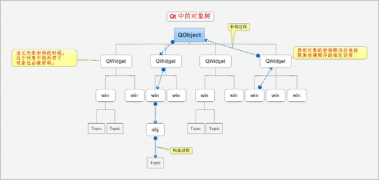

```
title: 【Qt】对象树  
date: 2026-08-09 11:09:52 
tags: 
	- C/C++
	- Qt
```


### 一、什么是 Qt 对象树

Qt 中的 `QObject` 通过对象树机制来管理自身及其子对象。

每个 `QObject` 内部维护一个 `QList<QObject *>` 私有列表，用于存储其所有子对象。当将一个对象设置为另一个对象的子对象时，该对象会被添加到父对象的子对象列表中。

> **注意**：这里的“对象树”指的是运行时内存中对象之间的父子关系，而非类继承关系。

---

### 二、对象树的作用

对象树的核心优势在于**自动内存管理**：

- 当父对象被销毁时，其所有子对象也会被自动销毁。
- 开发者无需手动 `delete` 每个子对象，简化了内存释放操作。

**举例说明**：  
假设一个窗口 `Window` 中包含 `Label`、`TextEdit` 和 `Button`，它们都以 `Window` 为父对象。关闭窗口时，Qt 会自动沿着对象树逐级释放所有相关对象，避免手动逐一释放的繁琐。



---

### 三、对象树的潜在问题

由于子对象可能被系统自动释放，可能引发**二次释放**的问题，从而导致程序崩溃。

**示例代码**：

```cpp
#include "widget.h"
#include <QApplication>

int main(int argc, char *argv[])
{
    QApplication a(argc, argv);
    QPushButton button;
    Widget w;
    button.setParent(&w);
    button.setText("崩溃之源");
    w.show();
    return a.exec();
}
```

**问题分析**：

- 在 `main` 函数结束时，栈对象按**声明顺序的逆序**销毁。
- 若 `Widget w` 先于 `QPushButton button` 销毁：
  1. `w` 的析构函数会先销毁其子对象 `button`。
  2. 随后 `button` 自身的析构函数被调用，导致二次释放，程序崩溃。

**解决方案**：

- 调整对象声明顺序，确保子对象先于父对象销毁（如先声明 `button`，再声明 `w`）。
- 子对象在自行销毁时，会向父对象发送标记，告知“我已析构”，父对象在析构时会检查此标记，避免重复释放。这个标记应该不是存储在子对象的内存中，而是存储在父对象与子对象的连接关系中。子对象自行先析构时，会在这个连接关系中打上标记告诉父对象我已经析构了。
