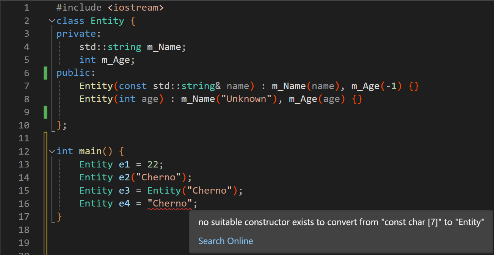
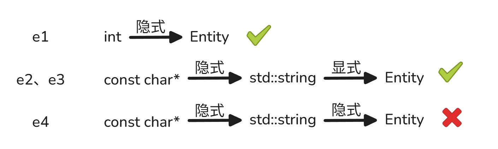
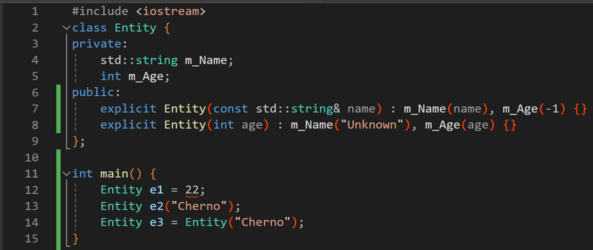

### 前言

本片文章仅记录观看视频时的疑惑，并提出自己的理解。

### 正文

使用隐式转换时容易引发一些令人疑惑的编译错误。为了正确理解隐式转换的用法，这里我要提出自己对隐式转换的定义：隐式转换是指==隐式的调用构造函数完成数据类型的转换==

* C++对隐式转换的规定是最多只允许一次隐式转换，也就是说不允许连续两次隐式的调用构造函数完成数据类型的转换。
* 隐式调用构造函数最基本的语法：`Entity e = 22`

> #### 基本规则
>
> **在任何情况下，C++ 都只允许最多一次用户定义的隐式转换链。**
>
> 这包括：
>
> 1. 函数参数传递
> 2. 构造函数参数传递
> 3. 对象初始化
> 4. 返回值转换

下面对视频中的例子进行解释

~~~cpp
#include <iostream>
class Entity {
private:
	std::string m_Name;
	int m_Age;
public:
	Entity(const std::string& name) : m_Name(name), m_Age(-1) {}
	Entity(int age) : m_Name("Unknown"), m_Age(age) {}

};

int main() {
	Entity e1 = 22;
	Entity e2("Cherno");
	Entity e3 = Entity("Cherno");
	Entity e4 = "Cherno";
}
~~~

这里头为什么只有`e4`是编译错误的，我们对比着进行分析。

`Entity`只接收`int`数据类型和`std::string`类型进行构造。

首先，`e1`用`int`类型完成了一次隐式的调用构造函数，这是允许的。

而`e4`想用`const char[7]`或者说`const char*`(降级)来隐式的调用构造函数，注意我并没有在定义这种类型的构造函数只能接收`std::string`，而`std::string`确实可以接收`const char*`完成构造，但这又一次涉及到隐式的调用构造函数。总结来看，想从`"Cherno"`字符串转换为`Entity`类型需要先隐式的调用构造函数从`const char*`变为`std::string`，再隐式的调用一次构造函数从`std::string`变为`Entity`。总共两次隐式转换，这并不允许。

`Entity e4 = (std::string = "Cherno")`，括号里一次隐式，括号外一次隐式。两次隐式不允许

反观`e2`和`e3`为什么允许。因为`e2`和`e3`的构造语法是显式的调用构造函数，由于`Entity`只接收`std::string`，而`std::string`允许接收`const char*`，于是`"Cherno"`先隐式的调用构造函数转化为`std::string`，再显式构造为`Entity`。这其中只有一次隐式构造函数。

`Entity e2(std::string = "Cherno")`，括号里一次隐式，括号外一次显式。只有一次隐式

`Entity e3 = Entity(std::string = "Cherno") `，括号里一次隐式，括号外一次显式。只有一次隐式

如果用上`explicit`关键字的话情况如下：

会发现`e1`不允许了，这很显然，因为`Entity::Entity(int)`必须显式的调用。

但为什么`e2`、`e3`却又允许呢，其实看上面的类型转换图就好理解了。因为只有在最后一次构造`Entity`是显式的，所以即使加上`explicit`关键字调用也符合规定。