从应用程序和应用程序的沟通方式来看，网络应用的架构可以分为一下集中类型：

1. **客户-服务器模式（C/S:client/server）**
2. **对等模式（P2P:Peer to Peer）**
3. **混合体：客户-服务器和对等体系结构**

### 分布式进程通信需要解决的问题

1. 进程如何标识和寻址问题。怎么样标识自己和其它进程的不同，怎么样让别人找得到你。可以用`IP`和`port`来标识一个进程，这样的组合可以表示一个**端节点(end point)**，本质上，一对主机进程之间的通信由2个端节点构成
2. 应用进程怎么使用传输层所提供的服务。怎么样使用传输层提供的服务的形式和地点。这个问题又可以分为 2 个子问题。
	1. 从应用进程传递给传输层，需要携带什么信息？
		* 要传输的报文(数据),也就是`SDU`
		* 传给谁，也就是目标进程的`IP + port`
		* 谁传的，也就是自己的应用进程标识，这样对方发来的响应才能接收到
	2. 用什么东西来封装传过去的信息？`TCP实体`还是`UDP实体`
3. 应用进程之间通过以上两个条件，可以进行报文的交换了，那么该如何定义协议实现通信。

对于第 2 个问题，还有一个重要的知识点。应用进程之间进行通信的时候，每次从上层传输给下层一些必要信息时，是不是每次的`源IP 源port` 和 `目标IP 目标port`都是固定的，似乎只有要传输的报文是不一样的。那么，每次应用进程通过层间接口给比如`TCP`实体传送必要信息时都会有重复的信息，而且很麻烦。于是，传输层引出了新的概念，并提供了新的服务——**Socket**，说白了`Socket`其实就是一张表，它就跟`文件描述符表`一样，通过一个整数（索引）来定位一个结构体信息。这个结构体包含哪些信息呢，最重要的就是`源IP 源port` 和 `目标IP 目标port`，以此四元组来维护本地应用进程和目标应用进程之间的通信和连接。然后呢，应用进程可以通过传输层提供的`Socket API`在`Socket`中创建自己和目标的连接表项，`Socket API`会返回这个表项的索引值作为整数，然后应用进程在此之后就可以拿着这个整数与目标进程进行通信，就像`文件描述符`一样。一个`TCP Socket`代表的是一对应用进程之间的会话关系，具体的看看下面这张图就行了。注意上面说的都是`TCP`的`Socket`。

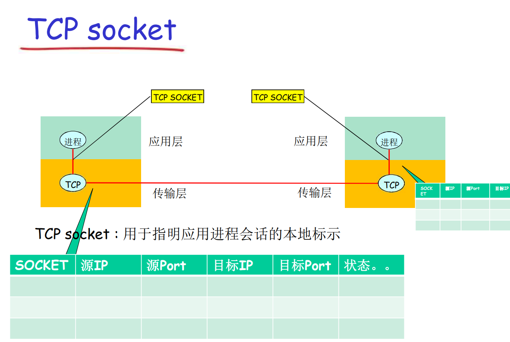

因为`UDP`是无连接的服务，所以`UDP`的`Socket`整数不代表一个会话关系，`UDP`的`Socket`只包含`源IP 源port` ，是一个二元组。所以应用程序在使用`UDP`的`Socket API`时还需要包含`目标IP 目标port`。`UDP`的`Socket`只是本地意义上的标识，仅仅代表本地的一个`端节点`。

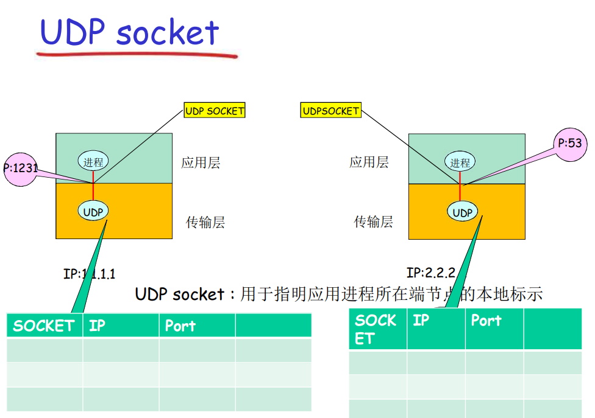

应用和应用实体需要区分，实际上应用除了应用实体之外还包括界面、IO操作、内部的处理逻辑，而实体指的是需网络交互有关的，遵守协议的这部分内容。比如一个 Web 应用，除了`HTTP协议`之外还包括了`HTML`的文件解释模块，这个模块并不属于`HTTP`。实体是实现网络协议的软件模块或者硬件模块，而且是运行当中的软件模块/硬件模块啊。

### Web and HTTP

`Web`是一种应用，而`HTTP`是一种支持`Web`应用的协议

**HTTP**，超文本传输协议，是跑在`TCP`协议之上的应用层协议。

现在的`HTTP`有两个版本，`HTTP/1.0`和`HTTP/1.1`版本，它们都是跑在`TCP`连接上的协议。区别在于一个是非持久连接，另一个是持久连接。非持久连接在一次`TCP`之上最多只有一个对象在`TCP`连接上发送，下载多个对象则需要多次`TCP`连接，因为传送了一次后，应用程序就会发出申请断开连接的请求。持久连接则允许在一次`TCP`连接之上传输多个对象，它不会在建立连接后马上释放连接。

`HTTP/1.1`默认是会保持连接的，当然也可以在请求头中添加`Connection: close`，在接收到对象后直接释放连接。

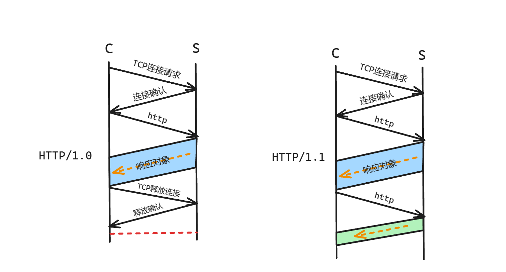

`HTTP`协议的头部中有一个`Content-Length`字段，这个字段有什么用呢，它描绘本次报文的大小。因为`TCP`协议并不维护报文的界限，假如应用程序给了传输层 2 个 15K 大小的报文，通过`TCP`传输给对方，对方可能会收到 1 个 30K 大小的报文。`TCP`不维护报文的界限，就需要`HTTP`协议自己来维护。

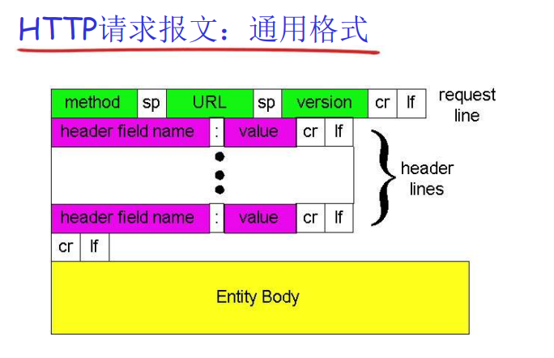

`HTTP`协议是**无状态协议**，什么叫无状态协议呢？服务器接收到`HTTP请求`，解析报文，按要求封装`HTTP响应`，然后发回去，这样就结束了。下次收到同样的请求，还是做同样的响应，不维护、不记录客户端的状态。因为有些应用需要用到`HTTP`协议，而且有维护状态的需求，于是有了**Cookie**的概念。在响应中带上`Set-Cookie`字段，客户端接收到响应后就会在本地存储`Cookie`，下次再次访问相同的网站时就会带上`Cookie`，服务器端接收到请求就会根据`Cookie`在数据库中检索对应的用户信息。

然后再后面引出了**Proxy(代理服务器)**的概念，这个服务器就是充当`Cache`的作用，用户访问一个网站，如果在这个服务器中刚好有这个网站的缓存，就直接返回这个缓存，不需要再次连接远端服务器（`Origin Server`），节省了时间。但是这样又会有个问题，如果远端服务器中的内容更新了怎么办，与代理服务器的内容不一致怎么办？这就给`HTTP`请求添加了新的请求方式，**条件GET方法**，其实和原来的格式一样，只不过有了新的头部字段：`If-modified-since: <date>`，用户向网站发出请求，先被代理服务器拦截，代理服务器这时会先向`Origin Server`发出这个条件请求，如果确实有更新，服务器像正常响应一样返回完整的响应报文，如果有更新，就简单返回一个`HTTP/1.0 304 Not  Modified`，这样代理服务器就知道了服务器没有更新，返回原来的缓存内容给用户。

### FTP

这个协议需要了解的不多。要知道的是这个协议和`HTTP`协议一样，仍然需要跑在`TCP`协议之上，而且它是**有状态协议**，因为服务器需要维护当前通信的用户是谁，他当前处在哪个目录上等信息。

此外还需要了解服务器建立连接的过程。`FTP`协议的默认端口为 **21**

首先，客户端向服务器的 21 号端口发送连接请求，通过用户认证后正常使用。客户端仍然需要通过向服务器的 21 号端口发送一些控制命令，比如上传和下载命令。假如发送的是下载命令，服务器会**主动**与客户端的 20 号端口建立新的连接，这个连接通道叫做**数据连接**专门用来传输文件。

所以`FTP`协议有两个连接通道，一个是控制连接，一个是数据连接。

需要注意的是，其实`HTTP`协议也可以上传文件和下载文件

### Email

什么是应用，比如说Web应用就是运行在服务器上的程序。

浏览器软件是Web应用的用户代理，用户通过浏览器访问Web应用。ftp客户端软件是ftp应用的用户代理。软件代理用户去访问应用，软件代理用户去执行相应的协议动作。

用户代理通过**SMTP**协议给邮件服务器发送邮件，通过**POP3、IMAP、HTTP**三种协议都可以从邮件服务器拉取邮件

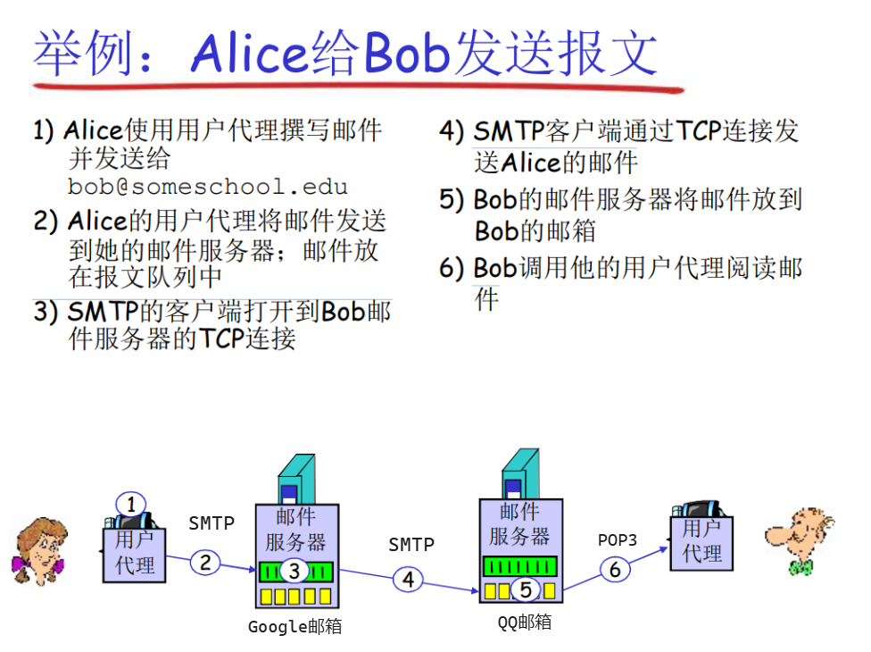

### DNS

**DNS**，Domain Name System，域名解析系统。`IP`地址标识主机、路由器，但是它是`32`位`4`字节的整数，不方便人类记忆，所以有了`DNS`负责将用户提供的字符串域名转化为二进制的网络地址。

`DNS`系统需要解决的问题有以下 3 点：

1. 如何命名设备
	* 要用有意义的字符串便于人类记忆的命名方式
	* 不能在一个平面上命名，容易重名。这就需要采用层次化命名
2. 如何完成名字到IP地址的解析
	* 采用分布式分层式的管理，一块区域由一个或者一层的 DNS 系统来维护和解析
3. 如何维护：增加或者删除一个域，需 要在域名系统中做哪些工作

`DNS`服务运行在服务器的`UDP`的 `53 `号端口上。`DNS`是互联网的核心功能，但是它是在互联网的边缘系统的应用层上实现的，不是在互联网的核心中实现的。 

需要区分一下什么是**别名**和**规范名字**。别名就是一个公司面向用户发布的域名比如说`www.baidu.com`，用户都会通过这个域名取访问百度的服务器，但是百度不可能在我国只设置一个服务器，他会在各个地区各个省份设立当地服务器，这些地方服务器都会有一个特定名字便于百度去管理，这个名字就是规范名字。

用户通过百度提供的`www.baidu.com`试图访问百度服务器，浏览器将别名发送给当地的`DNS`，域名解析系统将这个别名转换为当地的百度服务器的规范名字并返回给浏览器，或者说域名解析系统中一个别名对应了多个不同的规范名字，`DNS`可以根据当时的情况选择一个合适规范名字返回个浏览器

浏览器继续将这个规范名字发送给`DNS`，域名解析系统将这个规范名字转换为`IP`地址返回给浏览器。浏览器接收`IP`地址，然后就使用这个`IP`地址。

**DNS域名结构**

* 一个层面命名设备会有很多重名

* `DNS`采用层次树状结构的命名方法

* `Internet`根被划分为几百个顶级域(top level domains)

	* 通用的(generic)

		`.com`，`.edu`，`.gov`，`.int`，`.mil`，`.net`，`.ort`
		`.firm`，`.hsop`，`.web`，`.arts`，`.rec`；

	* 国家的(countries)

		`.cn`，`.us`，`.jp`，`.nl`

* 每个域下面可划分为若干子域(subdomains)

* 树枝是子域(subdomains)

* 树叶是主机(host)

域的划分与地理位置没有关系。同一个域下的子域可以分布在不同地理位置，同一个地理位置也可以有不同的域。域的划分是逻辑上的划分

**权威DNS服务器**，或者说权威名字服务器，用于管理一个**域(Zone)**的域名。

为了方便管理，将互联网划分为一个个互不相交的**区域(Zone)**，每个区域都有一个名字服务器，维护着它所管辖区域的权威信息(authoritative record)。

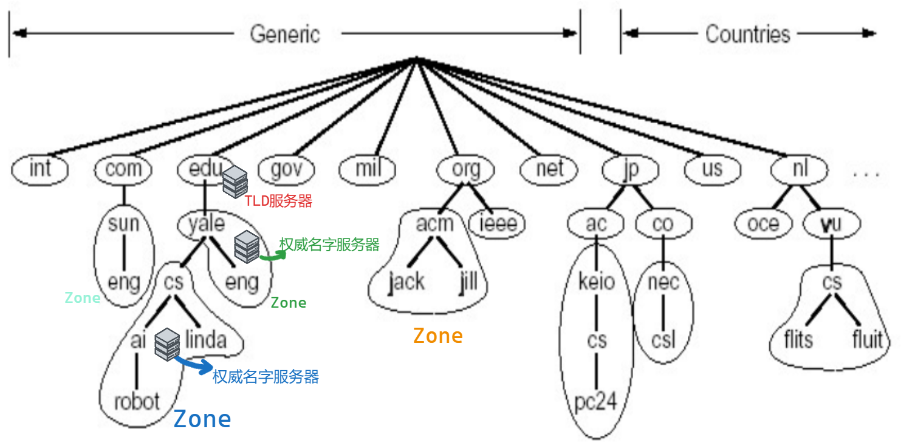

**顶级域(TLD)服务器**：负责顶级域名（如com、org、edu和cn、uk、jp等)，由一些公司负责维护这些顶级域名服务器。比如 NetWork solutions公司维护`com TLD服务器`、Educause公司维护`edu TLD服务器`。

那么`DNS`服务器里存储的都是些什么呢？`DNS`数据库中存储的一条记录叫做**资源记录(Resource Record)**，这个记录有以下几个字段：

* DomainName：域名
* TTL：Time to Live，生存时间。如果时间无限大说明是权威记录，如果时间小说明是缓冲记录，一般是2天
* Class：记录的类别，如果是互联网类型，则值为 IN
* Value：值，就是DomainName所映射的值
* Type：类型，就是关于DomainName到Value的映射关系，其实表明了Value具体的含义是什么

关于`TTL`的设置说明一下。本地有一个权威名字服务器，比如说科大的名字服务器，它如果存储的是科大自己本地的一些主机域名所对应的IP，那么这条记录就是永久的。如果某个用户访问了科大外的服务器，比如说交大的服务器，科大的名字服务器作为代理去询问交大服务器的`IP`，得到了之后返回给用户，并将此时交大服务器的域名和`IP`做一个存储以便下一次访问时的返回，但是这是一个缓存，一般 2 天后就会自动删除。为什么要删除呢，一方面是为了节省空间，另一方面如果交大服务器那边的IP地址改了，或者域名改了，这样原来的留着也没意义，还不如删了以便下次更新。

还有`Type`的说明。如果`Type = A(Address)`，那么这条记录就是关于一个主机的**确定(specific)**域名到它`IP`地址的映射；如果`Type = CNAME`，那么这条记录就是关于一个别名(公布给用户的名字)到服务器的规范名字（或者说确定域名）的映射；如果`Type = NS`，那么这条记录就是关于一个域名到该域名服务器的域名（其实就是DNS服务器的域名），其实感觉跟`CNAME`也差不多，不过应该是为了区分`Value`服务器的类型吧。还有`Type = MX`跟上面的解释也差不多。

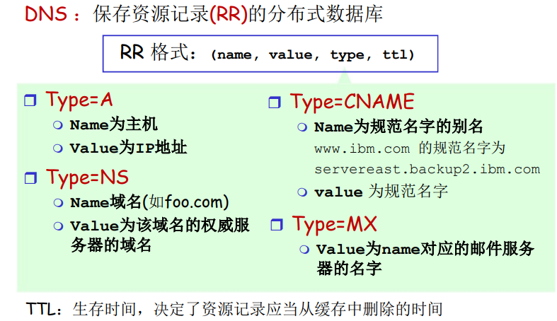

比如说`edu`域名服务器 记录 `yale.edu`域名的有关信息，它需要起码 2 条记录，一条映射是`yale.edu`到`yale.edu`域名服务器的确定域名，这条记录的`Type = NS`；一条是这个确定域名到`IP`地址的映射，这条记录的`Type = A`

同样的`yale.edu`域名服务器记录`cs.yale.edu`域名的信息也是向上面一样。

一台主机想要上网一般需要 4 个信息：`IP`地址、子网掩码、`Local Name Server`本地域名解析服务器、`Default Gateway`发送到外网的网关地址。这些信息要么手动配要么自动配。

一般来说，我们的主机想要获取一个域名对应的`IP`地址，都会优先向本地的域名解析服务器发送请求，如果本地的域名解析系统有这条记录则直接返回，如果没有就需要进入下一个流程。这个流程有两种方式，不过大抵相同。

全球有 13 个根服务器，这些服务器记录了顶级域名(像com、edu这一类)有关的映射。

首先是递归查询，这种方式压力全在根`DNS`服务器。

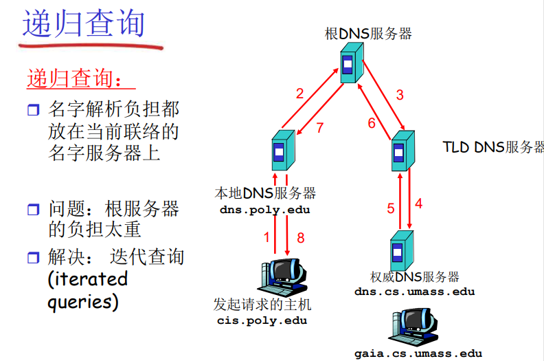

因为根服务器的压力太大，就有了迭代查询方式，这样根服务器只需要简单返回一个响应就行了。压力全在本地DNS服务器上。

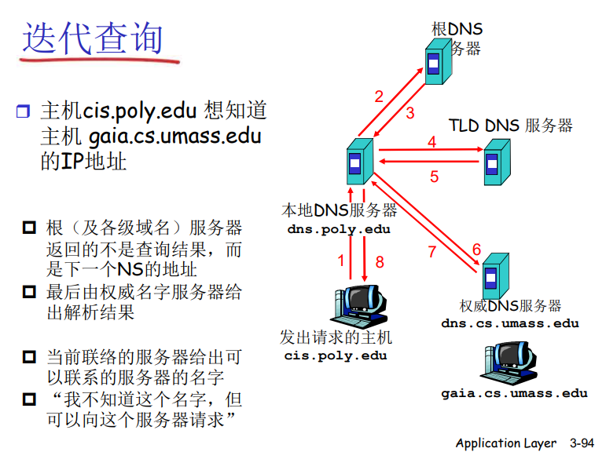

然后还要知道的是，`DNS`的报文格式，请求报文和响应报文的格式是一样的，通过`flag`来区分是请求报文还是响应报文，还有一个`ID`头部，用来区分是哪台主机请求的查询服务，到时候好返回结果。还有用`flag`字段来表明是采用递归方式查询还是迭代方式查询。

还有关于第三个问题，如何维护记录的问题。新增一条记录，如果是关于一个子域的，那么需要加两条记录一条是从子域名到子域域名服务器的域名的映射，还有一条是子域域名服务器的域名到其`IP`地址的映射；如果是关于一台主机的话，直接就是主机域名到主机`IP`地址的映射。

为什么要将域名和域名服务器的域名区分开来呢？首先，域名是公布给用户使用的，它应该是便于记忆且唯一的，而域名服务器需要公司自己去管理，它可能有很多台，遍布在很多地方，所以需要一个自己的特定域名作为编号方便管理吧。而且，一个DNS中的有关同一子域名的记录可能会有多个子域域名服务器的映射，DNS可以根据当时的网络情况进行选择子域的域名服务器。

或者说，域名就是一个逻辑上的东西，DNS服务器其实也是一台服务器，也是一台主机呀，作为这个逻辑域名的一部分自然也需要一个物理域名加以区分。

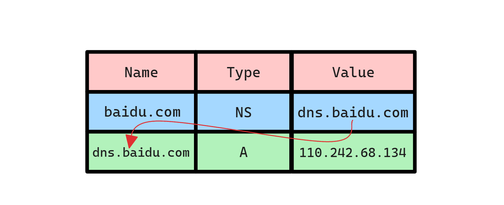

## P2P应用

前面我们提到，网络架构分为 `C/S`架构 和 `P2P`架构，下面我们重点介绍`P2P`架构，在这之前简单讲一下`C/S`式模式的文件分发时间作为对照。

假设要传输文件的大小为 `F`，服务器的上载带宽为 U~s~，有 N 个客户端需要下载文件，每个客户端的下载带宽为 d~i~ 。
那么我们可以得出将所有文件分发给 N 个服务器的耗时为 D~C-S~ >= max{ NF / U~s~，F / d~min~}，就是从服务器和客户端选个发送速度最慢的。这样来看，如果客户端数量很少，这个传输时间还是可以接受的，但是客户端数量一旦上来了，服务器所有承受的压力从图上来看是线性的增加。传播时间是不可控的，当下载量上来后，服务器的上载带宽就成了瓶颈

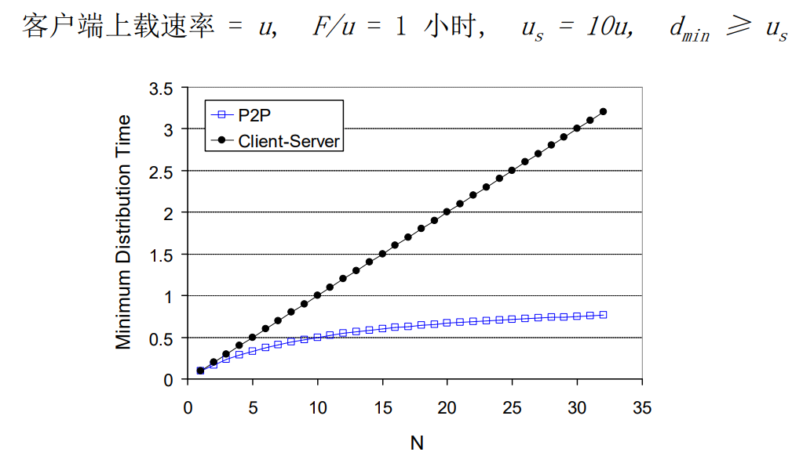

如果采用`P2P`架构，这个文件的传输时间就会变成下图这样。

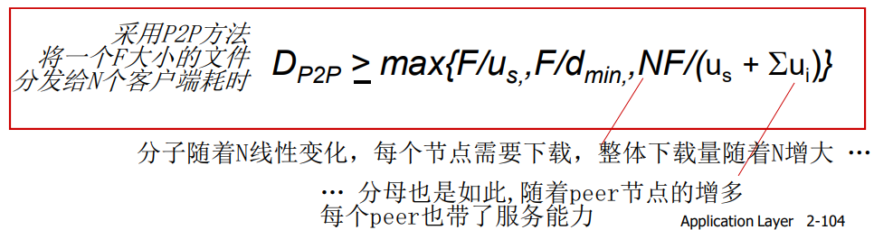

假设，这个时候`P2P`的架构已经搭建好了，当 N 个客户端请求文件时，服务器的荷载将会分配个其它客户端承担，这样原来服务器的上载时间就会降下来，从而不再成为瓶颈，慢慢的瓶颈就会变成客户端自己的下载带宽。

`P2P`架构模式也有分类，首先大致分为 **非结构化P2P** 和 **DHT(分布式散列表)结构化P2P**。`DHT结构化P2P`属于高级计算机网络的知识，这里老师没有过多探讨。大致的分类区别就是，非结构化的P2P，客户端之间的连接(overlay)是没有规律或者说规则可寻的，能碰上连接就连接，想连就连，所有客户端形成的逻辑网络是混乱的。反之，结构化的P2P中的客户端之间的**overlay**组成的网络可以是一个环、一个树这样的数据结构，是有规律的。

非结构化的P2P具体分为以下几类，老师依据以下几类举出了几个应用实例来讲解。

### 集中式目录

最初的 **Napster** 就是用这样的架构设计的。服务器并直接参与文件的上传和下载，也就是说服务器不会存储文件，它只维护一个目录表，这个表记录些什么呢？比如用户是否在线，用户客户端的IP地址，以及用户客户端都存储了些什么文件。这就需要客户端做出一些配合，比如每个用户在客户端上线时就会向服务器发送自己的IP地址，和自己都存储哪些文件。然后如果某个用户需要什么文件，他就会向服务器发送自己需要什么文件，服务器检索一下哪个客户端有这个文件，然后发送这个客户端的IP地址返回给请求方。然后这两个客户端之间建立连接，在它们之间收发文件。

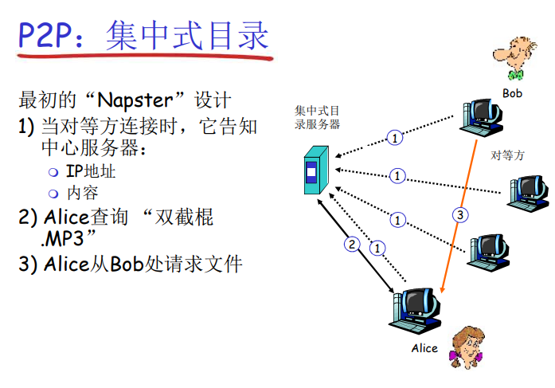

当然，这种模式的弊端也非常大，整个网络的核心就是这个集中式目录服务器。**Napster** 在校园网里做 mp3 公益服务，侵犯了版权方的利益，对他做的惩罚就是拔掉了服务器的插头。至此整个 Napster 的网络也就宕机了。

### 完全分布式

**Gnutella** 就是这样一一个完全分布式的应用，没有中间服务器提供服务，网络完全由客户端构成。

假设这个网络已经构建成了。那么大致的结构是张这个样子的。

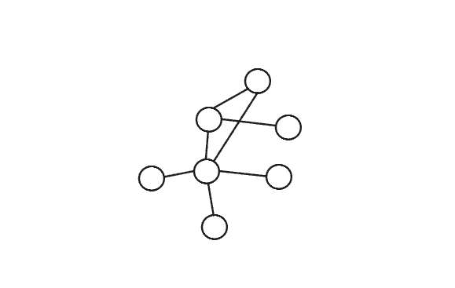

节点与节点之间构成“邻居”关系。如果一个客户端需要下载某个文件，它是如何实现的呢？假设请求方为 X，它有很多邻居 Y

1. 对等方X必须首先发现某些已经在覆盖网络中的其他对 等方：使用可用对等方列表 自己维持一张对等方列表（经常开机的对等方的IP） 联系维持列表的Gnutella站点 
2.  X接着试图与该列表上的对等方建立TCP连接，直到与 某个对等方Y建立连接 
3.  X向Y发送一个Ping报文，Y转发该Ping报文 
4.  所有收到Ping报文的对等方以Pong报文响应 IP地址、共享文件的数量及总字节数 
5.  X收到许多Pong报文，然后它能建立其他TCP连接

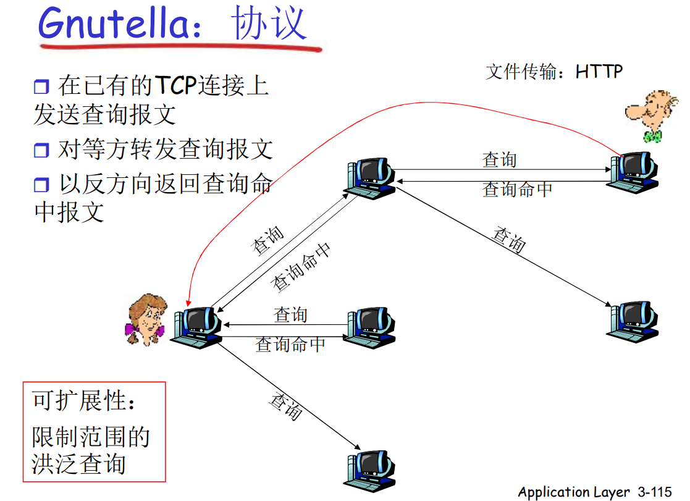

这种查询方式容易造成**网络泛洪**，造成网络资源的浪费。限制这种网络泛洪的方式也很简单，每个报文设置一个`TTL`就行了

那么 Gnutella 网络是如何建立起来的呢。首先，用户在安装客户端软件的时候，会有一个**配置文件**，这个配置文件里会有一些IP地址，关于这些IP地址老师讲的也不是很清晰，我大概猜测有两种可能，第一种是这个IP地址是经常活跃的一些用户，作为常驻用户，新用户通过这些常驻用户来加入网络，并通过它们的`ping pong`来和其它节点建立`overlay`；第二种这个IP地址可能是与Gnutella无关的服务器，用户通过这些向Gnutella无关的服务器发送`ping`，由它们作为跳板向其它地方转发，而当有Gnutella运行的客户端接收到这个`ping`后就会响应`pong`，由此通过第三者的方法建立`overlay`的方法。不过老师一直说"死党"什么的，我觉得第二种的可能性会高一点。

### 混合体

就是将上述两种方式结合起来的P2P架构。这种方式将节点分为大节点和小节点。其中小节点和大节点之间的关系就像第一种集中式目录的关系一样，大节点存储目录表，在同一组的小节点之前收发文件；而大节点和大节点之间的关系就像第二种一样是完全分布式的，如果同一组的小节点没有想要的资源，通过大节点进行泛洪查询向其它大节点询问其组有没有我想要的资源，然后两个小节点之间跨组进行文件传输（应该是这样。

**KaZaA**就是这样的一个应用

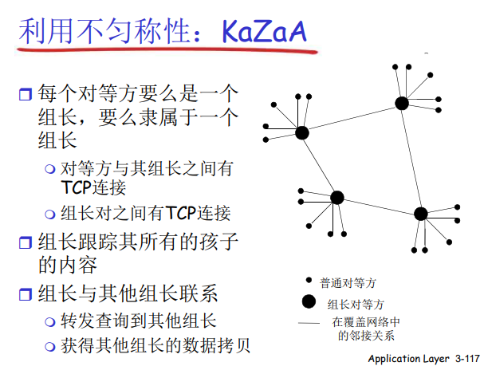

此外，老师还讲述了在这种架构下文件的查询方式。大节点建立一个关于文件的表格，其中主要包括以下字段：文件、文件描述信息、由文件字节序列得出的32位Hash值。这个Hash值就像文件的唯一ID一样。比如当一个小节点想要查询一首歌时，它向大节点发送这首歌的信息比如歌手、歌曲类别等等，大节点会根据这个模糊的描述信息将符合描述信息的所有文件的Hash值返回给小节点，小节点再细细的选择一个，当它决定了要具体的哪首歌后，就返回这个Hash值，Hash值作为文件的唯一标识符，当然也能唯一定位一首歌了。然后返回其它拥有这首歌的小节点的IP地址，让它们自己去通信。

## CDN

其实关于**CDN**本身的内容其实并不复杂，不过老师以流媒体为例讲述了CDN工作的原理。

**CDN**，Content Distribution Networks，内容分发网络。它作为和`IPS`和`ICS`差不多的存在，作为现代网络不可少的网络组成部分，有着和它们同样不小的地位。同样有很多公司做`CDN`向`ICS`提供服务。

在这之前先讲述一下流媒体在网络中是如何工作的。

**DASH**，Dynamic Adaptive Streaming over HTTP，动态自适应流化 over HTTP技术。这个具体是什么呢。我们在浏览网页视频的时候，视频从服务器发送过来并不是一整包发过来的，而是将视频文件分成一块一块的发送过来。而整个视频文件其实有很多不同画质的版本。浏览器申请视频资源时就是在这些不同画质的不同切片之间根据当时的网络情况进行跳跃的。至于视频被分成了几片，每片都放在什么地方，这些东西都存储在了一个叫做**manifest**的告知文件当中，浏览器一开始请求视频时就会收到这个文件，然后根据这个文件去请求视频。

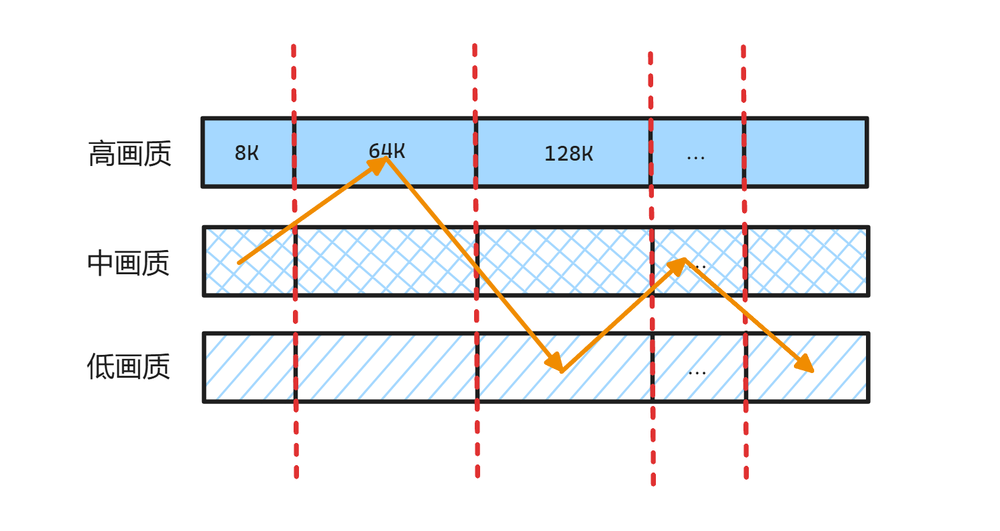

CDN 其实就是作为一个服务器的拷贝，能够让不同地区用户访问离自己比较近的服务器从而得到比较快的响应。而像流媒体这样的公司就需要提前将这些不同视频的切片放到CDN服务器上。到时候浏览器想要获取视频资源切片时有两种方法。第一种是向源服务器发送请求，源服务器的权威域名服务器会返回一个CDN域名作为重定向，这个域名经过CDN的权威域名服务器解析返回一个离用户最近的CDN主机IP地址；第二种就是浏览器自己根据需要，从**manifest**告知文件中取得各个切片所在的CDN服务器的IP地址，发送请求。
