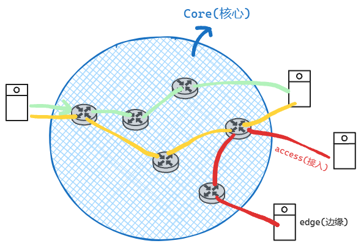
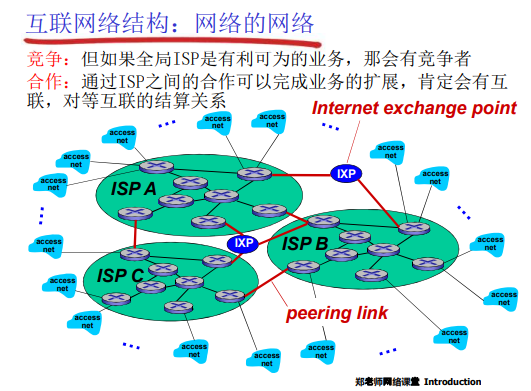
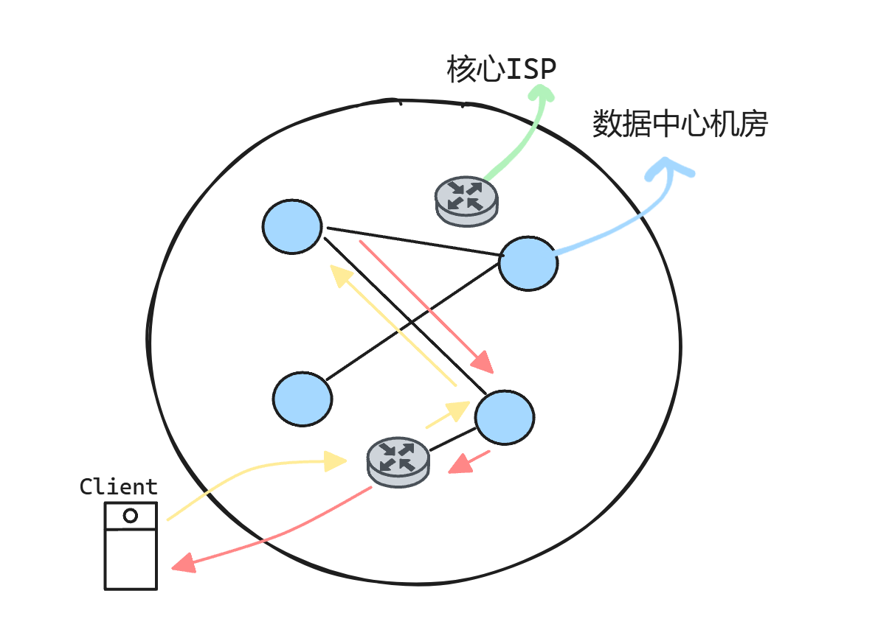
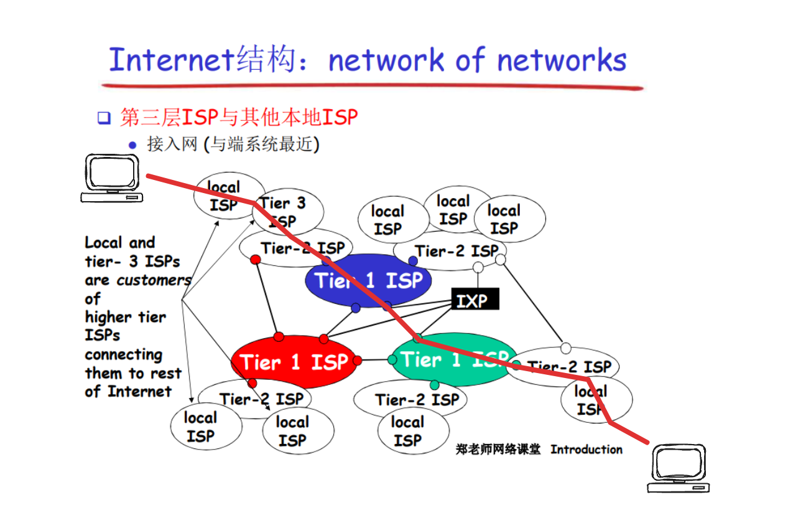
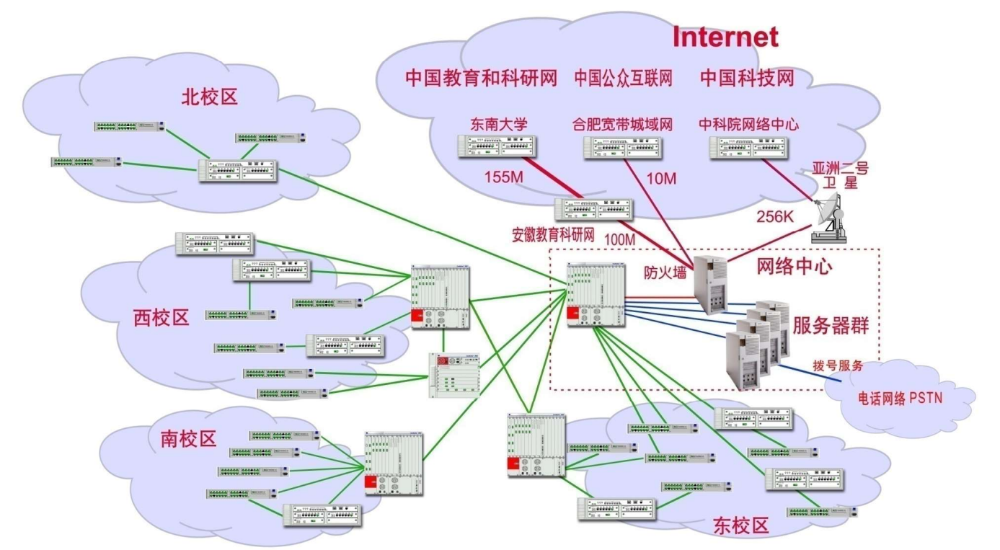
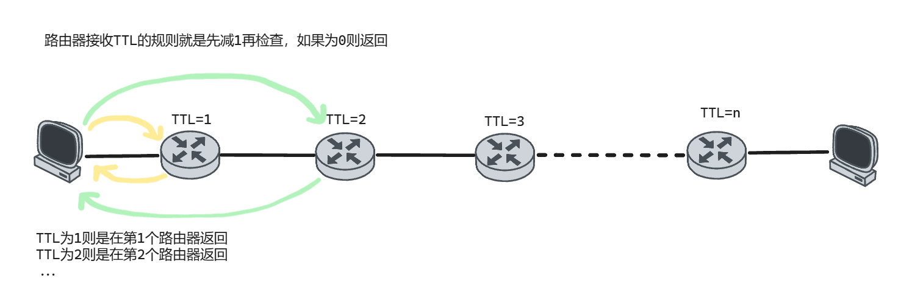

## 什么是Internet

互联网是什么？以`TCP/IP`为主要构成的一簇协议，由这些协议构成的网络、世界上使用人数最大的网络，叫做**互联网（Internet）**。但是同样以`TCP/IP`为主要协议进行工作的网络，个人用的、公司用的不接入互联网的网络叫做**内部网（intranet）**

协议：协议是对等层实体在通信过程当中应该遵守的**规则的集合**，是一个标准，是一个规范。
这个规则包含很多，包括：语法、语义、时序和动作等。

协议 定义了在两个或多 个通信实体之间交换的 报文格式和次序，以及 在报文传输和/或接收或 其他事件方面所采取的 动作

互联网由分布式的应用程序（进程）及为这些应用程序提供通信服务的基础设施。基础设施包括什么，包括了主机当中应用层以下的所有的运行中的协议实体，包括了目标主机当中的应用层以下的应用实体，还包括了应用通信过程中所必要的网络。分布式的应用是网络存在的理由，基础设施为分布式的应用提供通信服务

网络结构组成如下有：核心、接入和边缘。

## 核心(Core)的工作方式

### 电路交换 / 线路交换

主机和主机之间会一直占用通信链路的资源，不管两者之间有没有在通信。这种通信方式保证了通信双方数据交换的稳定性。

为了能够提供多组主机之间的通信，电路交换有了`pieces`的概念，将链路带宽分成多分交给每组主机用，分片的方式有 频分(FDM)根据频率分带宽、时分(TDM)根据时间周期内的时间片分、码分、波分等等。

因为主机之间不管有没有在通信都会占用链路资源，所以电路交换的方式所能提供的用户是有限的，比如带宽为 1Mbps，每个用户占用链路带宽为 1Bbps，那么这段链路撑死也就支持 10 个用户，再多就得切断一组用户的通信。

而分组交换因为有**存储**的概念，所以还能提供给更多的用户在用户突发网络请求的情况下。

### 分组交换

主机和主机之间的通信不再使用通信链路的`pieces`，而是使用它带宽的全部。

主机和主机之间的通信数据被分成一个个单位，这个单位叫 **分组** 或者 **包(packet)**，包在越过每个通信链路的时候使用带宽的全部，数据在传输过程中每一个节点时，以分组为单位进行**存储-转发**。最终由源主机发送到目标主机。

为什么在传输过程中的节点需要对分组进行先存储再转发呢？不进行存储，遇到一个比特就转发一个比特不行吗？如果用这种方式的话，如果传输的数据非常大，比如说 10 个 G，这样的话这一组的数据交换会持续很长的一段时间，并且一直占用这段链路，其它主机无法用这段链路进行通信。这就造成很大的问题。

边缘系统该如何接入核心呢？如果重新设计接入链路，每家每户都接一个成本是巨大的。于是运营商就在电话线上做文章。以前电话线通过电话线是以 4KHz 进行传播通信的，为了用已有的电话线进行进行上网就有了**调制解调器**，俗称猫(modem的谐音)，将数字信号调制成不同频率不同波长比如说 2KHz 到 3KHz，然后发送到链路上。核心那边的接收端也是通过猫来区分传过来的信号的是要上网还是打电话。但是这样的问题是，打电话时不能上网，上网时不能打电话，因为在做一个行为的时候链路总是被占用的。所以这种方式被淘汰了。

### 虚拟电路交换技术

由于分组太多，不同的分组又会走不同的线路，所以会发生很多不可预知的数据丢失的情况。为了解决这个问题，分组交换技术吸取电路交换的有点，两个主机交换数据前会先进行沟通采用哪条线路，保证它们之间的线路是稳定安全的，之后在分组(packet)上打上这条线路的记号，然后所有的信息交换都在这个线路上进行。但是这种方式无疑是会增加开销的，而且是增加**核心部分**的开销，事实上**核心部分**要负责的内容应该仅仅只是保证数据的快速传输和快速的选择路线，而不是解决主机提出来的这种新要求。所以现代并没有采用虚拟电路交换技术，数据包丢失的问题交给主机自己去解决，主机有强大的算力完全有能力去解决。

## Internet 和 ISP

* 端系统(个人电脑、服务器、移动手机等)通过**接入ISP(Internet Service Providers)**连接到互联网。
	* 接入ISP有很多，比如公司的、大学的ISP
* 接入ISP必须是互联的，这样任何两个端系统才可以相互发送分组到对方

### global ISP

在全球范围部署路由器用链路连在一起，然后让端系统通过 access net 连接到上述组成的 global ISP 实现全球范围内数据的收和发。

因为这个东西的利益是巨大的，就会有很多厂商构建 global ISP。不同厂商会有自己的一批客户，为了让不同厂商的客户实现互联，厂商之间就会进行合作，将各自的 global ISP中间搭一条线路进行连接，还有一种方式就是搭建一个 **IXP(Internet exchange poin)**互联网交换点，在这个交换点中完成流量的交换。

### regional ISP

前面这些大头将全球范围的ISP搭建好骨干网后就需要更一些小厂商给小区域比如说省市、城镇做更精细的划分。做到业务上的细分。

### ICP

**Internet Content Provider**，互联网内容提供商，比如说百度、谷歌提供业务。这些厂商同样需要 ISP 接入互联网，这就需要交钱了，因为这些厂商的用户量是巨大的，这样造成的成本也是巨大的。为了解决这一问题，他们就会在全球各个地方建造自己的机房，叫做 **DC(Data Center)**，然后自己部署自己的专用的网络连接这些 DC，自己拉光缆将 DC 连接起来。

这些 DC 部署的位置也是有讲究的，都是靠近核心ISP比较近的地方，这样用户通过 ISP 连接 DC 的速度也会快一点。如果用户申请的服务在 DC1 中没有，它也能够通过自己的专有网络快速从其它 DC 中找到，然后拉取过来发给客户。此外 DC机房还需要建在温度低，散热快，且事故发生比较少的地方，比如说贵州就有很多的机房，北极也有机房、海底也有机房。

ISP 其实是分层的 ISP，端系统接入最低层的 ISP，有需要时低层 ISP 会向高层 ISP 发送数据，让远在两端的主机实现通信。

网络非常复杂的功能分解为若干功能明确的层次，每一层实现一个或一组功能

上层的模块可以通过接口使用本层内部的一些功能，这些功能的子集叫做**服务**，服务是功能的一部分

本层实体借助下层所提供的**服务**，来跟对等层实体交换**PDU**，再经过内部处理，实现更复杂、更新的**功能**，通过层间的**接口**再向上层提供更好的**服务**。比如操作系统提供的`Socket API`，就是传输层向应用层提供的服务

本层协议实体在交互的过程当中，应该遵守的规则的集合叫做**协议**，协议的**目的**是向上层提供更好的服务，协议**怎么实现**？通过层间的接口访问下层所提供的服务来实现。

**服务提供者**向**服务用户**提供服务，具体在哪里提供服务，在层间界面上**服务访问点(SAP)**提供服务，用来区分不同的服务用户。同一个服务提供者可能需要为多个上层用户提供服务，比如 `TCP实体` 可能需要向 `telnet应用`、`http应用`、`ftp应用`等同时提供服务，这时候就需要 `SAP` 来区分

服务提供者通过什么样的形式为服务用户提供用户，服务用户通过什么形式来使用服务提供者提供的服务。这个形式称作——**原语(primitive)**。比如说`Socket API`中的函数就叫做原语，原语就是提供服务的形式，服务用户到底采用服务提供者的什么服务，服务用户通过提供者提供的原语来告诉提供者我要用什么样的服务。

下层服务为两个上层应用提供服务进行通信之前，要有一个握手的过程，为之后的通信做好准备，这种类型的服务称作为**面向连接的服务**。反之通信之前没有握手的过程，就是**无连接的服务**。

上层传过来的 **SDU(服务数据单元)** 再加上本层的一些控制信息（头部），形成本层的 **PDU(协议数据单元)**

物理层接收上一层传过来的比特，转化为光电信号，发送给目标；目标物理层再把这个信号转回比特。

在目标**链路层**，将物理层传过来的比特进行划分，分装成**帧**。链路层在物理层提供的服务的基础之上，相邻两**点(Point)**进行传输以帧为单位的数据，是 **P2P** 的关系

网络层在链路层提供的**点到点**的数据传输的基础之上，提供以**分组**为单位的**端到端**的数据传输的服务。实现主机到主机的数据传输。

**传输层**在主机到主机传输的基础之上，完成进程到进程的区分；此外，网络层提供的服务是不可靠的，传输层还需要自己为上层应用提供可靠的传输服务

**应用层**在传输层提供的服务的基础之上，完成**应用报文**和应用报文之间的交换

