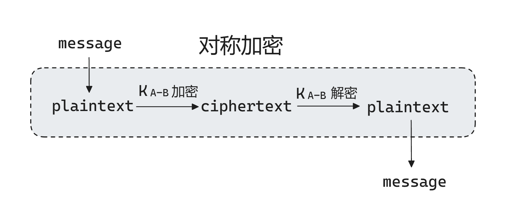
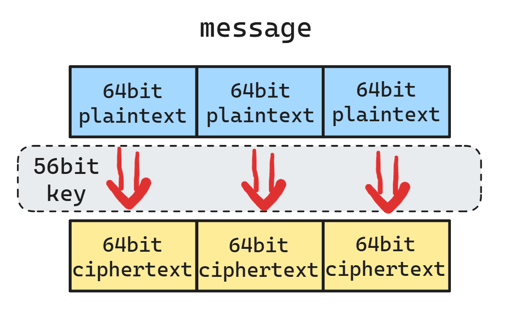
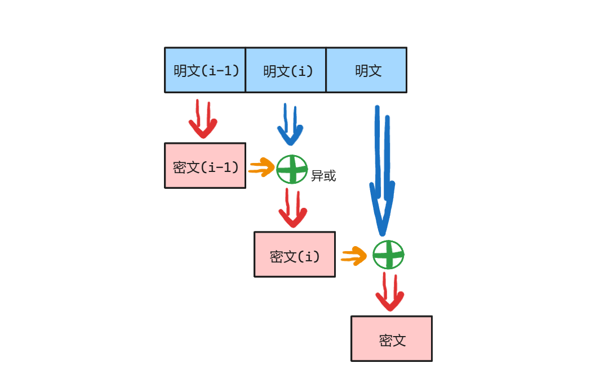
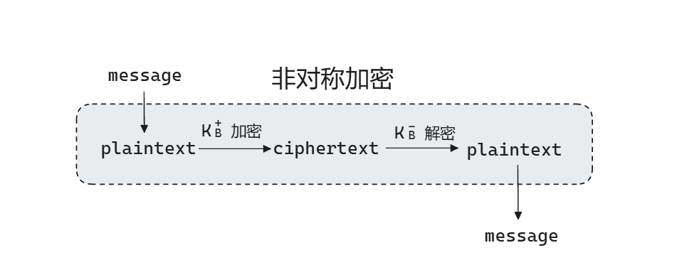
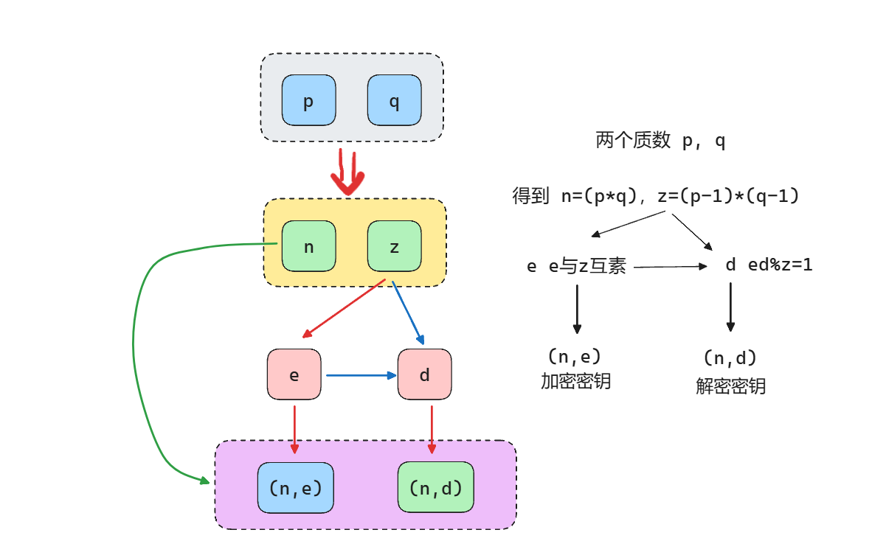
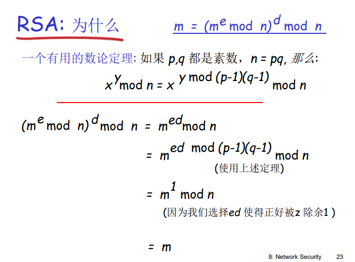
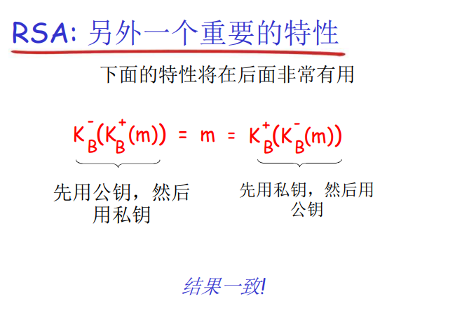

加密分为：**对称加密 **和 **非对称加密**

如果加密的密钥和解密的密钥是一样的话，我们将这种加密体系称之为**对称加密体系**
如果加密的密钥和解密的密钥不一样的话，我们将这种加密体系称之为**非对称加密体系**，或者说公开加密体系。

* **对称密钥密码学**：发送方和接收方的密钥相同。
* **公开密钥密码学**：发送方使用接收方的公钥进行加密，接收方使用自己的私钥进行加密。

* 明文，`plaintext`
* 密文，`ciphertext`
* message, `m`

---

在对称加密体系中，假设 Alice 和 Bob 共享一个对称式的密钥 K~A-B~，则满足 m = K~A-B~( K~A-B~(m) )，也就是`message`通过同一个密钥加密，通过同一个密钥解密。**plaintext = m，ciphertext = K~A-B~(plaintext) ，plaintext =  K~A-B~(ciphertext)，m = plaintext**

**DES**

对称密钥加密学中有一种加密方法，叫做**DES(Data Encryption Standard)**

* **56-bit** 对称密钥，**64-bit** 明文输入

规则就是使用 56位的`key`对一串数据进行 64位成组加密。

使**DES**更安全

* 使用 3 个 `key`，3 重 `DES` 运算
* 密文分组成串技术

密文成串技术如下图所示

**AES**

**AES(Advanced Encryption Standard)**，其实就是**DES**的升级版

同样是成组加密，只不过它的明文是**128-bit**成组，而且密钥的长度可以选择**128-bit**、**192-bit**、**256-bit**，按照安全性要求选择

---

然后就是非对称加密

用公钥进行加密，用私钥进行解密

**RSA**

1. 选择两个质数 `p`，`q`
2. 用这两个质数得到两个数 `n = p * q`，`z = (p - 1) * (q - 1)`
3. 再找到两个数，用`z`再得到**`e`**，`e`与`z`互素，再用`e`得到**`d`**，满足 **`ed % z = 1`**，或者说 `ed - 1`能被`z`整除
4. 得到数对 **(n,e)** 用于加密，**(n,d)** 用于解密

最后

* 加密公式为：c = m^e^ mod n
* 解密公式为：m = c^e^ mod n

证明过程如下，这个证明过程是先通过上面的硬过程得到`e`和`d`，然后再证明这个`e`和`d`具有加密和解密功能的正确性。

从公式中，通过交换律可以看出，`e`和`d`的位置是可以互换的。`m`是先`e`再`d`，还是先`e`再`d`的结果是一样的，也就是说哦`m`用`e`加密也行，用`d`加密也行，反正最后它们都能通过另一个数解密出正确的`m`。

