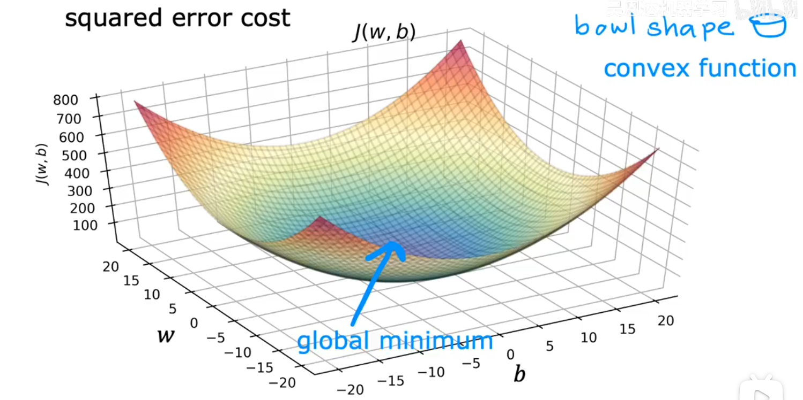

### 机器学习

机器学习，顾名思义，让机器 运行一定的算法 能够具备 自主学习、解决问题的能力。

这个算法主要分为：监督学习(Supervised Learning) 和 无监督学习(Unsupervised Learning)。

* 监督学习算法运用的场景在：用户给出一组**输入**，以及对应的一组正确**输出**，监督学习能够使用一定的算法利用这组数据**预测**输入和输出之间的**映射关系**。这个映射关系客观上不一定是正确的，但一定是理论上最接近正确的。

* 无监督学习算法运用的场景：用户只提供输入，不提供输出，所以它不必像监督学习算法那样一定要找出输入和输出之间的映射关系。它主要的目的是**找出**输入数据之间所具有的**共同特征**，然后根据找出的共同特征对输入数据做**处理**。

---

#### 监督学习

##### 术语(Terminology)

监督学习的目的是根据用户给出的输入和输出找出它们之间的映射关系。

1. 这种映射关系也被称作**函数**，或者更专业点的叫做**模型(Model)**。
2. 监督学习算法根据用户给出的数据得到映射关系的**过程**叫做**训练(Training)**
3. 将用户给出的输入数据和输出组成的集合叫做**训练集(Training Set)**
4. 用户给出的**输入数据(input)**可称为**特征(feature)**，记作`x`；用户给出的**输出数据(output)**可称为**目标(target)**, 记作`y`。它们都是用户给出的真实正确的数据
5. 用`(x, y)`表示一个**训练示例(training example)**，它由用户给出的真实正确有对应关系的数据组成的作为训练集的元素。
6. 用`m`表示训练集元素的个数

根据用户提供提供的输出数据，可以初步判断输入和输出之间的映射关系是**连续**的还是**离散**的。

比如说输入和输出之间的关系是 `y = wx + b` ，输出是连续的；比如也有可能是根据输入判断的结果的`0/1`、`true/false`这类离散的输出。

我们将**连续**的模型叫做**回归**，将**离散**的模型叫做**分类**

因此，监督学习算法主要分为回归算法和分类算法。

#### 线性回归

算法去预测模型可以往直线的方向去预测，也可以往曲线的方向去预测。当然曲线会更贴合现实规律，但是为了更好的讲清楚概念，所以这里往直线的方向去预测。往直线方向去预测的过程叫做**线性回归**。

因为是预测一条直线，所以只需要找出**一次函数**: `y = wx + b`，让它更**贴合**用户给出的所有`(x, y)`。所谓预测，其实就是找到合适的`w, b`，使得由 $f_{w,b}(x_{i}) = wx_{i}~ + b$ 算出的 $\hat{y_{i}}$ 尽可能的贴合 $y_{i}$

当然了，仅凭预测的一次函数 $f_{w,b}$ 就想做到让所有的 $f(x_{i})$ 能精确的等于 $y_{i}$ 这是不可能的，所以我们能做的只有让预测的函数更加的**贴合**实际情况。

##### 代价函数

那么总得有个指标来描述这个**预测函数**有多么的贴合**实际情况**，于是有了新的概念：**代价函数(cost function)**。

代价函数可以有多种写法，只有它能够正确描述**预测函数**与**实际情况**的贴合程度。

这里采用的**误差平方和**来作为代价函数，记为 $J(w, b)$。
$$
J(w, b) = \sum_{i=1}^m[f_{w,b}(x^{(i)} - y^{(i)}]^2 = \sum_{i=1}^m(wx^{(i)} + b - y^{(i)})^2
$$
==将 $x^{(i)}$ 和 $y^{(i)}$ 视作常量，那么代价函数就是关于$(w,b)$的函数==

为了不让 $J(w, b)$ 的值不会随着 $m$ 的增大而过分增大，所以对 $J(w, b)$ 做进一步改善：$J(w, b) = \frac{1}{m}\sum_{i=1}^m[f_{w,b}(x^{(i)}) - y^{(i)}]^2$，就是用**误差平方和的平均值**来做代价函数

再做进一步改善得到最终的代价函数：
$$
J(w, b) = \frac{1}{2m}\sum_{i=1}^m[f_{w,b}(x^{(i)}) - y^{(i)}]^2
$$
为什么会有个 2，这在后面会做解释。

##### 梯度下降

现在的目标就是找到 $(w,b)$ 取什么值时可以让 $J(w, b)$ 取到最小值。这样预测出的回归函数就是当前代价函数下的最贴合实际情况的模型。

虽然我们可以通过代价函数求偏导的方式求出偏导值为0的点解方程得到$(w,b)$，但是我们不可能再写一个这种求方程的引擎。计算机最擅长的方法就是枚举，一个一个代值去试，因此找到一个枚举方法可以正确的找出$(w,b)$让计算机去运行才是我们的目标，这个方法就是**梯度下降**

* **梯度**是方向导数值最大的**方向向量**
* 导数/偏导 提供了**梯度**在 该分量上的方向(正负方向) 以及 该方向上具体的变化率
* $\alpha$ 是**学习率**，由于算出来的偏导值一般会比较大，所以需要一个比例控制一下步长

$$
tmp\_w = w - \alpha\frac{\partial J(w, b)}{\partial w}\\
tmp\_b = b - \alpha\frac{\partial J(w, b)}{\partial b}\\
w = tmp\_w \\
b = tmp\_b
$$

使用了梯度下降后，$(w,b)$ 就会从初值慢慢**滑到**代价函数 $J(w, b)$ 的某个临近的**极小值**上。注意是极小值上，不是最小值，所以运行完梯度下降后并不意味着就找到了 $(w,b)$ 的最优解，这取决于$(w,b)$ 的初值在哪里。

但是，由于我们采用**误差平方和**来作为代价函数，因此整个 $J(w, b)$ 函数的图像就是一个向下塌陷的凹函数，它只有一个极小值，也是我们要的最小值

因此，使用**误差平方和**来作为代价函数，就不需要考虑$(w,b)$ 的初值，只管运行梯度下降就行。

下面可以解释一下为什么 $J(w, b)$ 中要用 $\frac{1}{2m}$

在梯度下降中，需要用到偏导，那么求偏导的过程：
$$
\frac{\partial{J(w,b)}}{\partial w} = \frac{\partial}{\partial w}\frac{1}{2m}\sum_{i=1}^m[f_{w,b}(x^{(i)}) - y^{(i)}]^2 = \frac{\partial}{\partial w}\frac{1}{2m}\sum_{i=1}^m(wx^{(i)} + b - y^{(i)})^2\\
=\frac{1}{2m}\sum_{i=1}^m2x^{(i)} * (wx^{(i)} + b - y^{(i)}) \\
=\frac{1}{m}\sum_{i=1}^mx^{(i)} * [f_{w,b}(x^{(i)}) - y^{(i)}] \\
\frac{\partial{J(w,b)}}{\partial b} = \frac{\partial}{\partial b}\frac{1}{2m}\sum_{i=1}^m[f_{w,b}(x^{(i)}) - y^{(i)}]^2 = \frac{\partial}{\partial b}\frac{1}{2m}\sum_{i=1}^m(wx^{(i)} + b - y^{(i)})^2\\
=\frac{1}{2m}\sum_{i=1}^m2 * (wx^{(i)} + b - y^{(i)}) \\
=\frac{1}{m}\sum_{i=1}^m  [f_{w,b}(x^{(i)}) - y^{(i)}]
$$
从这个过程可以看出，代价函数 $J(w, b)$ 中的$\frac{1}{2m}$ 是为了在求偏导时消去**平方**掉下来的$2$。让偏导函数更加简洁。

**批量梯度下降**（Batch Gradient Descent）指的是在运行梯度下降的过程中，会将**训练集**中的**所有数据**都代进去运算，而不是代几个数据进去。
