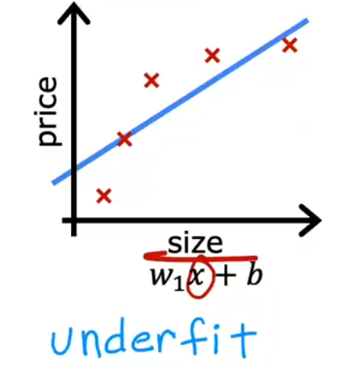
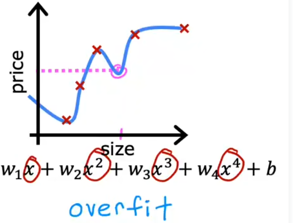
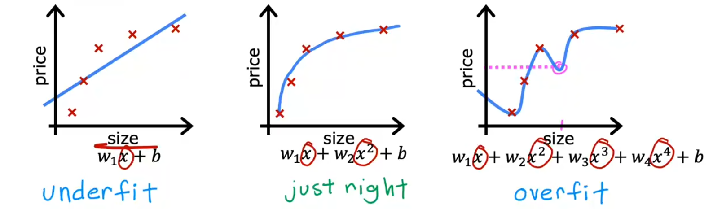
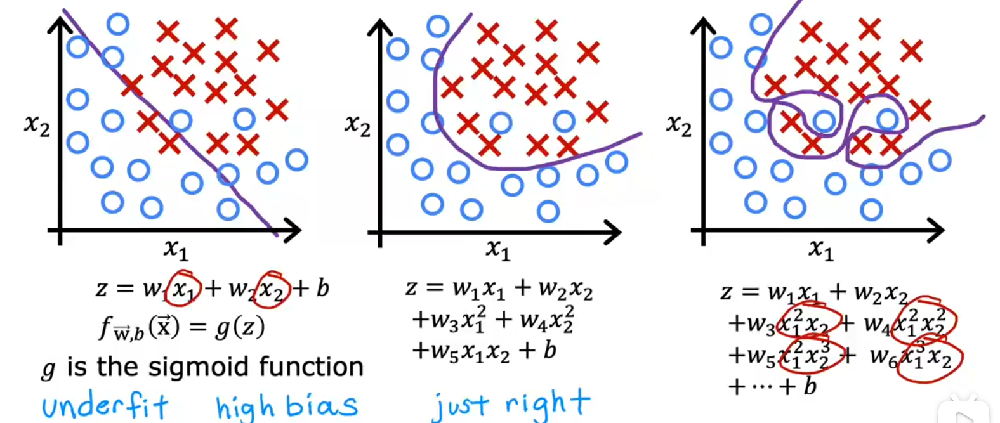
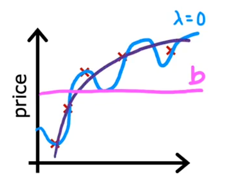

# 欠拟合与过拟合笔记

## 一、欠拟合与过拟合

### 欠拟合（Underfitting）

欠拟合也叫**高偏差（High Bias）**。通常的原因是事先预测的模型太过简单，比如房价预测模型中采用直线去预测。

- **本质**：模型**太简单**，连训练数据的基本规律都没抓住。
- **表现**：在训练集和测试集上的误差都很大（高偏差）。
- **线性回归场景**：如果数据的真实分布明显是一条曲线，但你强行用一条直线（$y = ax + b$）去拟合，这条直线无法穿过数据的关键拐点，预测值会严重偏离真实值。

**原因**：
- 特征数量过少（遗漏了重要自变量）。
- 特征多项式次数过低（假设太强）。
- 正则化惩罚系数（如 $L2$ 的 $\lambda$）**过大**，导致模型参数被压缩得太小。

**解决方法**：
- 增加新的有效特征（特征工程）。
- 提高多项式次数（如将 $x$ 变为 $x^2, x^3$）。
- 减小正则化系数 $\lambda$。
- 增加模型的迭代训练轮数。

### 过拟合（Overfitting）

过拟合也叫**高方差（High Variance）**，通常是因为预测的模型太过复杂，特征值的次数太高，算法为了让线条能够经过每一个点，绘制出来的曲线会非常扭曲，使得个别点附近的波动非常大。这种情况预测出来的模型只能对训练集有很好的解释，但对未知数据的预测会非常差，波动非常大。

在这种情况下，如果对同一个问题采用两份不同的训练集训练，最终两次预测出的模型会非常不一样。

- **本质**：模型**太复杂**，不仅记住了数据的整体趋势，还死记硬背住了训练数据中的**随机噪声**和异常点。
- **表现**：在训练集上误差极小（甚至为0），但在测试集（新数据）上误差突然变得极大（高方差）。
- **线性回归场景**：你用了高阶多项式（如 $y = ax^9 + bx^8 + \cdots$）去拟合仅有10个点的数据，这条曲线扭曲得很厉害，能精确穿过每一个训练点，但一旦放入一个新点，预测结果会剧烈震荡。

**原因**：
- 特征过多，且样本量太少（维度灾难）。
- 多项式次数过高，模型过于灵活。
- 正则化系数 $\lambda$ **过小**或为 $0$，没有对模型复杂度进行约束。

**解决方法**：
- **增加训练样本量**（让散点图更密集，减少模型曲线的抖动）。
- **特征选择/降维**（PCA），剔除不相关的冗余特征。
- **增加正则化**（$L1/L2$ 正则化），在损失函数中加上惩罚项，约束系数 $w$ 的大小。
- **早停法**（Early Stopping）：在训练误差开始下降但验证误差即将回升时停止训练。

如果采用刚好既不复杂又不简单的模型，那么预测出来的模型就会比较符合规律：

同样的，逻辑回归（分类）问题中也会经常出现欠拟合和过拟合的问题。究其原因还是特征值的幂次过大或者过小，造成曲线过于扭曲或者过于直白。

## 二、解决过拟合的方法

**一、增加训练样本量**（让散点图更密集，减少模型曲线的抖动）。

**二、选择更具代表性的特征值，或者说剔除一些特征值**。但总会遇到不能剔除任何一个特征的情况，因此有了正则化的方法。

**三、正则化**。它相比第二种方法会温和一些，它做的是把特征值前面的参数调小，尽可能接近0。比如说某个特征值前面的参数 $w_j = 0.00001$，减小特征值影响的同时不放弃特征值。这种方法可以让原本的四次函数接近于二次函数，达到解决过拟合的效果，比如 $f(x) = 13x - 0.21x^2 + 0.000014x^3 - 0.0001x^4 + 10$。

### 正则化的具体过程

正则化的目的是尽可能地让参数 $w_j$ 变小，那么怎么才能让算法得出的 $w_j$ 尽可能小呢？

$w_j$ 是如何得来的？或者说满足我们要求的 $w_j$ 是如何得来的。我们是当成本函数 $J(w, b)$ 的值最小时才确定参数 $(\vec{w}, b)$，所以我们应当从成本函数入手。

当成本函数的值越小时，此时的参数 $(\vec{w}, b)$ 越容易保留；当成本函数的值越大时，此时的参数 $(\vec{w}, b)$ 越不容易保留。这就涉及到了机器学习中对模型的奖惩机制：当你以某种方式强行增大成本函数的值，就是一种惩罚；强行减小成本函数的值，就是一种奖励。

以预测模型 $f_{\vec{w}, b}(x) = w_1x + w_2x^2 + w_3x^3 + w_4x^4 + b$ 为例，我们想要让 $w_3$ 和 $w_4$ 变小，那么只要当 $w_3$ 和 $w_4$ 取值很大时就惩罚模型，也就是让成本函数 $J(w, b)$ 的值变大，就能让算法尽可能不取得较大值的 $w_3$ 和 $w_4$。

最简单的做法就是对成本函数做手脚：
$$
J(w, b) = J(w,b) + 1000w_3^2 + 1000w_4^2 = \frac{1}{2m}\sum_{i=1}^m[f_{w,b}(x^{(i)}) - y^{(i)}]^2 + 1000w_3^2 + 1000w_4^2
$$
如此简单粗暴的方法，改变成本函数的定义，就能让算法往 $w_3$ 和 $w_4$ 取小值的方向靠。

这个方法只在特征很少的情况下适用，我们能一眼看出哪些特征会造成过拟合。但大多数情况是输入会有很多特征（比如100多个特征值），这时要判断哪些特征会造成过拟合就比较困难了。

此时简单的做法就是：一视同仁地惩罚所有 $w_j$ 参数。这种做法通常会拟合一个更平滑、更简单、波动较小的函数，不容易产生过拟合。
$$
J(\vec{w}, b) = \frac{1}{2m}\sum_{i=1}^m[f_{w,b}(x^{(i)}) - y^{(i)}]^2 + \frac{\lambda}{2m}\sum_{j=1}^n w_j^2
$$
其中的 $\frac{1}{m}$ 是为了减少训练集数据过多时造成的影响，而 $\frac{1}{2m}$ 则是为了和前面的系数统一。$\lambda$ 的作用则是和学习率 $\alpha$ 相似，为了控制对 $w_j$ 的奖惩力度。

我们并没有对 $b$ 做奖惩制度。其实加上 $\frac{\lambda}{2m}b^2$ 也可以，但是 $b$ 毕竟是一个常数项，它对模型的影响其实非常小，所以加不加都无所谓，最终结果也不会有太大差别。

现在思考一个有趣的事情：$\lambda$ 的取值会如何影响预测模型的结果。还是以 $f_{\vec{w}, b}(x) = w_1x + w_2x^2 + w_3x^3 + w_4x^4 + b$ 为例。

- 如果 $\lambda = 0$，那么最后取得的结果和原来一样，会造成**过拟合**。
- 如果 $\lambda = 10^{10}$（一个非常大的数），那么最后的结果就是各个 $w_j$ 都非常小，最终 $f_{\vec{w}, b}(x) \approx b$，变成一条水平线，造成了**欠拟合**。
- 只有 $\lambda$ 取一个不大不小刚刚好的值，最后的曲线才会平滑、简单、波动较小。

## 三、正则化在线性回归与逻辑回归中的应用

### 正则化线性回归

正则化后的成本函数有了新的定义：
$$
J(\vec{w}, b) = \frac{1}{2m}\sum_{i=1}^m[f_{w,b}(x^{(i)}) - y^{(i)}]^2 + \frac{\lambda}{2m}\sum_{j=1}^n w_j^2
$$

相应的导数公式也会发生变化，其实也没多大变化，就是多加了一项：
$$
\frac{\partial J}{\partial w_j} = \frac{1}{m} \sum_{i=1}^{m} [f_{w,b}(x^{(i)}) - y^{(i)}]x^{(i)}_j + \frac{\lambda}{m}w_j \\
\frac{\partial J(\vec{w}, b)}{\partial b} = \frac{1}{m} \sum_{i=1}^{m} [f_{w,b}(x^{(i)}) - y^{(i)}]
$$

这样运行梯度下降的话：
$$
w_j = w_j - \alpha \left[\frac{1}{m} \sum_{i=1}^{m} [f_{w,b}(x^{(i)}) - y^{(i)}]x^{(i)}_j + \frac{\lambda}{m}w_j\right] \\
b = b - \alpha \frac{1}{m} \sum_{i=1}^{m} [f_{w,b}(x^{(i)}) - y^{(i)}]
$$

$b$ 没有多大区别，但是 $w_j$ 的梯度下降有了新的写法：
$$
w_j = \left(1- \alpha \frac{\lambda}{m}\right)w_j - \alpha \frac{1}{m} \sum_{i=1}^{m} [f_{w,b}(x^{(i)}) - y^{(i)}]x^{(i)}_j
$$

后面的部分和原来未正则化时一模一样，变化的是前面 $w_j$ 在运行梯度下降时会先乘一个系数，一般来说这个系数是一个小于 $1$ 但接近 $1$ 的数，因为 $\alpha \frac{\lambda}{m}$ 是一个接近 $0$ 的数，比如 $\alpha \frac{\lambda}{m} = 0.01 \times \frac{1}{50} = 0.0002$。

### 正则化逻辑回归

因为逻辑回归的成本函数的**偏导数**与线性回归的偏导数在形式上完全一样，所以它们的梯度下降过程也十分相似。同样的，正则化逻辑回归的梯度下降也会非常相似。

先举一个简单的例子回顾一下逻辑回归的预测模型：
$$
z = w_1x_1 + w_2x_2 + w_3x_1^2w_2 + w_4x_1^2x_2^2 + w_5x_1^2x_2^3 + \cdots + b \\
f_{\vec{w}, b}(\vec{x}) = sigmoid(z) = \frac{1}{1+e^{-z}}
$$

然后对逻辑回归的成本函数进行正则化：
$$
J(w, b)= -\frac{1}{m}\sum_{i=1}^m \left[ y^{(i)} \log\!\big(f_{w,b}(x^{(i)})\big) 
+ (1 - y^{(i)}) \log\!\big(1 - f_{w,b}(x^{(i)})\big) \right] + \frac{\lambda}{2m}\sum_{j=1}^n w_j^2
$$

同样的，偏导数也要发生改变：
$$
\frac{\partial J}{\partial w_j} = \frac{1}{m} \sum_{i=1}^{m} [f_{w,b}(x^{(i)}) - y^{(i)}]x^{(i)}_j + \frac{\lambda}{m}w_j \\
\frac{\partial J(\vec{w}, b)}{\partial b} = \frac{1}{m} \sum_{i=1}^{m} [f_{w,b}(x^{(i)}) - y^{(i)}]
$$

这样运行梯度下降的话：
$$
w_j = w_j - \alpha \left[\frac{1}{m} \sum_{i=1}^{m} [f_{w,b}(x^{(i)}) - y^{(i)}]x^{(i)}_j + \frac{\lambda}{m}w_j\right] \\
b = b - \alpha \frac{1}{m} \sum_{i=1}^{m} [f_{w,b}(x^{(i)}) - y^{(i)}]
$$

---

### 1. 欠拟合（Underfitting）

欠拟合（Underfitting）也叫**高偏差（high bias）**。通常的原因是事先预测的模型太过简单，比如说**房价预测模型**中采用直线去预测模型。

-   **本质**：模型**太简单**，连训练数据的基本规律都没抓住。
-   **表现**：在训练集和测试集上的误差都很大（高偏差）。
-   **线性回归场景**：如果数据的真实分布明显是一条曲线，但你强行用一条直线（$ y = ax + b $）去拟合，这条直线无法穿过数据的关键拐点，预测值会严重偏离真实值。

**原因**：

-   特征数量过少（遗漏了重要自变量）。
-   特征多项式次数过低（假设太强）。
-   正则化惩罚系数（如$L2$的$\lambda$）**过大**，导致模型参数被压缩得太小。

**解决方法**：

-   增加新的有效特征（特征工程）。
-   提高多项式次数（如将 \( $x$ \) 变为 \($ x^2$, $x^3$ \)）。
-   减小正则化系数 \($\lambda$)。
-   增加模型的迭代训练轮数。

---

### 2. 过拟合（Overfitting）

过拟合（Overfitting）也叫**高方差（high variance）**，通常是因为预测的模型太过复杂，特征值的次数太高，算法为了让线条能够经过每一个点，绘制出来的曲线会非常扭曲，使得个别点附近的波动非常大。这种情况预测出来的模型只能对训练集有很好的解释，但是对未知数据的预测会非常差，波动非常大。

在这种情况下，如果对同一个问题的采用两份不同的训练集训练，最终两次预测出的模型会非常不一样。

-   **本质**：模型**太复杂**，不仅记住了数据的整体趋势，还死记硬背住了训练数据中的**随机噪声**和异常点。
-   **表现**：在训练集上误差极小（甚至为0），但在测试集（新数据）上误差突然变得极大（高方差）。
-   **线性回归场景**：你用了高阶多项式（如 $y = ax^9 + bx^8 + ... $）去拟合仅有10个点的数据，这条曲线扭曲得很厉害，能精确穿过每一个训练点，但一旦放入一个新点，预测结果会剧烈震荡。

**原因**：

-   特征过多，且样本量太少（维度灾难）。
-   多项式次数过高，模型过于灵活。
-   正则化系数 \(\lambda\) **过小**或为 $0$，没有对模型复杂度进行约束。

**解决方法**：

-   **增加训练样本量**（让散点图更密集，减少模型曲线的抖动）。
-   **特征选择/降维**（PCA），剔除不相关的冗余特征。
-   **增加正则化**（$L1/L2$正则化），在损失函数中加上惩罚项，约束系数 ( $w$ ) 的大小。
-   **早停法**（Early Stopping）：在训练误差开始下降但验证误差即将回升时停止训练。

---

如果采用刚好既不复杂又不简单的模型，那么预测出来的模型就会比较符合规律

---

同样的，逻辑回归（分类）问题中也会常出现欠拟合和过拟合的问题。究其原因还是特征值的幂次过大或者过小，造成的曲线过于扭曲或者直白。

---

#### 解决过拟合的方法

一、**增加训练样本量**（让散点图更密集，减少模型曲线的抖动）。

二、选择更具代表性的特征值，或者说剔除一些特征值。但是总会遇到不能剔除任何一个特征的情况，因此有了正则化的方法。

三、正则化。它相比第二种方法会温和一些，它做的是把特征值前面的参数调小，尽可能接近0。比如说某个特征值前面的参数$w_j = 0.00001$，减小特征值的影响的同时不放弃特征值。这种方法可以让原本的四次函数接近于二次函数达到解决过拟合的效果，比如 $f(x) = 13x - 0.21x^2+0.000014x^3-0.0001x^4+10$

#### 正则化的具体过程：

正则化的目的是尽可能地让参数 $w_j$ 变小，那么怎么才能让算法的出来的 $w_j$ 尽可能的小呢？

$w_j$ 是如何得来的，或者说满足我们要求的 $w_j$ 是如何得来的。我们是当成本函数 $J(w, b)$ 的值最小时才确定参数 $(w,b)$，所以我们应当从成本函数入手。

当成本函数的值越小时，此时的参数 $(w,b)$ 越容易保留；当成本函数的值越大时，此时的参数 $(w,b)$ 越不容易保留。

这就涉及到了机器学习中对模型的奖惩机制：当你以某种方式强行增大成本函数的值，就是一种惩罚；强行减小成本函数的值，就是一种奖励。

以预测模型：$f_{\vec{w}, b}(x) = w_1x + w_2x^2 + w3_x^3+ w4_x^4 + b$ 为例，我们想要让 $w_3$ 和 $w_4$ 变小，那么只要当 $w_3$ 和 $w_4$ 的取值很大时就惩罚模型，也就是让成本函数  $J(w, b)$ 的值变大，就能让算法尽可能不取得较大值的 $w_3$ 和 $w_4$

最简单的做法就是对成本函数做手脚：令 
$$
J(w, b) = J(w,b) + 1000w_3^2 + 1000w_4^2 = \frac{1}{2m}\sum_{i=1}^m[f_{w,b}(x^{(i)}) - y^{(i)}]^2 + 1000w_3^2 + 1000w_4^2
$$
如此简单粗暴的方法，改变成本函数的定义，就能让算法往 $w_3$ 和 $w_4$ 取小值的方向靠。

这个方法只是在特征很少的情况，我们一眼能看出哪些特征会造成过拟合。但大多是情况是输入会有很多特征（比如说100多个特征值），这时我们要判断哪些特征会造成过拟合就比较困难了。

此时简单的做法就是：一视同仁的惩罚所有 $w_j$ 参数。这种做法通常会拟合一个更平滑、更简单、波动较小的函数，不容易产生过拟合。
$$
J(\vec{w}, b) = \frac{1}{2m}\sum_{i=1}^m[f_{w,b}(x^{(i)}) - y^{(i)}]^2 + \frac{\lambda}{2m}\sum_{j=1}^nw_j^2
$$
有 $\frac{1}{m}$ 是为了减少训练集数据过多时造成的影响，而 $\frac{1}{2m}$ 则是为了和前面的系数统一。$\lambda$ 的作用则是和学习率 $\alpha$ 相似，为了控制对 $w_j$ 的奖惩力度。

我们并没有对 $b$ 做奖惩制度，其实加上 $\frac{\lambda}{2m}b^2$ 也可以，但是 $b$ 毕竟是一个常数项，它对模型的影响其实非常小，所以加不加都无所谓，最终结果也不会有太大差别。

现在思考一个有趣的事情，$\lambda$ 的取值会如何影响预测模型的结果。还是以 $f_{\vec{w}, b}(x) = w_1x + w_2x^2 + w3_x^3+ w4_x^4 + b$ 为例。

- 如果 $\lambda = 0$ ，那么最后取得的结果和原来一样，会造成**过拟合**。

- 如果 $\lambda = 10^{10}$ 一个非常大的数，那么最后的结果就是各个 $w_j$ 都非常小，最终  $f_{\vec{w}, b}(x) \approx b$，变成一条水平线，造成了**欠拟合**
- 只有 $\lambda$ 取一个不大不小刚刚好的值，最后的曲线才会平滑、简单、波动较小

#### 正则化线性回归

正则化后的成本函数有了新的定义：
$$
J(\vec{w}, b) = \frac{1}{2m}\sum_{i=1}^m[f_{w,b}(x^{(i)}) - y^{(i)}]^2 + \frac{\lambda}{2m}\sum_{j=1}^nw_j^2
$$
相应的导数公式也会发生变化，其实也没多大变化，就是多加了一项
$$
\frac{\partial J}{\partial w_j} = \frac{1}{m} \sum_{i=1}^{m} [f_{w,b}(x^{(i)}) - y^{(i)}]x^{(i)}_j + \frac{\lambda}{m}w_j \\
\frac{\partial J(\vec{w}, b)}{\partial b} = \frac{1}{m} \sum_{i=1}^{m} [f_{w,b}(x^{(i)}) - y^{(i)}]
$$
这样运行梯度下降的话：
$$
w_j = w_j - \alpha [\frac{1}{m} \sum_{i=1}^{m} [f_{w,b}(x^{(i)}) - y^{(i)}]x^{(i)}_j + \frac{\lambda}{m}w_j] \\
b = b - \alpha \frac{1}{m} \sum_{i=1}^{m} [f_{w,b}(x^{(i)}) - y^{(i)}]
$$
$b$ 没有多大区别，但是 $w_j$ 梯度下降有了新的写法
$$
w_j = (1- \alpha \frac{\lambda}{m})w_j - \alpha \frac{1}{m} \sum_{i=1}^{m} [f_{w,b}(x^{(i)}) - y^{(i)}]x^{(i)}_j
$$
后面的部分和原来未正则化时一模一样，变化的就是前面 $w_j$ 在运行梯度下降时会先乘一个系数，一般来说这个系数是一个小于$1$ 但接近 $1$ 的数。因为 $\alpha \frac{\lambda}{m}$ 是一个接近 $0$ 的数

比如 $\alpha \frac{\lambda}{m} = 0.01 \frac{1}{50} = 0.0002$

#### 正则化逻辑回归

因为逻辑回归的成本函数的**偏导数**与线性回归的偏导数在形式上一模一样。所以它们的梯度下降的过程也是十分相似。同样的，正则化逻辑回归的梯度下降也会非常相似。

先举一个简单的例子回顾一下逻辑回归的预测模型：
$$
z = w_1x_1 + w_2x_2 + w_3x_1^2w_2 + w_4x_1^2x_2^2 + w_5x_1^2x_2^3 + ... + b \\
f_{\vec{w}, b}(\vec{x}) = sigmoid(z) = \frac{1}{1+e^{-z}}
$$
然后对逻辑回归的成本函数进行正则化：
$$
J(w, b)= -\frac{1}{m}\sum_{i=1}^m \left[ y^{(i)} \log\!\big(f_{w,b}(x^{(i)})\big) 
+ (1 - y^{(i)}) \log\!\big(1 - f_{w,b}(x^{(i)})\big) \right] + \frac{\lambda}{2m}\sum_{j=1}^n w_j^2
$$
同样的，偏导数也要发生改变：
$$
\frac{\partial J}{\partial w_j} = \frac{1}{m} \sum_{i=1}^{m} [f_{w,b}(x^{(i)}) - y^{(i)}]x^{(i)}_j + \frac{\lambda}{m}w_j \\
\frac{\partial J(\vec{w}, b)}{\partial b} = \frac{1}{m} \sum_{i=1}^{m} [f_{w,b}(x^{(i)}) - y^{(i)}]
$$

这样运行梯度下降的话：
$$
w_j = w_j - \alpha [\frac{1}{m} \sum_{i=1}^{m} [f_{w,b}(x^{(i)}) - y^{(i)}]x^{(i)}_j + \frac{\lambda}{m}w_j] \\
b = b - \alpha \frac{1}{m} \sum_{i=1}^{m} [f_{w,b}(x^{(i)}) - y^{(i)}]
$$

