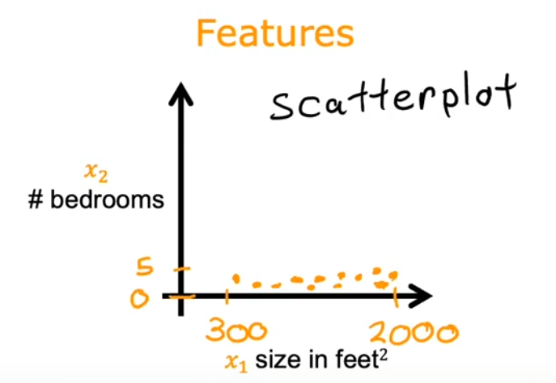
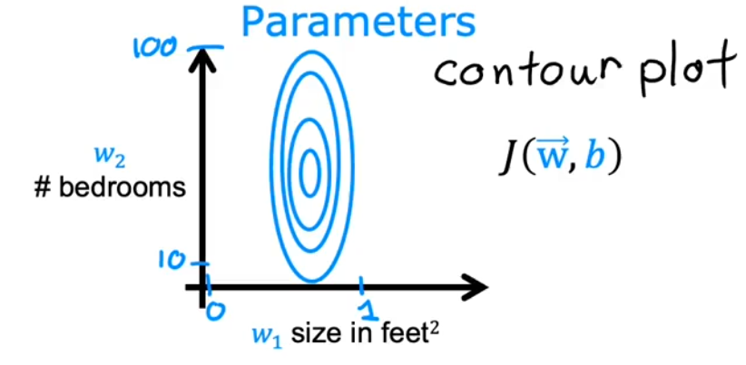
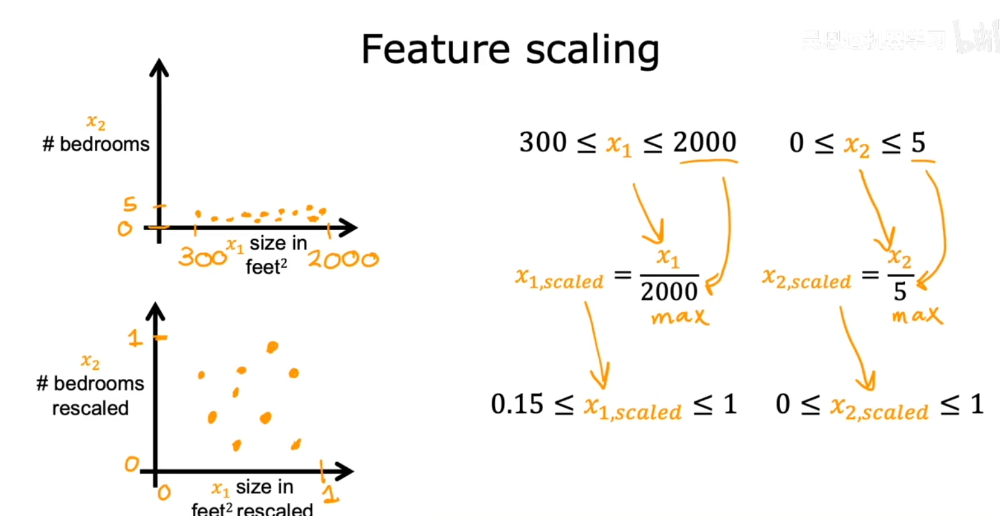
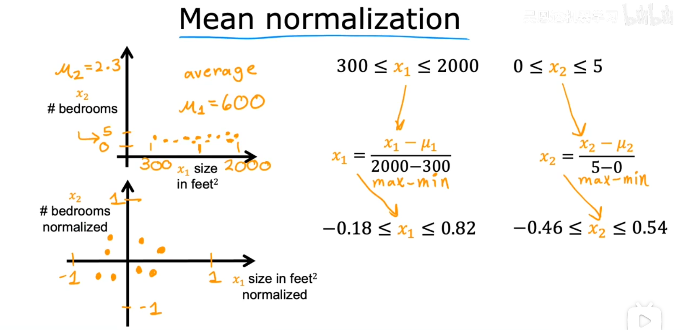
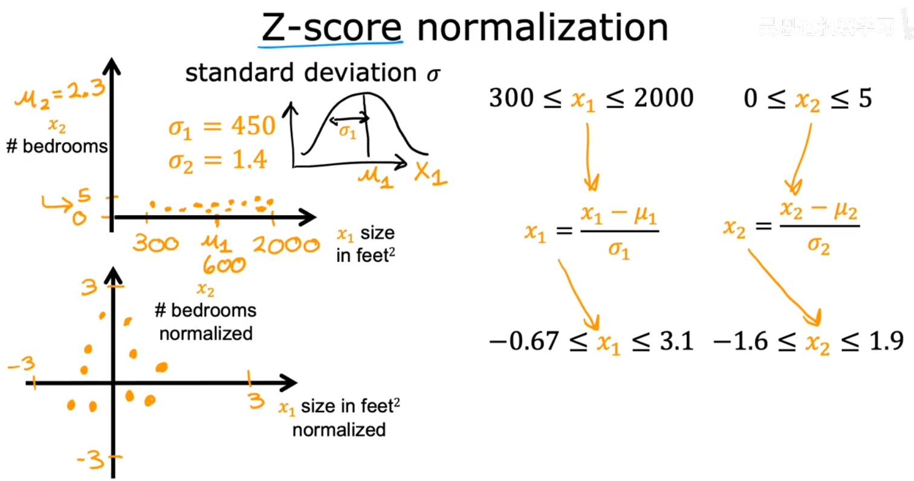
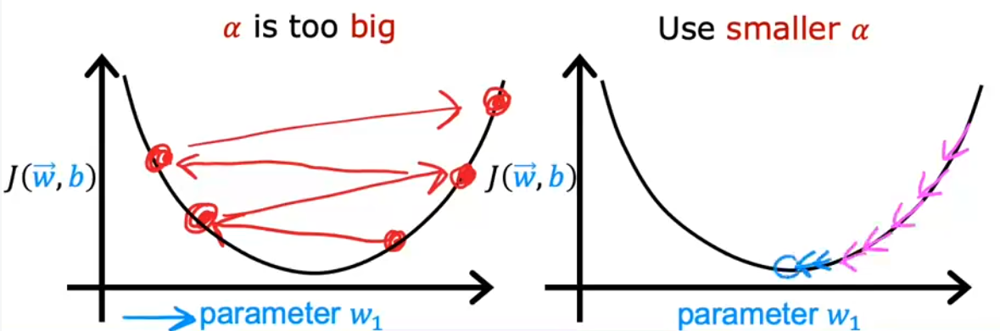
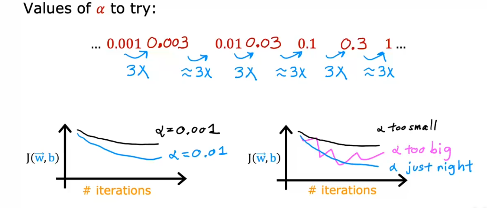
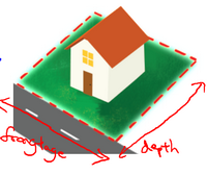
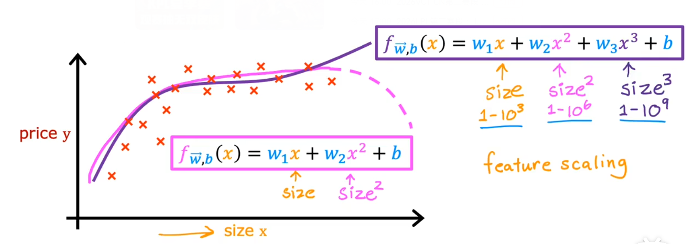

### 机器学习

机器学习，顾名思义，让机器 运行一定的算法 能够具备 自主学习、解决问题的能力。

这个算法主要分为：监督学习(Supervised Learning) 和 无监督学习(Unsupervised Learning)。

* 监督学习算法运用的场景在：用户给出一组**输入**，以及对应的一组正确**输出**，监督学习能够使用一定的算法利用这组数据**预测**输入和输出之间的**映射关系**。这个映射关系客观上不一定是正确的，但一定是理论上最接近正确的。

* 无监督学习算法运用的场景：用户只提供输入，不提供输出，所以它不必像监督学习算法那样一定要找出输入和输出之间的映射关系。它主要的目的是**找出**输入数据之间所具有的**共同特征**，然后根据找出的共同特征对输入数据做**处理**。

---

#### 监督学习

##### 术语(Terminology)

监督学习的目的是根据用户给出的输入和输出找出它们之间的映射关系。

1. 这种映射关系也被称作**函数**，或者更专业点的叫做**模型(Model)**。
2. 监督学习算法根据用户给出的数据得到映射关系的**过程**叫做**训练(Training)**
3. 将用户给出的输入数据和输出组成的集合叫做**训练集(Training Set)**
4. 用户给出的**输入数据(input)**可称为**特征(feature)**，记作`x`；用户给出的**输出数据(output)**可称为**目标(target)**, 记作`y`。它们都是用户给出的真实正确的数据
5. 用`(x, y)`表示一个**训练示例(training example)**，它由用户给出的真实正确有对应关系的数据组成的作为训练集的元素。
6. 用`m`表示训练集元素的个数

根据用户提供提供的输出数据，可以初步判断输入和输出之间的映射关系是**连续**的还是**离散**的。

比如说输入和输出之间的关系是 `y = wx + b` ，输出是连续的；比如也有可能是根据输入判断的结果的`0/1`、`true/false`这类离散的输出。

我们将**连续**的模型叫做**回归**，将**离散**的模型叫做**分类**

因此，监督学习算法主要分为回归算法和分类算法。

### 线性回归

算法去预测模型可以往直线的方向去预测，也可以往曲线的方向去预测。当然曲线会更贴合现实规律，但是为了更好的讲清楚概念，所以这里往直线的方向去预测。往直线方向去预测的过程叫做**线性回归**。

因为是预测一条直线，所以只需要找出**一次函数**: `y = wx + b`，让它更**贴合**用户给出的所有`(x, y)`。所谓预测，其实就是找到合适的`w, b`，使得由 $f_{w,b}(x^{i}) = wx^{i}~ + b$ 算出的 $\hat{y}^{(i)}$ 尽可能的贴合 $y^{(i)}$

当然了，仅凭预测的一次函数 $f_{w,b}$ 就想做到让所有的 $f(x^{(i)})$ 能精确的等于 $y^{(i)}$ 这是不可能的，所以我们能做的只有让预测的函数更加的**贴合**实际情况。

##### 代价函数

那么总得有个指标来描述这个**预测函数**有多么的贴合**实际情况**，于是有了新的概念：**代价函数(cost function)**。

代价函数可以有多种写法，只有它能够正确描述**预测函数**与**实际情况**的贴合程度。

这里采用的**误差平方和**来作为代价函数，记为 $J(w, b)$。
$$
J(w, b) = \sum_{i=1}^m[f_{w,b}(x^{(i)} - y^{(i)}]^2 = \sum_{i=1}^m(wx^{(i)} + b - y^{(i)})^2
$$
==将 $x^{(i)}$ 和 $y^{(i)}$ 视作常量，那么代价函数就是关于$(w,b)$的函数==

为了不让 $J(w, b)$ 的值不会随着 $m$ 的增大而过分增大，所以对 $J(w, b)$ 做进一步改善：$J(w, b) = \frac{1}{m}\sum_{i=1}^m[f_{w,b}(x^{(i)}) - y^{(i)}]^2$，就是用**误差平方和的平均值**来做代价函数

再做进一步改善得到最终的代价函数：
$$
J(w, b) = \frac{1}{2m}\sum_{i=1}^m[f_{w,b}(x^{(i)}) - y^{(i)}]^2
$$
为什么会有个 2，这在后面会做解释。

##### 梯度下降

现在的目标就是找到 $(w,b)$ 取什么值时可以让 $J(w, b)$ 取到最小值。这样预测出的回归函数就是当前代价函数下的最贴合实际情况的模型。

虽然我们可以通过代价函数求偏导的方式求出偏导值为0的点解方程得到$(w,b)$，但是我们不可能再写一个这种求方程的引擎。计算机最擅长的方法就是枚举，一个一个代值去试，因此找到一个枚举方法可以正确的找出$(w,b)$让计算机去运行才是我们的目标，这个方法就是**梯度下降**

* **梯度**是方向导数值最大的**方向向量**
* 导数/偏导 提供了**梯度**在 该分量上的方向(正负方向) 以及 该方向上具体的变化率
* $\alpha$ 是**学习率**，由于算出来的偏导值一般会比较大，所以需要一个比例控制一下步长

$$
tmp\_w = w - \alpha\frac{\partial J(w, b)}{\partial w}\\
tmp\_b = b - \alpha\frac{\partial J(w, b)}{\partial b}\\
w = tmp\_w \\
b = tmp\_b
$$

使用了梯度下降后，$(w,b)$ 就会从初值慢慢**滑到**代价函数 $J(w, b)$ 的某个临近的**极小值**上。注意是极小值上，不是最小值，所以运行完梯度下降后并不意味着就找到了 $(w,b)$ 的最优解，这取决于$(w,b)$ 的初值在哪里。

但是，由于我们采用**误差平方和**来作为代价函数，因此整个 $J(w, b)$ 函数的图像就是一个向下塌陷的凹函数，它只有一个极小值，也是我们要的最小值

因此，使用**误差平方和**来作为代价函数，就不需要考虑$(w,b)$ 的初值，只管运行梯度下降就行。

下面可以解释一下为什么 $J(w, b)$ 中要用 $\frac{1}{2m}$

在梯度下降中，需要用到偏导，那么求偏导的过程：
$$
\frac{\partial{J(w,b)}}{\partial w} = \frac{\partial}{\partial w}\frac{1}{2m}\sum_{i=1}^m[f_{w,b}(x^{(i)}) - y^{(i)}]^2 = \frac{\partial}{\partial w}\frac{1}{2m}\sum_{i=1}^m(wx^{(i)} + b - y^{(i)})^2\\
=\frac{1}{2m}\sum_{i=1}^m2x^{(i)} * (wx^{(i)} + b - y^{(i)}) \\
=\frac{1}{m}\sum_{i=1}^mx^{(i)} * [f_{w,b}(x^{(i)}) - y^{(i)}] \\
\frac{\partial{J(w,b)}}{\partial b} = \frac{\partial}{\partial b}\frac{1}{2m}\sum_{i=1}^m[f_{w,b}(x^{(i)}) - y^{(i)}]^2 = \frac{\partial}{\partial b}\frac{1}{2m}\sum_{i=1}^m(wx^{(i)} + b - y^{(i)})^2\\
=\frac{1}{2m}\sum_{i=1}^m2 * (wx^{(i)} + b - y^{(i)}) \\
=\frac{1}{m}\sum_{i=1}^m  [f_{w,b}(x^{(i)}) - y^{(i)}]
$$
从这个过程可以看出，代价函数 $J(w, b)$ 中的$\frac{1}{2m}$ 是为了在求偏导时消去**平方**掉下来的$2$。让偏导函数更加简洁。

**批量梯度下降**（Batch Gradient Descent）指的是在运行梯度下降的过程中，会将**训练集**中的**所有数据**都代进去运算，而不是代几个数据进去。

### 多元线性回归 (multiple linear regression)

上面讲的例子中只涉及到单个特征，但是现实往往会有多个特征影响到预测值

前面都是**一个特征值**表示**一个输入数据**，现在是**多个特征值**组成**一个特征**表示**一个输入数据**

前面用 $x^{(i)}$ 表示第 $i$ 组特征（输入数据），现在用 $x_{j}$ 表示某组特征的第 $j$ 个特征值

用 $x^{(i)}_{j}$ 表示第 $i$ 组特征的第 $j$ 个特征值

比如说 $x^{(i)} = [1416,\ 3,\ 2,\ 40]$ ，表示第 $i$ 组特征，那么 $x^{(i)}_{2} = 3$  表示第 $i$ 组特征的第 $2$ 个特征值为 $3$

因为这么多个特征值组成一个特征可以表示成一个向量，所以会在 $x$ 的上面画一个箭头 $\vec{x}$ 表示这是多个特征值组成的一个向量特征。其实 $x^{(i)}$ 和 $\vec{x}^{(i)}$ 完全是一样的，写哪个都可以，但为了更加直观的表示输入数据是由多特征值组成的特征值组，会采用后者显式表示出来它更像一个向量

一个特征里有多少个特征值会用 $n$ 表示出来，前面是用 $m$ 表示训练集中有多少组特征

有多个特征值影响预测值，意味着预测函数的参数也会有多个，这里可以用 $[w_1,\ w_2,\ w_3,\ ..., w_n,\ b]$ 表示预测函数的参数，或者更更简洁的表示方法 $[\vec{w},\ b]$

现在需要用多元的预测模型，为了更好的讲清楚概念，这里采用的还是线性模型。比如现在可以假定预测模型为：$f_{\vec{w},b}(\vec{x})=w_1x_1+w_2x_2+...+w_nx_n+b$，或者更简洁的写法：$f_{\vec{w},b}(\vec{x})=\vec{w} \cdot \vec{x} + b$

即
$$
f_{\vec{w},b}(\vec{x})=\vec{w} \cdot \vec{x} + b = w_1x_1+w_2x_2+...+w_nx_n+b
$$
相应的**代价函数**还是**误差平方和**，记为 $J(\vec{w}, b)$
$$
J(\vec{w}, b) = \frac{1}{2m} \sum_{i=1}^m[f_{\vec{w},b}(\vec{x}^{(i)})-y^{(i)}]^2\\
= \frac{1}{2m} \sum_{i=1}^m[\vec{w}\vec{x}^{(i)}-y^{(i)}]^2 \\
=\frac{1}{2m} \sum_{i=1}^m[w_1x_1^{(i)} + w_2x_2^{(i)} + ... + w_nx_n^{(i)} + b - y^{(i)}]^2 \\
= \frac{1}{2m} \sum_{i=1}^m[\sum_{j=1}^n w_jx^{(i)}_j + b - y^{(i)}]^2
$$
相应的就可以根据代价函数得出 $w_j$ 和 $b$ 的偏导数
$$
\frac{\partial J(\vec{w}, b)}{\partial w_j} = \frac{1}{2m} \sum_{i=1}^{m} 2 x^{(i)}_j[\sum_{j=1}^{n}w_jx^{(i)}_j + b - y^{(i)}]\\
=\frac{1}{m} \sum_{i=1}^{m} x^{(i)}_j[\vec{w} \cdot \vec{x}^{(i)} +b - y^{(i)}]
$$

$$
\frac{\partial J(\vec{w}, b)}{\partial b} = \frac{1}{2m} \sum_{i=1}^{m} 2 [\sum_{j=1}^{n}w_jx^{(i)}_j + b - y^{(i)}]\\
=\frac{1}{m} \sum_{i=1}^{m} [\vec{w} \cdot \vec{x}^{(i)} +b - y^{(i)}]
$$

由此可得出，执行梯度下降时的公式：
$$
w_j = w_j - \alpha \cdot \frac{\partial J(\vec{w}, b)}{\partial w_j} = w_j - \alpha \cdot \frac{1}{m}\sum_{i=1}^{m} x^{(i)}_j (f_{\vec{w},b}(\vec{x}^{(i)})-y^{(i)})
$$

$$
b = b - \alpha \cdot \frac{\partial J(\vec{w}, b)}{\partial b} = b - \alpha \cdot \frac{1}{m}\sum_{i=1}^{m} (f_{\vec{w},b}(\vec{x}^{(i)})-y^{(i)}) 
$$

注意在执行梯度下降的时候，因为所有的 $w_j$ 可以组成一个 $\vec{w} = (w_1,\ w_2,\ ...,w_n )$ 

而所有的偏导数 $\frac{\partial J(\vec{w}, b)}{\partial w_j}$ 可以组成一个 $\vec{d} = (d_1,\ d_2,\ ...,d_n ) $

所以可以用向量的加减法直接得出 $\vec{w}$ 变化后的值：$\vec{w} = \vec{w} - \alpha \cdot \vec{d} $

而不是用循环的方式一个一个计算 $w_j$ 变化后的值

#### 特征缩放

有时候我们得到的输入数据中某个特征的值它的跨度范围会比较大，某个特征的值的跨度又非常小。比如在房价预测模型中：房屋尺寸 $x_1$ 的范围在 $300 \longrightarrow  2000$ 之间，房间数量 $x_2$ 的范围在 $0-5$ 之间。

在这里面房间数量 $x_2$ 的范围是处于可接受范围内的，但是相比之下房屋尺寸 $x_1$ 的范围跨度非常大。这样造成的问题如下：

1. 将输入数据绘制在散点图上，散点在横轴上的分布会很分散但是在纵轴上的分布又很聚集不利于观察

2. 在误差平方和成本函数 $J(\vec{w}, b)$ 中，$x_1$ 和 $x_2$ 作为常量，$w_1$ 和 $w_2$ 作为变量（先假定 $b$为已知量）。由$w_1$ 、 $w_2$ 变化而引发的 $J(\vec{w}, b)$ 值的变化所绘制成的 $J(\vec{w}, b)$ 关于 $(w_1, w_2)$ 的图像，把这个图像压缩在平面上得到等高线图像，会形成一个横向窄、纵向宽的椭圆图形。这是因为 $x_1$ 的值普遍比较大，在$J(\vec{w}, b)$ 中 $x_1$ 作为 ${w_1}^2$ 的系数，使得这个二次函数数值变化更快、图像更陡；而 $x_2$ 的值普遍比较小，在$J(\vec{w}, b)$ 中 $x_2$ 作为 ${w_2}^2$ 的系数，使得这个二次函数数值变化更慢、图像更缓。
	由于梯度下降时，$w_1$ 和 $w_2$ 选取的学习率 $\alpha$ 是一样的，$w_2$的步子要迈大一点才有效果，但是步子大了的话 $w_1$所造成的影响就太大了。这样子在下降时路线会非常混乱，不利于得到成本函数的最小值

综上来看，因此我们的输入数据应该：

1. 范围不宜过宽
2. 数值不宜过大

因此我们需要对输入数据进行合理的放缩，也就是**特征缩放**

下面提供几种特征缩放的方法：

##### 一、除以最大值

比如：$300 \le x_1 \le 2000$，$0 \le x_2 \le 5$，除以它们各自的最大值后就能让它们的范围限定在 $[0, 1]$ 之间

##### 二、均值归一化

使用均值归一化，可以让 $x_1$ 和 $x_2$ 的范围都限定在 $[-1,1]$ 之间，让散点图均匀的分布在 $0$ 点附近

具体做法是：先求特征值的均值，然后让特征值与均值的差值除以特征值的跨度
$$
\mu = average(x) \\
x_{scaled} = \frac{x-\mu}{x_{max} - x_{min}}
$$

##### 三、Z-score 归一化

Z-score 归一化可以让缩放的数据更符合正态分布。

具体做法：求出特征值的均值 $\mu$ 和标准差 $\sigma$ ，然后哟用如下公式
$$
x_{scaled} = \frac{x-\mu}{\sigma}
$$

#### 梯度下降是否收敛

##### 一、学习曲线

检查梯度下降是否收敛最直观的做法就是观察**学习曲线**。所谓学习曲线，就是每次执行梯度下降时都记录下成本函数 $J(\vec{w}, b)$ 的值，绘制成曲线观察它随着迭代次数增加会有什么样的变化。

如果这是一个成功的梯度下降，那么成本函数 $J(\vec{w}, b)$ 的值会逐渐下降，并趋近某一个值。对应的学习曲线就是趋近于某条水平线。

值得一提的是，最终趋近的值不一定就是成本函数理论上的最小值。因为受学习率$\alpha$的影响，梯度下降至某个点后可能会在某两个对称点反复横跳。

这是我们自己通过肉眼的方式观察梯度下降是否收敛。还有一种更理论的方法叫做：**自动收敛检测**

##### 二、自动收敛检测

它的做法也很简单，就是取一个很小很接近 $0$ 的数 $\epsilon$，定义好这个数后在每次执行梯度下降后得到的$J(\vec{w}, b)$ 的值与前一次的$J(\vec{w}, b)$做差，如果这个差值小于 $\epsilon$ 就可以认为这次梯度下降已经收敛了。

### 学习率的选择

学习率如果选择过大会怎么样？

以二次函数的成本函数为例，因为当前点的导数值可能过大，迈出的步子也很大的话跑到抛物线的另一边有可能对面点的导数值更大，最终使得 $\alpha \frac{dy}{dx}$ 越来越大，离 $J(\vec{w}, b)$ 最小值也越来越远

如果学习率选的小一点，是可以做到梯度下降一点一点靠近最小值的

因为受到初始点选择的影响，最终反复横跳的对称点也会有所不同。不是说学习率 $\alpha$ 越小，最终收敛的地方 就会离 $J(\vec{w}, b)$ 的最小值越近，这不一定的。主要还是受初始点选择的影响

​                                

#### 特征方程和多项式回归

如房价预测问题，

$f_{\vec{w}, b}\left( x \right)={w_{1}}\times{frontage}+{w_{2}}\times{depth} + b$ 

${x_{1}}=frontage$（临街宽度），${x_{2}}=depth$（纵向深度），$x_3=frontage*depth=area$（面积），

则：$f_{\vec{w}, b}\left( x \right)={w_{1}}x_1 + w_2x_2 + w_3x_3$。这里利用已有的特征再自己创造一个特征的方法就叫做**特征方程**

线性回归并不适用于所有数据，有时我们需要曲线来适应我们的数据，比如一个二次方模型$f_{\vec{w}, b}\left( x \right)={w_{1}}{x_{1}}+{w_{2}}{x_{2}^2} + b$ 

或者三次方模型： $f_{\vec{w}, b}\left( x \right)={w_{1}}{x_{1}}+{w_{2}}{x_{2}^2}+{w_{3}}{x_{3}^3} + b$ 

通常我们需要先观察数据然后再决定准备尝试怎样的模型。 另外，我们可以令：

${{x}_{2}}=x_{2}^{2},{{x}_{3}}=x_{3}^{3}$，从而将模型转化为线性回归模型。

根据函数图形特性，我们还可以使：

$f_{\vec{w}, b}\left( {x} \right)={w_{1}{x}}+{w_2}{\sqrt{x}} + b$ 

注：如果我们采用多项式回归模型，在运行梯度下降算法前，特征缩放非常有必要。

---

