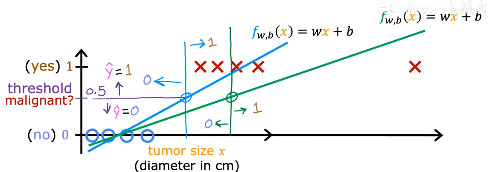
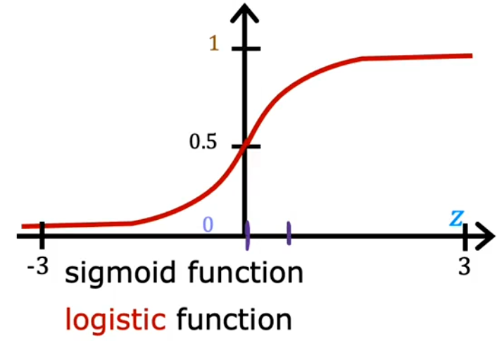
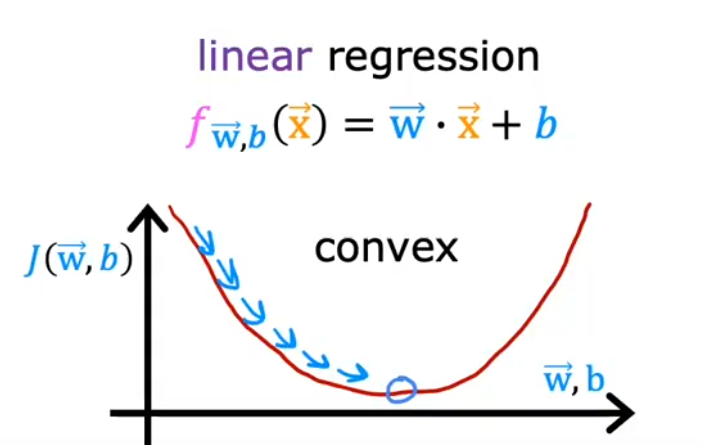
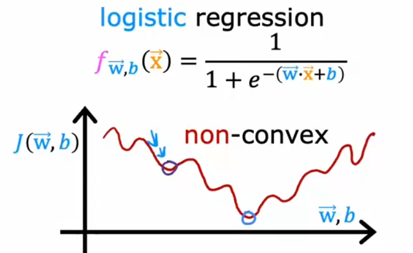
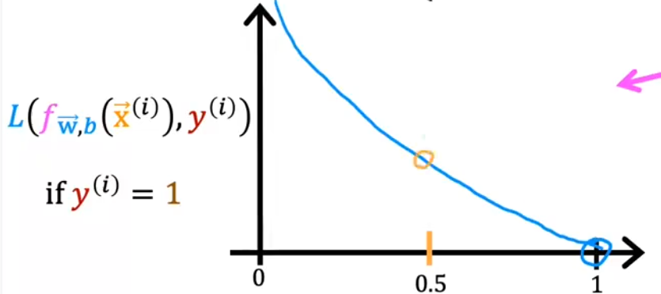
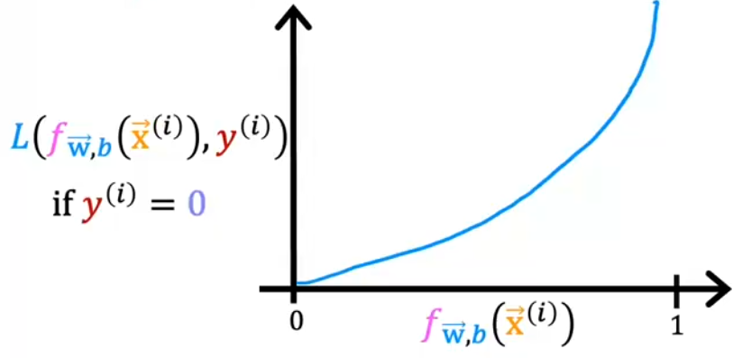
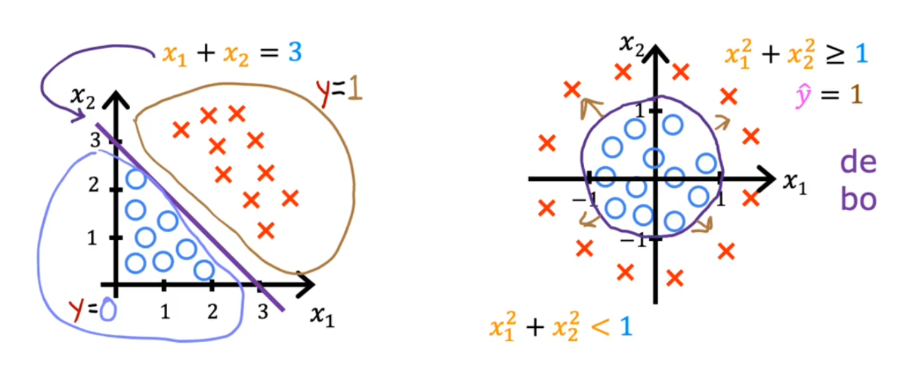
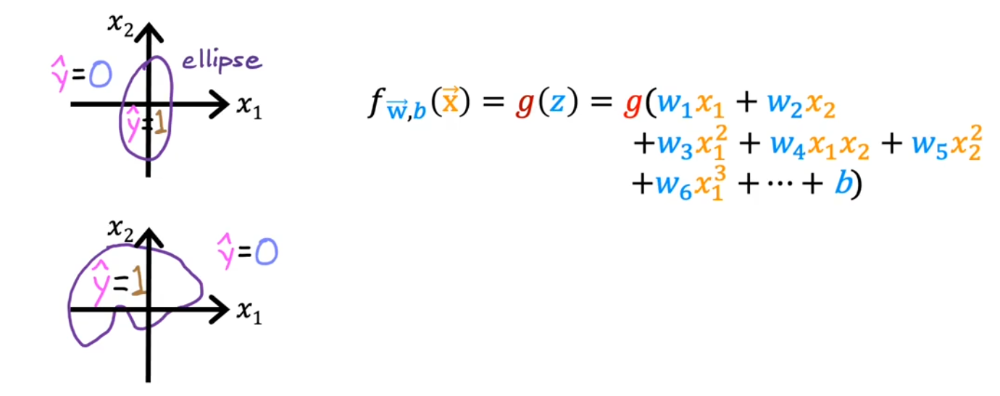

# 逻辑回归笔记

## 一、逻辑回归的基本思路

逻辑回归（Logistic Regression）虽然名字中带有“回归”，但这是历史原因造成的。实际上，它是监督学习中的**分类算法**。

逻辑回归解决的是分类问题，这意味着它的输入可以是连续的，但输出必须是离散值，通常为 $0$ 或 $1$。在散点图中，数据的分布大致如下：

从图中可以看出，散点图连起来基本就是一条水平线。

如果使用前面的线性模型进行预测，即使构建出的模型能够勉强拟合原始数据集（例如蓝色直线：当预测值 $f_{w,b}(x) > 0.5$ 时输出 $1$，当 $f_{w,b}(x) < 0.5$ 时输出 $0$），但如果在右侧添加一个极端输入数据，模型会被严重拉偏（变为绿色直线），甚至导致原来的数据集都无法被正确分类。因此，简单的线性模型并不适合直接用于分类问题。

后来发现一个新的函数——$sigmoid(z)$，它的图像可以很好地拟合上述分类数据集。

该函数在定义域 $[-\infty, +\infty]$ 上连续，且值域位于 $(0, 1)$ 之间。更重要的是，它的函数形式简单，图像性质也非常适合我们的分类需求。

因此我们引入：
$$
g(z) = sigmoid(z) = \frac{1}{1+e^{-z}}
$$

借助 $g(z)$，将预测模型改进为：
$$
f_{\vec{w}, b}(\vec x) = g(\vec w \cdot \vec x + b)
$$
即：
$$
f_{\vec{w}, b}(\vec x) = \frac{1}{1+e^{-(\vec w \cdot \vec x + b)}}
$$

得到的 $f_{w,b}(x)$ 可以解释为：在给定 $\vec x、\vec w、b$ 的条件下，输出 $\hat{y} = 1$ 的概率。

即：
$$
f_{w,b}(x) = P\{\hat{y} = 1 \mid \vec x, \vec w, b\}
$$

由于 $y$ 的取值只能为 $0$ 或 $1$，根据预测模型 $f_{w,b}(x)$ 得到 $y=1$ 的概率，因此分类规则为：
$$
\text{if } f_{w,b}(x) \ge 0.5 \quad \Rightarrow \quad \hat{y} = 1 \\
\text{else} \quad \Rightarrow \quad \hat{y} = 0
$$

有了新的预测模型，我们的目标就是找到合适的 $(\vec{w}, b)$，使得 $f_{w,b}$ 尽可能贴合训练集。

## 二、成本函数的选择与推导

在线性模型中，我们采用误差平方和作为成本函数：
$$
J(w, b) = \frac{1}{2m}\sum_{i=1}^m [f_{w,b}(x^{(i)}) - y^{(i)}]^2
$$

当 $f_{\vec{w}, b}(\vec x)$ 为线性模型时，$J(\vec{w}, b)$ 的图像是凸函数，只有一个极值点（即最小值点），因此可以使用梯度下降找到最优参数。

但是，当 $f_{\vec{w}, b}(\vec x) = g(\vec w \cdot \vec x + b)$ 时，代入上述成本函数后，图像会变为非凸函数，存在多个极值点。若初始参数选择不当，梯度下降可能无法收敛到全局最小值。

因此，误差平方和不适合作为逻辑回归的成本函数，我们需要重新定义一个新的成本函数。

新的目标是：寻找一个新的成本函数 $J(\vec{w}, b)$，代入 $f_{\vec{w}, b}(\vec x) = g(\vec w \cdot \vec x + b)$ 后，能够顺利运行梯度下降，找到合适的 $(\vec{w}, b)$。

为此，我们先从误差平方和拆解出损失函数的概念：
$$
J(w, b) = \frac{1}{m}\sum_{i=1}^m \frac{1}{2}[f_{w,b}(x^{(i)}) - y^{(i)}]^2
$$

其中，针对单组数据 $(i)$ 的偏差称为**损失函数（Loss）**：
$$
L(f_{w,b}(x^{(i)}), y^{(i)})
$$

损失函数衡量单组数据的预测值与实际值的偏差，而成本函数则是所有数据损失度的平均值。因此，我们的目标就是找到 $(\vec{w}, b)$ 使平均损失度最小。

我们直接给出适用于逻辑回归的损失函数：
$$
L\big(f_{w,b}(x^{(i)}),\, y^{(i)}\big) = 
\begin{cases}
-\log\!\big(f_{w,b}(x^{(i)})\big), & \text{if } y^{(i)} = 1, \\[6pt]
-\log\!\big(1 - f_{w,b}(x^{(i)})\big), & \text{if } y^{(i)} = 0.
\end{cases}
$$

下面来分析一下为什么这个函数可以作为损失函数。

- 当 $y^{(i)} = 1$ 时，采用这个损失函数可得到 $L$ 关于 $f$ 的函数图像：

已知 $y^{(i)} = 1$ 的情况下，当 $f_{\vec{w}, b}(\vec x)$ 得到的值越接近 $1$，说明模型越贴合这组数据，损失度 $L$ 理应越小，该函数可以做到；当 $f_{\vec{w}, b}(\vec x)$ 越接近 $0$，说明模型越不贴合这组数据，损失度 $L$ 理应越大，该函数也可以做到。

- 当 $y^{(i)} = 0$ 时，采用这个损失函数可得到 $L$ 关于 $f$ 的函数图像：

已知 $y^{(i)} = 0$ 的情况下，当 $f_{\vec{w}, b}(\vec x)$ 越接近 $0$，说明模型越贴合这组数据，损失度 $L$ 理应越小，该函数可以做到；当 $f_{\vec{w}, b}(\vec x)$ 越接近 $1$，说明模型越不贴合这组数据，损失度 $L$ 理应越大，该函数也可以做到。

综上，这个损失函数确实可以反映某组数据使用当前预测模型得到的预测值与实际值之间的偏差。

上述分段损失函数可以合并为更简洁的形式：
$$
L\big(f_{w,b}(x^{(i)}),\, y^{(i)}\big) = 
- y^{(i)} \log\!\big(f_{w,b}(x^{(i)})\big) 
- (1 - y^{(i)}) \log\!\big(1 - f_{w,b}(x^{(i)})\big)
$$

由上述损失函数构成的成本函数为：
$$
J(w, b) = \frac{1}{m}\sum_{i=1}^m L(f_{w,b}(x^{(i)}), y^{(i)}) \\
= -\frac{1}{m}\sum_{i=1}^m \left[ y^{(i)} \log\!\big(f_{w,b}(x^{(i)})\big) 
+ (1 - y^{(i)}) \log\!\big(1 - f_{w,b}(x^{(i)})\big) \right]
$$

为了判断该成本函数是否适合梯度下降，我们需要分析其导数。

首先求 $sigmoid$ 函数的导数：
$$
令\ y = sigmoid(x) = \frac{1}{1+e^{-x}}
$$
则：
$$
y' = \frac{e^{-x}}{(1+e^{-x})^2} = \frac{1}{1+e^{-x}} \cdot \frac{1 + e^{-x} - 1}{1+e^{-x}} \\
= \frac{1}{1+e^{-x}} \cdot \left(1 - \frac{1}{1+e^{-x}}\right) \\
= y(1 - y)
$$

可见 $sigmoid$ 函数的导数形式非常简洁。

设：
$$
g(z) = sigmoid(z) \\
令\ h = \vec{w}\cdot\vec{x} + b \\
令\ f = g(h)
$$
则：
$$
\frac{\partial f}{\partial w_j} = f(1-f)x_j,\quad \frac{\partial f}{\partial b} = f(1-f)
$$

对成本函数求偏导：
$$
\frac{\partial J}{\partial w_j} 
= -\frac{1}{m}\sum_{i=1}^m \left[ y^{(i)}\cdot\frac{1}{f}\cdot\frac{\partial f}{\partial w_j} - (1-y^{(i)})\cdot\frac{1}{1-f}\cdot\frac{\partial f}{\partial w_j} \right] \\
= -\frac{1}{m}\sum_{i=1}^m \left[ \frac{y^{(i)}}{f}\cdot\frac{\partial f}{\partial w_j} - \frac{1-y^{(i)}}{1-f}\cdot\frac{\partial f}{\partial w_j} \right] \\
= -\frac{1}{m}\sum_{i=1}^m \left[ \frac{\partial f}{\partial w_j}\cdot\frac{(1-f)y^{(i)} - (1-y^{(i)})f}{f\cdot(1-f)} \right] \\
= -\frac{1}{m}\sum_{i=1}^m \left[ \frac{\partial f}{\partial w_j}\cdot\frac{y^{(i)} - f}{f\cdot(1-f)} \right] \\
= -\frac{1}{m}\sum_{i=1}^m \left[ x^{(i)}_j \cdot f(1-f) \cdot \frac{y^{(i)} - f}{f\cdot(1-f)} \right] \\
= \frac{1}{m}\sum_{i=1}^m x^{(i)}_j \cdot [f - y^{(i)}]
$$

同理：
$$
\frac{\partial J}{\partial b} 
= -\frac{1}{m}\sum_{i=1}^m \left[ y^{(i)}\cdot\frac{1}{f}\cdot\frac{\partial f}{\partial b} - (1-y^{(i)})\cdot\frac{1}{1-f}\cdot\frac{\partial f}{\partial b} \right] \\
= -\frac{1}{m}\sum_{i=1}^m \left[ \frac{\partial f}{\partial b}\cdot\frac{y^{(i)} - f}{f\cdot(1-f)} \right] \\
= \frac{1}{m}\sum_{i=1}^m [f - y^{(i)}]
$$

最终得到：
$$
\frac{\partial J(\vec{w}, b)}{\partial w_j} = \frac{1}{m}\sum_{i=1}^m x^{(i)}_j \cdot [f_{\vec{w},b}(\vec{x}) - y^{(i)}] \\
\frac{\partial J(\vec{w}, b)}{\partial b} = \frac{1}{m}\sum_{i=1}^m [f_{\vec{w},b}(\vec{x}) - y^{(i)}]
$$

可以发现，该导数形式与线性模型的成本函数导数形式基本一致，只是 $f_{\vec{w},b}(\vec{x})$ 的定义不同。逻辑回归中的 $f$ 外层是 $sigmoid$ 函数，而 $sigmoid$ 是**单调递增**函数，不会影响内部函数的凸性。由于逻辑回归的 $f_{\vec{w},b}(\vec{x})$ 内层结构与线性模型相同，且成本函数公式形式一致，因此逻辑回归的成本函数图像也是凸的，可以使用梯度下降找到使 $J(\vec{w}, b)$ 最小的 $(\vec{w}, b)$。

## 三、决策边界

因为预测模型为：
$$
f_{\vec{w},b}(\vec{x}) = sigmoid(z(\vec{x}))
$$

最外层是 $sigmoid$ 函数，当 $z < 0$ 时输出小于 $0.5$，预测为 $0$；当 $z > 0$ 时输出大于 $0.5$，预测为 $1$。

因此在得到参数 $(\vec{w}, b)$ 后，只需关注内层函数 $z(\vec{x})$ 的正负即可。令 $z(\vec{x}) = 0$，即可在坐标轴上画出**决策边界**，例如：
- $w_1x_1 + w_2x_2 + b = 0$
- $w_1x_1^2 + w_2x_2^2 + b = 0$

利用特征工程，还可以构造出更复杂的决策边界。

---

### 逻辑回归

逻辑回归（logical regression）虽然叫回归，但这是历史原因。其实它是监督学习中**分类算法**。

逻辑回归属于分类问题，这意味着它的输入可以是连续的，但是输出得是 $0$ 或 $1$ 的离散值。这在散点图中的表现可能就像下面这样

散点图连起来基本就是一条水平线。

使用前面的线性模型来预测的话，即使构建出来的模型能够勉强拟合原来的数据集（比如蓝色的那条线：如果预测值 $f_{w,b}(x)$ 大于 $0.5$ 则输出为 $1$，预测值 $f_{w,b}(x)$ 小于 $0.5$ 则输出为 $0$）但如果在右边添加一个极端一点的输入数据，它就会极大的改变预测出来的模型（也就是那条绿线），这个新预测的模型甚至连原来的数据集都无法正确预测。

因此，简单的线性模型并不能用来很好的应用于分类问题。

后来发现一个新的函数：$sigmoid(z)$ 函数的图像可以很好的拟合上面这种数据集。

这个函数不仅在定义域 $[-\infty, +\infty]$ 区间上连续的，而且值域就在 $(0, 1)$ 之间。最重要的是它的函数性质很简单，图像性质也非常拟合我们给出的数据。

因此我们引入
$$
g(z) = sigmoid(z) = \frac{1}{1+e^{-z}}
$$
借助 $g(z)$，改进预测模型为：$f_{\vec{w}, b}(\vec x) = g(\vec w \cdot \vec x + b)$

即，
$$
f_{\vec{w}, b}(\vec x) = g(\vec w \cdot \vec x + b) \\
=\frac{1}{1+e^{-(\vec w \cdot \vec x + b)}}
$$
得出的 $f_{w,b}(x)$ 可解释为最终输出 $\hat{y}$ 为 $1$ 的概率（在给定 $\vec x，\vec w，b$ 的条件下 ）

即 $f_{w,b}(x) = P\left \{ \hat{y} = 1 \mid \vec x，\vec w，b \right \} $

由于 $y$ 的的取值只能为 0 或 1。现根据预测模型  $f_{w,b}(x)$ 得出 $ y = 1$ 的概率，故令
$$
if (f_{w,b}(x)\ge0.5) \ \ \ \ \hat{y} = 1 \\
else \ \ \ \ \ \ \ \ \ \ \ \ \ \ \ \ \ \ \ \ \ \ \ \ \ \hat{y} = 0
$$
现在有了新的预测模型，那么新的目标就是找到合适$(\vec{w}, b)$ 能让 $f_{w,b}$ 尽可能的贴合给出的训练集。

前面线性模型采用误差平方和作为成本函数，即令 $J(w, b) = \frac{1}{2m}\sum_{i=1}^m[f_{w,b}(x^{(i)}) - y^{(i)}]^2$

当 $f_{\vec{w}, b}(\vec x)$ 为线性模型时，$J(\vec{w}, b)$ 的图像如下，可以发现它只有一个极值点，这个极值点就是最小值点。使用梯度下降就可以得到合适的$(\vec{w}, b)$ 让成本函数达到最小值

当 $f_{\vec{w}, b}(\vec x) = g(\vec w \cdot \vec x + b)$ 时再代入 $J(\vec{w}, b)$ 得到的图像如下，可以发现它有多个极值点，$(\vec{w}, b)$ 初值选择不对的话使用梯度下降得到的 $(\vec{w}, b)$ 并不一定能让 $J(\vec{w}, b)$ 取得最小值。可见用误差平方和作为成本函数并不适合运行梯度下降。$f_{\vec{w}, b}(\vec x)$ 时我们预测的模型，$(\vec{w}, b)$ 是我们选的参数，这些都是不好改变的。为了能运行梯度下降我们需要重新寻找新的方式来评估预测模型与实际数据的偏差值，也就是重新定义一个新的成本函数，让我们能够在这个新的成本函数上面运行梯度下降。

那么现在新的目标就是：寻找一个新的成本函数 $J(\vec{w}, b)$ ，代入我们预测的模型 $f_{\vec{w}, b}(\vec x) = g(\vec w \cdot \vec x + b)$ 后能够运行梯度下降找到合适的  $(\vec{w}, b)$ 让 $f_{\vec{w}, b}(\vec x)$ 更贴合给出的训练集。

为了找到这个成本函数，需要对原来的误差平方和进行拆解研究，并提出新的概念
$$
J(w, b) = \frac{1}{m}\sum_{i=1}^m\frac{1}{2}[f_{w,b}(x^{(i)}) - y^{(i)}]^2
$$
我们后面对单组数据 $(i)$ 的处理称为损失函数（$Loss$），即 $L(f_{w,b}(x^{(i)}), y^{(i)})$

损失函数的目的是求出单组数据的预测值与其实际值的偏差，将这个偏差称为单组数据的损失度

而成本函数就是计算整个整个数据集的损失但，然后求平均的损失度

那么我们目的自然就是找出合适  $(\vec{w}, b)$ 让平均损失度最小

现在我们已知的成本函数只是对所有数据损失度的集中处理

原先我们是关注整体数据的偏差值，现在可以聚焦于单组数据的偏差值

我们要找到一个损失函数不仅能合理描述单组数据的偏差值，最重要的是能让成本函数适合运行梯度下降

时刻记住：损失函数是为了描述 
应用了当前  $(\vec{w}, b)$ 的预测模型 $f_{\vec{w}, b}(\vec x)$ 
作用在第 $i$ 组数据上得出的预测值 $\hat{y^{i}}$ 
与实际值 $y^{(i)}$ 之间的偏差

真要去研究找出那么个损失函数是不可能的，这里直接给出一个损失函数，然后来分析一下为什么它能够作为符合我们要求的损失函数。
$$
L\big(f_{w,b}(x^{(i)}),\, y^{(i)}\big) = 
\begin{cases}
-\log\!\big(f_{w,b}(x^{(i)})\big), & \text{if } y^{(i)} = 1, \\[6pt]
-\log\!\big(1 - f_{w,b}(x^{(i)})\big), & \text{if } y^{(i)} = 0.
\end{cases}
$$
下面来分析一下为什么这个函数可以作为损失函数

- 当得知  $y^{(i)} = 1$ 时，采用这个损失函数可得到 $L$ 关于 $f$ 的函数图像

已知  $y^{(i)} = 1$ 的情况下，当 $f_{\vec{w}, b}(\vec x)$ 得到的值越接近 $1$ ，说明这个 $f$ 的 $(\vec{w}, b)$ 越贴合这组数据，应适当保留这个$(\vec{w}, b)$，此时算出的损失度 $L$ 理应越小，明显这个 $L$ 关于 $f$ 的函数图像可以做到；当$f_{\vec{w}, b}(\vec x)$ 得到的值越接近 $0$ ，说明这个 $f$ 的 $(\vec{w}, b)$ 越不贴合这组数据，不应当保留这个$(\vec{w}, b)$，此时算出的损失度 $L$ 理应越小，明显这个 $L$ 关于 $f$ 的函数图像也可以做到

- 当得知  $y^{(i)} = 0$ 时，采用这个损失函数可得到 $L$ 关于 $f$ 的函数图像

已知  $y^{(i)} = 1$ 的情况下，当 $f_{\vec{w}, b}(\vec x)$ 得到的值越接近 $0$ ，说明这个 $f$ 的 $(\vec{w}, b)$ 越贴合这组数据，应适当保留这个$(\vec{w}, b)$，此时算出的损失度 $L$ 理应越小，明显这个 $L$ 关于 $f$ 的函数图像可以做到；当$f_{\vec{w}, b}(\vec x)$ 得到的值越接近 $1$ ，说明这个 $f$ 的 $(\vec{w}, b)$ 越不贴合这组数据，不应当保留这个$(\vec{w}, b)$，此时算出的损失度 $L$ 理应越小，明显这个 $L$ 关于 $f$ 的函数图像也可以做到

综上，这个损失函数确实可以反映某组数据使用当前预测模型得到的预测值与实际值之间的偏差。

其实，这个分段的损失函数还有更简洁的形式：
$$
L\big(f_{w,b}(x^{(i)}),\, y^{(i)}\big) = 
- y^{(i)} \log\!\big(f_{w,b}(x^{(i)})\big) 
- (1 - y^{(i)}) \log\!\big(1 - f_{w,b}(x^{(i)})\big).
$$
下面还要分析由这个损失函数组成的成本函数是否能够运行梯度下降。主要还是要分析成本函数的图像
$$
J(w, b) = \frac{1}{m}\sum_{i=1}^mL(f_{w,b}(x^{(i)}), y^{(i)}) \\
=-\frac{1}{m}\sum_{i=1}^m[ y^{(i)} \log\!\big(f_{w,b}(x^{(i)})\big) 
+ (1 - y^{(i)}) \log\!\big(1 - f_{w,b}(x^{(i)})\big)]
$$
我们可以根据 $J(\vec{w}, b)$ 的导数来分析它的函数图像。但是想要求它的导数，要先知道 $sigmod(x)$ 函数的导数是什么样的。
$$
令\  y = sigmoid(x) = \frac{1}{1+e^{-x}} \\
则\ y' = \frac{e^{-x}}{(1+e^{-x})^2} = \frac{1}{1+e^{-x}} \cdot (\frac{1 + e^{-x} - 1}{1+e^{-x}}) \\
=\frac{1}{1+e^{-x}} \cdot (1-\frac{1}{1+e^{-x}}) \\ 
= y (1 - y)
$$
可见 $sigmod(x)$ 函数的导数非常特殊，用上面的结论开始求 $J(\vec{w}, b)$ 的导数。
$$
g(z) = sigmoid(z) \\
令\ h = \vec{w}\cdot\vec{x} + b \\
令\ f = g(h), \\则 \frac{\partial f}{\partial w_j} = f(1-f)x_j,\frac{\partial f}{\partial b} = f(1-f) \\
$$

$$
J(w, b) =\
=-\frac{1}{m}\sum_{i=1}^m[ y^{(i)} \log\!\big(f_{w,b}(x^{(i)})\big) 
+ (1 - y^{(i)}) \log\!\big(1 - f_{w,b}(x^{(i)})\big)] \\
则 \frac{\partial J}{\partial w_j} = -\frac{1}{m}\sum_{i=1}^m[y^{(i)}\cdot\frac{1}{f}\cdot\frac{\partial f}{\partial w_j} - (1-y^{(i)})\cdot\frac{1}{1-f}\cdot\frac{\partial f}{\partial w_j}] \\
=-\frac{1}{m}\sum_{i=1}^m[\frac{y^{(i)}}{f}\cdot\frac{\partial f}{\partial w_j} - \frac{1-y^{(i)}}{1-f}\cdot\frac{\partial f}{\partial w_j}] \\
=-\frac{1}{m}\sum_{i=1}^m[\frac{\partial f}{\partial w_j}\cdot\frac{(1-f)y^{(i)}-(1-y^{(i)})f}{f\cdot(1-f)}] \\
=-\frac{1}{m}\sum_{i=1}^m[\frac{\partial f}{\partial w_j}\cdot\frac{y^{(i)}-f}{f\cdot(1-f)}] \\
= -\frac{1}{m}\sum_{i=1}^m[x^{(i)}_j\cdot f(1-f)\cdot\frac{y^{(i)}-f}{f\cdot(1-f)}] \\
= \frac{1}{m}\sum_{i=1}^mx^{(i)}_j\cdot [f-y^{(i)}] \\
同理 \frac{\partial J}{\partial b} = -\frac{1}{m}\sum_{i=1}^m[y^{(i)}\cdot\frac{1}{f}\cdot\frac{\partial f}{\partial b} - (1-y^{(i)})\cdot\frac{1}{1-f}\cdot\frac{\partial f}{\partial b}] \\
= -\frac{1}{m}\sum_{i=1}^m[\frac{\partial f}{\partial b}\cdot\frac{y^{(i)}-f}{f\cdot(1-f)}] \\
= \frac{1}{m}\sum_{i=1}^m [f-y^{(i)}]
$$

综上：
$$
\frac{\partial J(\vec{w}, b)}{\partial w_j} = \frac{1}{m}\sum_{i=1}^mx^{(i)}_j\cdot [f_{\vec{w},b}(\vec{x})-y^{(i)}] \\
\frac{\partial J(\vec{w}, b)}{\partial b} = \frac{1}{m}\sum_{i=1}^m[f_{\vec{w},b}(\vec{x})-y^{(i)}]
$$
可以发现，它的导数与线性模型基本一致。只是 $f_{\vec{w},b}(\vec{x})$ 的定义有所不同，但是逻辑回归的 $f_{\vec{w},b}(\vec{x})$ 最外层是 $sigmoid(x)$  函数，这个函数的性质从图像上看非常简单，就是**单调递增**的，这样的函数性质不会影响里层函数对整个函数造成的性质。

而 $f_{\vec{w},b}(\vec{x})$ 里层的函数和线性模型是一模一样的，所以综合来看：

逻辑回归的 $f_{\vec{w},b}(\vec{x})$ 的函数性质及图像与线性模型的预测模型的图像基本一致，

既然预测模型的函数性质几乎一样，又因为成本函数的公式又完全一样，因此可以得出它们的成本函数 $J(\vec{w}, b)$ 的图像也是一样的，都是向下凹的函数图像。

这样，逻辑回归的成本函数也可以运行梯度下降，找到令 $J(\vec{w}, b)$ 值最小的 $(\vec{w}, b)$。

#### 决策边界

因为我们的预测模型 $f_{\vec{w},b}(\vec{x}) = sigmod(z(\vec{x}))$，

最外层是 $sigmod$ 函数，这个函数只要 $z < 0$ 输出值就小于 $0.5$，结果取 $0$；只要 $z > 0$ 输出值就大于 $0.5$，结果取 $1$

那么在我们运行梯度下降后得到参数$(\vec{w}, b)$后，只需要关注里层函数 $z(\vec{x})$ 是否大于或小于 $0$ 即可。这样就可以得到方程：$z(\vec{x}) = 0$，在坐标轴上画出**决策边界**。比如 $w_1x_1 + w_2x_2 + b = 0$ 或者 $w_1x_1^2 + w_2x_2^2 + b = 0$。

甚至可以用特征工程得出更加复杂的决策边界。

