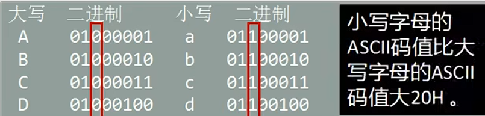

~~~assembly
assume cs:codesg, ds:datasg

datasg segment
	db "BaSiC"
	db "iNfOrMaTiOn"
datasg ends

codesg segment
start:	mov ax, datasg
		mov ds, ax ; 定义数据段地址
		
		mov bx, 0
		mov cx, 5
	s:	mov al, [bx] ; 小写转大写循环
		and al, 11011111B ; 把第3位变成0,其它位不变
		mov [bx], al
		inc bx
		loop s
		
		mov bx, 0
		mov cx, 11
	s0:	mov al, [bx] ; 大写转小写循环
		or al, 00100000B ; 把第3位变成1,其它位不变
		mov [bx], al
		inc bx
		loop s0
		
		mov ax, 4c00h
		int 21h
codesg ends
end start
~~~

简单讲述一下原理，我们知道在 **ASCII** 表中，大写字母与小写字母相差 **20H** ，体现在二进制中就是 **0010 0000** ，大写字母的二进制表示如果加上这个二进制数就是小写字母的二进制表示，这无非就是只在第 3 位数（从左往右）上加上 1，巧的是所有大写字母的第 3 位数字都是 0，所以，可以得出在 **ASCII** 表中，大写字母与小写字母的差别就是第 3 位数上 0 和 1 的区别。看下下面这张表会更清晰

在将 **小写** 转 **大写** 时，只需要保证第 **3** 位为 `0` 其它位保持不变即可，所以`and 1101 1111B`

在将 **大写** 转 **小写** 时，只需要保证第 **3** 位为 `1` 其它位保持不变即可，所以`or 0010 0000B`
