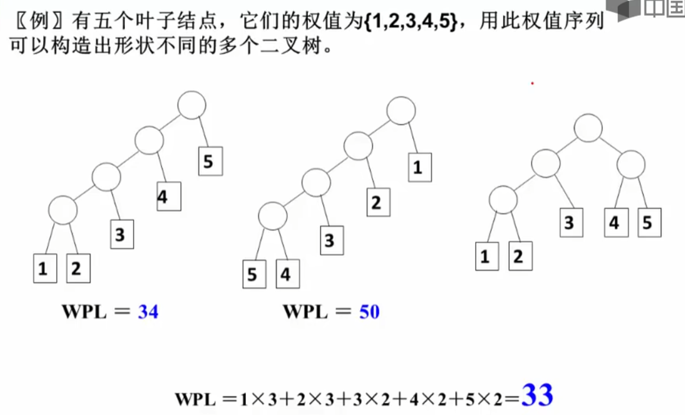
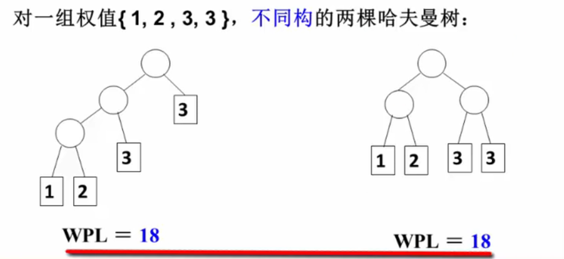
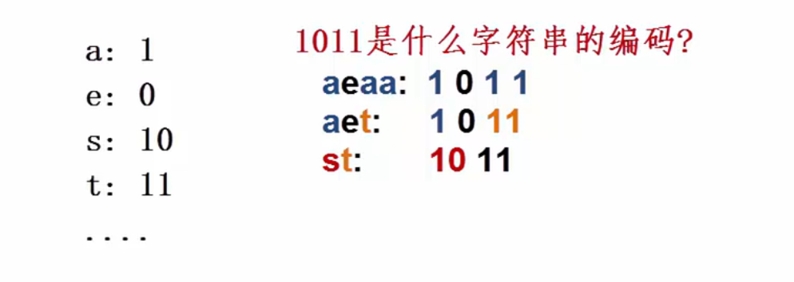
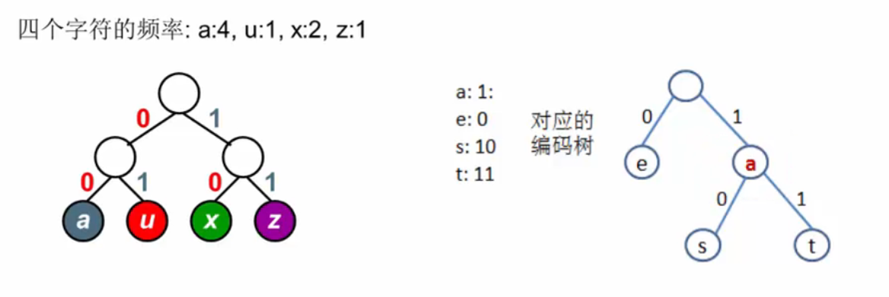
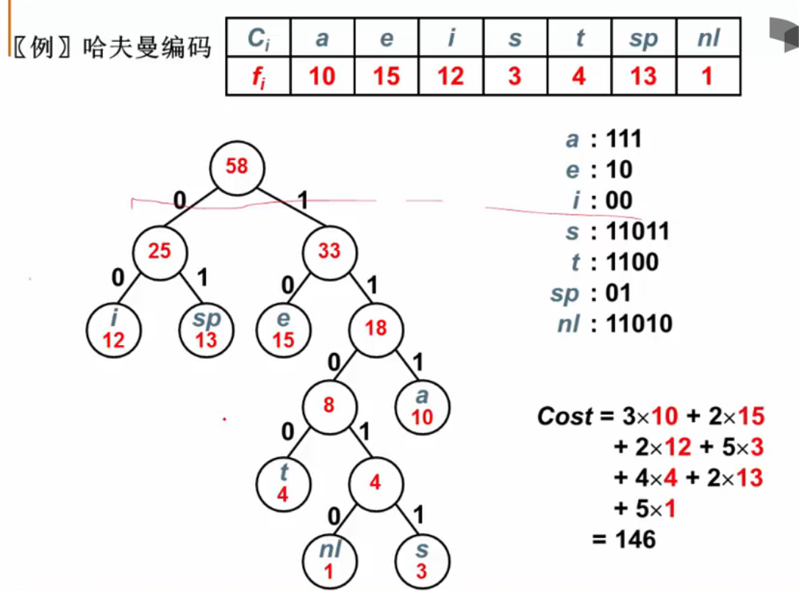

## 哈夫曼树

#### 定义

带权路径长度(WPL)：设二叉树有n个**叶结点**，每个叶结点带有权值**w~k~**,从根结点到每个叶结点的长度为**l~k~**，则每个叶结点的带权路径长度之和就是：
$$
WPL = \sum_{n=1}^n{w_kl_k}
$$
最优二叉树或**哈夫曼树**：WPL最小的二叉树

#### 哈夫曼树的构造

每次把权值最小的两棵树合并

~~~C
#include <stdio.h>
#include <stdlib.h>

typedef struct TreeNode* HuffmanTree;
struct TreeNode{
	int Weight;
	HuffmanTree Left;
	HuffmanTree Right;
};

typedef struct HeapStruct* Heap;
struct HeapStruct{
	HuffmanTree* Elements; // Elements是一个数组，元素为指向TreeNode的指针
	int Size;
	int Capacity;
};

void BuildMinHeap(Heap H); //按照权值将H中的Elements[]排成最小堆

struct TreeNode* DeleteMin(Heap H); //返回H最小结点的地址

void Insert(Heap H, HuffmanTree T);// 将指针T插入H中

HuffmanTree Huffman(Heap H)
{
	int i;
	HuffmanTree T = nullptr;
	for(i = 0; i < H->Size; i++){ //进行Size-1次处理
		T = (HuffmanTree)malloc(sizeof(struct TreeNode));
		T->Left = DeleteMin(H);
		T->Right = DeleteMin(H);
		T->Weight = T->Left->Weight + T->Right->Weight;
		Insert(H, T);// 将新生成的T塞回H里
	}
	//for循环结束后H中只剩下一个元素，即T指向的元素的地址
	
	T = DeleteMin(H); //这一步意义不大，猜测是为了清空 H
	return T;
}
~~~

#### 哈夫曼树的特点

* 没有度为1的结点
* n个叶结点的哈夫曼树共有2n-1个结点 （由==n~2~ = n~0~ - 1==得出）
* 哈夫曼树的任意非叶结点的**左右子树**交换后任是哈夫曼树
* 对同一组权值{w~1~, w~2~, ..., w~n~},**存在**不同构的两颗哈夫曼树

#### 哈夫曼编码

* 怎么进行不等长编码?
* 怎么避免二义性?
	
	

##### 二叉树用于编码

用二叉树进行编码：
1. 左右分支：0、1
2. 字符只在叶结点

当字符存在于二叉树的叶结点上时，就不会产生二义性

