##图

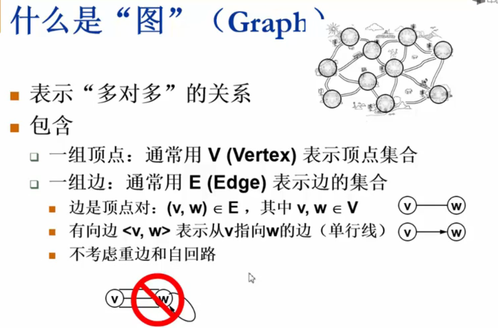

#### 抽象数据类型定义

* 类型名称：图（Graph）

* 数据对象集：G(V,E)有一个**非空**的有限顶点集合V和一个有限边集合E组成(即一个图可以没有边，但一定要有节点)

* 操作集：对于任意图 G∈Graph，以及 v∈V，e∈E 
  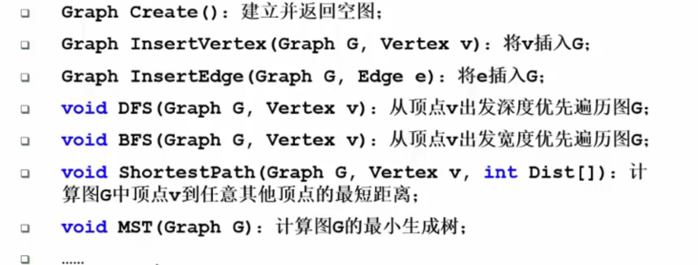
  
  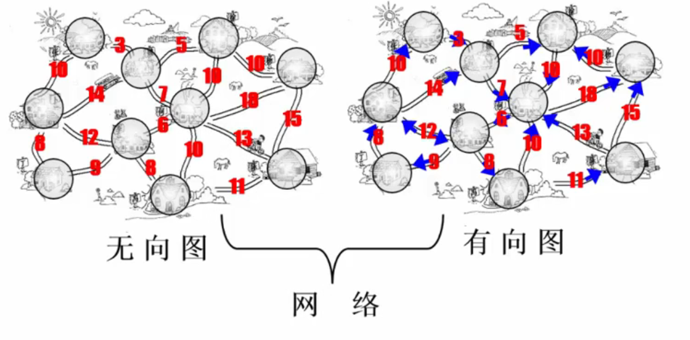
  
  无方向的图叫无向图，有方向的图叫有向图；图的边上带了权重就叫网络

#### 怎么在程序中表示一个图

######邻接矩阵表示法

邻接矩阵G[N] [N]--N个顶点从0到N-1编号
$$
G[i][j] = \begin{cases} 1,若<v_i,v_j>是G中的边 \\ 0,否则 \end{cases}
$$
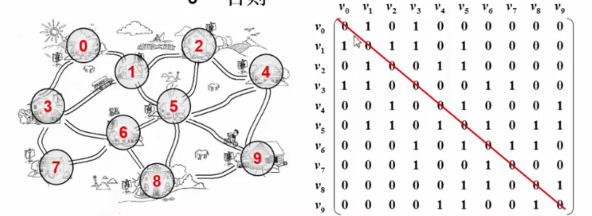

不难发现，这个矩阵的**主对角线**都为0，因为没有自回路；且这个矩阵关于对角线对称，因为是**无向图**

那么有一个问题：对于无向图的存储，怎样可以省一般空间？
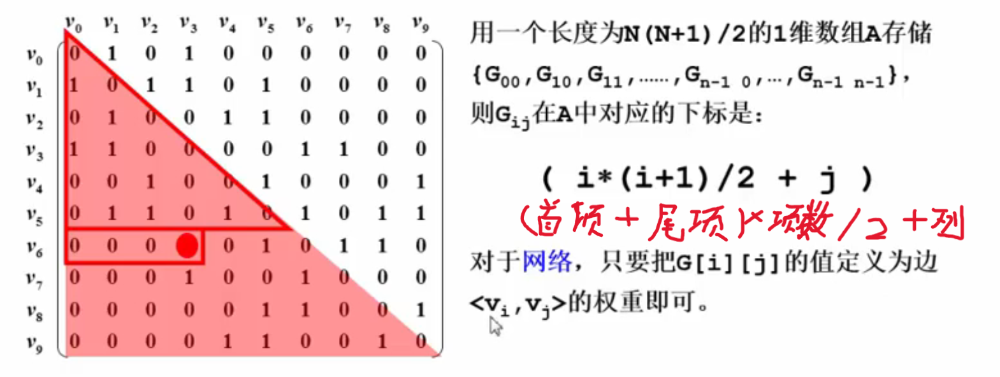

邻接矩阵 --- 有什么好处？

* 直观、简单、好理解

* 方便检查任意一对顶点是否存在边

* 方便找任一顶点的所有“邻接点”（有边直接相连的顶点）

* 方便计算任一顶点的“度”（从该点出发的边数为“出度”，指向该点的边数为“入度”）

  无向图：对应行（或列）非0元素个数

  有向图：对应行非0元素的个数是“出度”；对应列非0元素的个数是“入度”

邻接矩阵 --- 有什么不好？

* 浪费空间 --- 存稀疏图（点很多而边很少）

  对稠密图（特别是完全图）还是很合算的

* 浪费空间 --- 统计稀疏图中一共有多少条边

##### 邻接表表示法

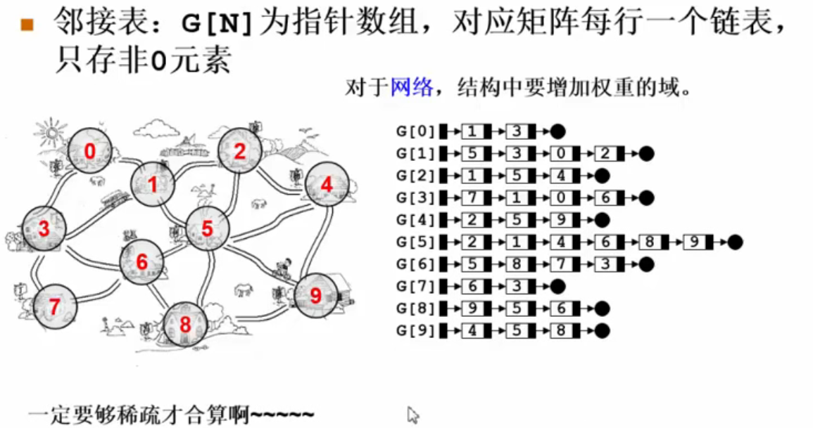

---

#### 图的遍历

#####深度优先搜索（Depth First  Search, DFS）

若有N个顶点、E条边，时间复杂度是
*   用邻接表存储图，有 O(N + E)
*   用邻接矩阵存储图，有 O( N^2^ )

###### 广度优先搜索（Breadth First Search, BFS）

类似于树的层序遍历，采用队列进行遍历

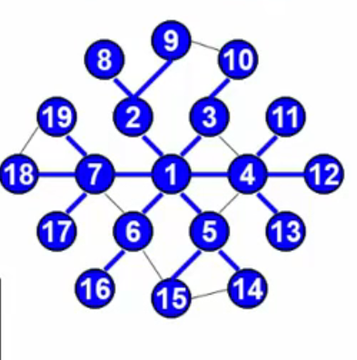

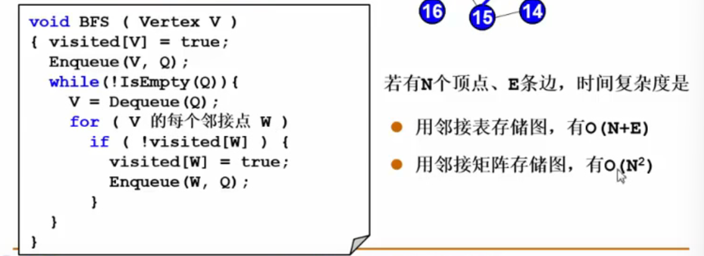

###### 图不连通怎么办

无向图：

**连通**：如果从V到W存在一条（无向）路径，则称V和W是连通的
**路径**：V和W的路径是一系列顶点{V，v~1~，v~2~，...，v~n~，W}的集合，其中任一对顶点间都要途中的边。**路径长度**是路径中的边数（如果带权，则是所有边的的权重和）。如果V到W之间的所有项都不同，则称**简单路径**
<u> 如果有两个顶点相同，则就是不简单路径，也就是回路</u>
**回路**：起点等于终点的路径
**连通图**：图中任意两顶点均连通
对于不连通的图，我们仍然可以考虑不连通的子图,即：
**连通分量**：**无向图**的==极大==连通子图

 * 极大顶点数：再加1个顶点就不连通
 * 极大顶点数：包含图中所有顶点相连的所有边

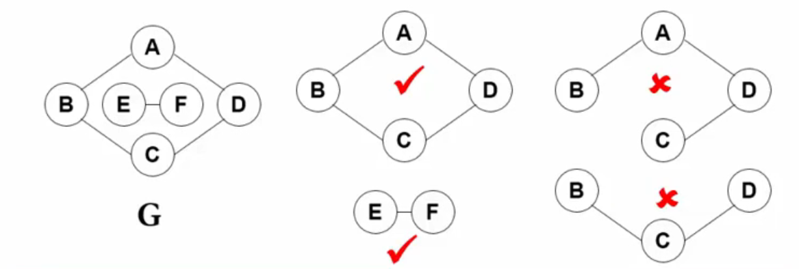

有向图：

**强连通**：==有向图==中任意顶点V和W（V和W可以互相走向对方）之间存在双向路径，则称 ==V和W是强连通的==
**强连通图**：有向图中任意两顶点均强连通
**弱连通图**：<u>将有向图的所有的有向边替换为无向边</u>，所得到图称为为原图的**基图**，如果基图是连通图，那么原图就是若连通图
**强连通分量**：有向图的极大强连通子图
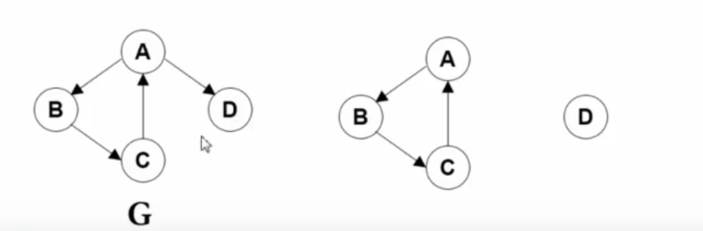

---

DFS与BFS两个遍历算法==只能遍历连通图==，不能遍历不连通图
但是，可以将不连通图的每一个连通分量都看成是一个单位连通图，于是有了以下新的算法

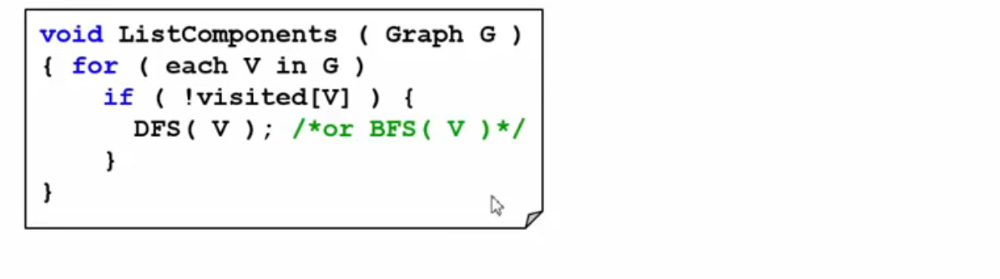

---

#### 图的建立

###### 邻接矩阵

~~~C
typedef struct GraphStruct* PtrToGraph;
struct GraphStruct{
	int Nv; //顶点数
	int Ne; //边数
	DataType Data[MaxVertexNumber]; //存放顶点数据
	WeightType G[MaxVertexNumber][MaxVertexNumber];
};
typedef PtrToGraph MGraph;
~~~

初始化一个图

~~~C
typedef int Vertex;
MGraph GraphCreate(int VertexNum) //初始化一个有顶点但没有边的图
{
	Vertex V, W;
	MGraph Graph;
	
	Graph = (MGraph)malloc(sizeof(struct GraphStruct));
	Graph->Nv = VertexNum;
	Graph->Ne = 0;
	
	for(V = 0; V < Graph->Nv; V++){
		for(W = 0; W < Graph->Nv; W++){
			Graph->G[V][W] = 0;
		}
	}
	
	return Graph;
}
~~~

插入边

~~~C
typedef struct ENode* PtrToENode;
struct ENode{
	Vertex V1, V2; //有向边<V1, V2>
	WeightType Weight;
};
typedef PtrToENode Edge;

void InsertEdge(MGraph Graph, Edge E)
{
	Graph->G[E->V1][E->V2] = E->Weight; //插入边<V1, V2>
	
	Graph->G[E->V2][E->V1] = E->Weight; //若是无向图,还要插入边<V2, V1>
}
~~~

整体构建

~~~C
MGraph BuildGraph()
{
	int i;
	Edge E;
	Vertex V;
	
	int Nv;
	scanf("%d", &Nv);
	MGraph Graph = GraphCreate(Nv);
	scanf("%d", &Graph->Ne);
	
	if(Graph->Ne){
		E = (Edge)malloc(sizeof(struct ENode));
		for(i = 0; i < Graph->Ne; i++){
			scanf("%d%d%d",
					&E->V1, &E->V2, &E->Weight);
			InsertEdge(Graph, E);
		}
	}
	//如果顶点有数据
	for(V = 0; V < Graph->Nv; V++){
		scanf("%d", &Graph->Data[V]);
	}
	
	return Graph;
}
~~~
简化版(考试用)
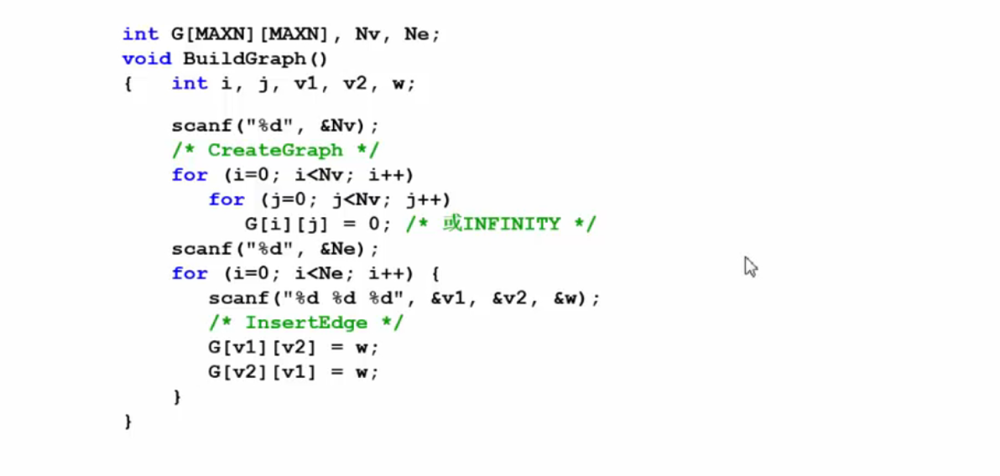

###### 邻接表

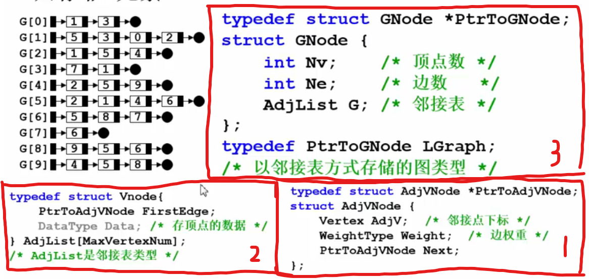

~~~C
typedef struct AdjVNode* PtrToAdjVNode;
struct AdjVNode{
	Vertex AdjV; //邻接表下标
	WeightType Weight; //边权重
	PtrToAdjVNode Next;
};

typedef struct VNode{
	PtrToAdjVNode FirstEdge;
	DataType Data; //存放顶点数据
}AdjList[MaxVertexNumber]; //AdjList是邻接表类型

typedef struct LGraphStruct* LGraph;
struct LGraphStruct{
	int Nv; //顶点数
	int Ne; //边数
	AdjList G; //邻接表
};
~~~

初始化一个有VertexNum个顶点但没有边的图

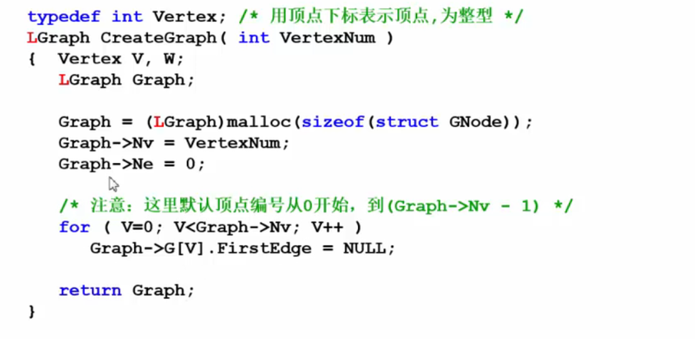

向LGraph中插入边

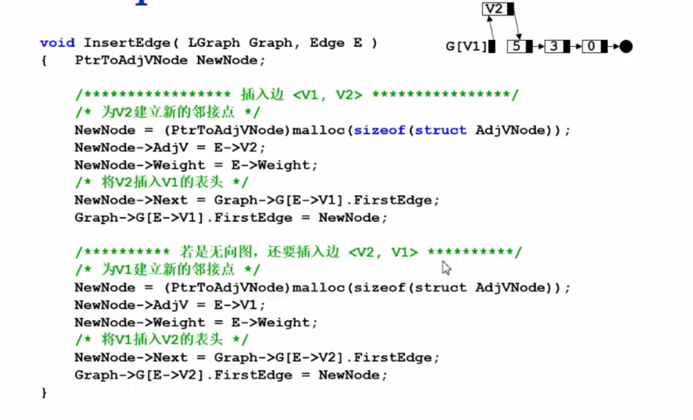
