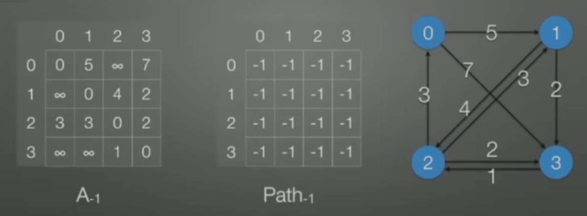
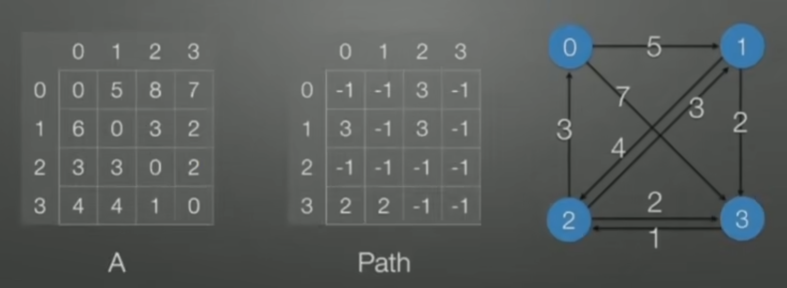

# 图论算法

---
## Dijkstra

#### 前引

* 令S = {源点s + 已经确定了最短路径的顶点v~i~}

* 对任一未收录的顶点v，定义dist[v]为s到v的最短路径长度，但该路<u>径仅经过S中的顶点</u>。即路径{s -> (v~i~∈S) -> v}的最小长度

* 若路径是按照递增（非递减）的顺序生成的，则

  * 真正的最短路径必须经过S中的顶点
  * 每次从未收录的顶点中选一个dist最小的的收录（==贪心==）
  * 增加一个v进入S，可能影响另一个w的dist值！
    * <u>dist[w] = min{dist[w], dist[v] + <v, w>的权重}</u>
#### 代码示例
~~~C
void Dijkstra(Vertex s)
{ //除了dist[s]=0外，其它的dist[V]=Infinity
    while (1) {
        V = 未收录顶点中dist最小者;
        if (这样的V不存在)
            break;
        collected[V] = true;
        // 先收录再更新
        for (V 的每个邻接点 W) {
            if (collected[W] == false) { 
           //已经收录的结点不用比较了，因为已经收录的节点路径肯定比下面要比较的小
                if (dist[V] + E<v, w> < dist[W]) {
                    dist[W] = dist[V] + E<v, w>; //dist数组表示节点V距离源点s的最短路径
                    path[W] = [V]; //path数组表示节点W的上一个节点
                }
            }
        }
    }
}
~~~

---

## Floyd

#### 前引

* D^k^[ i ] [ j ]  =  路径 {i -> {l <= k} -> j} 的最小长度
* D^0^,D^1^, ..., D^|v|-1^[ i ] [ j ]即给出了i到j的真正最短距离
* 最初的D^-1^,给两个顶点有直接边相连的D[i] [j]赋权值，没有直接边相连的赋 INF
* 当D^k-1^已经完成，递推到D^k^时：
  * 或者k ∉ 最短路径}{ i -> {i <= k} ->j },则D^k^ = D^k-1^
  * 或者k ∈ 最短路径{ i -> {i <= k} ->j },则该路径必定有两端最短路径组成：D^k^[i] [j] = D^k-1^[i] [k] + D^k-1^[k] [j] 

#### 代码示例
~~~C
 void Floyd()
 {
     for (i = 0; i < N; i++)
         for (j = 0; j < N; j++) {
             D[i][j] = G[i][j]; //D[i][j]初始化为它的邻接矩阵
             P[i][j] = -1; //P数组表示i，j之间的路径，用-1表示此时i，j之间没有路径
         }
     for (k = 0; k < N; k++)
         for (i = 0; i < N; i++)
             for (j = 0; j < N; j++)
                 if (k != i && k != j && i != j) //i，j，k有相等情况就不用管
                     if (D[i][k] + D[k][j] < D[i][j]) {
                    	D[i][j] = D[i][k] + D[k][j];
                         P[i][j]  = k; //k为i，j之间的中间节点
                     }
 }
~~~

初始状态

最终状态

