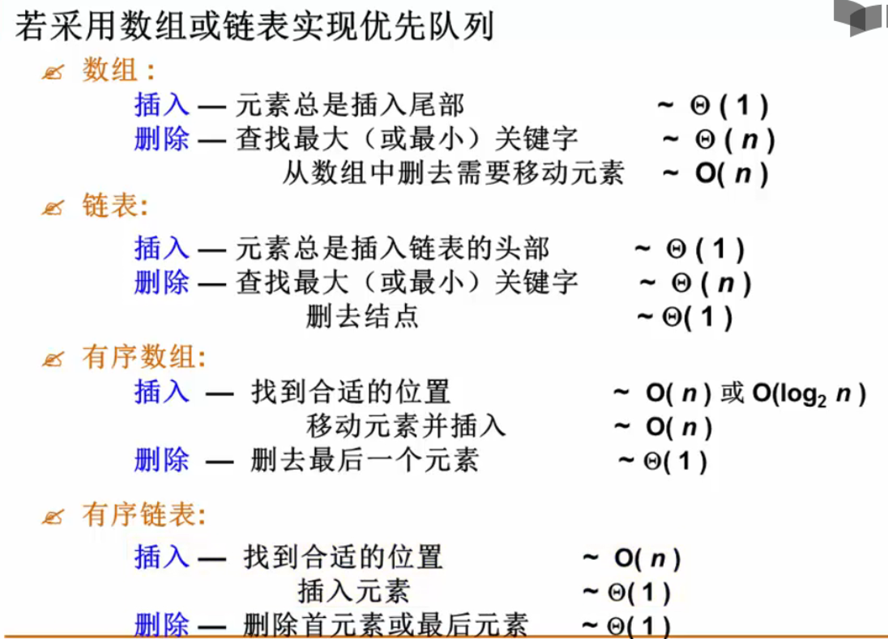
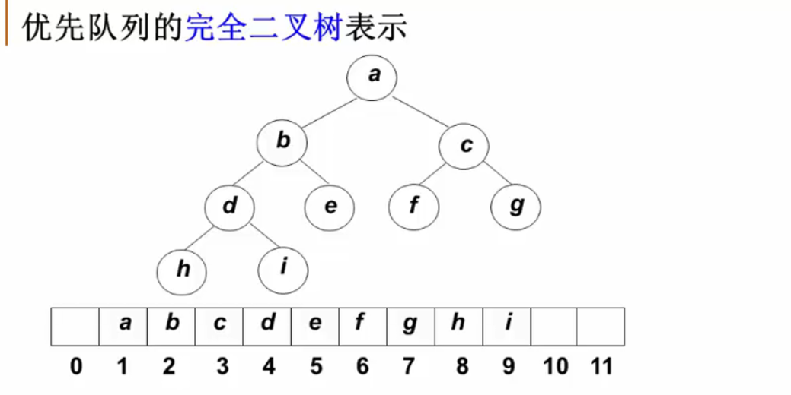
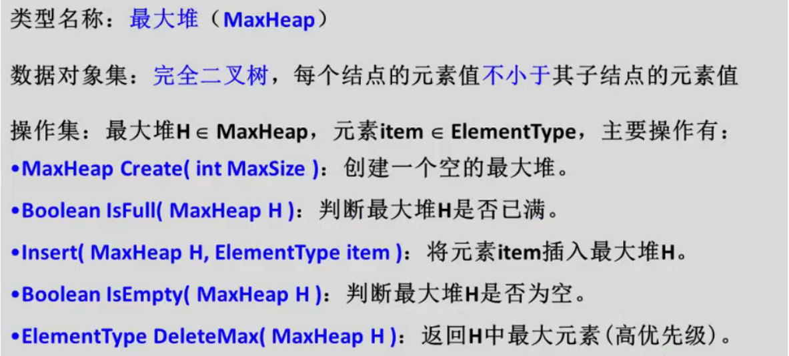

## 堆

#### 什么是堆

* 优先队列(Priority Queue):特殊的“队列”,取出元素的顺序是依照元素的优先权（关键字）大小，而不是元素进入队列的先后顺序

堆的两个特性：

* 结构性：用数组表示的完全二叉树；
* 有序性：任一结点的根结点是其子树所有结点的最大值（或最小值）
* “最大堆（MaxHeap）”，也称“大顶堆”：最大值
* “最小堆（MinHeap）”，也称“小顶堆”：最小值
####堆的抽象数据类型描述

最大堆的创建

~~~C
typedef struct HeapStruct* MaxHeap
struct HeapStruct{
    ElementType* Elements;//存储堆元素的数组
    int Size;//堆的当前元素个数
    int Capacity;//堆的最大容量
};

MaxHeap Create(int MaxSize)
{
    MaxHeap H = malloc(sizeof(struct HeapStruct));
    H->Elements = malloc((MaxSize+1) * sizeof(ElementType))//0号元素做哨兵，1—MaxSize号元素才有作用
    H->Size = 0;
    H->Capacity = MaxSize;
    H->Elements[0] = MaxData;//定义哨兵为大于堆中所有可能元素的值，便于以后更快操作
    return H;
}
~~~

堆的插入

~~~C
// 先插入数组末尾，然后一路上升
void Insert(MaxHeap H, ElementType item)//从下往上操作
{
    int i;
    H->Elements[0] = item;//定义哨兵
    if(isFull(H)){
		printf("最大堆已满");
        return;
    }
    for(i = ++H->Size; item > H->Elements[i / 2]; i /= 2){
		H->Elements[i] = H->Elements[i / 2];
    }
    H->Elements[i] = item;
}
~~~

堆的删除

~~~c
// 拿数组最后一个元素顶替被删除元素，然后一路下降
ElementType Delete(MaxHeap H)//将最后一个元素拷贝，从上往下查找该元素能待的位置
{
    int Parent, Child;
    ElementType Maxitem, temp;
    Maxitem = H->Elements[1];
    temp = H->Elements[H->Size--];
    for(Parent = 1;Parent * 2 <= H->Size;Parent = Child){
        Child = Parent * 2;
        if(Child < H->Size && H->Elements[Child] < H->Elements[Child + 1])
            Child++;
        if(temp > Elements[Child])	break;
        Elements[Parent] = Elements[Child];
    }
    Elements[Parent] = temp;
    return Maxitem;
}
~~~

堆的建立

~~~C
void PerDown(Heap H, int Index)
{
	int Parent, Child;
	int item = H->Data[Index];
	for(Parent = Index; Parent * 2 <= H->Size; Parent = Child){
		Child = Parent * 2;
		if(Child < H->Size && H->Data[Child] < H->Data[Child + 1])
			Child++;
		if(item > H->Data[Child])	break;
		else
			H->Data[Parent] = H->Data[Child];
	}
	H->Data[Parent] = item;
}

void BuildHeap(Heap H)
{
	int i;
	for(i = H->Size / 2; i > 0; i--){
		PerDown(H, i);
	}
}
~~~

