## 树

---

#### 基本术语
1. 结点的度(Degree)：结点的子树个数
2. 树的度：树的所有结点中最大的度数
3. 叶结点(Leaf)：度为0的结点
4. 父结点(Parent)：有子树的结点是其子树根结点的父结点
5. 子结点(Child)
6. 兄弟结点(Sibling)
7. 路径和路径长度：从结点n~1~到n~k~的路径为一个结点序列n~1~，n~2~，... ，n~k~， n~i~是n~i+1~的父结点。路径所包含的==个数==为路径的长度
8. 祖先结点(Ancestor)
9. 子孙结点(Descendant)
10. 结点的层次(Level)：规定根结点在1层，其它任一结点的层数是其父结点的层数加1
11. 树的深度(Depth)：规定根结点的深度为0，树中所有结点中最大层次是这棵树的深度，深度的单位为1条路径长度
12. 树的高度(Height)：规定最低叶结点的高度为0，高度的单位为1条路径长度
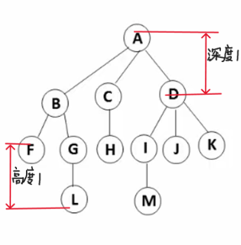

#### 树的实现

儿子-兄弟表示法

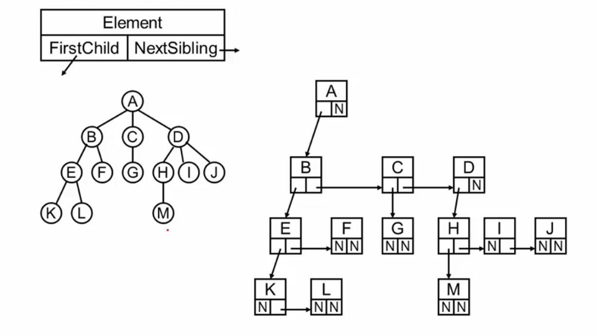

#### 特殊二叉树

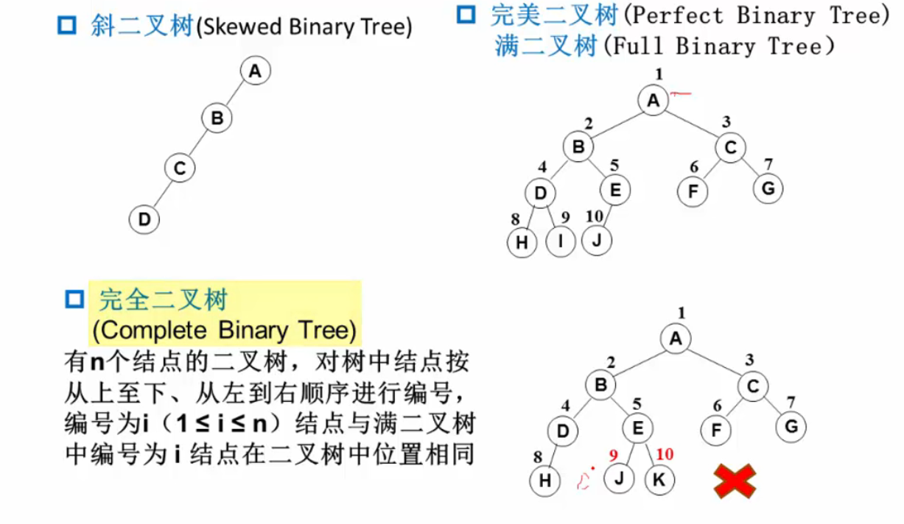

#### 二叉树的几个重要性质

* 一个二叉树第 *i* 层的最大结点数为：2^i-1^, i >= 1
* 深度为 *k* 的二叉树有最大结点总数：2^k^-1, k >= 1    2^0^ + 2^1^ + 2^2^ + ... + 2^k-1^ = 2^k^ - 1 
* 对任何非空二叉树T，若n~0~表示叶结点的个数、n~2~是度为2的非叶结点个数，那么两者满足关系n~0~ = n~2~ + 1   由路径（边）的个数为 n~0~ + n~1~ + n~2~ - 1 = 2n~2~ + n~1~ 得出 

#### 二叉树的抽象数据类型定义

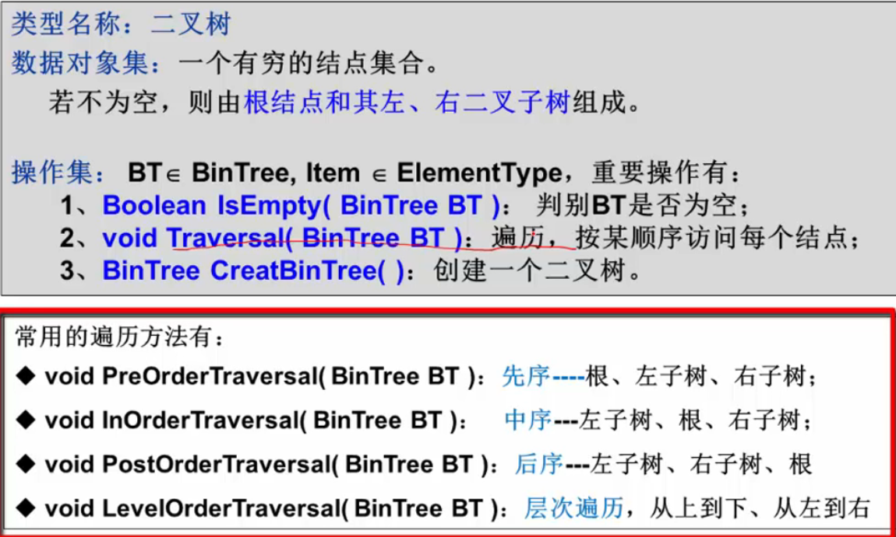

#### 二叉树的存储结构

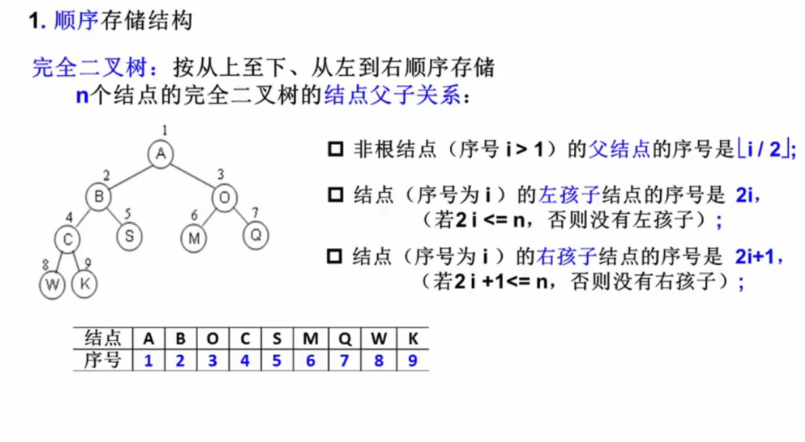

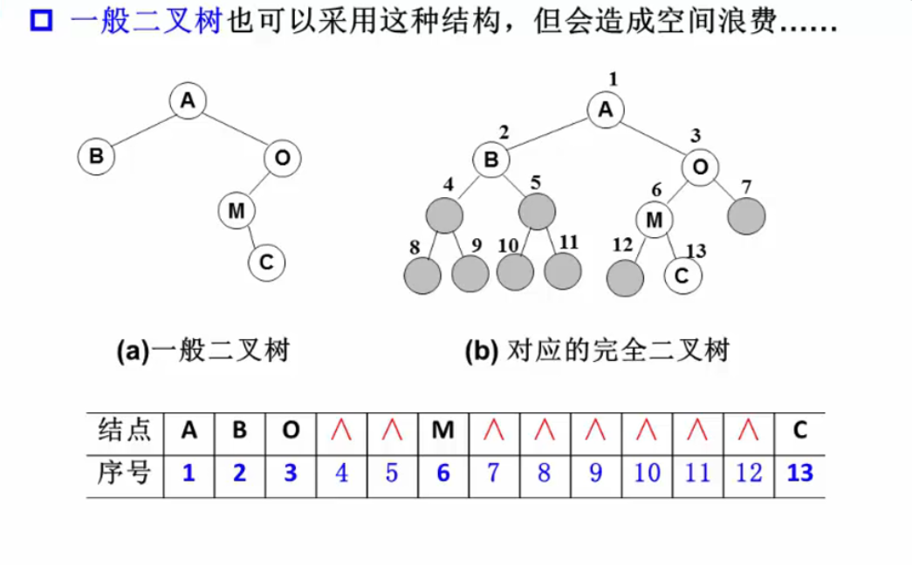

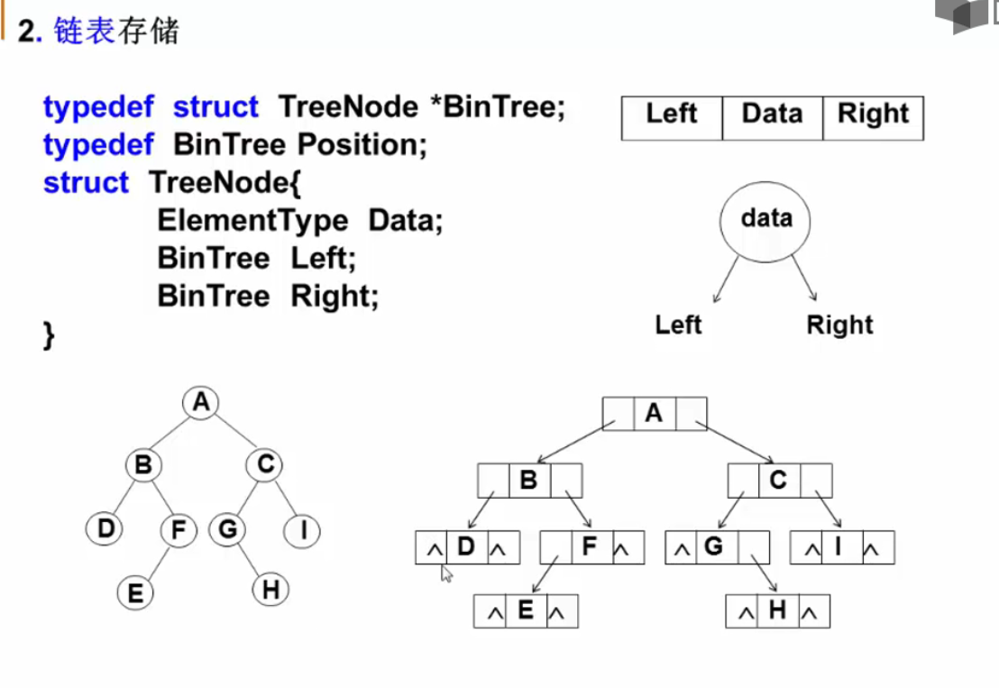

~~~ C
typedef struct TreeNode* BinTree;
typedef BinTree Position;
struct TreeNode{
    ElementType Data;
    BinTree Left;
    BinTree Right;
};
~~~

#### 二叉树的遍历

先序遍历

遍历过程为：
1. 访问根结点；
2. 先序遍历其左子树；
3. 先序遍历其右子树
4. 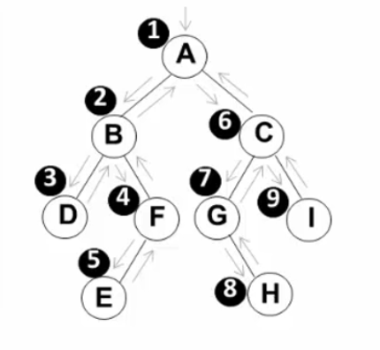

代码示例：
~~~ C
void PreOrderTraversal(BinTree BT)
{
    if(BT){
        printf("%d", BT->Data);
        PostOrderTraversal(BT->Left);
        PostOrderTraversal(BT->Right);
    }
}
~~~

中序遍历
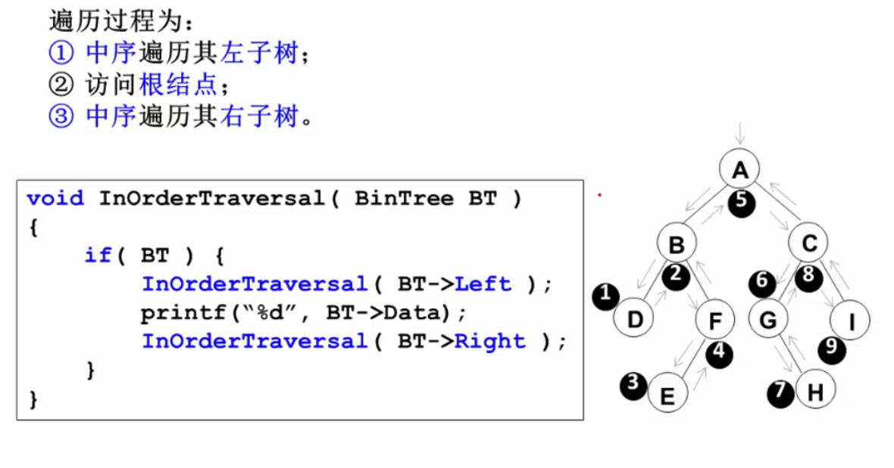

后序遍历
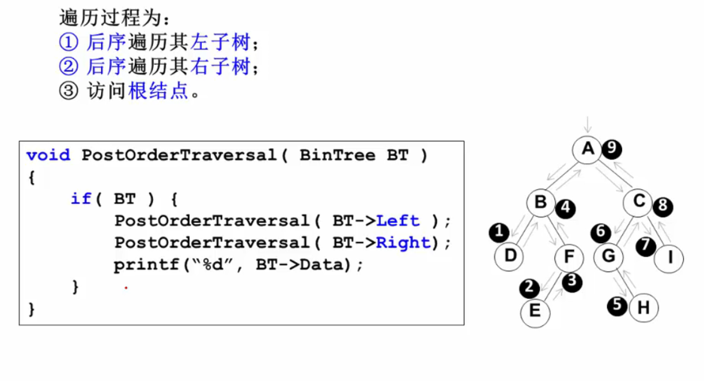

#### 中序遍历非递归遍历算法

基本思路：使用==栈==

* 遇到一个结点，就把它压栈，并去遍历它的左子树
* 当左子树遍历结束后，从栈顶弹出这个结点并访问它；
* 然后按其右指针再去中序遍历该结点的右子树

代码示例：
~~~ C
void InOrderTraversal(BinTree BT)
{
	BinTree T = BT;
    Stack S = CreateStack(MaxSize);
    while(T || !IsEmpty(S)){  //当T = NULL时开始处理栈顶元素
		while(T){   //一直向左将沿途结点压入堆栈
            Push(S, T);
            T = T->Left;
        }
        if(!IsEmpty(S)){  
            T = Pop(S);
            printf("%d",T->Data);
            T = T->Right;  //左边走完了，看看右边有没有
        }
    }
}
~~~

#### 层序遍历

二叉树遍历的核心问题：二位结构的线性化

* 从结点访问其左右儿子结点

* 访问做儿子后，右儿子结点怎么办？

  需要一个存储结构保存暂时不访问的结点

  存储结构：堆栈、队列

* 队列实现：遍历从根结点开始，首先将根结点入队，然后开始执行循环：结点出队、访问该该结点、将其左右儿子入队
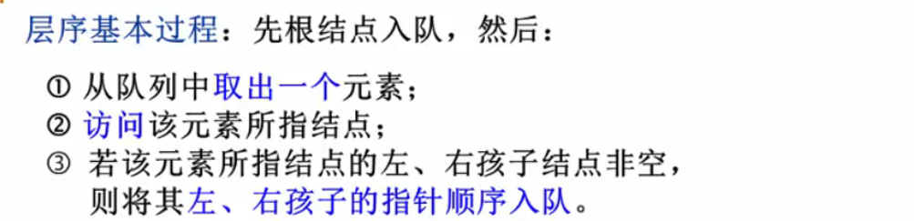

代码示例:

~~~ C
void LevelOrderTraversal(BinTree BT)
{
	if(!BT)	return; //若是空树则直接返回
    Queue Q = CreateQueue(MaxSize);
    BinTree T;
    EnQueue(Q, BT);
    while(!IsEmpty(Q)){
		T = DeQueue(Q);
        printf("%d", T->Data);
        if(T->Left)	EnQueue(T->Left);
        if(T->Right)	EnQueue(T->Right);
    }
}
~~~

---

#### 遍历应用例子

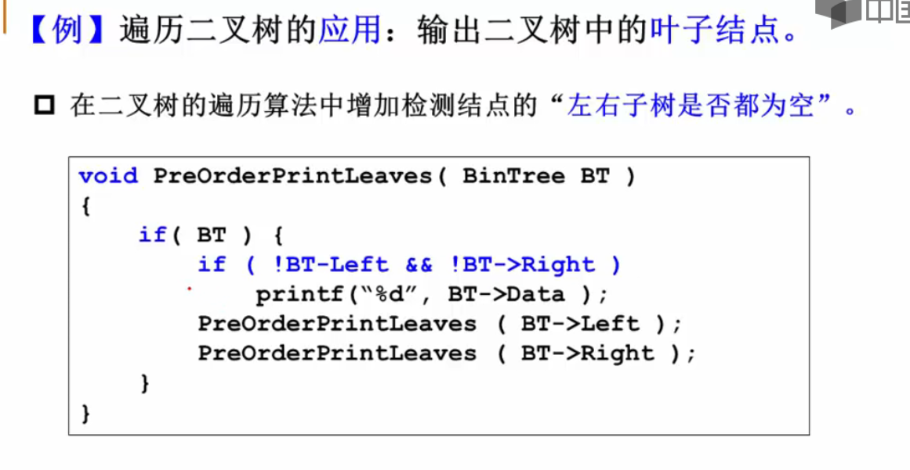

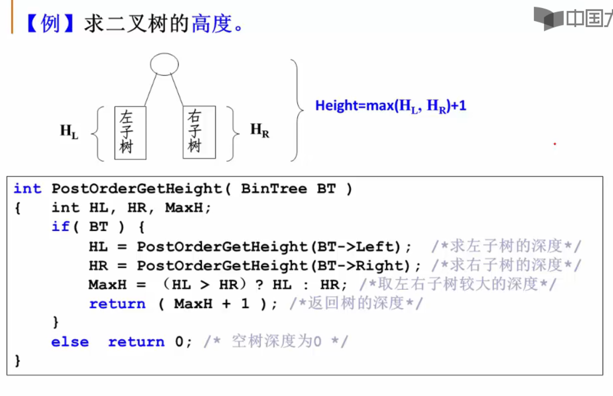

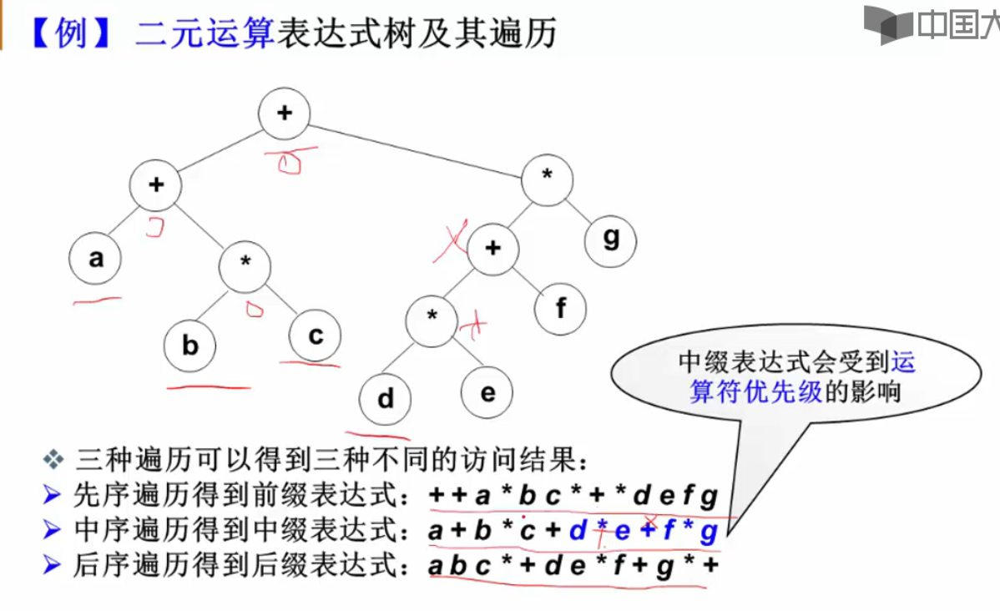

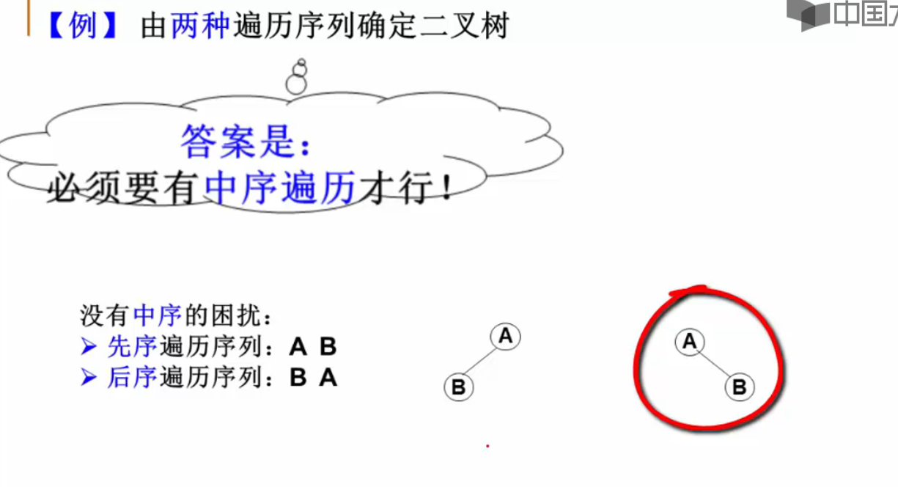

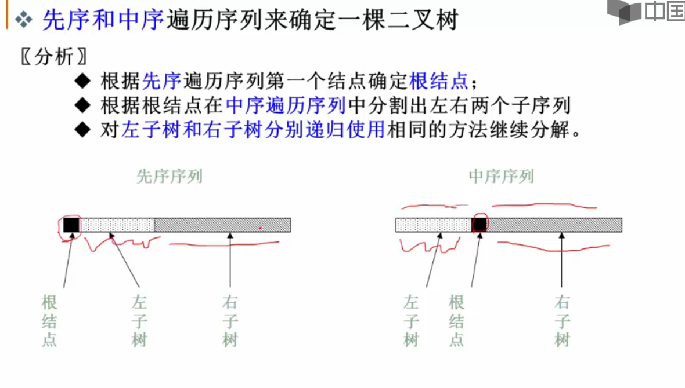

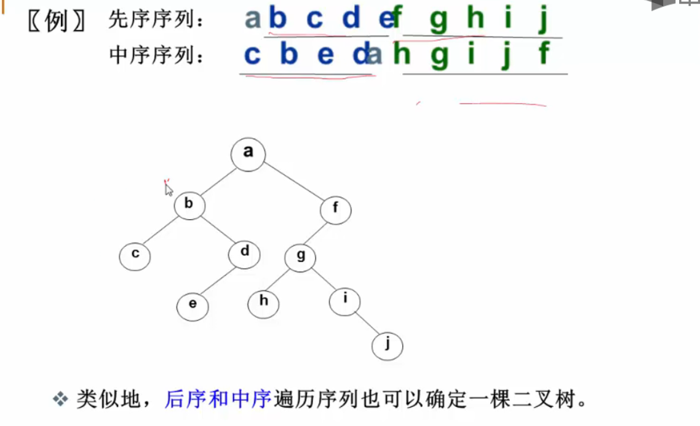

---

#### 什么是二叉搜索树

二叉搜索树（BST， Binary Search Tree）,也称二叉排序树或二叉查找树

二叉搜索树：一棵二叉树，可以为空；如果不为空，满足以下性质：

1. 非空左子树的所有键值小于其根结点的键值
2. 非空右子树的所有键值大于其根结点的键值
3. 左、右子树都是二叉搜索树

#### 二叉搜索树操作的特别函数

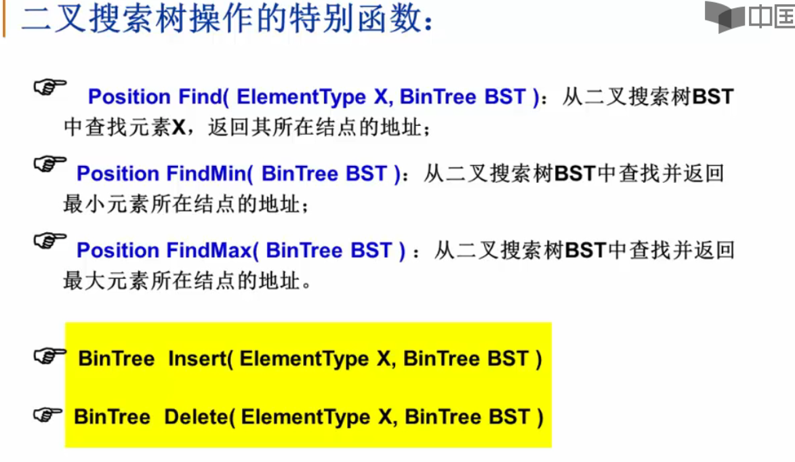

Find

~~~ C
Position Find(ElementType X, BinTree BST)
{
	if(!BST) return NULL;
    if(X == BST->Data){
        return BST;
    }else if(X < BST->Data){
        return Find(X, BST->Left);
    }else{
	    return Find(X, BST->Right);
    }
}
~~~

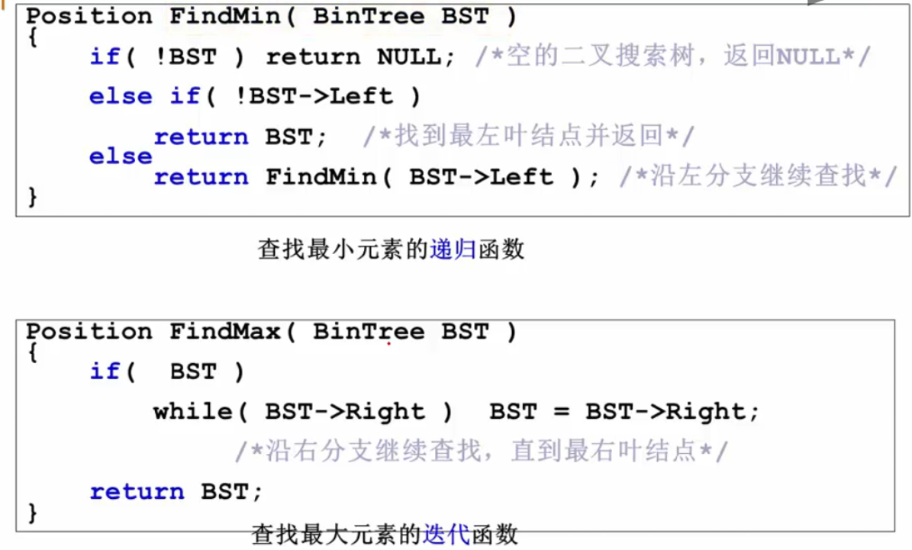

Insert
~~~ C
BinTree Insert(ElementType X, BinTree BST)
{
    if(!BST){
        Position BT = (Position)malloc(sizeof(struct TreeNode));
        BT->Data = X;
        BT->Left = BT->Right = NULL;
        BST = BT;
    }else if(X < BST->Data){
        BST->Left = Insert(X, BST->Left);
    }else{
        BST->Right = Insert(X, BST->Right);
    }
    return BST;
}
~~~

二叉搜索树的删除

考虑三种情况：
* 删除叶结点：直接删除，并修改其父结点指针---置为NULL

* 删除的结点只有一个子结点：将其父结点的指针指向要删除结点的孩子结点，用被删除结点的孩子顶替被删除结点
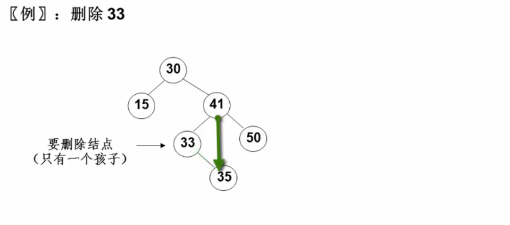

* 删除的结点有左、右两棵子树：

  用另一结点代替被删结点：==右子树==的==最小==元素 或者 ==左子树==的==最大==元素
  
  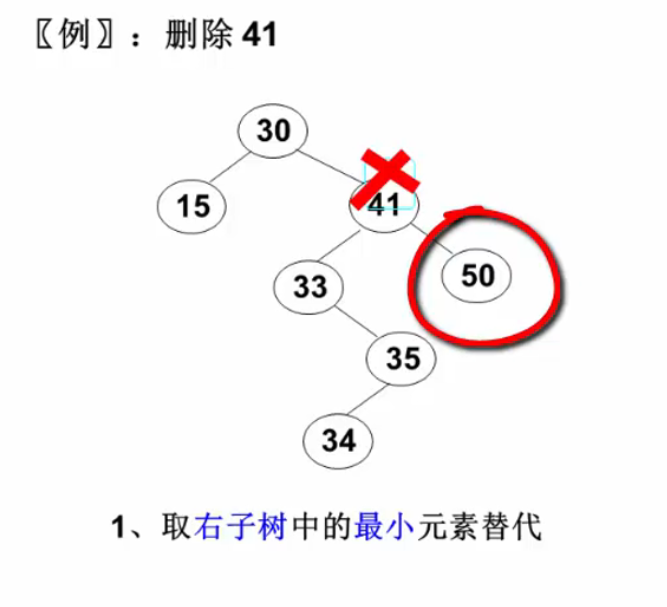

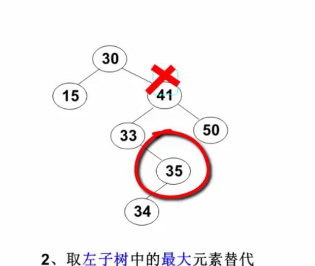

Delete
~~~ C
BinTree Delete(ElementType X, BinTree BST)
{
    if(BST == NULL)	printf("未找到删除元素");
    else if(X < BST->Data){
        BST->Left = Delete(X, BST->Left);
    }else if(X > BST->Right){
		BST->Right = Delete(X, BST->Right);
    }
    else{
        if(BST->Left && BST->Right){
            Position T = FindMin(BST->Right)//查找右子树最小元素
            BST->Data = T->Data;
            BST->Right = Delete(T->Data, BST->Right); //将问题转化为情况一或情况二
        }else{ //被删除结点有一个或无子结点
            Position T = BST;
            if(BST->Left){
                 BST = BST->Left;
            }else if(BST->Right){
                 BST = BST->Right;
            } else {
                BST = NULL;
            }
            free(T);
        }
    }
    return BST;
}

~~~

---

#### 平衡二叉树

平衡因子(Balanced Factor，简称BF)：BF(T) = h~L~ - h~R~，
其中 h~L~，h~R~，分别为T的左、右子树的高度.
==平衡二叉树==
空树u，或者
任一左右子树高度差的绝对值不超过1，即|BF(T)| <= 1

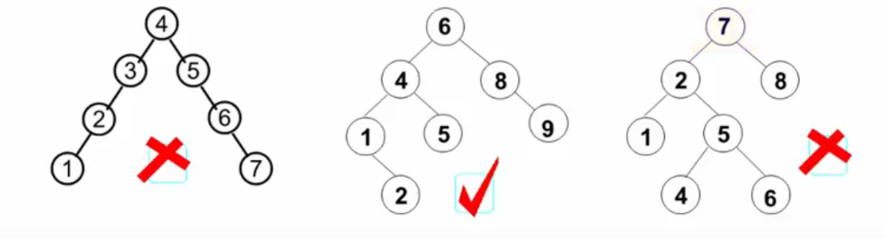

平衡二叉树的高度

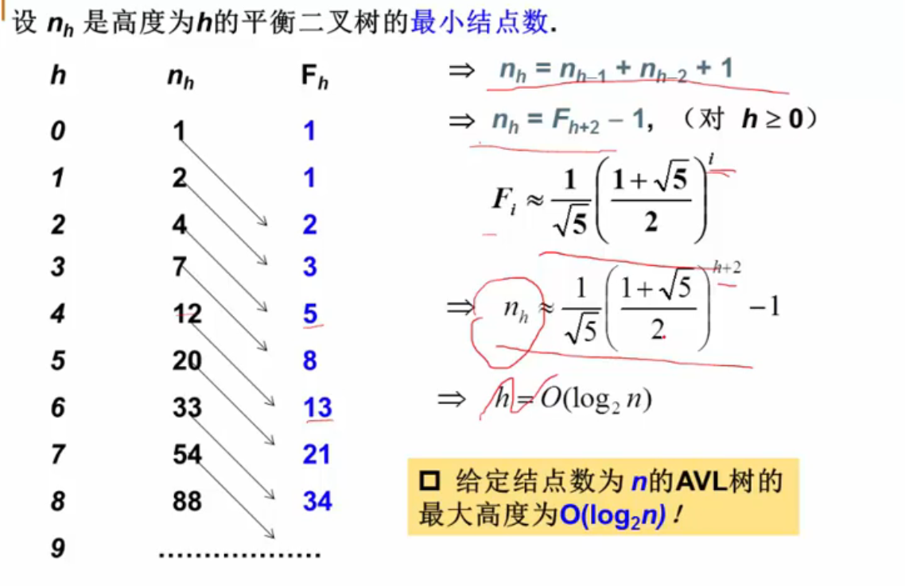

####平衡二叉树的调整

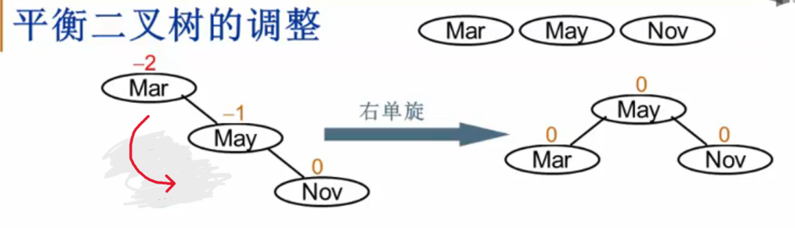

不平衡的“发现者”是Mar,"破坏者"Nov在发现者右子树的右边，因而叫==RR插入==，需要==RR旋转（右单旋）==

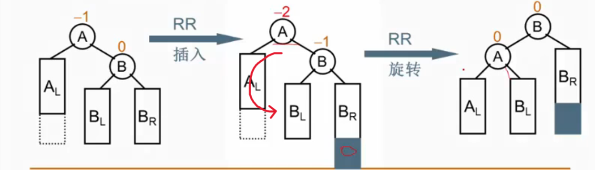

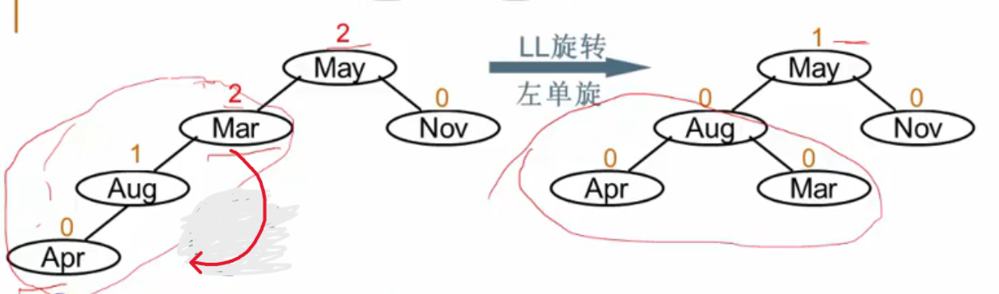

不平衡的“发现者”是Mar,"破坏者"Apr在发现者左子树的左边，因而叫==LL插入==，需要==LL旋转（左单旋）==

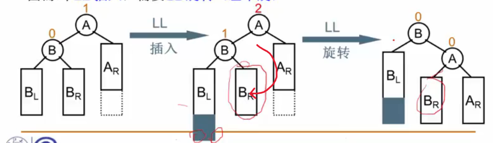

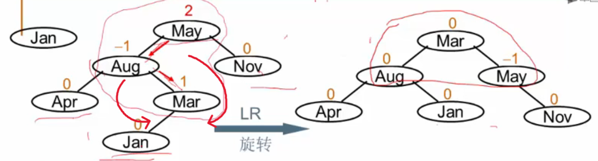

不平衡的“发现者”是May,"破坏者"Jan在发现者左子树的右边，因而叫==LR插入==，需要==LR旋转==

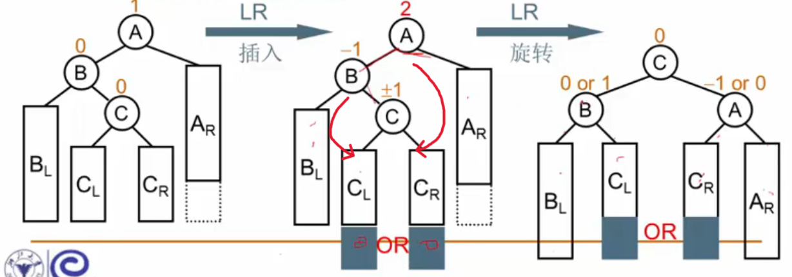

RL旋转

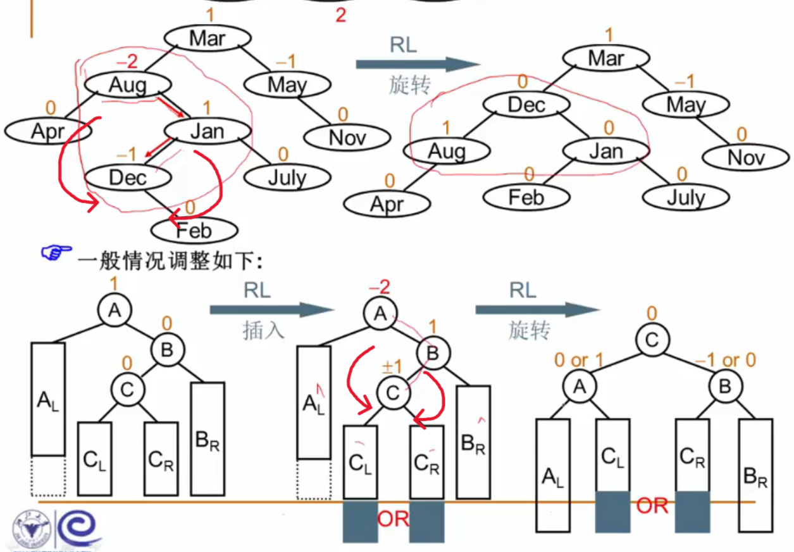

### 平衡二叉树的删除操作步骤

1. 删除要删除的结点，方法同 **二叉排序树的输出** 一样，有三类情况
	* 叶子结点
	* 只有一个子树的结点
	* 有左右子树的结点
2. 从被删除的结点开始向上找最小不平衡子树（不平衡的**发现者**），注意如果被删除的结点是**有左右子树的结点**，则从实际被删除的那个“替罪羊”开始找。如果没有找到，那说明没有不平衡的情况
3. <u>从**发现者**开始</u>，找它高度最高的儿子，以及其高度最高的孙子
4. <u>高度度最高的孙子作为**“破坏者“**</u>，根据**发现者**和**破坏者**的位置关系来确定调整关系（LL、RR、LR、RL）
5. 从被调整的最小不平衡字数开始，继续向上找最小不平衡字数，重复2的步骤。

### 红黑树

**二叉搜索树**，为实现 O(log n) 的查找效率提供了思路，但是二叉搜索树的效率不稳定，如果插入顺序不对，就会使得查找效率又变为 O(n)

于是有了 **平衡二叉树(AVL)**，平衡二叉树是二叉搜索树的升级版，它的旋转操作在每次插入操作后保证了树的高度控制在 O(log n) 级别，换句话说，平衡二叉树就是会自我调节高度的二叉搜索树

但由于  **平衡二叉树(AVL)** 对树的高度太过严格（任一结点左右子树高度相差不大于1），导致其在插入过程中旋转操作太过频繁，使得插入和删除的效率太低。

于是有了 **红黑树**，也是一颗**二叉搜索树**，它与**平衡二叉树**一样，都是具有特殊要求的**二叉搜索树**。

**红黑树**对树的高度要求不像**平衡二叉树**那样严格，因此其**查找效率**略逊于 **平衡二叉树**。

但是**红黑树**在**插入和删除**操作时的旋转调整次数少于**平衡二叉树**，所以它的插入和删除效率更高。

红黑树定义：
1. 首先是一棵二叉搜索树，即左子树都小于根结点，右子树都大于根结点
2. 根结点是黑色的
3. 所有叶子结点（其实是NULL结点）是黑色的
4. 所有红色结点的孩子都是黑色的，换句话说，从上到下，不存在连续的两个红色结点
5. 任一结点到任一叶子结点的路径上，黑色结点的数量相同（路径上黑色结点不包括起点，但包括终端叶结点）。
	是同一起点不同终点的路径上数量相等，不是说任意起点到任意终点的路径上数量都相等

红黑树的插入操作：

插入的结点如果是黑色，会破坏 **黑路同** 的性质，因此默认插入的颜色是红色。虽然也可能会破坏 **不红红** 的性质，但相比来说破坏程度更小

1. 插入红色结点，无非破坏的就是 **根叶黑** 与 **不红红** 的性质。
	1. 插入结点是根结点，破坏 **根叶黑** 性质，直接改为黑色即可
	2. 破坏的 **不红红** 的性质，那么插入结点的父结点一定是红色，且爷爷结点一定是黑色，（红-红-黑）
		那么怎么调整就要看叔叔结点的颜色
		1. 如果叔叔节点是红色，
			父结点肯定要变成黑色，导致分支的黑色增加，那可以使另外一个分支，叔叔结点也变成黑色
			上面两个操作使得小整体的黑色增加，那就爷爷结点变成红色减少小整体的黑色，
			这又引发 **根叶黑** 或 **不红红** 的问题，那么就以爷爷结点为新插入结点，从头开始继续判定。
			那么操作很简单，**父结点、爷爷结点、叔叔结点** 三个结点都变色（颜色取反）；然后以爷爷结点为插入结点（cur），从最开始的第一步继续判定 cur 结点是否违反了 **根叶黑** 或 **不红红 **的性质。
		2. 如果叔叔结点是黑色，不能增加叔叔分支的黑色
			那就只能旋转，改变树形结构
			怎么旋转还是按照平衡二叉树的旋转方法来
			旋转后肯定是红色结点为新的父结点，结构为（R<-R->B）
			这样肯定不满足 **黑路同** 
			为了使两个分支黑色相等有两个选择（B<-R->B）和 （R<-B->R）
			（B<-R->B）会引发新的  **根叶黑** 或 **不红红 ** 问题
			所以选择 （R<-B->R）
			反正记住新的父结点肯定要变色，剩下的让两边颜色对称就好了

> 从来没记过四种旋转![[笑哭]](https://i0.hdslb.com/bfs/emote/c3043ba94babf824dea03ce500d0e73763bf4f40.png@40w_40h.avif)按我直观的感觉就是把涉及到的三个节点中间大小的做父亲节点，然后多出来的子树按照大小接到空余的位置就行了，以不变应万法。红黑树的变色也是因为需要符合其性质不得不这么操作：对于插入节点违反“不红红”的情况，显然祖父->父亲->插入节点一定构成黑(B)-红(R)-红(R)的形式，显然需要把某个红节点变黑。由于默认插入红结点，所以我们只能把父亲节点变黑。变黑会导致祖父->父亲这一路的树黑节点数+1，违反“黑路同”原则。所以我们必须想办法让另一路，也就是祖父-叔叔这一路的树黑节点数也+1。①如果叔叔节点是红的，那刚好就让他变黑。但是这还没完，注意到祖父节点为根的子树整体黑节点数+1了，这跟祖父节点的兄弟节点引导的子树违反“黑路同”原则，所以还得把祖父节点变红，平衡黑节点数。祖父节点变红后，等效于新插入了这个节点，所以重复判定即可。②如果叔叔节点是黑的，无法+1，那就只能旋转树，重新排列，把黑色的祖父节点安排到叔叔节点的那一路。同时因为祖父节点一定是三个节点中最小或最大的，不可能作为新的父亲节点，所以新父亲节点一定是红的（R<-R->B），原祖父节点(B)必然在原叔叔那一路。显然左右子树黑节点数量不一样的，新父节点变黑，黑子节点变红即可解决（R<-B->R）。说这么多就是想说这玩意不用背，记住红黑树的性质就可以推导出来![[笑哭]](https://i0.hdslb.com/bfs/emote/c3043ba94babf824dea03ce500d0e73763bf4f40.png@40w_40h.avif)

### B-树

B树也是一种排序树，但不是二叉的排序树，它是多叉的

AVL树与红黑树虽然效率很高，但是它们所占用的内存很大，而且当数据量很大不得不存放在硬盘当中时，因为只有二叉的原因树高会非常高，使得查找次数很高。所以当数据量非常大的时候，二叉的排序树反而没有优势

因此有了B树这种多叉的排序树

不同教材对B树的叶子结点不一样，可以是最后一层结点，也可能以是NULL结点

下面的叶子结点指的是最后一层结点，NULL结点就叫NULL结点

B树的三个特点：

1. 平衡：为了达到像平衡二叉树那种左右平衡的效果，使得B树不会变成只有一边很长，另一边很短的样子，所有叶结点（不是NULL结点）都必须在同一层，即规定任何一个结点，其所有子树（包括NULL结点）的高度都要相同
2. 有序：一个结点不止包含一个元素，结点内有序。任一元素的左子树都小于它，右子树都大于它
3. 多路：也就是多叉，但是最多有几叉，最少有几叉都是有规定的
	对于 m 阶B树来说：
	一个结点**最多**有m个分支，有m个分支也就代表最多 m -1 个元素
	根节点**最少**有2个分支，1个元素
	其它结点（包括叶结点）**最少**要有 ⌈ m/2 ⌉ 个分支，即最少要有 ⌈ m/2 ⌉-1 个结点
	比如 5阶 B树，最多有 5 个分支 4 个结点
	除根结点允许只有 2 个分支 1 个结点外，其它结点必须至少有 3 个分支，2个结点

B树的插入：

1. B树的插入都是找好位置，插入叶结点中的
2. 插入到叶结点后，如果元素个数超过了最大个数，m - 1 + 1 也就是 m 个元素，就需要做分裂操作
3. 选中该结点的中间元素，即第 ⌈ m/2 ⌉ 个元素，该元素沿着天线飞升至上一层结点，然后天线分裂到飞升后元素位置的两边，原来结点根据原来被选中元素的位置分裂成左右两棵子树，分别挂在分裂的两个天线上
4. 飞升后的结点的元素个数如果也超过了最大个数，即达到了 m 个元素，则重复刚才操作直至符合B树要求

B树的删除：

1. 如果删除的是分支结点中元素，则从它的叶子结点中找到从数值上最靠近它的左右两个元素，选择一个覆盖它，然后删除那个叶子结点上的元素。所以最终都会归结到删除叶子结点上元素的问题
2. 如果删除的是叶子结点上的元素，由于 B树要求每个结点至少有 ⌈ m/2 ⌉-1 个元素，因此如果元素删除后，叶子结点中的元素个数小于这个数造成下溢，就要做处理
3. 首先不管三七二十一，先从父结点上选择一个方向拽一个元素下来，然后看对应方向上的左右兄弟的元素个数够不够分一个出来，顶替原先父结点的元素
4. 如果够的话，很好，让一个正确的元素飞升上去，顶替原来父结点的位置
5. 如果不够的话，则只能进行合并处理，连带上刚刚拽下来的父结点的元素，选择对应方向上的兄弟结点合并

### B+树

B树虽然存储起来很方便，在查找某一个数据的时候也很方便，但如果需要遍历每一个数据的时候就会非常麻烦，需要用中序遍历在结点之间来回穿梭，非常耗时

B+树作为数据库的数据结构，在B树的基础上做了改进。

它的核心只需要记住几点（主要是前面2条，后面几条是想到什么写什么的）：

1. 与B树不同的是，它的关键数据都存放在叶子结点上，也就是说所有的叶子节点上就存放了所有数据
	而其它非叶子结点不存在关键数据，它们仅仅只是作为查找关键数据的方向，或者说索引。非叶子结点中的元素存放的是其指向的下一层的结点中的值最大的元素
2. 与B树不同的是，B树结点的元素数等于指针数-1（因为指针分布在元素的空隙及其两侧），而B+树的元素数是等于指针数的（也就是说其指针是位于元素的正下方的）。举个例子，同样是 5 阶树，B树最多允许5叉4个元素，最少允许3叉2个元素；而B+树却允许5叉5个元素，最少允许3叉3个元素。
3. B+树与B树一样，也要让所有NULL结点处在同一层
4. 因为B+树的所有数据都在叶子结点上了，所以可以通过一个指针一连串的顺序读取叶子结点读出所有元素
