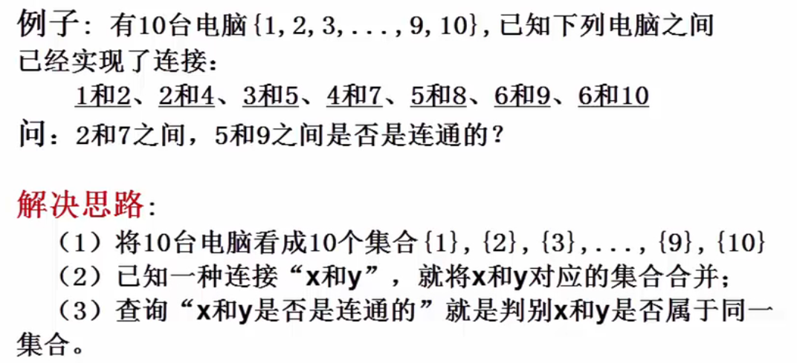
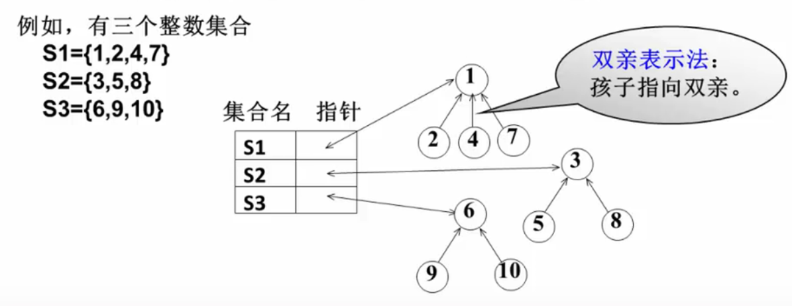
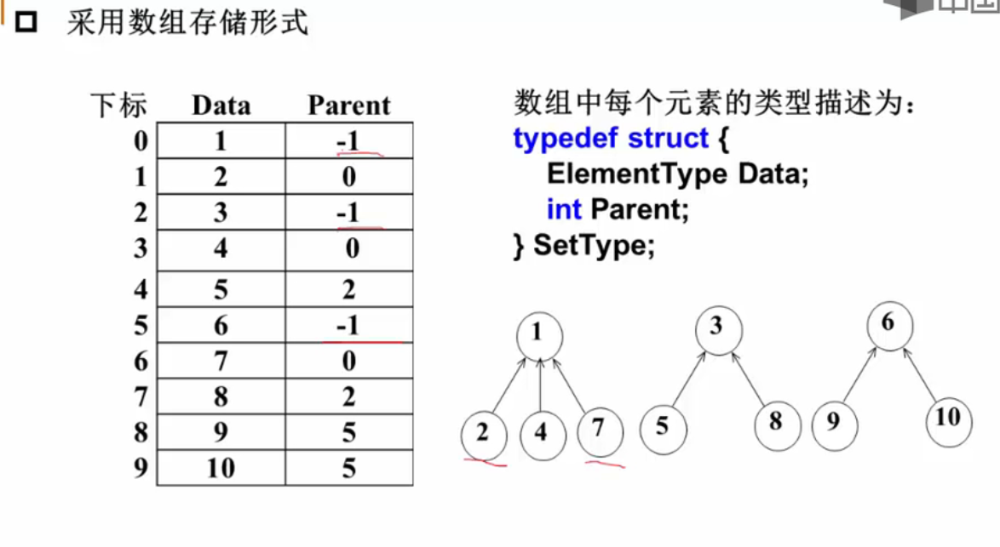
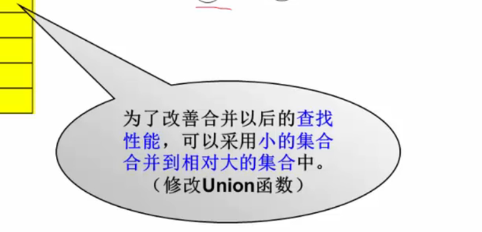
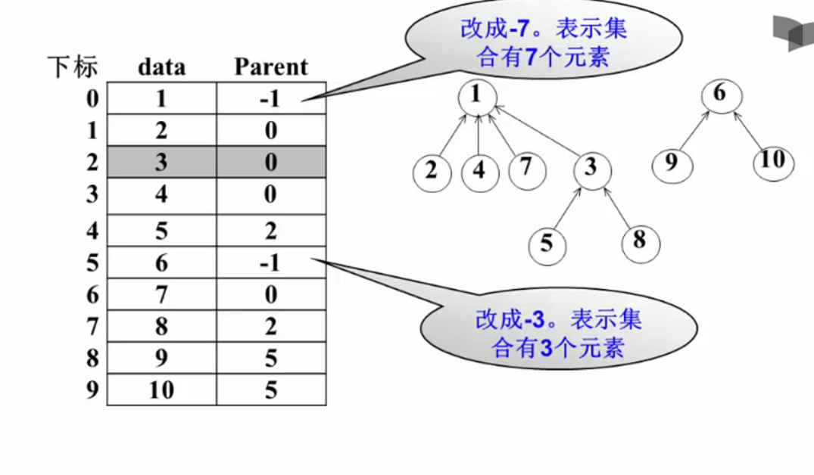

## 集合

* 集合运算：交、并、补、差，判定一个元素是否属于某一集合
* 并查集：集合并、查某元素属于哪个集合
* 并查集问题中集合存储如何实现？

如何实现：

* 可以用==树结构==表示集合，树的每个结点代表一个==集合元素==

​     由链表实现，采用==双亲表示法==由子结点找到父结点，从而找到子结点从属哪个集合

但是还有更好的表示方法，采用数组表示法

#### 集合运算

1. 查找某个元素所在集合（用根结点表示）
~~~C
int Find(SetType* S, ElementType X)
{
    //MaxSize是全局变量，表示数组S的最大长度
    int i;
    for(i = 0; i < MaxSize && S[i].Data != X; i++); //遍历查找X的下标
    if(i >= MaxSize)	return -1; //未找到X
    for(; S[i].Parent >= 0; i = S[i].Parent);
    return i;
}
~~~

2. 集合的并运算
* 分别找到X1和X2两个元素所在集合树的根结点
* 如果它们不同根，则将其中一个根结点的父结点指针另一个根结点的下标
~~~C
void Union(SetType* S, ElementType X1, ElementType X2)
{
    int Root1, Root2;
    Root1 = Find(S, X1);
    Root2 = Find(S, X2);
    if(Root1 != Root2){
		S[Root2].Parent = Root1;
    }
}
~~~

