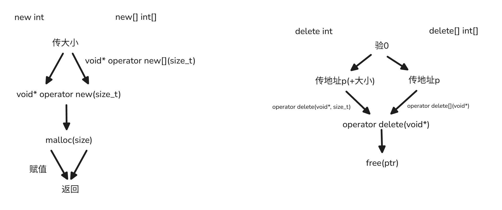
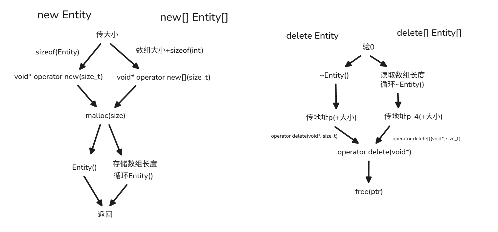

## 基本数据类型

### new

`new`作为C++中的关键字，能被编译器识别，自然就能被编译器编译展开为一串汇编代码，理解这串汇编代码在做什么才能真正理解`new`做了什么。下面以简单的代码为例

~~~cpp
int* p = new int(18);
~~~

~~~assembly
sub     esp, 12
push    4 ;sizeof(int)
call    operator new(unsigned int) ; operator new(sizeof(int))
add     esp, 16
mov     DWORD PTR [eax], 18 ;*(eax) = 18
mov     DWORD PTR [p], eax; p = (eax)
~~~

可以发现`new`关键字展开后做了很多事，总结来说就是：

1. 传参，传入要开辟的字节大小
2. 开辟，调用 `operator new()`函数开辟内存空间
3. 赋值，给开辟的空间赋值
4. 返回，返回对应类型的指针

不难看出，`new`关键字展开的核心就是调用 `operator new()`函数，那么这个函数具体做了什么？不同的编译器具体实现不同，这里以`gcc`的为例：

~~~cpp
// gcc/libstdc++-v3/libsupc++/new_op.cc

_GLIBCXX_WEAK_DEFINITION void *
operator new (std::size_t sz) _GLIBCXX_THROW (std::bad_alloc)
{
  void *p;

  /* malloc (0) is unpredictable; avoid it.  */
  if (__builtin_expect (sz == 0, false))
    sz = 1;

  while ((p = malloc (sz)) == 0)
    {
      new_handler handler = std::get_new_handler ();
      if (! handler)
	_GLIBCXX_THROW_OR_ABORT(bad_alloc());
      handler ();
    }

  return p;
}
~~~

函数名旁边的宏定义大致意思是：`_GLIBCXX_WEAK_DEFINITION`允许函数的重定义（重写），`_GLIBCXX_THROW`这个函数可能会抛异常。

最重要的是，这个函数返回的是`void*`指针。

接下来就是这个函数的重头戏。总的来说这个函数就是对`malloc()`函数的包装。

首先`malloc(0)`会引发未定义行为，所以`__builtin_expect (sz == 0, false)`函数对参数`sz`进行检查，然后将其改为`sz = 1`。从这里可以看出，`operator new(0)`是允许的，不过它会开辟大小为1的空间。

然后用`while`循环检测`malloc`是否成功开辟空间，这里用`while`的原因是线程安全的缘故，细节不多讲（我也不懂。如果`malloc`开辟失败，就会进入循环体，循环体里做的就是调用`handler()`函数，这个函数由用户自己通过`std::set_new_handler()`来定义，可以由用户自己决定如果`new`失败了应该做什么，如果用户没有定义`handler()`函数，那么`_GLIBCXX_THROW_OR_ABORT`就会**抛异常**或者**终止程序**。

如果`malloc`开辟成功，就正常返回开辟的地址`void* p`

这么看来，`new`关键字做的事情很简单：传参，调用`operator new(sizeof(TYPE))`，这个函数是对`malloc`函数的包装，允许`malloc(0)`并在开辟空间失败的情况下抛出异常或终止程序。最后给开辟空间赋值

### new[]

接下来看看关键字`new[]`会被编译器展开成什么样。

同样是简单的例子：

~~~cpp
int* p = new int[10];
~~~

~~~assembly
sub     esp, 12
push    40 ; 10 * sizeof(int)
call    operator new ; operator newp * 10)
add     esp, 16
mov     DWORD PTR [p], eax ; p = (eax)
~~~

同样是：

1. 传参，传入要开辟的数组的大小，只不过传入的字节大小会经过计算，这是经过计算后数组总的大小`10 * sizeof(int)`
2. 开辟，调用 `operator new`函数开辟内存空间
3. 返回，返回对应类型的指针，这里也能看出`new[]`**不会给开辟的数组初始化**

然后来看一下`operator new`函数做了什么

~~~cpp
// gcc/libstdc++-v3/libsupc++/new_opv.cc

_GLIBCXX_WEAK_DEFINITION void*
operator new[] (std::size_t sz) _GLIBCXX_THROW (std::bad_alloc)
{
  return ::operator new(sz);
}
~~~

可以发现非常的简单，就是调用上面`new`关键字的`operator new()`函数。

从这里可以看出，`new`和`new[]`关键字本质上没有区别。

**无非就是`new`关键字开辟的大小是数据类型的大小并给开辟的空间赋值，返回相应指针；而`new[]`关键字会简单计算数组的大小，并开辟数组大小的空间，返回相应指针。**

### delete

`delete`作为与`new`配套的关键字，编译器也会将其编译展开为相应的一串汇编代码。

~~~cpp
delete p;
~~~

~~~assembly
mov     eax, DWORD PTR [p]
test    eax, eax ; if p == 0 
je      .L2 ; if nullptr 跳转到下一行代码

sub     esp, 8
push    4 ; sizeof(int)
push    eax
call    operator delete(void*, unsigned int) ; operator delete(p, sizeof(int))
add     esp, 16

.L2:
;下一行代码的起始地址
~~~

`delete`同样也做了一些事大致上来说：

1. 检测，检测要释放的地址是否为`0`
2. 传参，传入释放地址（和释放的内存大小）
3. 释放，调用`operator delete()`函数释放内存空间

一开始的`test eax, eax`就是检验`p`是否为`nullptr`，如果是的话程序就会跳转到`.L2`处执行即`delete p`下一行代码的起始地址，也就是说允许`delete nullptr`只不过这会直接跳到下一行代码执行。

然后看看`operator delete()`函数具体做了什么：

~~~cpp
// gcc/libstdc++-v3/libsupc++/del_ops.cc

_GLIBCXX_WEAK_DEFINITION void
operator delete(void* ptr, std::size_t) noexcept
{
  ::operator delete (ptr);
}

// gcc/libstdc++-v3/libsupc++/del_op.cc
_GLIBCXX_WEAK_DEFINITION void
operator delete(void* ptr) noexcept
{
  std::free(ptr);
}
~~~

这里涉及到两个函数，一个是`operaotr delete()`带`size`版本，一个是`operator delete()`单参版本，而`delete`关键字实际调用的是上面这个有两个参数的版本。但是这个函数非常简单只是调用下面的单参版本，并且直接忽略了传入的`size`参数，这个忽略参数的操作看着很奇怪，只是`gcc`用不到，但用户重写`operator delete(void* ptr, std::size_t)`可能会用到`size`参数所以保留了这个函数。

然后看看下面的单参版本，也非常简单，就是调用`free()`函数。和传统C语言一样，释放传入的地址。

总结来说，`delete`关键字要做的事情很简单，就是检测是否为`nullptr`，然后调用`operator delete()`去释放对应地址的空间，而这个释放的任务调用`free()`函数去完成。

### delete[]

接下来看看关键字`delete[]`会被编译器展开成什么样。

同样是简单的例子：

~~~cpp
delete[] p;
~~~

~~~assembly
cmp     DWORD PTR [p], 0 ; if p == 0
je      .L3 ; if nullptr 跳转到下一行代码

sub     esp, 12
push    DWORD PTR [p]
call    operator delete ; operator delete
add     esp, 16

.L3:
~~~

可以发现和`delete`关键字简直是一模一样，同样是：

1. 检测，检测要释放的地址是否为`0`
2. 传参，只传入释放地址
3. 释放，调用`operator delete`函数释放内存空间

然后看看`operator delete`函数

~~~cpp
// gcc/libstdc++-v3/libsupc++/del_opv.cc

_GLIBCXX_WEAK_DEFINITION void
operator delete[] (void *ptr) _GLIBCXX_USE_NOEXCEPT
{
  ::operator delete (ptr);
}
~~~

可以发现就是非常简单的调用`operator delete()`函数，那么接下来的故事就和`delete`关键字完全一样，将释放空间的任务交给`free()`函数。

综上来看，对于基本数据类型：

* `new`和`new[]`关键字做的事情几乎一样，都是由编译器判断要分配的大小，这个大小完全就是类型的大小，调用到`malloc(sizeof(DATA_TYPE))`完成内存的分配，最终由编译器完成赋值；`传大小 => malloc => 赋值`
* 而`delete`和`delete[]`关键字可以说是完全一样，都是由编译器判断`nullptr`，调用到`free(ptr)`完成内存的释放。`验0 => 传地址 => free`

---

## 类对象

如果是简单的结构体类，那么`new`、`new[]`以及`delete`、`delete[]`的行为和上面是完全一样的。**所谓的简单的结构体类是指没有定义构造函数和析构函数**

~~~cpp
class Entity {
public:
    int x;
};
~~~

这样做应该是为了兼容以前的C语言，毕竟以前的C语言不能在结构体中定义函数。

但是定义了构造函数和析构函数情况就会不一样。C++专门弄出`new`和`delete`关键字而不再使用C语言的`malloc()`和`free()`函数的原因也是如此。

这里提一个有意思的现象，或许只有`gcc`会这样。如果类只定义了构造函数，那么只有`new`会触发构造函数，但是`delete`不会触发析构函数；如果类只定义了析构函数，那么`delete`会触发析构函数，同时`new`也会触发构造函数。

上面的情况并不实用，也没什么用。言归正传，简单定义一下类：

~~~cpp
class Entity {
public:
    int x, y;
    Entity() {}
    ~Entity() {}
};
~~~

## 类对象

### new

同样是以简单的代码为例，看看`new`一个对象编译器会将其展开为什么样的汇编代码：

~~~cpp
Entity* p = new Entity;
~~~

~~~assembly
sub     esp, 12
push 	8 ; sizeof(Entity)
call`	operator new(unsigned int) ; operator new(sizeof(Entity))
add		esp, 16
mov		ebx, eax

sub		esp, 12
push	ebx ; this指针
call	Entity::Entity() ; Entity::Entity(p)
add		esp, 16
mov		DOWORD PTR [p], ebx ; p = (ebx)
~~~

可以发现前面的代码与基本数据类型的操作一样，都是用`operator new()`函数开辟对应数据类型大小的内存空间。不过由于类的**创建**和**初始化**几乎是绑定在一起的，所以`new`关键字还会在开辟对象的内存空间后，在这个内存空间上调用类的构造函数进行初始化。这就是C++专门设计一个`new`关键字而不简单沿用C语言`malloc`函数的原因。

总结来说：

1. 传参，传递对象的内存大小
2. 开辟，调用`operator new()`开辟对应内存空间
3. 初始化，调用`Entity::Entity()`构造函数初始化对应内存空间
4. 返回，返回对应类型的指针给指针赋值

### delete

同样是以简单的代码为例

~~~cpp
delete p;
~~~

~~~assembly
mov     ebx, DWORD PTR [p]
test    ebx, ebx ; if p == 0
je      .L4 ; if nullptr 跳转到下一行代码

sub     esp, 12
push    ebx ; this指针
call    Entity::~Entity() ; Entity::~Entity(p)
add     esp, 16

sub     esp, 8
push    8 ; sizeof(Entity)
push    ebx
call    operator delete(void*, unsigned int) ; operator delete(p, sizeof(Entity))
add     esp, 16

.L4:
~~~

~~~cpp
// gcc/libstdc++-v3/libsupc++/del_ops.cc

_GLIBCXX_WEAK_DEFINITION void
operator delete(void* ptr, std::size_t) noexcept
{
  ::operator delete (ptr);
}

// gcc/libstdc++-v3/libsupc++/del_op.cc
_GLIBCXX_WEAK_DEFINITION void
operator delete(void* ptr) noexcept
{
  std::free(ptr);
}
~~~

类毕竟与普通的基本数据类型不一样，它的成员可能有指针，有指针就需要释放。所以对象所在的空间在被释放前需要调用析构函数，让对象在被销毁前做好内存回收工作。这就是C++专门设计一个`delete`关键字而不简单沿用C语言`free`函数的原因。

观察上，`delete`一个类与`delete`一个基本数据类型大体框架上一样，都是先检验指针然后传参调用`operator delete()`函数使用`free()`来释放相应的内存空间。只不过，对象在被销毁前需要先调用析构函数做好内存回收的工作

总的来说：

1. 检测，检测要释放的地址是否为`nullptr`
2. 析构，在对象被销毁前调用析构函数做好内存回收工作
3. 传参，传入释放地址（和释放的内存大小）
4. 释放，调用`operator delete()`函数释放内存空间

### new[]

~~~cpp
Entity* p = new Entity[10];
~~~

~~~assembly
sub     esp, 12
push    84 ; sizeof(Entity) * 10 + sizeof(int)
call    operator new ; operator new * 10 + sizeof(int))
add     esp, 16
mov     ebx, eax ; operator new申请到的空间的起始地址
mov     DWORD PTR [ebx], 10 ; 数组长度为 10, 起始地址存数组长度
lea     eax, [ebx+4] ; 数组长度后面才是真正存储Entity[]数组的地方
mov     esi, 9 ; esi是计数器,构造函数调用次数 0~9 共 10 次
mov     edi, eax ; edi是this指针
jmp     .L3
.L4:
sub		esp, 12
push	edi
call	Entity::Entity() ; Entity::Entity(this)
add		esp, 16
sub		esi, 1 ; esi -= 1
add		edi, 8 ; edi += 8
.L3:
test    esi, esi ; if esi >= 0 ?
jns     .L4
lea     eax, [ebx+4] ; 数组长度后面才是真正存储Entity[]数组的地方
mov     DWORD PTR [p], eax ; p = (eax)
~~~

可以发现，`new[]`关键字作用在对象数组上还是大不一样的。分析一下汇编代码，大致意思是：分配内存空间、循环调用`Entity`的构造函数初始化内存空间，返回对应类型的指针。下面来具体分析一下。

首先和前面的`new`一样，会先传参调用`operaotr newp`函数来开辟内存空间。但是这个参数不仅仅是数组的大小，还多出了`4`个字节。

为什么会多出这`4`个字节，原因在下面的指令能看出来，是为了存储一个整型数据，这个整型数据其实是数组的长度或者说对象的个数。这个整型就存储在开辟的内存空间的起始位置，毕竟`operator new`返回的是`malloc`的结果，而`malloc`返回的是开辟的内存空间的起始位置。真正的数组存储在整型数据的后面，数组的地址才是要赋予的`p`的值，也就是说`p = malloc() + 4`。至于为什么要存储这个数组的长度，这到后面`delete[]`会有用。

接下来要做的就是根据数组的长度，循环`10`次调用构造函数，初始化这`10`个对象。

最后返回对应类型的指针。注意，**指针的值应该是开辟内存空间的起始地址再加sizeof(int)**。

总的来说：

1. 传参，传入的参数是要开辟的数组的大小加上`sizeof(int)`
2. 开辟，调用`operator new`函数开辟内存空间
3. 存储，存储数组的长度到开辟内存空间的起始地址
4. 初始化，循环调用构造函数初始化数组中的所有对象
5. 返回，返回对应类型的指针给指针赋值，注意这个地址是**开辟内存空间的起始地址再加上sizeof(int)**

### delete[]

~~~cpp
delete[] p;
~~~

~~~assembly
cmp     DWORD PTR [p], 0 ; if p == 0
je      .L6 ; if nullptr 跳转到下一行代码
mov     eax, DWORD PTR [p]
sub     eax, 4 ; eax = p - 4
mov     eax, DWORD PTR [eax] ; eax = 数组长度
lea     edx, [0+eax*8] ; edx = 数组长度 * sizeof(Entity)
mov     eax, DWORD PTR [p]
lea     ebx, [edx+eax] ; ebx = 数组末尾的后一个地址, 作为类计数器。********最重要的一句********
.L8:
cmp 	ebx, DWORD PTR [p] ; if ebx == p
je		.L7
sub		ebx, 8 ; ebx -= sizeof(Entity)
sub 	esp, 12
push    ebx ; this指针
call 	Entity::~Entity() ; 循环调用析构函数Entity::~Entity(this)
add     esp, 16
jmp     .L8
.L7:
mov     eax, DWORD PTR [p]
sub     eax, 4 ; eax = p - 4
mov     eax, DWORD PTR [eax] ; eax = 数组长度
sal     eax, 3 ; eax = 数组长度 * sizeof(Entity)
lea     edx, [eax+4] ; edx = 开辟的内存空间大小
mov     eax, DWORD PTR [p] ; eax = p
sub     eax, 4 ; eax -= 4
sub     esp, 8
push    edx ; 开辟的内存空间大小
push    eax ; 开辟的内存空间起始地址
call 	operator delete 
add		esp, 16
.L6:
~~~

~~~cpp
// gcc/libstdc++-v3/libsupc++/del_opvs.cc

_GLIBCXX_WEAK_DEFINITION void
operator delete[] (void *ptr, std::size_t) noexcept
{
  ::operator delete[] (ptr);
}
~~~

我们知道，数组中有多个`Entity`对象，这意味着在销毁这个数组时需要对这个数组中的每一个`Entity`对象执行析构函数才能保证做好内存回收工作。

* 但是要执行几次析构函数，析构几个对象呢？`malloc`是允许用变量创建数组的，也就是说数组中有几个对象只有在程序运行时才知道。而`delete[]`在执行时能知道只有要释放的数组的起始地址，所以前面`new[]`存储的数组长度在这里发挥了作用。
* `delete[]`关键字展开的汇编代码，会先从`p-4`的地方获得这个数组长度得到这个数组存储了多少个对象。然后就能知道需要析构多少个对象。
	这里循环调用的析构方式的方式很巧妙。`ebx`作为遍历指针，从数组末尾的后一个地址开始，以数组的起始地址作为终点，`ebx`不仅作为类计数器，而且作为析构函数的`this`指针。前面说到的数组长度，虽然不直接作为计数器使用，但是它能够得出数组的结尾地址，并赋值给`ebx`。

* 最后，调用`operator delete`函数释放开辟的内存空间，当然传入的参数必须是原先`malloc`来的起始地址，因此传入的参数是`p-4`。

总的来说：

1. 检测，检测要释放的地址是否为`0`
2. 析构，循环调用析构函数，在数组被销毁前调用做好内存回收工作
3. 传参，传入释放地址`p-4`（和释放的内存大小）
4. 释放，调用`operator delete()`函数释放内存空间

---

### Placement new

前面的`new`关键字展开为汇编指令后我们知道，它就是会将`operator new()`开辟内存空间函数和`Entity::Entity()`构造函数**捆绑**在一起。

如果有一天，我们想先分配一块内存空间预留给`Entity`，但还没想好用什么参数构造`Entity`时，也就是说只想分配内存不像初始化，这时矛盾就来了。首先一般的`new`关键字将开辟内存空间的函数(`malloc`)和构造函数捆绑在一起，其次我们在C++中无法直接显式的在一块内存上调用构造函数`Entity::Entity()`。

于是有了C++对`new`关键字增添了新的语法，有了新的用法——`Placement new`。

> Placement new 是 C++ 中一种特殊的 new 运算符形式，**它不分配内存，只在已分配的内存上构造对象**。这是 C++ 中少数几个允许你分离内存分配和对象构造的机制之一。

##### 基本用法

~~~cpp
#include <new>  // 必须包含的头文件

void* p = operator new(sizeof(Entity));  // 仅分配内存,只有malloc
Entity* obj = new(p) Entity(args...);   // 在指定内存构造对象,只调用构造函数
~~~

然后让我们来看看整个代码的汇编展开形式，更加深入的了解其中细节

~~~assembly
; void* p = operator new(sizeof(Entity));
sub     esp, 12
push    8 ; sizeof(Entity)
call    operator new(unsigned int) ; 调用 operator new(sizeof(Entity))
add     esp, 16
mov     DWORD PTR [p], eax ; p = malloc(sizeof(Entity))

; Entity* obj = new(p) Entity()
mov     eax, DWORD PTR [p] ; eax = p
sub     esp, 8
push    eax ; p
push    8 ; sizeof(Entity)
call    operator new(unsigned int, void*) ; return p
add     esp, 16
mov     ebx, eax
sub     esp, 12
push    ebx ; this
call 	Entity::Entity() ; Entity::Entity(this)
add		esp, 16
mov     DWORD PTR [obj], ebx
~~~

惊讶的发现为什么`Placement new`里还有一段`operator new()`，注意看参数和上面的`new`不一样，它多传了一个`void*`。让我们来看看源码是怎么样的

~~~cpp
// gcc/libstdc++-v3/libsupc++/new

// Default placement versions of operator new.
_GLIBCXX_NODISCARD _GLIBCXX_PLACEMENT_CONSTEXPR
void* operator new(std::size_t, void* __p)
  _GLIBCXX_TXN_SAFE _GLIBCXX_USE_NOEXCEPT
{ return __p; }
~~~

这个函数非常的简单，直接将传进来的指针返回去了。在上面的汇编指令中可以说是屁用没有，但是`gcc`仍然保留这个函数可能是方便之后用户重写这个函数。

总结来看，`Placement new`就是只会在已经在分配好的内存上接收地址作为`this`指针，然后调用构造函数。它不会调用`malloc()`来开辟内存。使用之前需要我们自己调用`operaotr new(sizeof(Entity))`来仅仅只是开辟内存。

~~~cpp
// gcc/libstdc++-v3/libsupc++/new

#if __cpp_lib_constexpr_new >= 202406L
# define _GLIBCXX_PLACEMENT_CONSTEXPR constexpr
#else
# define _GLIBCXX_PLACEMENT_CONSTEXPR inline
#endif

// Default placement versions of operator new.
_GLIBCXX_NODISCARD _GLIBCXX_PLACEMENT_CONSTEXPR
void* operator new(std::size_t, void* __p)
  _GLIBCXX_TXN_SAFE _GLIBCXX_USE_NOEXCEPT
{ return __p; }
_GLIBCXX_NODISCARD _GLIBCXX_PLACEMENT_CONSTEXPR
void* operator new
  _GLIBCXX_TXN_SAFE _GLIBCXX_USE_NOEXCEPT
{ return __p; }

// Default placement versions of operator delete.
_GLIBCXX_PLACEMENT_CONSTEXPR void operator delete  (void*, void*)
  _GLIBCXX_TXN_SAFE _GLIBCXX_USE_NOEXCEPT
{ }
_GLIBCXX_PLACEMENT_CONSTEXPR void operator delete
  _GLIBCXX_TXN_SAFE _GLIBCXX_USE_NOEXCEPT
{ }

#undef _GLIBCXX_PLACEMENT_CONSTEXPR
~~~

