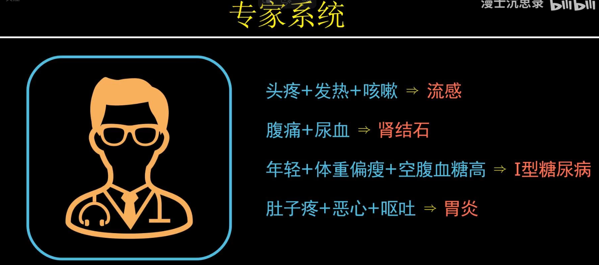

智能：智能本质上就是根据**不同的输入**得到**针对性的输出**

针对性指符合人类直觉，符合人类预期

### 人工智能的分类

##### 1.符号主义

专家系统

在条件集合中，选取若干条件进行组合作为输入，通过**逻辑与**运算得出结果。

缺点：需要人为提前给出输入和输出的对应关系，模型是静态的，水平是持续不变的。

* 智能的本质是一个黑箱，这个黑箱能够从数据中找到输入和输出之间的对应关系，换言之，在数据驱动的机器学习和统计学习眼里，所谓智能本质上就是给你一堆点然后用一个函数拟合它们之间的关系罢了。

* 目的是找到一组多项式，这组多项式定义了一个多项式函数。用什么东西来评估这组多项式定义出来的函数是否准确，这就是**损失函数**。损失函数就是将所有 多项式定义的函数算出来的数值 与 实际数据点的数值 之间的差值的平方加和。