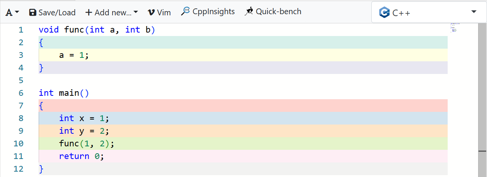

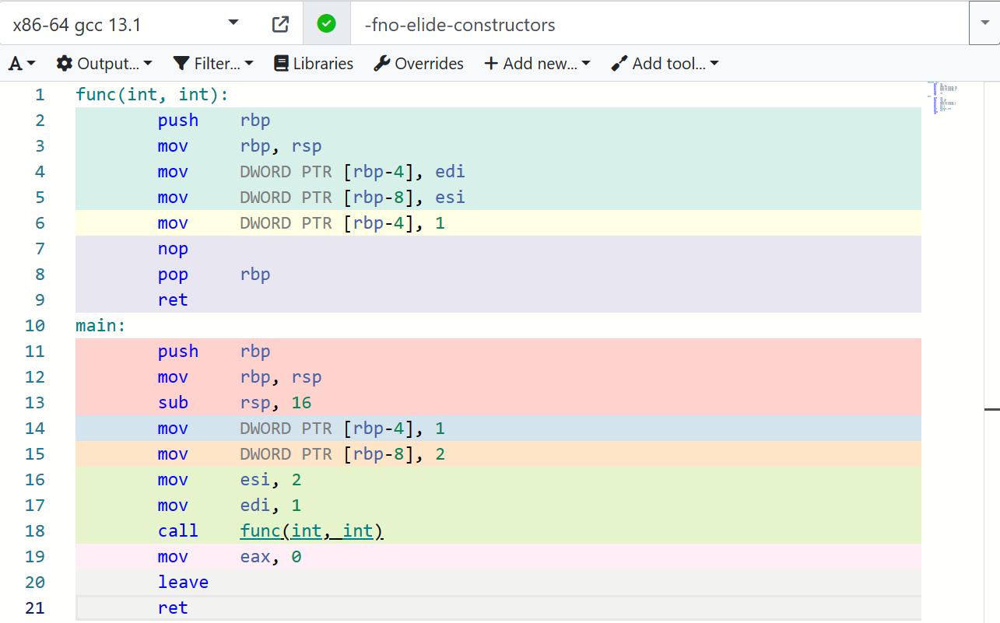

这里呈现出一个简单的C++代码及其对应的汇编代码。用寄存器作为中间人，将数据从内存中一块区域移到另一块内存区域。当只有一个参数时，这里用的时`edi`寄存器

但是，寄存器的数量是有限的。当参数过多时又该如何传递呢

在当前的环境中，经过测试，当函数的参数达到 7 个即以上时，多出来参数将直接通过压栈的方式存储，对应的内存空间就是参数了

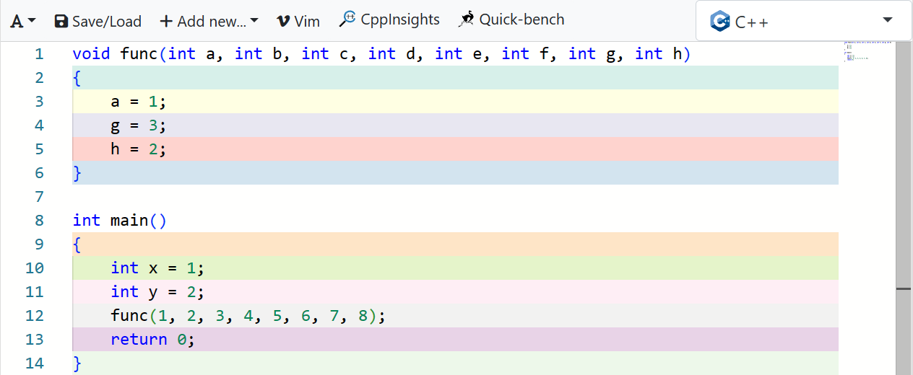

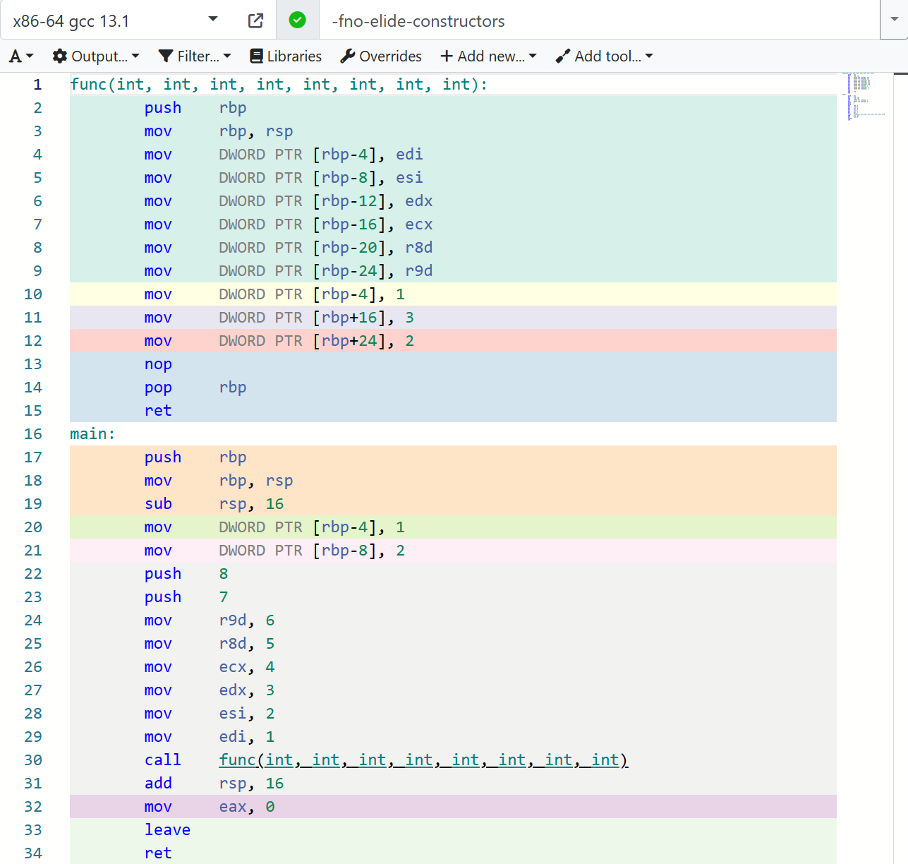

可以发现后面的参数比前面的参数先进入内存中，所以有时候发现函数参数中的内存地不规律的不用感到奇怪。但是函数内定义的局部变量内存地址肯定是递减的。

然后就是函数返回简单结果

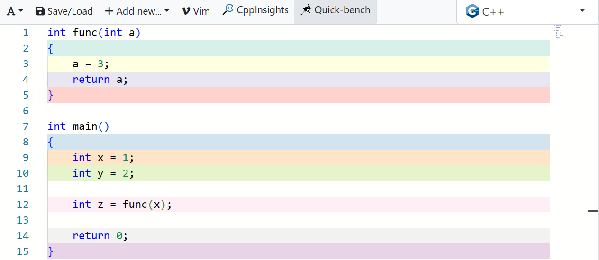

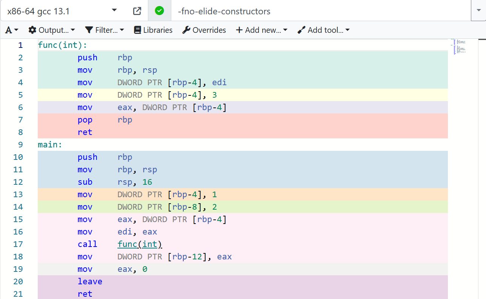

同函数传参一样，也是用寄存器充当中间人，将数据从一块内存区域移到另一块内存区域。不过返回结果一般用`eax`寄存器

以上都是基本数据类型的函数传参与函数返回结果，接下来看一下复杂类型的比如类。

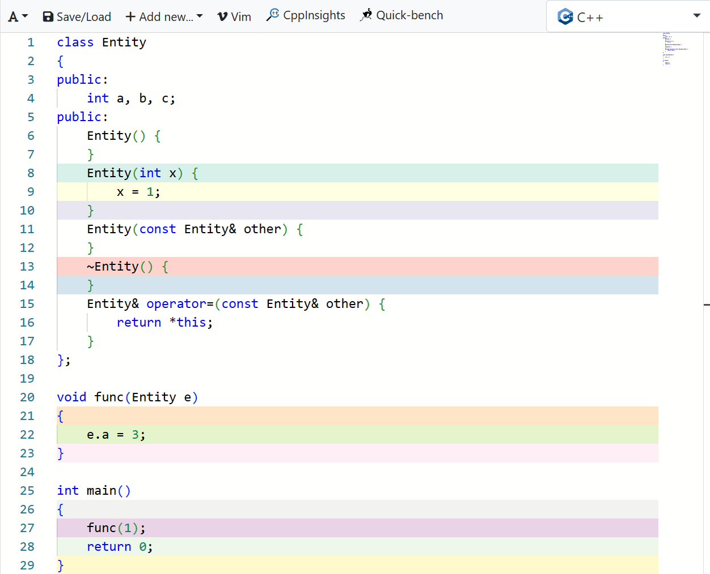

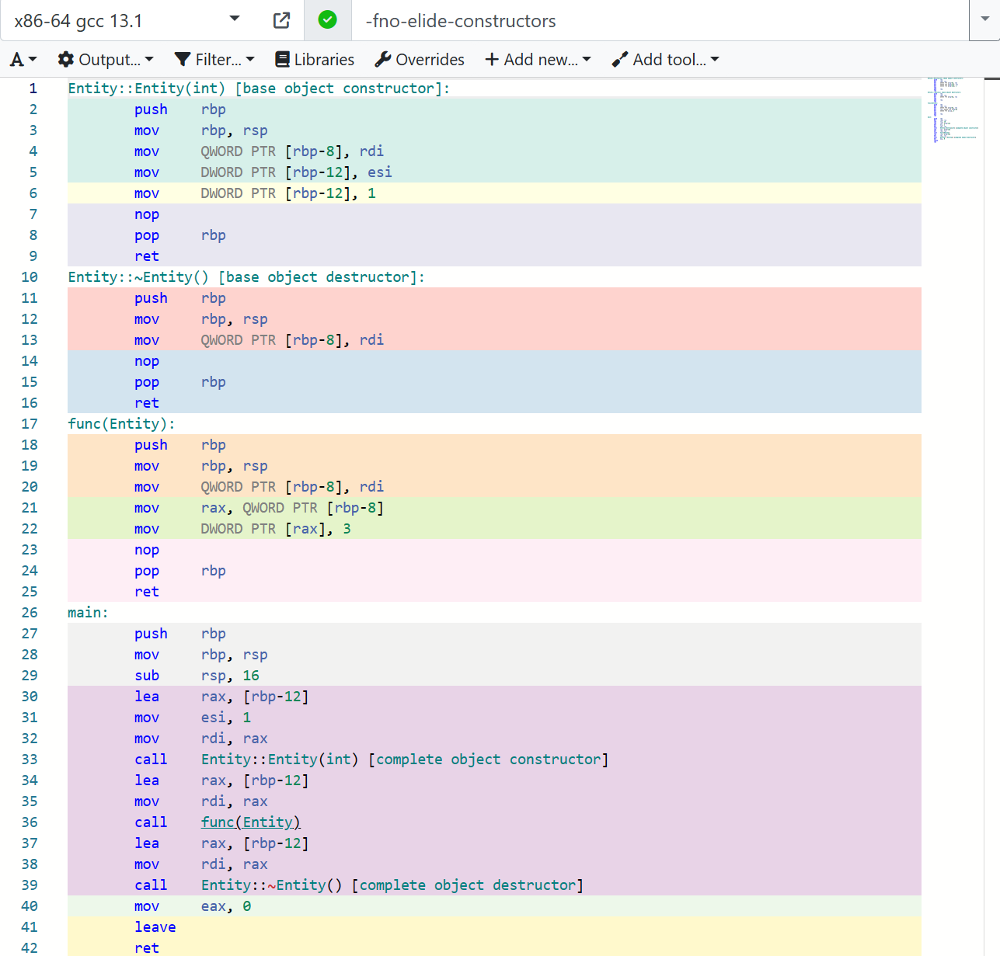

由于是复杂数据类型，所以编译器采用了参数过多时的传参方式，这里是隐式调用构造函数，在正式调用函数前先调用构造函数，将对象在在内存中先构造出来，然后直接在函数中使用这块内存。注意到，在调用类的函数前，都会有个`lea rax, [n]`，`mov rdi, rax`的操作，如果猜的不差，`[n]`这个内存单元就是对象的首个元素，那么这一通操作就是在`rdi`存放该对象的地址，以`rid`作为中间人，到时候赋值给`this`指针用的，在类函数中`this`指针也有专属的空间，这个例子里`[rbp-8]`就是`this`了。

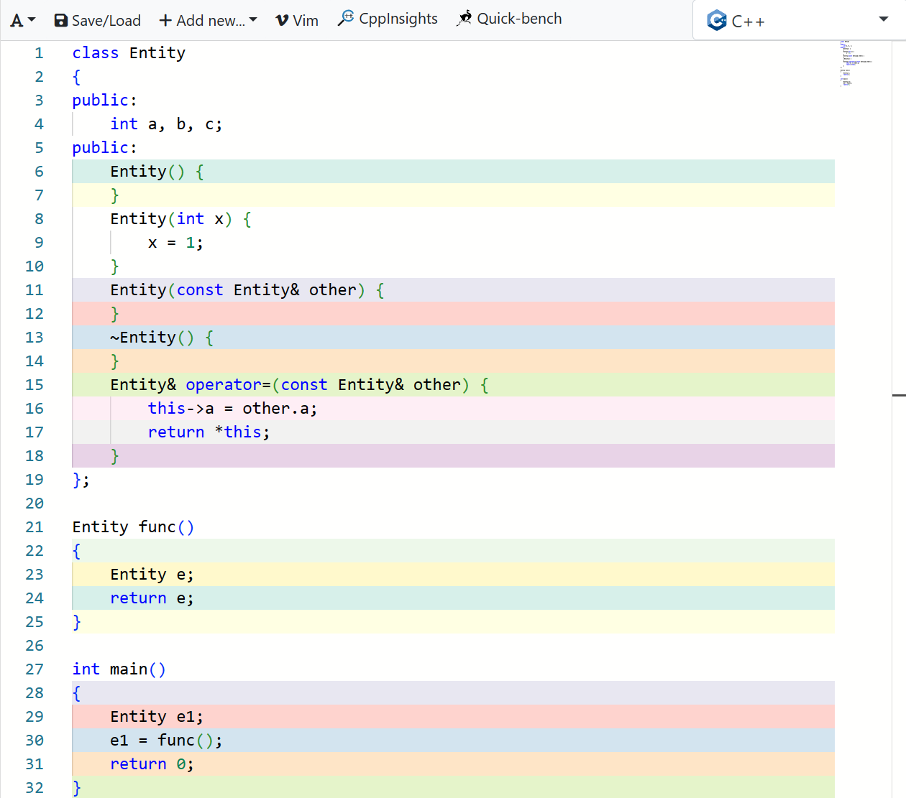

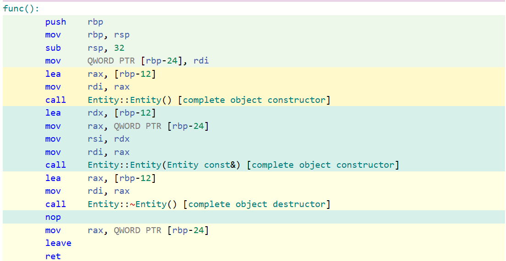

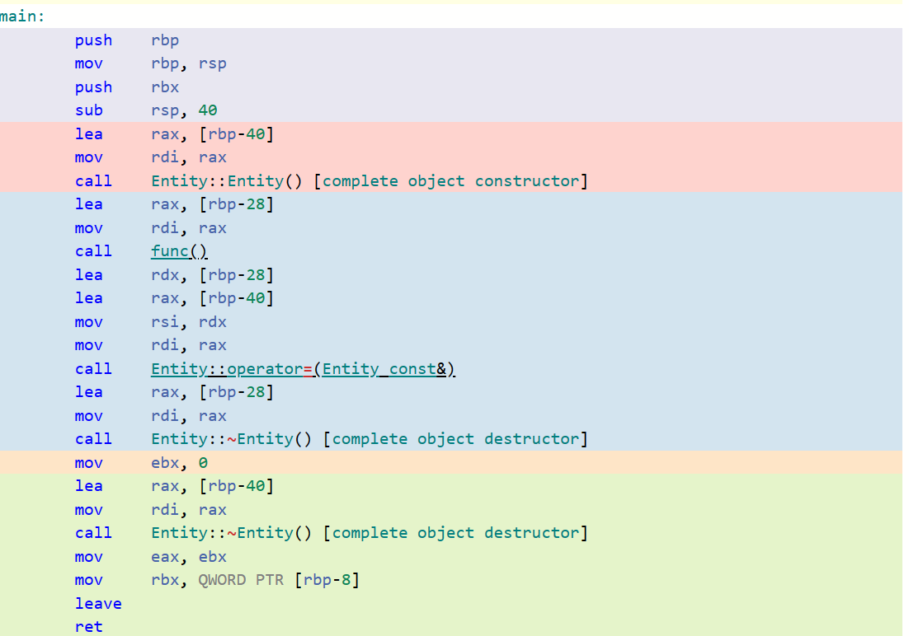

大致意思就是会在内存中用`e`拷贝构造函数构造出一个`tmp`，销毁`e`，然后赋值给`e1`，最后把`tmp`销毁。

对于类这样的复杂类型的函数传参和结果返回，编译器的做法就是在正式调用函数前先将参数和返回结果的内存分配出来，然后将它们的内存地址放到比如`rsi`和`rdi`中传到函数中，对它们做相应的操作。

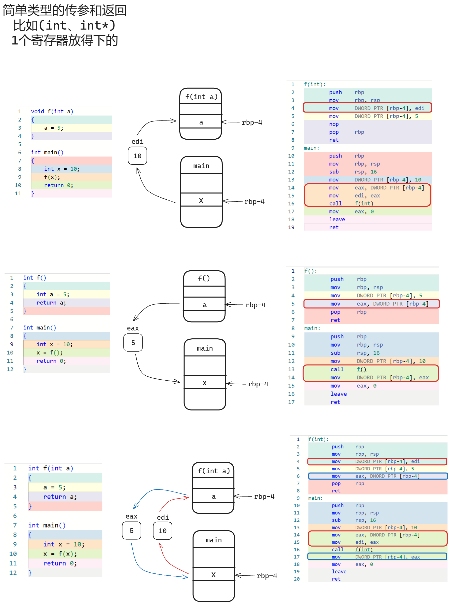

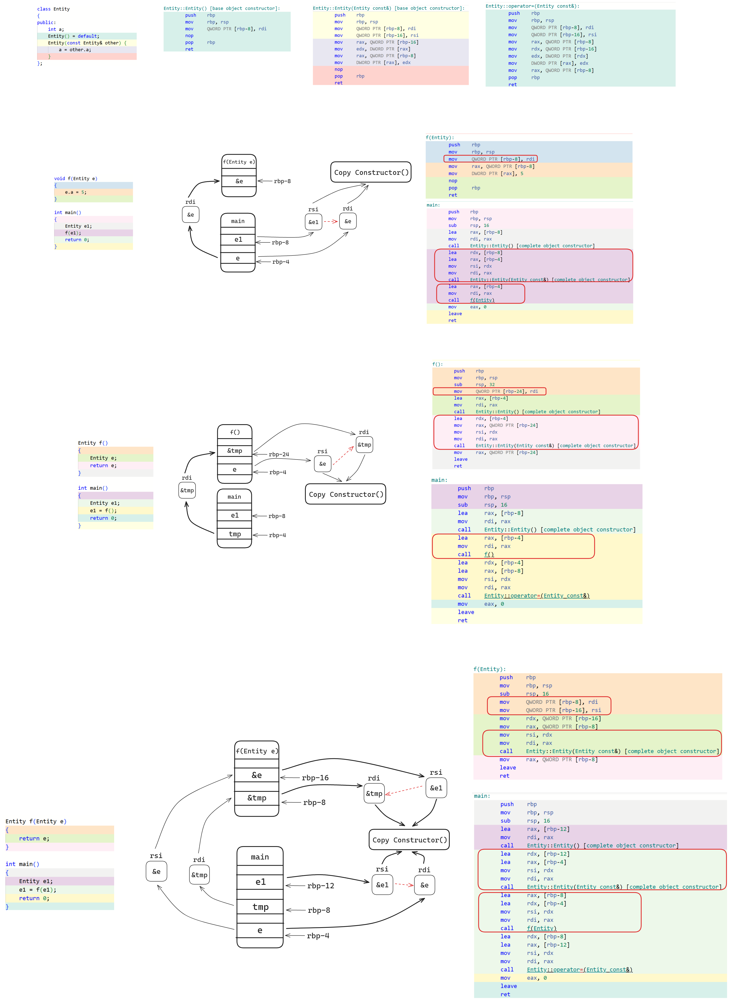