## 关系模型

**关系模型**，是数据模型的一种，数据模型还有层次模型和网状模型等。重点讲述关系数据模型

数据模型是现实世界数据特征的抽象，它有三个要素：

* 数据结构
* 数据操作
* 数据上的约束

### 关系数据模型

* 关系：就是一张二维数据表
* 属性：关系的列，是关系特征的描述
* 模式：由关系名和属性组成
	* `movies(title, year, length, genre)`
* 元组：就是关系的一行
	* (红海行动, 2018, 138, 动作)
* 域：属性的数据类型及取值范围，约束了一个关系的列

### 关系的性质(关系的约束)

* 不能出现相同的行
* 不能出现相同的列名
* 列已经是不可分割的最小数据项
* 可以交换任意两行的顺序
* 可以交换任意两列的顺序
* 每一列的数据类型、数据范围必须一致

### 投影运算

从关系R中取出几个列组成一个新的关系。

因为取出的列组成的关系有三个相同的元组，所以需要删掉两个元组。

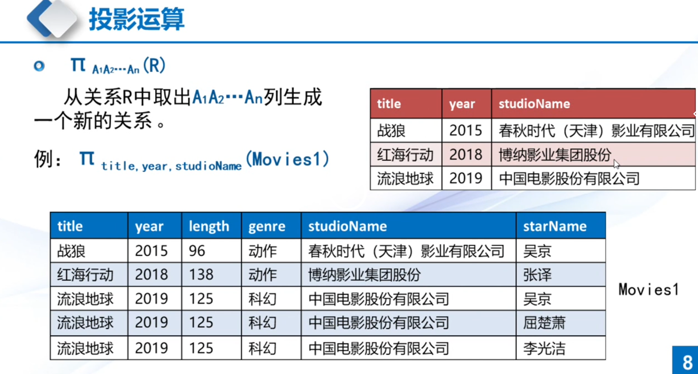

### 选择运算

从关系R中取出几行组成一个新的关系。

从关系R中取出满足条件c的元组组成一个新的关系

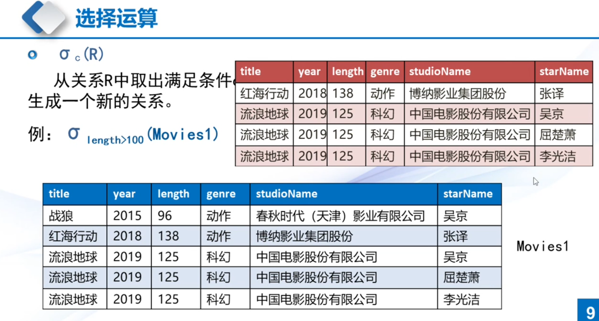

#### 总结

先 **选择** 再 **投影**，即先筛选行组成新的关系，再挑选列组成新的关系

## 三种连接

### 笛卡尔积

两个关系的各个元组总共有多少种组合方式

关系R和S的乘运算也称为笛卡尔积，记作 R × S

* 设关系R有i个属性，关系S有j个属性，则 R × S 有 (i + j) 个属性
* 设R有m个元组，S有n个元组，则 R × S 有 (m × n) 个元组
* 每个元组的前i个属性是R的一个元组r，后j个属性是S的一个元组s

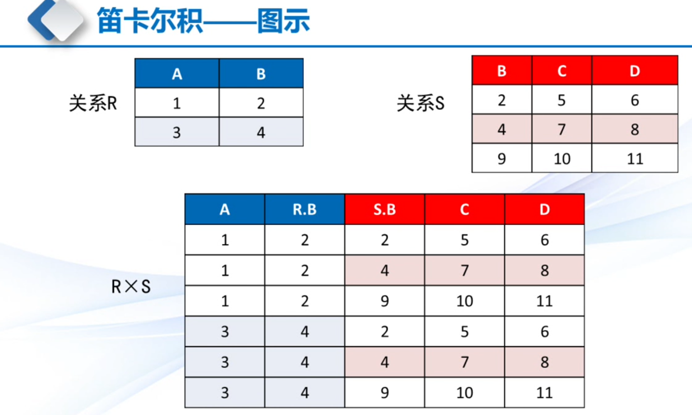

### 自然连接

在笛卡尔积的基础上，r 元组和 s元组连接需要满足以下条件：

* R 和 S存在某些共同的属性
* R 和 S在这些共同属性上的值相同

连接后的元组相同的属性只能保留一个

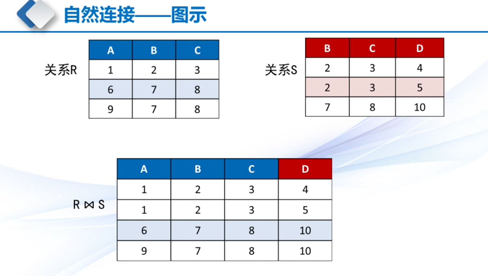

### θ连接

在笛卡尔积的基础上r 元组和 s元组连接需要满足自定义条件 c

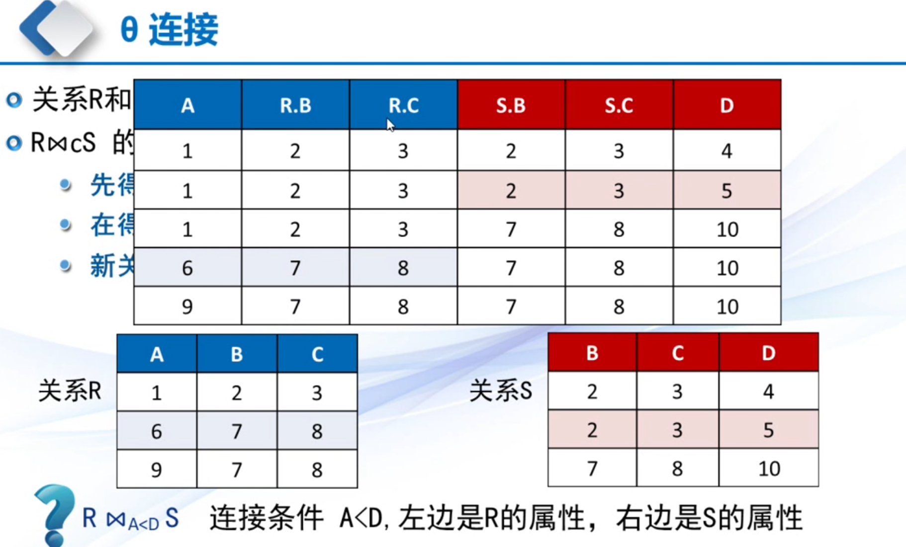

## 关系上的约束

### 实体完整性约束

* 键（也称码）：关系中某一属性或属性组的值能唯一标识一个元组，则称该属性或属性组为关系的键（码）
* 候选键（也称候选码）：若一个关系中存在多个键，这些键统称为候选键，从候选键中选一个键作为关系的键，这个键被称为**主键**（也称主码）。
* 主属性：**候选键**中的属性统称为主属性。

关系R的实体完整性约束：若属性A是关系R的主属性，则A不能取空值。控制（NULL）不是0，也不是空字符串，而是没有值。

### 参照完整性约束

外键：设`F`是关系`R`的一个或一组属性，但不是关系`R`的主键。如果`F`与关系`S`的某个键`KS`相对应（即实际意义相同，可以不同名），则

* 称F是关系R的外键
* 称关系R为参照关系
* 称关系S为被参照关系
* 外键是参照关系的一个键，另一个关系则是被参照关系

参照完整性规则：若属性（或属性组）F是关系R的外键，他与基本关系S的主码KS相对应，则对于

R中的每个元组在F上的值必须满足：

* 或者取空值（F属性组的每个属性均为空值），
* 或者等于S中某个元组的主键值。

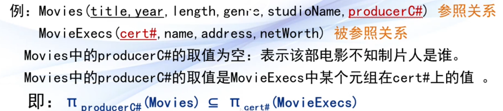

### 自定义完整性约束

定义的完整性是针对某一具体要求来定义的约束条件，它反映某一具体应用所涉及的数据必须满足的**语义要求**。

### 总结

* 实体完整性约束：针对主属性的约束，不能为空
* 参照完整性约束：针对外键的约束，要么为空要么有一个既定的值
* 自定义完整性约束：对某个属性的值有要求

## 关系数据库设计理论

### 函数依赖

关系R的两个元组在属性A上相同，在属性B上必定也相同，则称作 **A决定B，或者B依赖于A，记作 A→B**

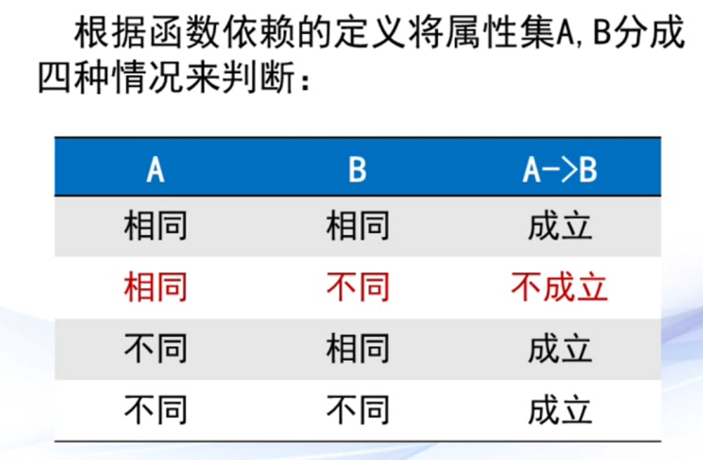

属性之间的**决定**是属性与属性之间的关系，并不涉及元组内所有属性。

但是**键**就涉及了一个关系的所有属性。

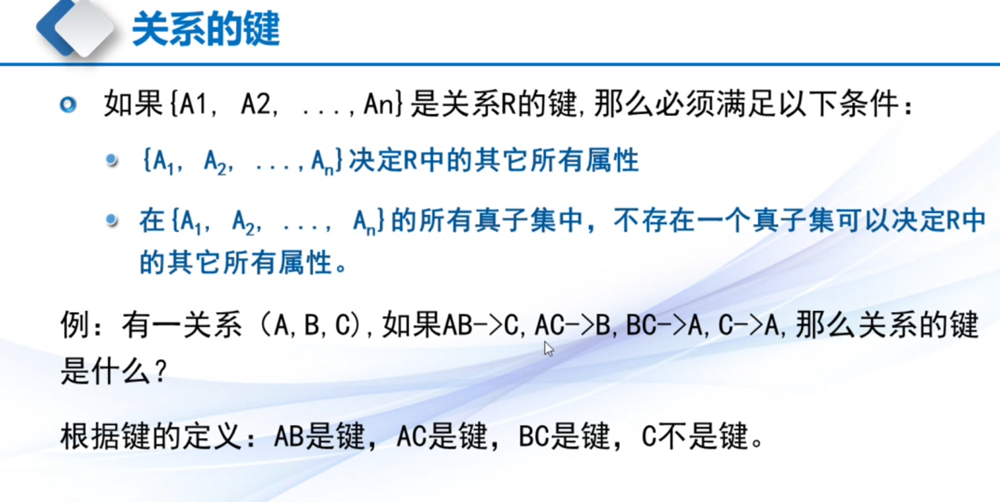

* 主键：在一个关系中可能会存在多个键，这些键统称为**候选键**，从候选键中指定一个键作为主键。注意键是由属性组成的(一般有大括号括起来)
* 主属性：候选键中的属性称为**主属性**
* 超键：包含键的属性**集**称为超键

### 函数依赖的规则

记：A = { A1A2...An }，
       B = { B1B2...Bm },
       C = { C1C2...Ck }.
存在 FD：B -> C，A -> B，A -> C

* B -> C，且 C 是 B 的子集，即 C完全是B的一部分
	称 B -> C 是**平凡的**函数依赖
* A -> B，且 A 与 B 有一部分属性重叠
	称 A -> B 是 **非平凡的**函数依赖
* A -> C，且 A 与 C 没有属性重合，即两个完全独立的属性集合
	称 A -> C 是**完全非平凡的**函数依赖

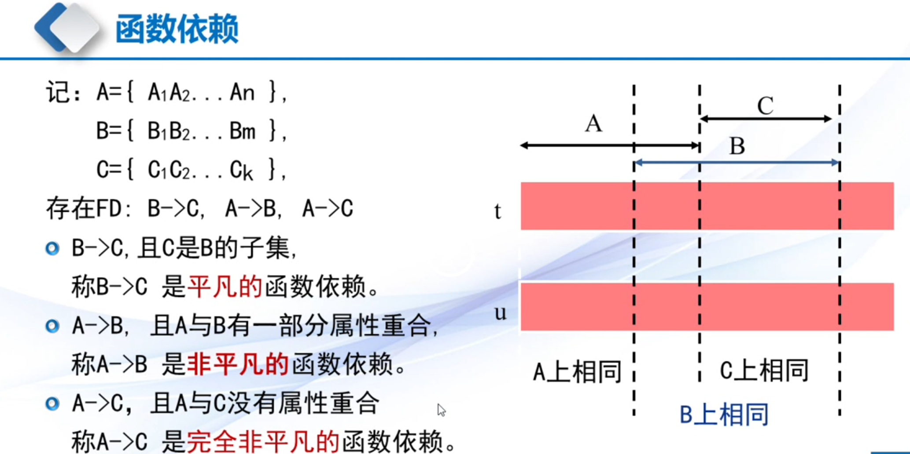

#### 等价

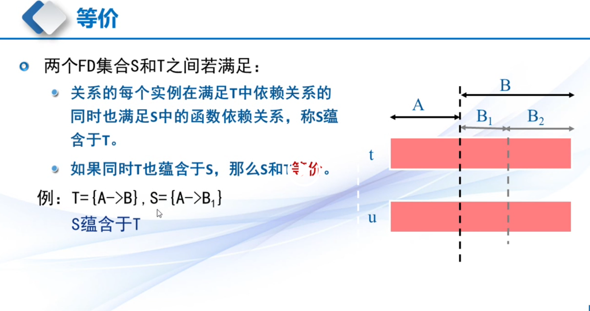

这个例子中，A决定B的同时也满足A决定B1，所以前者蕴含后者，后者蕴含于前者。

#### 分解和合并规则

左边的属性集不动，右边的属性集可以任意**拆分与合并**

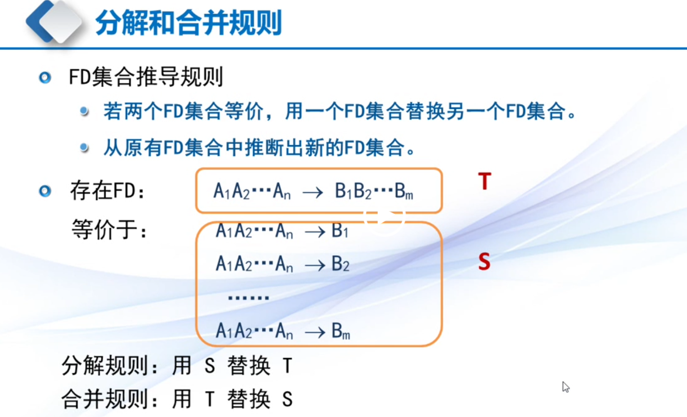

#### 传递规则

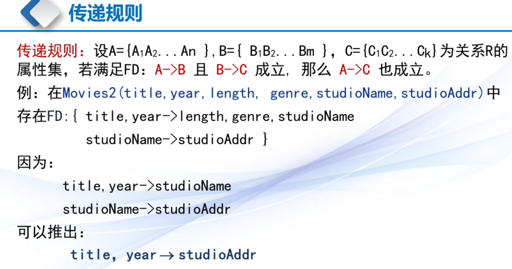

#### 三大公理

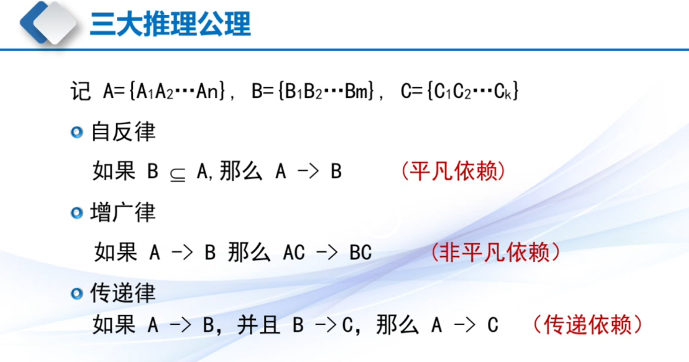

#### 最小基本集

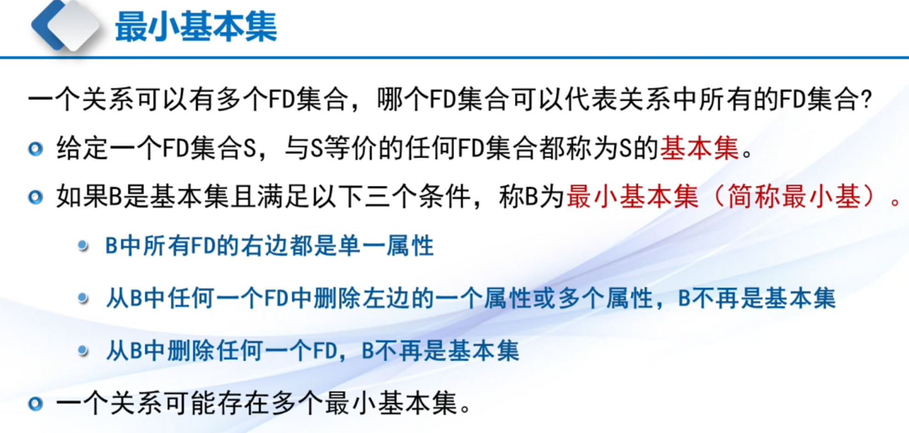

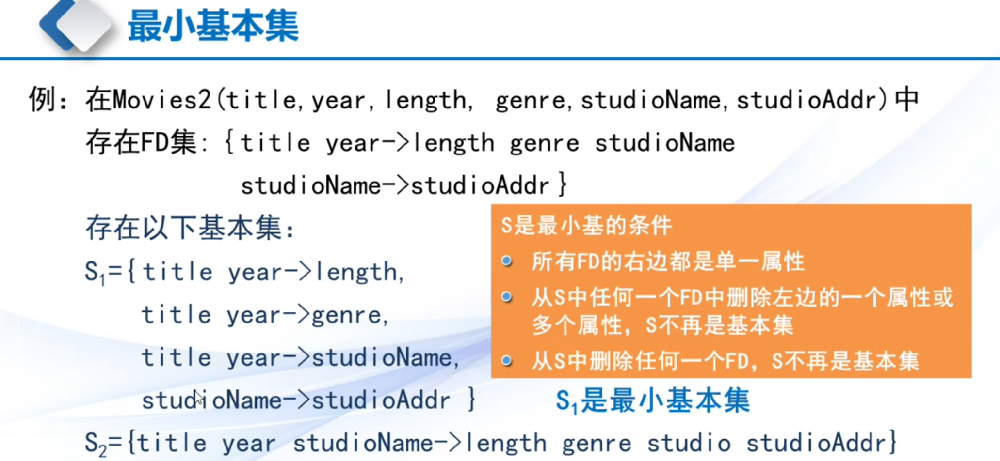

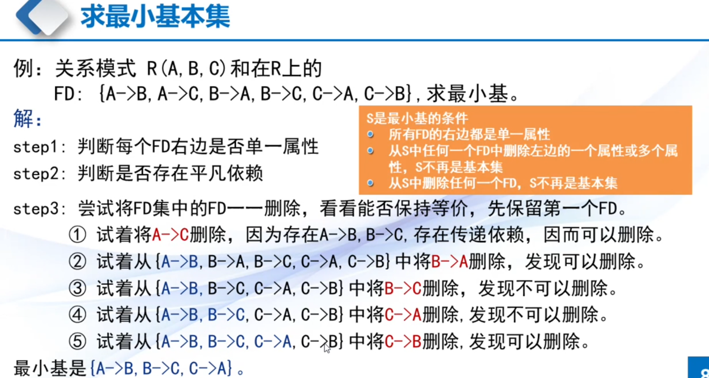

### 闭包

闭包是属性集

闭包是函数依赖的极限

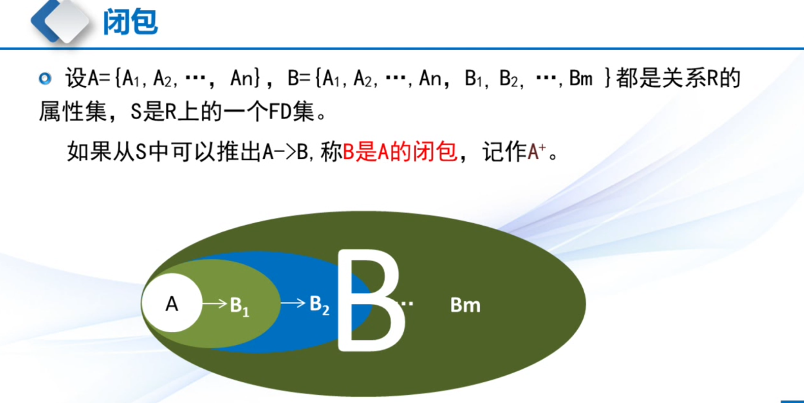

计算闭包的模板

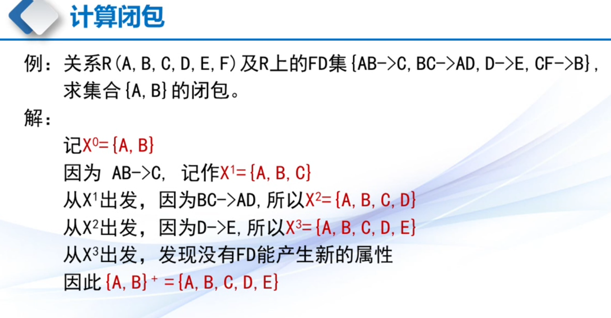

可以通过闭包求一个关系键，**如果一个属性集的闭包包含了其它属性，说明这个属性集就可以决定其它所有属性**，所以这个属性集可以作为该关系的键

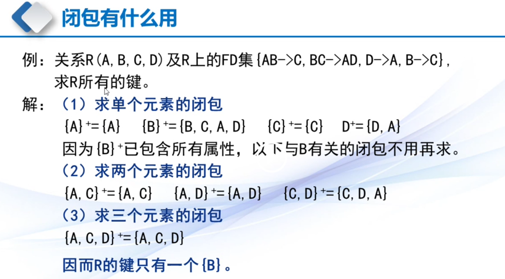

给定一个关系 R 和该关系的函数依赖集 S，先给出 R 的投影（子关系）R1，求 R1 的函数依赖集 S1：

做法就是：求出单个元素、两个元素、三个元素……在R上的闭包，而这些闭包就需要根据 S 来判断，然后摘出 R1 上有的元素 的函数依赖，将他们组成函数依赖集。为了保证是最小基本集，一般来说箭头的右边都只有一个属性

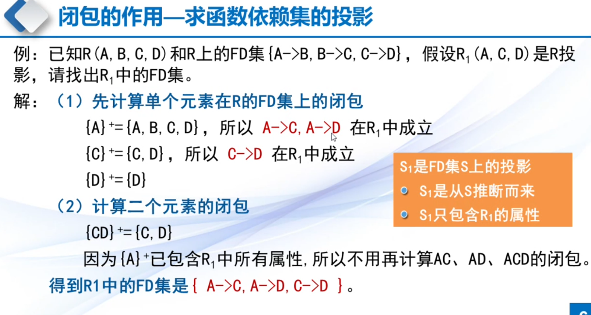

## 高级数据库模型

### E/R模型

数据库的**概念设计**，称为高级数据库设计

**概念模型**，称为高级数据库模型

在概念设计阶段，将解决和回答下属问题：

* 存储哪些信息
* 信息元素如何相互关联
* 有哪些约束（如键和引用完整性）

表示概念设计的符号：

* **E/R图（实体关系图）**
* UML (同一建模语言)
* ODL (对象描述语言)

### E/R模型——三要素

* **实体集**（用矩形表示）
	实体集是同一类型实体的集合
	实体是客观存在并相互区别的事物，实体可以是具体的人、事或物
* **属性**（用椭圆表示）
	实体所具有的特征称为属性，一个实体可具有多个属性
* **联系**（用菱形表示）
	在现实世界中，事物内部以及事物之间是有联系的，这些联系在信息世界中反映为实体集内部的联系和不同实体集之间的联系

实体集A和实体集B可能存在三种联系：

* 一对一联系（1 ：1）
* 多对一联系（n ：1）
* 多对多联系（m ：n）

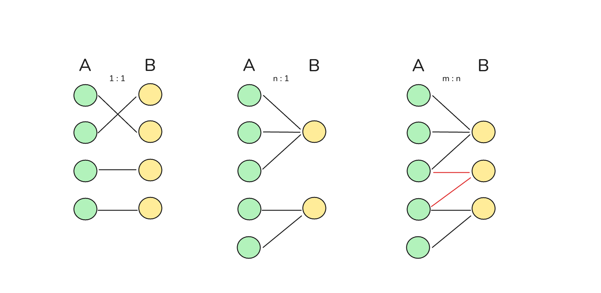

### E/R模型中的子类

**"isa"**是一对一联系，用三角形表示，将一个实体集和它的子类连接起来

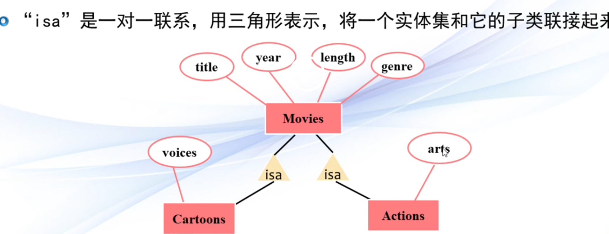

一个E/R图

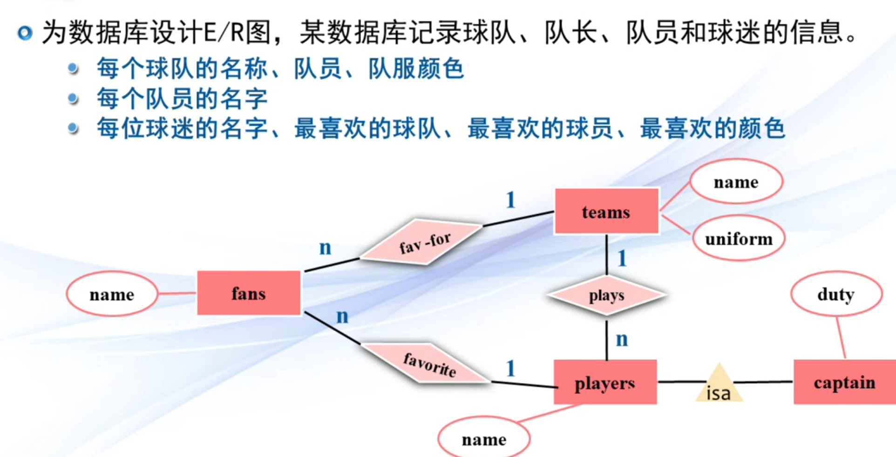

## 逻辑结构设计

### 实体集到关系的转化

转化规则：

* 一个实体集转化成一个关系模式（一张表）
* 实体集的属性转化成关系的属性（表的列）
* 实体集的键转化成关系的键

联系如何转换成关系：

### 二路联系

一对一的联系：

* 方法一：将联系单独转化为一个关系模式，联系原有的属性转化为关系的属性，关系的键由两个实体集的键组合而成。
* 方法二：选择一个实体集对应的关系模式，将联系转化成该关系的属性并入，如何转化？保留联系原有的属性并加上另一个实体集的键。

多对一的联系：

* 方法一：将联系单独转化为一个关系模式，联系原有的属性转化为关系的属性，关系的键由两个实体集的键组合而成。
* 方法二：选择一端将联系并入，并入方法和上面一样，但是选择**多端合并**。为什么选择多端？如果选择多端，就是多端的每个元组加一列来存储一端的键来维持联系；但如果选择一端，就需要一端复制自己生成n个元组并添加一列来存储多端的键来维持联系，重点是需要凭空多出n个元组来维持联系这是严重的冗余。

多对多的联系：

* 只有一种方法：将联系单独转化为一个关系模式，联系原有的属性转化为关系的属性，关系的键由两个实体集的键组合而成。

### 多路联系

只有一种方法：将联系单独转化为一个关系模式，联系原有的属性转化为关系的属性，关系的键由两个实体集的键组合而成。

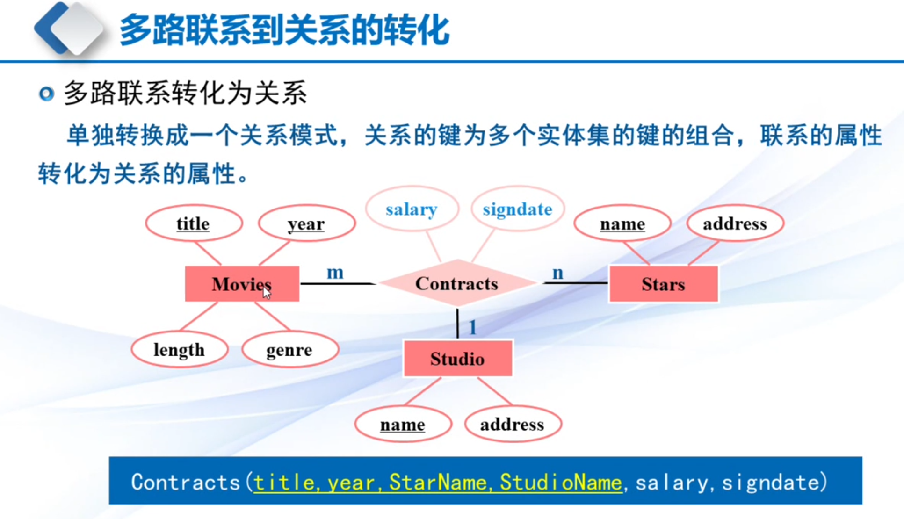

### isa联系

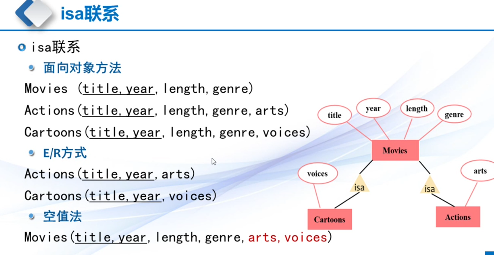

### 弱实体到关系的转化

弱实体转化为关系后的模式组成：

* 弱实体原有的属性
* 支持联系所有的属性
* 支持实体集的键作为弱实体的键

支持联系不用转化为关系

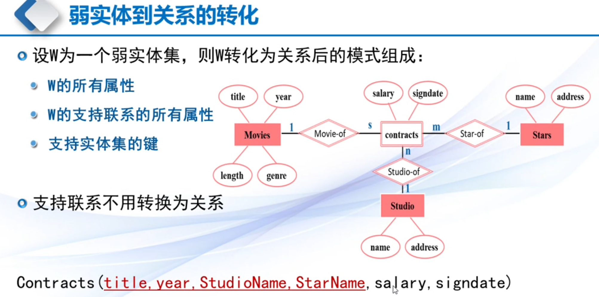

## 数据库语言SQL

### 定义关系模式

使用 **CREATE TABLE** 定义关系型模式（创建表）

`CHAR`是定长字符串，`NCHAR`表示明确使用`unicode`编码。

`CHAR(50)`和`VARCHAR(50)`的区别在于，`CHAR(50)`是一个定长字符数组，如果输入不够50个字符后面会补`50 - n`个空格，当然输入不能大于50个字符；`VARCHAR(50)`是不定长的字符串，50只限制了最大输入字符串，存储的字符数该输入多少个就是多少个。

~~~sql
CREATE TABLE Movies (
	title NCHAR(50),
    year INT,
    length INT,
    genre NCHAR(10),
    studioName NVARCHAR(30), 
    producerC# INT
);
~~~

##### 定义主键

在关系中可以选择一个属性作为主键，也可以选择一组属性作为主键。在创建表时也可以选择一个或一组属性作为主键，不过定义的方法不同。

~~~sql
CREATE TABLE MovieStars (
	name NCHAR(30) PRIMARY KEY, -- 选择一个属性作为主键
    address NVARCHAR(255),
    gender CHAR(1),
    birthdate DATETIME
);

CREATE TABLE Movies (
	title NCHAR(50),
    year INT,
    length INT,
    genre NCHAR(10),
    studioName NVARCHAR(30), 
    producerC# INT,
    PRIMARY KEY(title, year), -- 选择一组属性作为主键
);
~~~

##### 唯一约束UNIQUE

~~~sql
CREATE TABLE MovieStars (
	name NCHAR(30) PRIMARY KEY,
    address NVARCHAR(255) UNIQUE,
    gender CHAR(1),
    birthdate DATETIME
)
~~~

* `UNIQUE`约束：在该列的取值必须唯一，**但可以取空值**
* `PRIMARY KEY`约束：在该列的取值必须唯一，不能取空值

##### 定义空值约束NULL

~~~sql
CREATE TABLE MovieStars (
    name NCHAR(30) PRIMARY KEY,
    address NVARCHAR(255) UNIQUE NOT NULL,
    gender CHAR(1),
    birthdate DATETIME
)
~~~

* `NULL`约束：没写`NOT NULL`就是默认`NULL`，表示属性可以取空值；当然主键还是不能取空值的
* `NOT NULL`约束：表示该属性不能取空值

##### 基于属性的CHECK约束

`CHECK`约束是当该属性获得新值时被检查。

有2种写法，一种是在定义属性时顺便加上，另一种是另起一行加个`CONSTRAINT`关键字专门写约束

~~~sql
CREATE TABLE MovieStars (
	name NCHAR(30) PRIMARY KEY,
    address NVARCHAR(255) UNIQUE NOT NULL,
    gender CHAR(1) CHECK (gender in ('F', 'M')),
    birthdate DATETIME
);

CREATE TABLE MovieStars (
	name NCHAR(30) PRIMARY KEY,
    address NVARCHAR(255) UNIQUE NOT NULL,
    gender CHAR(1),
    birthdate DATETIME,
    CONSTRAINT gender_check CHECK(gender in ('F', 'M'));
);
~~~

##### 设置默认值

可以在创建关系时给属性设置默认值，插入元组时如果没有给该属性赋值，该属性的值就用默认替代。

~~~sql
CREATE TABLE MovieStars (
    name NCHAR(30) PRIMARY KEY,
    address NVARCHAR(255),
    gender CHAR(1) DEFAULT 'M',
    birthdate DATETIME DEFAULT '0000-00-00'
);
~~~

#### 修改关系模式

使用 `DROP TABLE` 语句删除关系模式

~~~sql
DROP TABLE MovieStars;
~~~

从数据库模式中删除 M 。 viestars 模式，包括里面的元组也一起删除。

使用 `ALTER TABLE` 语句更改关系模式

* 使用 `ADD` 子句添加属性和约束
	~~~sql
	ALTER TABLE Movi eStars AD D mob i | e NCHAR （ 1 1) DEFALUT 'unlisted';
	~~~

* 使用 `DROP` 子句删除属性和约束
	~~~sql
	ALTER TABLE MovieStars DROP mobile;
	~~~

#### SQL中的投影

用`SELECT`字句对结果关系进行投影，选出我们要的列。

可以用 `AS`在列投影出来后进行改名

~~~sql
SELECT title AS name, lenth duration -- title 改为 name, length 改为 duration
FROM Movies
WHERE studioName = 'Disney' AND year = 2019

-- 注：AS可以省略，只要列名与别名之间保留空格就行
~~~

投影的对象可以是属性，也可以是**表达式**

* 用表达式取代属性

~~~sql
SELECT title name, length/60.0 lengthInHours, 'hours' inHours
FROM Movies
WHERE studioName = 'Disney' AND year = 2019
~~~

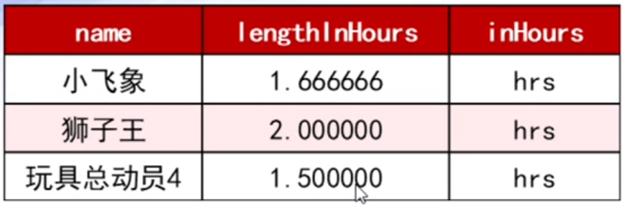

#### 输出排序

对查询结果的元组以某种顺序表示

`ORDER BY` 属性列表 `ASC/DESC`

* 排序是在 `FROM` 、 `WHERE` 等子句的结果上进行，排序之后再执行 `SELECT` 子句。
* 排序列可以是表达式： `ORDER BY A+ B DESC`
* 排序默认是升序 `ASC` ，也可以指定按降序 `DESC` 排序。

~~~sql
SELECT *
FROM Movies
WHERE studioName = 'Disney'
ORDER BY length, title DESC -- 先按length升序，再按title降序
~~~

### 字符串比较

`str LIKE pattern`

其中`str`是字符串，`pattern`是使用通配符表示的模式，通配符有以下这些：

* `%`，表示任意长度的字符串
* `_`，表单单个字符
* `[ ]`，指定括号里的任意单个字符
* `[^]`，占位的字符不是括号里的任意字符

注意区分:

* `s%`: 以 s 开头的字符串
* `%s`: 以 s 结尾的字符串
* `%s%`：含有 s 的字符串

如果匹配模式中有单引号的模糊匹配：

~~~sql
SELECT title
FROM Movies
WHERE title LIKE '%'' s%';
~~~

==注： SQL 中约定两个连续的单引号表示一个单引号==

如果匹配模式中带有`%`或者`_`等特殊字符需要匹配的话，需要用：

**SQL中用`ESCAPE 'x'`来指定任意字符x临时担任转义字符**:

~~~sql
s LIKE 'x%%x_' ESCAPE 'x'
x 是转义字符，
x% 表示字符串以%开头
% 表示任意长的字符串
x_ 表示字符串以_结尾
~~~

### 字符串的拼接

两个字符串进行拼接的运算符：**+**

`'ABC ' + 'D ' = 'ABC D '`

* 要求运算符两边均是字符串
* 拼接时左右两边的空格均保留

~~~sql
SELECT title+StudioName ts
FROM Movies
~~~

### SQL中的NULL

SQL 中的空值 NULL, 有许多不同的解释：

* 未知值：知道它有一个值但不知道是什么，如在 MovieStars 表中某个影星的生日不知道。
* 不适用的值：表示任何值在这里都没有意义，在 MovieStars 表中如果有一列用来描述影星的配偶的姓名，如果该影星单身，该属性只能是空，给任何具体值都不符合实情。
* 保留的值：属于某对象但无权知道的值，一般用在权限不足以获取实际取值时， M 。 viestars 表中如果有一属性用来描述影星的手机，该属性的值常常为 NULL

NULL 的运算规则

* NULL 和其他任何值的算术运算结果都是 NULL
* NULL 是一个特殊值，但又不算是一个常量，不能给NULL赋值
* 判断 x 的值是否为空值，不能用等号**=**
	* x IS NULL           x 为空时，结果为 TRUE
		x IS NOT NULL   x 不为空时，结果为 TRUE

### 多关系查询

笛卡尔积：π~a1,a2~(R~1~ × R~2~)
~~~SQL
SELECT a1, a2     (投影)
FROM R1, R2       (积的运算)
~~~

θ 连接：π~a1,a2~(σ~cond~ (R~1~ × R~2~) )

~~~SQL
SELECT a1, a2
FROM R1, R2
WHERE cond       (选择运算)
~~~

自然连接：π~a1,a2~(σ~cond~ (R~1~ ⋈ R~2~) )

~~~SQL
SELECT a1, a2
FROM R1, R2
WHERE cond AND R1.r1=R2.r2
~~~

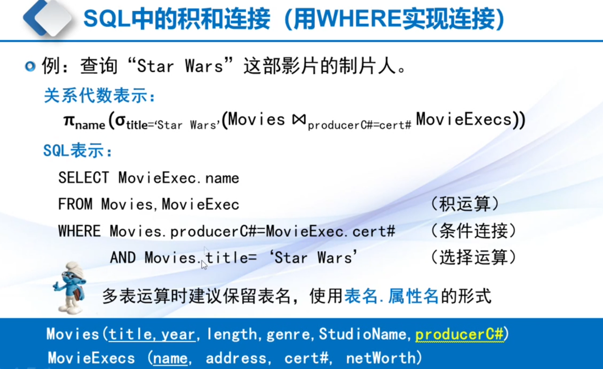

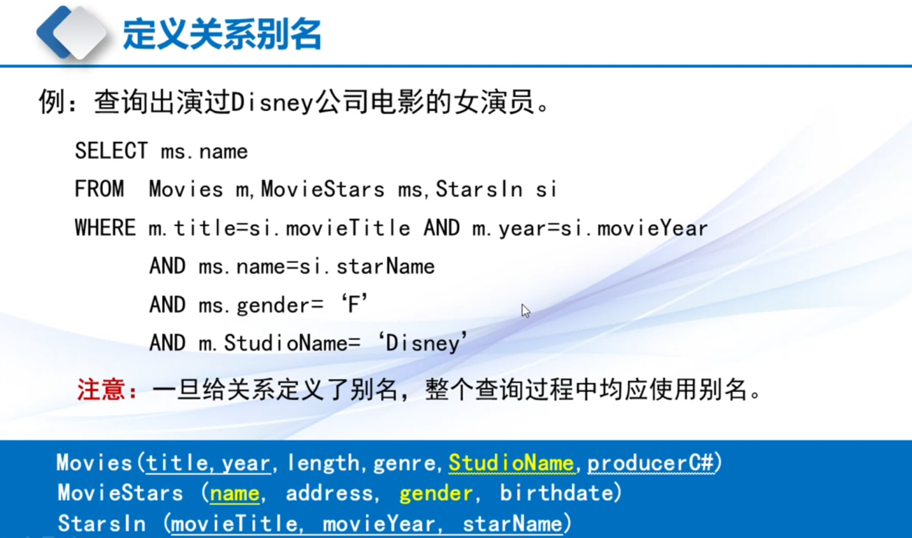

### SQL中的积和连接（用JOIN实现连接）

积：笛卡尔积：π~a1,a2~(R~1~ × R~2~)

~~~SQL
SELECT a1, a2             (投影)
FROM R1 CROSS JOIN R2     (积的运算) = FROM R1, R2
~~~

#### 内连接

**内连接**：先自然连接 + 再 θ 连接，或者先 θ 连接 + 再选择

~~~SQL
SELECT a1, a2
FROM R1 INNER JOIN R2 ON R1.r1 = R2.r2     (INNER可省略)
WHERE cond
等同于
SELECT a1, a2
FROM R1, R2
WHERE R1.r1 = R2.r2 AND cond
~~~

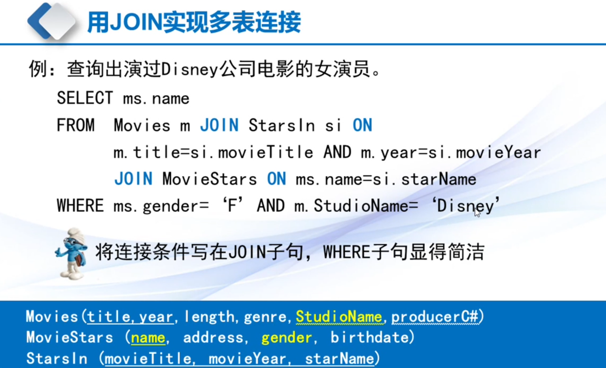

#### 外连接

外连接分为**左外连接**、**右外连接**和**全外连接**

#### 左连接

**左外连接**的结果返回左表的**所有数据行**

~~~sql
SELECT *
FROM R LEFT OUTER JOIN S ON R.A = S.A         (OUTER可省略)
~~~

左表与右表做有条件的笛卡尔积，先遍历左元组，内嵌遍历右元组，如果符合条件就连接两个元组；右元组如果遍历完没有符合条件，仍然在新关系中加上左元组，但是右元组的所有属性设为 `NULL`。

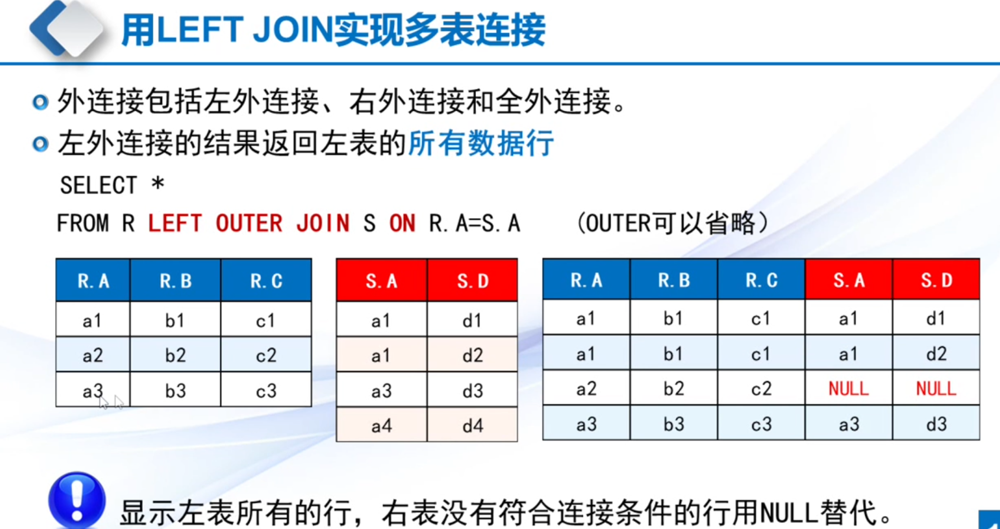

#### 右连接

**右外连接**的结果返回右表的**所有数据行**

~~~sql
SELECT *
FROM R RIGHT OUTER JOIN S ON R.A = S.A         (OUTER可省略)
~~~

与左外连接相同，只不过是先遍历右元组再内嵌遍历左元组。在都不符合条件的情况下，新的关系上添加右元组，左元组的所有属性设为 `NULL`。

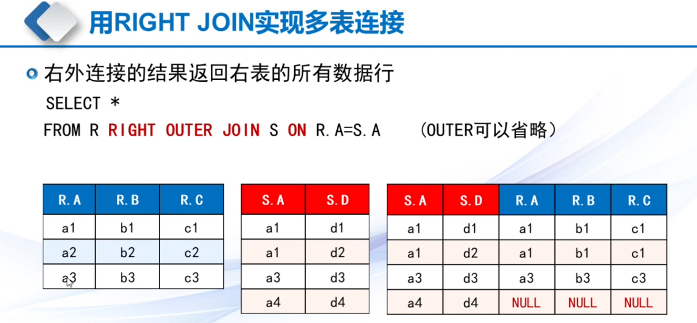

==R RIGHT JOIN S 等同于 S LEFT JOIN==

#### 全外连接

**全外连接**，是左外连接和右外连接的结合。

符合条件的元组都一样直接加上去，不符合条件的左外连接和右外连接各来一次

~~~sql
SELECT *
FROM R FULL OUTER JOIN S ON R.A = S.A         (OUTER可省略)
~~~

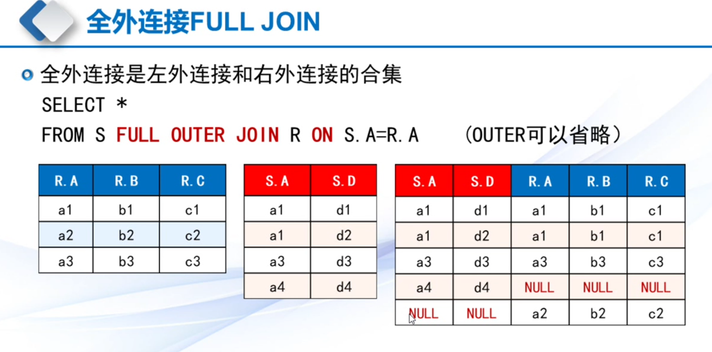

### 子查询

当某个查询是另一查询的一部分时称该查询为子查询，另一查询称为父查询。

* 子查询可以用 `INTERSECTS` `EXCEPT` 和 `UNION`连接起来
* 子查询可以返回单个常量，能与父查询中 `WHERE` 子句的常量进行比较。
* 子查询能返回关系，可被父查询的 `WHERE` 子句以不同的方式使用。
* 子查询返回的关系，可以出现在 `FROM` 子句中

**EXISTS** 子查询

`[NOT] EXISTS R`，当且仅当子查询结果R非空时，表达式的值为真

~~~sql
-- 查询参演‘红海行动’的影星
SELECT starName
FROM StarsIN
WHERE EXISTS (
	SELECT * 
    FROM Movies
    WHERE StarsIn.movieTitle = Movies.title
    	  AND Movies.title = '红海行动'
);
~~~

**IN** 子查询

`[NOT] s IN R`，当且仅当s等于R中的某一个值时，表达式为真

~~~sql
-- 查询有女影星出演的电影
SELECT movieTitle
FROM StarsIn
WHERE starName IN (
	SELECT *
    FROM MovieStars
    WHERE gender = 'F'
);
~~~

当子查询的结果不止一个元组时，用 "IN"

当子查询的结果只有一个元组，可以用 "="

**ALL** 子查询

`[NOT] s > ALL R`，当且仅当子s比R的所有值都大时，表达式的值为真

~~~sql
-- 查询哪部影片的放映时间最长
SELECT title
FROM Movies
WHERE length >= ALL (
    SELECT length FROM Movies
);
~~~

**ANY** 子查询

`[NOT] s > ANY R`，当且仅当s至少大于R中某个值非空时，表达式的值为真

~~~sql
-- 查询被两部或两部以上电影使用过的电影名
SELECT title, year
FROM Movies m1
WHERE m1.year > ANY (
	SELECT m2.year
    FROM Movies m2
    WHERE m1.tile = m2.title
);
~~~

子查询输出同名影片制作时间，父查询输出年份最近同名电影

**FROM 子句中的子查询**

查询结果作为关系直接用于 FROM 子句，应当括起并给予别名

~~~sql
SELECT name
FROM MovieExec, (SELECT ProducerC#
                 FROM Movies, StarsIn
                 WHERE Movies.title = StarsIn.movieTitle
                 AND Movies.year = StarsIn.movieYear
                 AND StarsIN.starName = '黄渤') Prod
WHERE cert# = Prod.producerC#
~~~

### 交操作

用保留字 INTERSECT 表示交操作

~~~sql
-- 找出那些即是女影星同时又是超过 1 亿资产的制片人的名字和地址
(SELECT name address FROM MovieStars WHERE gender= 'F')
INTERSECT
(SELECT name address FROM MovieExecs WHERE netWorth>100000000)
~~~

交操作不会消除两个相等的元素，而是把两个相等的元组一起放入新的关系中

## 约束和触发器

* 约束是存储在数据库中的表达式或语句
* 当某个时间发生或数据库更改时执行，约束主动起作用
* SQL Server提供完整性约束包括
	* 键
	* 参照完整性
	* 域约束、检查约束（check)
	* 断言
* SQL提供触发器：在某些指定事件上被主动调用，也是一种约束

#### 基于属性（元组）的约束

~~~sql
CREATE TABLE MovieStars (
	name NCHAR(30) PRIMARY KEY,
    address NVARCHAR(255) UNIQUE NOT NULL,
    gender CHAR(1) CHECK (gender in ('F', 'M')),
    birthdate DATETIME
);

CREATE TABLE MovieStars (
	name NCHAR(30) PRIMARY KEY,
    address NVARCHAR(255) UNIQUE NOT NULL,
    gender CHAR(1),
    birthdate DATETIME,
    CONSTRAINT gender_check CHECK(gender in ('F', 'M'));
);
~~~

#### 定义参照完整性约束（外键）

~~~sql
CREATE TABLE Movies (
	title CHAR(100),
    year INT,
    length INT,
    genre CHAR(10),
    studioName VARCHAR(30) REFERENCES Studios(name), -- 它要参照Studios关系里的name属性
    producerC INT REFERENCES MovieExecs(cert),  -- 它要参照MovieExecs关系里的cert属性
    PRIMARY KEY(title, year)
)

CREATE TABLE Movies (
	title CHAR(100),
    year INT,
    length INT,
    genre CHAR(10),
    studioName VARCHAR(30),
    producerC INT,
    PRIMARY KEY(title, year),
)
~~~

可以引用同一个表中的字段。比如 Students(id, name, depid, monitorid)
`FOREGIN KEY(monitorid) REFERENCES id`

可以声明一个具有空值的外键

在 Movies 关系中已定义了参照完整性（或者说数据一致性）， DBMS 为维护参照完整性，将阻止下列操作。

* 对参照关系 `Movies` 操作的阻止

	* 插入新元组到`Movies` ，若新元组的 `producerC#` 不为空且不是 MovieExecs 任何元组的 `cert#` 值
	* 修改`Movies`元组，其 `producerC#` 不为空且不是 `MovieExecs` 任何元组的 `cert#` 值

* 对被参照关系 `MovieExecs` 操作的阻止

	* 删除 `MovieExecs` 元组，该元组的 cert# 非空且被 `Movies` 的 `producerC#` 引用
	* 修改 `MovieExecs` 元组 `cert#` 值，但该` cert#` 值被 `Movies` 的` producerC#` 引用。也就是说`cert#`被指向了，那么它就不能被修改，防止引用失效（野指针）。这是拒绝原则控制的。

	其实如果要修改**被引用**属性的值也不是不可以（`MovieExecs.cert#`），不过要满足以下三个原则（原则其一即可）来保证参照完整性

	1. **拒绝原则**（DBMS的默认原则）

		拒绝任何违反参照完整性约束的更新。若 `MovieExecs` 关系中某个元组的 `cert#` 被 `Movies` 中 `producerC#` 参照引用，那么不能对该元组的 `cert#`进行更新操作。

	2. 级联原则（同时更新）

		若 `MoviesExecs` 中被参照的 `cert#` 值发生了更新，那对应的 `Movies` 中的 `producerC#` 值也同时发生更新。

	3. 置空原则（置零）

		若 `MovieExecs` 中被参照的 `cert#` 值发生了更新，那对应的 `Movies` 中`producerC#`的值置为空。

	~~~sql
	CREATE TABLE Movies (
		title CHAR(100),
	    year INT,
	    length INT,
	    genre CHAR(10),
	    studioName VARCHAR(30),
	    producerC INT,
	    CONSTRAINT PRIMARY KEY(title, year),
	    FOREIGN KEY(studioName) REFERENCES Studios(name) ON DELETE SET NULL, -- 对面被删除时此处置空
	    FOREIGN KEY(producerC) REFERENCES MovieExecs(cert) ON UPDATE CASCADE -- 级联更新
	)
	~~~

	注意，后面几行的约束开头的`CONSRAINT`关键字可以省略，但是如果要给约束命名，就需要带上`CONSRAINT`关键字并紧接着约束名。其实命名在前在后都行，不过在前的话一定要带上`CONSRAINT`关键字。

	~~~sql
	CREATE TABLE Movies (
		title CHAR(100),
	    year INT,
	    length INT,
	    genre CHAR(10),
	    studioName VARCHAR(30),
	    producerC INT,
	    PRIMARY KEY titleyear_key(title, year),
	    CONSTRAINT pro_fkey FOREIGN KEY(studioName) REFERENCES Studios(name) ON DELETE SET NULL
	    FOREIGN KEY(producerC) REFERENCES MovieExecs(cert) ON UPDATE CASCADE -- 级联更新
	)
	~~~

	#### 修改约束

	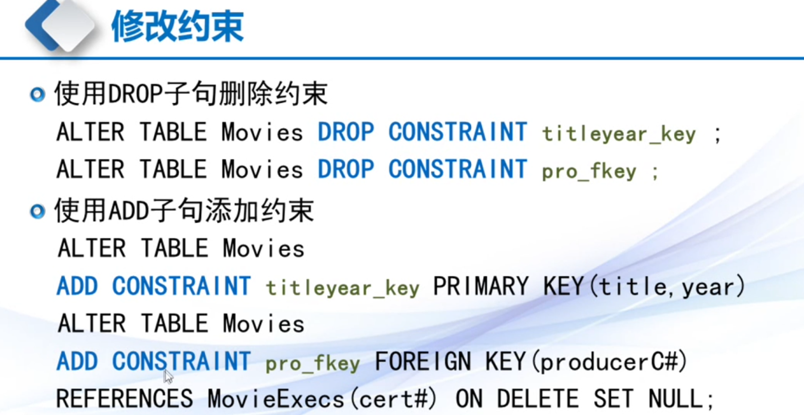

### 触发器

#### 触发器与约束的区别

* 仅当数据库程序员声明的事件发生时，触发器才被**激活**。
	如对特定关系的插入、删除、修改或事务的结束等。
* 当触发器被事件激活时，触发器**测试**触发的条件。如果条件不成立，则响应该事件的触发器不做任何处理。
* 如果触发器声明的条件满足，则与该触发器相连的动作由**DBMS**执行。动作可以是任何数据库操作序列，包括与触发事件毫无关联的操作。
* `INSTEAD OF`触发器在约束前起作用，`AFTER` 触发器在约束后起作用。

#### 触发器分类

按触发事件的不同

* `DML`触发器
	当数据库中发生DML事件时将自动调用DML触发器。
* `DDL`触发器
	当发生DDL事件时将触发DDL触发器

> #### 一、 DDL 语句
>
> DDL（Data Definition Language）语句： `数据定义语言`，主要是进行定义/改变表的结构、数据类型、表之间的链接等操作。常用的语句关键字有 CREATE、DROP、ALTER 等。
>
> 模板如下：
>
> ~~~sql
> CREATE TABLE 表名(
> 列名1 数据类型,
> 列名2 数据类型,
> 列名3 数据类型,
> ...
> )
> 
> ALTER TABLE 表名;
> eg：ALTER TABLE 表名 ADD 列名 数据类型;（添加一个列）
>     ALTER TABLE 表名 CHANGE 列名 新列名 新数据类型;（修改列名）
>     ALTER TABLE 表名 DROP 列名;
> 
> DROP TABLE 表名;
> DROP DATABASE 数据库名;
> ~~~
>
> #### 二、 DML 语句
>
> DML（Data Manipulation Language）语句: `数据操纵语言`，主要是对数据进行增加、删除、修改操作。常用的语句关键字有 INSERT、UPDATE、DELETE 等。
>
> 模板如下：
>
> ```sql
> INSERT INTO 表名 (字段1,字段2,...) values (某值,某值,...),(某值,某值,...);
> 
> UPDATE 表名 SET 列名=新值 WHERE 限定条件;
> 
> DELETE FROM 表名 WHERE 限定条件;
> ```
>
> **DDL 语句与DML 语句的主要区别：**
>
> |      | DDL                                            | DML                                                          |
> | ---- | ---------------------------------------------- | ------------------------------------------------------------ |
> | 名称 | 数据定义语言                                   | 数据操纵语言                                                 |
> | 区别 | 对**数据库内部**的对象进行创建、删除、修改操作 | 只是对**表内部**数据进行操作 (不涉及到表的定义、结构的修改，也不涉及到其他对象) |

按被激活的时机不同

* `AFTER`触发器
	在DML操作或DDL操作之后被激活的，对表进行**约束检查**等动作都在 `AFTER` 触发器**被激活之前**发生。**操作事件 -> 约束检查 -> 触发器激活**
* `INSTEAD OF`触发器
	INSTEAD OF 触发器并不执行其定义的操作 (insert 、 update 、 delete)而仅是执行触发器本身，INSTEAD OF 触发器可用于表和视图。

执行顺序：

* **数据变更操作** 先执行。

* **`BEFORE` 触发器** 在数据变更操作之后、约束检查之前执行。

* **约束检查** 在 `BEFORE` 触发器之后执行，如果违反约束，操作回滚。

* **数据变更提交** 在约束检查通过后进行。

* **`AFTER` 触发器** 在数据变更提交之后执行。

#### DML触发器

例：在 MovExecs 关系上创建触发器，该触发器的作用是阻挠降低电影制作人净资产值的企图。

~~~sql
CREATE TRIGGER netWorthTrigger
ON moviesExecs AFTER UPDATE
AS
IF UPDATE(networth)
~~~

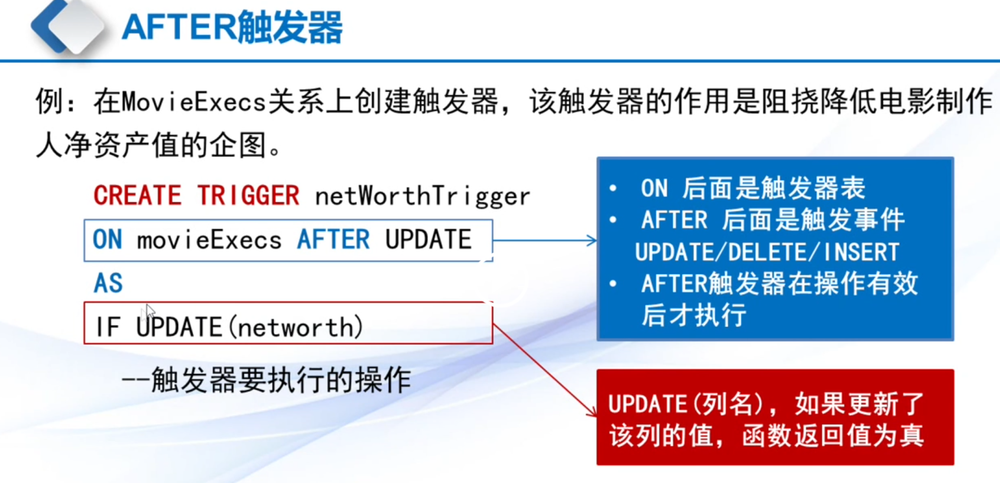


~~~sql
-- 例：在 MvieExecs 关系上创建触发器，该触发器的作用是阻挠往 MvieExecs 中插入净资产值低于 1000 万元组的操作。
CREATE TRIGGER movieExecs_insertTrigger
ON movieExecs AFTER INSERT
AS
IF (SELECT netWorth FROM INSERTED) < 10000000
	ROLLBACK
~~~

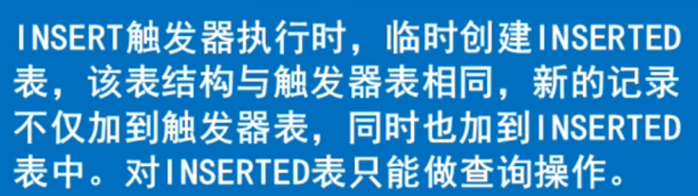

因为只插入了一条数据，所以按理来说`INSTERED`表只有一条被插入到触发器表的数据。`INSTERED`表并不会复制触发器表原先的数据。

~~~sql
-- 例：在 MovieExecs 关系上创建 DELETE 触发器，当删除了某位制片人时，将 Movies 关系中对应的制片人证件号设置空值。
CREATE TRIGGER movieExecs_deleteTrigger
ON movieExecs AFTER DELETE
AS
UPDATE Movie SET producerC = NULL
WHERE producerC IN (
	SELECT cert
    FROM DELETED
);
~~~

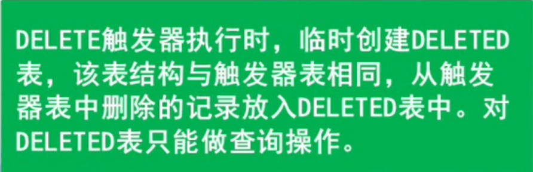

~~~sql
-- 例：在 MovieExecs 关系上创建触发器，该触发器的作用是阻挠降低电影制作人净资产值的企图。
CREATE TRIGGER netWorthTrigger
ON movieExecs AFTER UPDATE
AS
IF UPDATE(networth)
	IF (SELECT netWorth FROM INSTERED) < (SELECT netWorth FROM DELETED)
		ROLLBACK
~~~

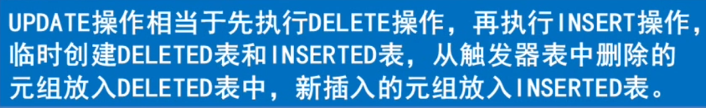

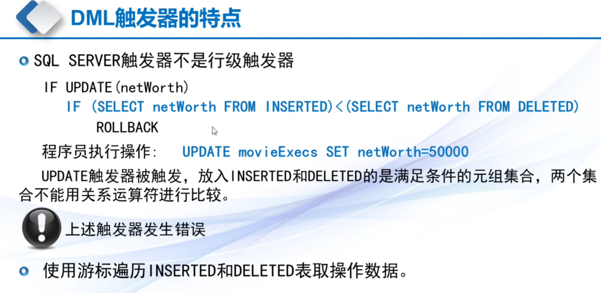

### DDL触发器

DDL 触发器是可以是**基于数据库**层面的触发器，如果某些操作是对**数据库进行操作**比如说**增加表**或者**删除表**时操作就会触发

~~~sql
-- 用DDL触发器来防止对当前数据做删除表和修改表的操作
CREATE TRIGGER safety
ON DATABASE -- DATABASE 表示当前数据库
AFTER DROP_TABLE, ALTER_TABLE
AS
PRINT 'You must disable Trigger "safety" to drop or alter tables!'
ROLLBACK TRANSACTION
~~~

可用 `DDL_TABLE_EVENTS` 表示 `CREATE TABLE`、`ALTER TABLE`、`DROP TABLE`事件

DDL 触发器也可以是**基于服务器**层面的触发器，可以就一些**登录事件**触发

服务器上的 DDL 触发器可以用 `DDL_LOGIN_EVENTS` 表示 `CREATE LOGIN` 、` ALTERLOGIN` 、 `DROP LOGIN` 事件。

~~~sql
-- 用 DDL 触发器来防止创建和修改服务器账号事件。
CREATE TRIGGER loginTrigger
ON ALL SERVER
BEFORE DDL_LOGIN_EVENTS
AS
PRINT 'No login creations without DBA involvement'
ROLLBACK
~~~

程序员执行：`CREATE LOGIN user WITH PASSWORD = '123456'`会触发触发器

#### 禁用和启用DDL触发器

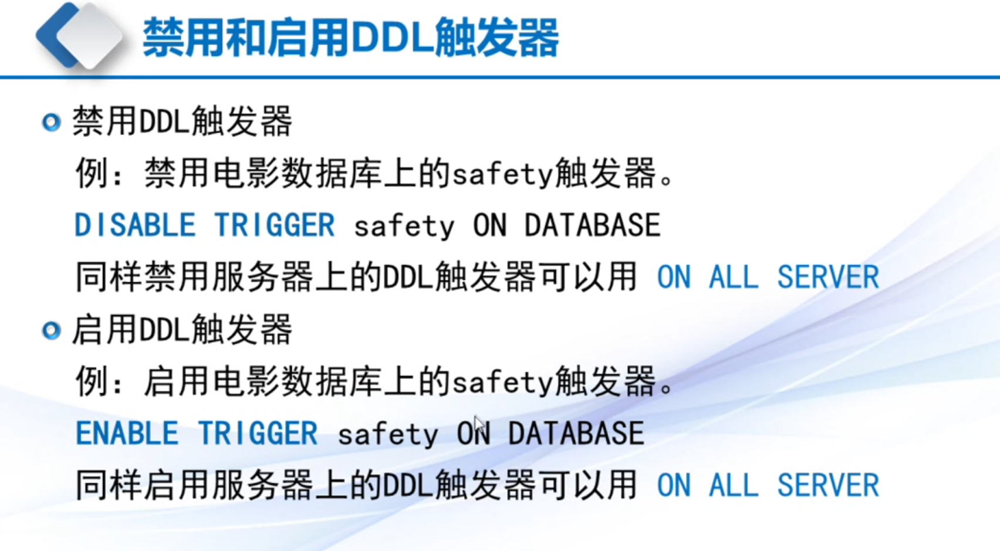


~~~sql
INSERT INTO Movies(studioName, title, year)
VALUES('中国电影股份有限公司', '流浪地球', 2019)

DELETE FROM Movies
WHERE year < 1980

UPDATE MovieExecs
SET address = 'B', netWorth = netWorth * 0.9
WHERE name = 'Ford'

CREATE VIEW moviesView
AS
SELECT title, year
FROM Movies
WHERE name = '中国电影'

CREATE TRIGGER viewTrigger
ON moviesView INSTEAD OF INSERT
AS 
INSERT INTO Movies(studioName, title, year)
SELECT '中国电影股份有限公司', title, year
FROM INSERTED
~~~

